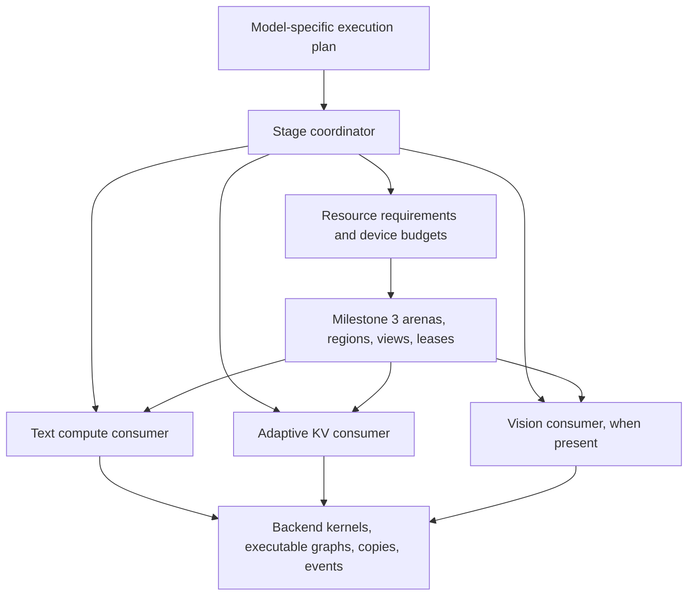

# Device memory consumers: implementation roadmap

Saved: 2026-09-10

Last source review: 2026-09-10, against the checkpoint commits below.

## Status and how to resume

Milestone 3 originally completed at `79e25c139`; its checkpoint now includes the prerequisite Meta ownership fix at `9c6d4b06f`. On `feature/device-memory-consumers`, substage **4.1a** is committed at `7da9821f5` and **4.1b** at `5b5b22d1e`; **4.2a** is implemented and validated, awaiting user review and commit. The rest of milestones 4-8 remains planned. The next substage after review is **4.2b**.

Read this file before continuing implementation. Keep milestone and stage identifiers stable. Parent stage IDs retain their original scope; lettered substages below are the commit units, each containing the implementation and its tests. Stage 8.5 remains a single commit unit. Update the progress ledger after completing a substage, recording its actual commit, validation, and any remaining limitations. A parent stage is complete only when all its required substages pass. Add explicitly named extensions if work expands; do not renumber or retroactively redefine completed stages.

After each completed substage, stage only its implementation, tests, and related documentation for user review. Leave unrelated changes unstaged and let the user create the commit.

This document records the discussed roadmap. Saving it does not start implementation, change branches, or authorize commits or publication.

## Checkpoints and reference implementations

| Reference | Commit | Purpose |
| --- | --- | --- |
| Milestone 3 / feature/device-memory-manager-milestone-3 | 9c6d4b06f | Existing generic arenas, regions, views, leases, and scheduler borrowing, plus Meta buffer-type ownership fix |
| feature/adaptive-kv-stream | d873e5db9 | Reference for fixed-budget adaptive KV algorithms, kernels, and tests |
| feature/kv-stream-phase-arena | ae09597ff | Reference for CUDA prefill/decode memory sharing |
| master at milestone 3 base | ece963f41 | Stock comparison baseline |

Develop on an integration branch based on milestone 3. Create a checkpoint branch only after each milestone passes its acceptance criteria. Branch names can move; the recorded commits identify the reference versions.

## Objectives and initial scope

1. Reimplement adaptive KV streaming using the milestone 3 memory infrastructure.
2. Share memory across text prefill and generation, reclaiming resources no longer needed in each stage.
3. Extend sharing to vision/mmproj execution, supporting separate vision encoders and encoder-free multimodal models.

Initial production scope: one active execution operation per session, one CUDA GPU, ordinary generation without MTP. Common coordination APIs remain backend-agnostic. Streaming kernels, allocation properties, and executable-graph lifecycle support require backend-specific implementation and validation.

Existing buffer-view support on another backend does not imply streamed-attention support.

## Architecture and invariants

The inference session owns a small serial stage coordinator above text and vision contexts. Model integrations describe stages and dependencies. Consumers describe required, preserved, reconstructible, and reclaimable resources. Milestone 3 implements storage ownership and layout validation.

Resource kinds include weights, KV/recurrent state, handoff embeddings, temporary graph workspace, and executable graphs. A resource can survive several stages even when the current stage does not read it.



- Keep device allocation classes explicit. Model weights may use UVM while the shared compute/KV arena remains device-local.
- Keep the parent allocation stable across stage transitions where possible.
- Keep adaptive resident/ring repartition inside one leased KV region. No common-arena transaction, lease lookup, or mutex per page/token.
- Preserve the optimized transfer pipeline, quantized attention, scratch sizing, and asynchronous slot reuse.
- A lease protects ownership but does not automatically track in-flight work or captured device pointers.
- Drain affected work and invalidate stale executable graphs before reusing storage.
- Distinguish graph descriptions, captured executable graphs, tensor workspace, and backend scratch. Releasing one does not imply releasing the others.
- Preserve all live conversation state, including recurrent state outside the streamed KV implementation.
- Keep image embeddings alive until their final consumer finishes. The current host embedding handoff is a useful initial boundary.
- Use explicit stage signals. A one-token prompt is not necessarily generation.
- The coordinator controls stage transitions and total grants; consumers retain specialized internal allocation and execution policies.
- Layout rollback is not inference-state rollback. Device failures after mutable state changes can require session invalidation.

## Source review findings and integration requirements

This review read core implementations and relevant tests at the milestone 3, adaptive KV, and phase-arena checkpoints. It did not run new tests or establish an exhaustive correctness proof. These requirements refine existing stages without renumbering them or marking implementation complete.

### Milestone 3 contracts

- Layout commits update region metadata; they do not move bytes. Consumers must explicitly preserve or reconstruct data when addresses change.
- `ggml_backend_memory_arena_quiesce()` closes admission but does not wait for GPU work. Drain affected compute and copy execution before releasing leases.
- Active leases can survive a commit only for persistent regions unchanged in ID, offset, size, alignment, and flags. Do not require all persistent leases to disappear or the whole arena to become QUIESCENT on every transition.
- A surviving persistent lease retains its acquisition generation after the arena generation increases. A generation mismatch alone does not invalidate that lease.
- Scheduler slots with the same buffer type share allocator storage and lease references. Preserve this aliasing through attachment and detachment.
- The current text consumer reserves maximum workspace across measured phases. It does not reclaim prefill capacity during generation.
- Backend views preserve ownership and native buffer conventions, but do not automatically invalidate captured graphs that refer to reassigned storage.

Sources at `79e25c139`: `ggml/src/ggml-backend-memory.cpp`, `ggml/src/ggml-alloc.c`, `ggml/src/ggml-backend.cpp`, and `src/llama-context-workspace.cpp`. Relevant cases in `tests/test-backend-memory.cpp` cover persistent lease transitions, failed commits, concurrent admission, scheduler detachment, and shared slots.

### Adaptive KV production behavior to preserve

- Prefill uses uniform residency. Decode can concentrate the streamed deficit into selected layers, leaving other layers fully resident to provide prefetch windows. Concentration is bounded by ring size and each layer's active capacity; small rings support multiple waves.
- Resident K and V occupy separate contiguous token-major planes. Ring transfers also use separate K/V planes. A slot is not necessarily a self-contained interleaved K/V byte block.
- Boundary changes can move layer bases and V-plane offsets. The reference invalidates resident metadata and reloads from host when necessary; it does not guarantee non-disruptive device-page migration.
- Preserve batched uploads, resident spans, cross-layer scheduling, producer-ready/consumed event ordering, and slot reuse after the final consuming query tile. Wide micro-batches must not multiply H2D uploads for the same span.
- The real cross-layer queue lives in CUDA's `fattn.cu`. Early helpers `llama_kv_stream_plan_make`, `llama_kv_stream_regions_make`, `llama_kv_stream_extent_make`, and `llama_kv_stream_prefetch_dispatch` have test callers but no production callers in the reviewed adaptive branch. Port from actual execution paths; retain reference helpers only where useful.
- Eligible all-resident decode graphs support CUDA capture. Graphs requiring streamed KV disable capture in the reference. Preserve both paths and their eligibility checks.
- KV-runtime generation covers internal layout changes and authoritative cache replacement. Keep it distinct from arena-layout generation; either can invalidate cached execution assumptions independently.
- Copy-busy feedback extrapolates sampled CUDA copy timing over an evaluation. It is not measured PCIe throughput divided by theoretical bandwidth. Preserve its meaning in policy and diagnostics.

Sources at `d873e5db9`: `src/llama-kv-cache.cpp`, `src/llama-kv-stream-plan.cpp`, `ggml/src/ggml-cuda/fattn.cu`, `ggml/src/ggml-cuda/ggml-cuda.cu`, `ggml/src/ggml-cuda/set-rows.cu`, and `ggml/src/ggml-cuda/kv-stream-span-tuner.h`. Inspect reference branches with `git show <commit>:<path>` without switching the working branch.

### Gaps the new consumers must address

- Host KV buffers retain a runtime that also owns device resources. Current construction requires nonzero staging/resident capacity and offers no complete device-suspension lifecycle. Separate host-cache ownership from device-region binding so host KV can survive without an active device lease.
- Attention partials/accumulators and staged SET_ROWS scratch use CUDA's `ctx.pool()` outside the shared arena. GGML workspace measurements alone do not describe peak memory. Account for overlapping lifetimes and retained backing capacity; explicitly identify what is reclaimed and what remains outside the grant.
- The old phase arena synchronizes, resets CUDA executable state, recreates the scheduler, and substitutes a custom compute buffer type. Replace bespoke ownership with generic leases while preserving required ordering. Partial failure recovery in the old switch is not a complete transactional inference-state guarantee.
- The reviewed integration is restricted to `LLM_ARCH_QWEN35`, the target context, one sequence, and one CUDA device. Attention also checks 256-wide Q/V heads, token-major strides, mask format, and no attention sinks. Runtime pages are 256 tokens, and the phase-arena constructor checks uniform layer page geometry. Broader quantization support does not imply arbitrary model support.
- Storage, online KV writes, direct attention, and conversion fallback are separate capabilities. Validate the entire requested type/shape path before enabling streaming.

Sources for phase transitions at `ae09597ff`: `src/llama-context.cpp`, `src/llama-kv-stream-config.cpp`, and `ggml/src/ggml-cuda/ggml-cuda.cu`.

Existing tests cover all-resident attention, authoritative cache replacement, dirty-row mirroring, batched uploads, cross-layer prefetch, concentrated/multi-wave layouts, wide micro-batches, and phase-arena overlap/lifetime rules. Extend these with delayed execution, complete suspension, and coordinated failure recovery; historical tests do not validate these new lifecycles.

## Development and validation rules

- Write a failing behavioral test before implementation.
- Cover successful operation, invalid input, and meaningful failure/recovery paths.
- Keep each commit buildable and runnable.
- Run focused tests per stage and broader regression checks at milestone boundaries.
- Preserve existing behavior when new functionality is disabled.
- Reuse existing algorithms and tests where suitable; adapt ownership instead of gratuitously rewriting kernels.
- Treat commit-sized stages as reviewable dependent changes, not necessarily independent PRs.
- Keep performance claims proportional to evidence. Existing A/B results are encouraging but include reduced samples, incomplete cells, and a SYCL VMM-fix confounder.
- Use targeted performance checks before broad sweeps: all-resident, streaming onset, moderate streaming, and bandwidth-limited operation.

## Commit sizing and dependency rules

The split below preserves milestones 4-8 and all existing parent stage scopes. It separates independently testable contracts, device execution, integration, failure recovery, and performance changes. It does not add another milestone or mark existing plans as completed.

| Milestone | Commit units | Main reason for subdivision |
| --- | --- | --- |
| 4 | 11 | Separate planning, asynchronous lifetimes, recovery, and the first real consumer. |
| 5 | 22 | Establish exact bounded streaming before adding asynchronous copy, prefetch, tuning, and server/cache integration. |
| 6 | 12 | Separate accounting, growth/shrink, failure handling, phase activation, and budget probing. |
| 7 | 11 | Separate embedding lifetime, KV suspension, projector ownership/reload, and server wiring. |
| 8 | 9, including conditional 8.2b | Separate real model adapters, capability coverage, and sustained lifecycle validation. |

These are planned review units, not a guarantee of final diff size or 65 mandatory code commits. The real cross-attention adapter in 8.2b is conditional; a documented deferral is not an implemented adapter. Do not create empty commits just to satisfy a count. If a substage still contains two independently risky changes, name an additional subdivision before implementing it and preserve completed identifiers.

- The dependency column lists immediate prerequisites. `M3` is the existing checkpoint; `M4` through `M7` mean the preceding milestone has passed its full acceptance gate.
- Tables group work by parent scope, not strict execution order. In milestone 4, implement 4.4a before 4.3b. In milestone 5, implement 5.4a before 5.3c; the host-write baseline does not depend on batched write optimization.
- Define capability rejection at the first affected consumer. Stage 8.3 consolidates and validates those contracts; it is not the first safety gate.
- For code substages, record a failing behavioral test, implement, rerun focused tests, and check existing paths. Documentation/qualification commits instead reproduce their commands and record evidence; do not manufacture a failing test for prose.
- Keep unfinished consumers opt-in or test-only until their integration stage passes. Preserve a runnable baseline at each commit; do not leave production dispatch calling half-ported kernels.
- Use one generic geometry/quant contract from 5.1a onward. Early execution tests can cover a subset while bringing up the pipeline, but must not establish a permanent Q8/Q4 special allocation path.
- Before optimization substages 5.3c and 5.4f-5.4k, retain a targeted result from the preceding working revision. Check numerical correctness, transfer bytes/submissions, and representative latency after each change. Isolate and explain regressions before proceeding.
- Freeze model, quantization, context, b/ub, UVM mode, and pool size for kernel A/B checks. Use separately labeled maximum-allocatable-pool comparisons for phase-sharing gains.
- Save test commands, outcomes, hardware/tool availability, and remaining limitations with each ledger entry. A skipped backend is not a pass; passing tests provide evidence, not a proof that no bug exists.

### Implementation checkpoints within milestone 5

1. Through 5.4a: authoritative host state, leased resident mirrors, and correct all-resident execution.
2. Through 5.4e: correct bounded block streaming and supported quant dispatch, without relying on asynchronous overlap.
3. Through 5.4k: optimized copy/prefetch pipeline, wide micro-batches, feedback, and resident capture.
4. Through 5.5d: real serial server/cache integration and reference-performance qualification.

Do not enable phase-dependent grants before the fixed-pool gate passes. Do not attempt full vision eviction until text phase transitions and host/device KV separation are validated.

## Milestone 4: execution stages and resource coordination

Outcome: multiple consumers can safely share an arena through explicit dependencies. Text behavior remains equivalent to milestone 3.

| Commit unit | Prerequisites | Implementation boundary | Required tests / evidence |
| --- | --- | --- | --- |
| 4.1a | M3 | Resource contracts: IDs, memory domain/allocation class, minimum/preferred bytes, access, preservation, and reconstruction; define explicit unsupported-capability results. | Missing/duplicate IDs, invalid sizes/domains, and a resource surviving an inactive stage. |
| 4.1b | 4.1a | Execution-plan validation: dependencies, last use, and conflicting access; keep model semantics above GGML. | Cycles, missing producers, empty plans, read/write conflicts, and preserved but unread resources. |
| 4.2a | 4.1b | Pure minimum-layout planning with fixed persistent extents and checked alignment/accounting. | Exact fit, overflow, insufficient capacity, persistent overlap, and unchanged persistent region identity. |
| 4.2b | 4.2a | Deterministic elastic grants after minimum requirements; report unused capacity without allocating storage. | Competing preferred sizes, alignment gaps, deterministic ties, and total grants within budget. |
| 4.3a | 4.2b | Transition preparation and admission state machine using fake consumers; no device rebinding yet. | Preparation failure leaves active state usable; cancellation, reentrancy rejection, and no-op transitions. |
| 4.3b | 4.3a, 4.4a | Drain affected execution, invalidate affected executables, release changed leases, commit layout, bind, then activate; preserve unchanged persistent leases. | Delayed compute/copies, admission closure, no reuse before completion, persistent leases surviving a commit, and bind ordering. |
| 4.3c | 4.3b | Failure recovery for transition boundaries; distinguish restorable metadata/bindings from a poisoned inference session. | Injected release/commit/view/bind failures, cancellation after drain, failed recovery, and safe destruction; never claim mutable-state rollback. |
| 4.4a | 4.1a | Executor lifetime contract plus fake executor: affected resources, explicit drain/invalidation, and separate arena/content/executable validity. | Captured stale addresses rejected, unchanged persistent lease remains valid across arena generations, and no-op executable preservation. |
| 4.4b | 4.3c, 4.4a | CUDA adapter for the executor contract using existing capture lifecycle mechanisms. | Real captured replay before/after rebinding, invalidation before storage reuse, no-op capture reuse, and backend-disabled builds. |
| 4.5a | 4.3c | Text workspace consumer: register maximum workspace and attach coordinated leases without phase reclamation. | Create/reserve/detach/destroy, same-buffer-type aliased scheduler slots, failed attachment, and existing backend fallback. |
| 4.5b | 4.5a, 4.4b | Text execution integration and milestone qualification; retain milestone 3 allocation behavior. | Numerical and lifecycle checks on available CPU/CUDA/OpenCL/SYCL/Vulkan/Meta paths; targeted no-op/steady-state overhead comparison. |

Acceptance:

- Fake consumers demonstrate safe sharing and failure recovery.
- Existing text inference passes across available backends.
- No phase-dependent reclamation is enabled yet.
- Coordinator placement remains reusable by text and vision without making GGML image- or server-aware.

## Milestone 5: adaptive KV streaming using leased memory

Outcome: fixed-budget adaptive streaming runs on milestone 3, independently of phase-switching complexity.

| Commit unit | Prerequisites | Implementation boundary | Required tests / evidence |
| --- | --- | --- | --- |
| 5.1a | M4 | Production KV geometry and capability checks with checked quant-aware sizes; audit which reference helpers have real callers. | Independent K/V storage/write/attention/conversion support, unequal row sizes, page tails, overflow, unsupported heads/strides/masks/sinks, and model/sequence limits. |
| 5.1b | 5.1a | Pure resident/ring layout and adaptation policy from production: uniform prefill, concentrated decode, multi-wave capacity, feedback, and hysteresis. | Exact boundaries, short contexts, concentrated deficit, tiny feasible rings, feedback resets, and bounded grants. |
| 5.2a | 5.1a | Device-local CUDA allocation adapter for KV arena storage regardless of weight-UVM setting. | Actual allocation class with UVM on/off, allocation failure, device identity, and teardown. |
| 5.2b | 5.2a, 5.1b | KV runtime borrows one coarse region lease; separate host-cache identity from device binding and cache base/capacity outside token loops. | Undersized/misaligned/wrong-device leases, shared ownership, detach ordering, and no per-page arena transactions. |
| 5.3a | 5.1a | Authoritative host KV storage and pinned-memory lifetime, preserving reference Windows behavior. | Allocation failure, pin/register/unregister ownership, supported quant layouts, and host lifetime independent of device binding; record unavailable OS coverage. |
| 5.3b | 5.3a, 5.2b | Cache writes, dirty rows, mutable tails, and content generation; use a correctness-first synchronized mirror update where needed. | Partial rows/pages, overwrites, cache replacement with unchanged arena generation, pending-write cancellation, and host/device agreement. |
| 5.3c | 5.3b, 5.4a | Batched prefill SET_ROWS/write staging and bounded scratch, replacing the baseline write submission policy. | Quantized batched writes, partial batches, staging reuse after completion, scratch peak, and fewer submissions without changed bytes. |
| 5.4a | 5.3b | Resident K/V planes and ordinary all-resident attention using the leased mirror; no asynchronous streamed execution yet. | Plane offsets, dirty-tail mirror, all-resident numerical equivalence, and existing ordinary attention dispatch. |
| 5.4b | 5.1a | Partial-attention result and stable merge contract; establish reference tests before device integration. | Unequal blocks, masked/empty blocks, causal tails, extreme logits, and tolerance-based comparison with unsplit attention. |
| 5.4c | 5.4a, 5.4b | One explicitly staged KV block and streamed partial-attention integration; start with ordered copy/compute. | Resident plus streamed merge, K/V plane bounds, mutable last block, minimum scratch, and out-of-bounds guards. |
| 5.4d | 5.4c, 5.1b | Multiple streamed blocks with bounded ring-slot reuse and correct concentrated/multi-wave traversal. | Ring wraparound, more blocks than slots, partially filled final block, per-layer bounds, and no premature slot overwrite. |
| 5.4e | 5.4d | Complete supported quant dispatch and bounded F16 conversion fallback through one generic layout contract. | Supported K/V pairs, unequal bytes, direct/fallback agreement, unsupported combinations rejected before allocation, and conversion scratch bounds. |
| 5.4f | 5.4e | Dedicated copy stream and producer-ready/final-consumer events; overlap copies without changing attention semantics. | Artificially delayed producer/consumer, slot reuse hazards, pending-copy teardown, cancellation, and sanitizer-capable host bookkeeping. |
| 5.4g | 5.4f, 5.3c | Contiguous attention spans and batched K/V uploads preserving separate planes. | Partial spans, wraparound, exact transfer bytes, fewer H2D calls, and targeted comparison with the prior commit. |
| 5.4h | 5.4g | Actual cross-layer prefetch queue, bounded lookahead, and immediate safe slot reuse; no fixed three-layer assumption. | Delayed and out-of-order readiness, concentrated/multi-wave schedules, no deadlock, and lookahead constrained by free slots. |
| 5.4i | 5.4h | Wide micro-batch query tiling with slot lifetime extending to the final consuming tile. | b/ub combinations, causal masks, partial query tiles, and no duplicate H2D upload per query tile; preserve 256/256 performance. |
| 5.4j | 5.4i | Runtime miss/copy timing feedback and span tuning connected to the pure policy. | Every consumed span can detect readiness misses, feedback reset, hysteresis, bounded repartitions, and copy-busy units distinct from PCIe utilization. |
| 5.4k | 5.4j | Capture eligibility and invalidation for the completed KV runtime: enable eligible resident replay and gate streamed capture. | Resident replay, resident-to-streamed-to-resident transitions, content/layout generation changes, and no stale captured pointers. |
| 5.5a | 5.4k | Opt-in text-context integration, serial execution gating, and hybrid recurrent-state preservation. | Real-model prefill/decode, context limits, unsupported model/device/sequence rejection, and feature-disabled equivalence. |
| 5.5b | 5.5a | Serial request/reset/cancellation and prompt-cache save/restore integration. | Different content/lengths, reused prefixes, cache replacement, abort followed by another request, and recurrent state equivalence. |
| 5.5c | 5.5b | Qualify fixed-pool performance and add only diagnostics needed to explain differences. | All-resident, streaming onset, moderate streaming, and bandwidth-limited comparisons against the fixed-pool reference; transfer volume and sufficient decode length. |
| 5.5d | 5.5c | Document supported configurations, fixed-budget semantics, limitations, and reproducible focused tests. | Verify documented invocations and capability matrix; no broad model/backend claim from quant-only coverage. |

Acceptance:

- Fixed-pool streaming is correct.
- Targeted comparisons with `feature/adaptive-kv-stream` show comparable performance and transfer volume.
- The KV runtime owns resident/ring subdivision within a coarse lease.
- Concentrated decode layouts and all-resident capture have execution coverage, not just standalone policy tests.
- No broad sweep is required unless representative points reveal an unexplained difference.

## Milestone 6: prefill/decode memory sharing

Outcome: compute and KV share one budget; decode receives space reclaimed from larger prefill workspace.

| Commit unit | Prerequisites | Implementation boundary | Required tests / evidence |
| --- | --- | --- | --- |
| 6.1a | M5 | Separate prefill/decode workspace requirements for actual b/ub, output selection, and attention settings. | Partial batches, TG1, multiple context lengths, output configurations, and budget fitting only one phase. |
| 6.1b | 6.1a | Inventory/account for backend scratch, retained ctx.pool() backing, captures, and transition peaks; define what is inside the shared grant. | Direct/conversion partials, accumulator/write scratch, overlapping lifetimes, and measured peaks versus declared accounting. |
| 6.2a | 6.1b | KV growth/rebind using authoritative host data; rebuild K/V planes and recompute resident/ring split instead of only growing the ring. | Changed layer/V-plane bases, increased residency, lazy reload correctness, and separate arena/KV validity generations. |
| 6.2b | 6.2a | KV shrink/rebind and pending-copy drain; invalidate moved mirrors and bounded scratch safely. | Minimum feasible capacity, concentrated layouts, ring remap, dirty tails, delayed work, and logical cache preservation. |
| 6.2c | 6.2b | Rebind failure handling without relying on simultaneous old/new full-budget allocation. | Rejected resize, failed view/binding creation, recoverable reactivation, poisoned-session rejection, and host KV retained. |
| 6.3a | 6.1a | Explicit text prefill/generation stage signals, with no reclamation enabled yet. | Single-token prompt versus generation, final short prompt batch, TG1, repeated notifications, and speculative execution rejection. |
| 6.3b | 6.3a, 6.2c | Activate phase sharing: drain/invalidate, release workspace, repartition grants, bind, and rebuild only affected execution. | Real prefill-to-decode reclaim, captured-pointer safety, no-op transition, no per-token coordinator work, and measured decode pool increase. |
| 6.4a | 6.3b | Return from expanded decode KV to prefill for serial requests and changed requirements. | Long decode then short/long prompts, repeated alternation, shrink/reload correctness, and numerical equivalence. |
| 6.4b | 6.4a | Prompt reuse, cache restoration, and interrupted phase transitions. | Cached prefixes, restored host KV/recurrent state, cancellation at each boundary, and subsequent request or explicit invalid-session outcome. |
| 6.5a | 6.4b | Generalized shared-budget CLI/API option and deliberate compatibility with existing fixed-pool options. | Parsing, mutually exclusive/conflicting options, old-option behavior, and clear included/excluded allocations. |
| 6.5b | 6.5a | Adapt maximum-pool benchmark probing to both phases and transition peaks, using existing sweep harness. | Startup-only false fits rejected, next-granule OOM boundary, successful decode/return-to-prefill, and no arbitrary new safety reserve. |
| 6.5c | 6.5b | Transition/accounting diagnostics and qualification against the phase-arena reference. | Effective decode KV bytes, streaming onset, reclaimed workspace versus capture storage, resident reload latency separated from steady-state speed. |

Acceptance:

- Reclaimed prefill workspace measurably increases decode KV capacity.
- Streaming begins later when additional capacity permits.
- No common-arena transactions or new device-wide synchronization occur on ordinary steady-state tokens.
- Transition cost and throughput are comparable to `feature/kv-stream-phase-arena`.
- The budget clearly states whether compute, KV, scratch, weights, and driver allocations are included.
- Executable-graph destruction and tensor-workspace reclamation are validated separately.
- Report resident reload cost separately from steady-state throughput; do not assume repartition preserves device pages.

## Milestone 7: separate vision encoder integration

Outcome: a Qwen-style vision encoder and language model safely share phase-specific memory.

| Commit unit | Prerequisites | Implementation boundary | Required tests / evidence |
| --- | --- | --- | --- |
| 7.1a | M6 | Borrowed mtmd compute workspace consumer with explicit requirements and executable lifetime. | Variable image sizes/batches, workspace sizing, attachment failure, and drain before release. |
| 7.1b | 7.1a | Handoff embedding ownership independent of reusable vision workspace; preserve the existing host boundary initially. | Multiple images, partial/chunked consumption, embedding lifetime after workspace release, and cancellation cleanup. |
| 7.2a | 7.1b | Session execution plan for vision encoding followed by embedding prefill; initially retain existing allocations. | Text/image/text ordering, follow-up images with existing state, multiple images, and encoding failure without unsafe text execution. |
| 7.3a | 7.2a | Full KV device suspension: drain authoritative writes/copies, release device binding, and preserve host/runtime identity; explicitly account for recurrent state. | Zero retained KV device lease/pool, dirty tails saved, unchanged host cache, suspended execution rejected, and state outside KV protected. |
| 7.3b | 7.3a | Resume suspended KV into a fresh grant and rebuild affected mirrors/executables. | Different grants/addresses, host content restored, stale capture rejection, and attention/recurrent-state equivalence. |
| 7.3c | 7.3b | Interrupted suspension/restoration and integration with vision-stage borrowing. | Allocation/rebind failure, cancellation before/after eviction, retry versus invalid-session rules, and repeated vision/text transitions. |
| 7.4a | 7.2a | Separate projector device-weight ownership from model metadata and host/reload source while keeping current eager residency. | Shared owners, tensor metadata lifetime, loading equivalence, and destruction without double release. |
| 7.4b | 7.4a | Explicit projector-weight unload/reload with executable invalidation and tensor rebinding. | Repeated new-address reload, stale tensor/capture rejection, drain before unload, and numerical equivalence. |
| 7.4c | 7.4b, 7.3c | Coordinate reloadable projector storage with phase grants and failure recovery; account for weights that stay outside the arena. | Budgets unable to hold both phase allocations, reload failure, no double-allocation assumption, and persistent conversation state. |
| 7.5a | 7.4c | Complete multimodal server flow, image-related cache reuse, and serial session cleanup. | Real image/text requests, follow-up images, reused media prefixes, aborted requests, and handoff final-use ordering. |
| 7.5b | 7.5a | Qualify memory savings, transition latency, and documented supported vision configuration. | Peak below simultaneous phase sum, expected post-request baseline, repeatable outputs, and separate projector reload versus KV reload costs. |

Acceptance:

- A supported request fits a budget that cannot hold all phase-specific allocations at once.
- Subsequent generation remains correct.
- Projector weights are unloaded only through an explicit storage lifecycle.
- Existing KV and hybrid recurrent state survive vision execution.
- Host KV ownership does not force retention of the device pool during vision execution.
- Handoff embeddings remain available for all consumers, including later chunks from a media batch.

## Milestone 8: encoder-free plans and integration hardening

Outcome: one coordinator supports separate encoders and shared multimodal transformers with explicit capability boundaries.

| Commit unit | Prerequisites | Implementation boundary | Required tests / evidence |
| --- | --- | --- | --- |
| 8.1a | M7 | Encoder-free execution-plan adapter for a supported model: lightweight preparation then shared multimodal prefill. | Model-derived dependencies, shared transformer weights never reclaimed as a separate projector, and absent encoder handled explicitly. |
| 8.1b | 8.1a | Real encoder-free inference integration and phase sharing; choose a model verified in the checkout and report streaming support separately. | Image/text output equivalence, prefill-to-decode reclamation, shared-weight lifetime, and safe fixed-layout/rejection when streaming geometry is unsupported. |
| 8.2a | 8.1b | Cross-attention-style persistent visual-resource contract using fake consumers. | Encoder workspace reclaim without dropping features/visual KV, repeated generation consumers, and last-use release. |
| 8.2b | 8.2a | Integrate a real cross-attention adapter only if a suitable supported model/backend is available; otherwise record a named deferred adapter and evidence of the limitation. | Actual model equivalence and lifetimes when implemented; fake tests are explicitly not production support. |
| 8.3a | 8.1b, 8.2a | Consolidate capability/fallback policy already introduced in milestones 4-7; do not defer safety checks until this stage. | Allocation, borrowing, executable invalidation, storage/write/attention streaming capability combinations, and no silent budget violation. |
| 8.3b | 8.3a | Validate existing CPU/CUDA/OpenCL/SYCL/Vulkan/Meta combinations and unsupported-path diagnostics. | Real available-device smoke/numerical tests, aliased Meta ownership, valid fixed-layout fallback, and explicit rejection where no budget-safe path exists. |
| 8.4a | 8.3b | Integrated session fault/lifetime matrix across transitions, caches, suspension, reload, and destruction. | Delayed compute/copy execution, injected failures at boundaries, repeated recovery/invalid-session outcomes, and no use after release. |
| 8.4b | 8.4a | Sustained reuse/leak and applicable sanitizer qualification, keeping host and device coverage distinct. | Repeated multimodal sessions, memory return to expected retained baseline, ASan/UBSan/TSan where supported, and recorded hardware/tool gaps. |
| 8.5 | 8.4b, 8.2b | Finalize architecture/support documentation, examples, and compact performance/memory comparisons using existing harnesses. | Reproducible text-only, separate-encoder, and encoder-free examples; deferred cross-attention support labeled; disabled-feature baseline preserved. |

Acceptance:

- Both real architecture families use the same coordinator.
- Existing backend paths retain their behavior.
- Unsupported streaming paths are explicitly identified.
- If no appropriate cross-attention model is supported locally, its real adapter is a named follow-up; contract tests do not count as production model support.

## Subsequent work, outside milestones 4-8

- Concurrent request execution and overlapping stages.
- Multi-GPU streaming and per-device capacity coordination.
- MTP/speculative execution layouts.
- General model-weight or MoE-expert eviction policies.
- Optimized streaming engines for ROCm, SYCL, Vulkan, OpenCL, and other accelerators.

The contracts should permit these additions without claiming they are implemented.

## Checkpoint meaning

| Milestone | Completed capability |
| --- | --- |
| 3 | Allocation and lifetime infrastructure |
| 4 | Safe execution-stage coordination |
| 5 | Fixed-budget adaptive KV streaming |
| 6 | Text prefill/decode reclamation |
| 7 | Separate vision/text sharing and reloadable projector storage |
| 8 | Encoder-free integration and consolidated validation |

## Progress ledger

Record substage completion here only after the required validation succeeds. Expand the grouped planned rows as work proceeds; keep each completed substage's actual commit and evidence. Substages 4.1a, 4.1b, and 4.2a are implemented; do not start 4.2b until the user has reviewed this change.

| Stage | Status | Commit | Validation / limitations |
| --- | --- | --- | --- |
| Milestone 3 | Complete | 9c6d4b06f | Original A/B evidence at 79e25c139 under benchmarks/server-ab/results/; prerequisite Meta ownership fix tested separately. |
| 4.1a | Complete | 7da9821f5 | 16 cases / 231 assertions; all five selected suites pass in debug, ASan/leak-checking, and UBSan after integration onto 9c6d4b06f. |
| 4.1b | Complete | 5b5b22d1e | 16 cases / 259 assertions; all six selected memory suites pass in debug, ASan/leak-checking, and UBSan. |
| 4.2a | Ready for user review | Uncommitted | 18 cases / 276 assertions; all seven selected memory suites pass in debug, ASan/leak-checking, and UBSan. |
| 4.2b | Next after review; not started | - | Deterministic elastic grants. |
| 4.3a-4.5b | Planned | - | Includes 4.4a before 4.3b; see dependency table. |
| 5.1a-5.5d | Planned | - | See substage dependencies and milestone acceptance gate. |
| 6.1a-6.5c | Planned | - | See substage dependencies and milestone acceptance gate. |
| 7.1a-7.5b | Planned | - | See substage dependencies and milestone acceptance gate. |
| 8.1a-8.5 | Planned | - | Real adapter 8.2b conditional; otherwise explicitly deferred. |

## Substage 4.1a implementation and validation

Implemented on 2026-09-10 in `src/llama-memory-requirements.h/.cpp`, with `tests/test-memory-requirements.cpp` registered through CMake.

- Internal declarations identify session-local placement domains and resources, exact allocation classes, content preservation/reconstruction policies, and per-stage capacities/access/capability requirements.
- The validator is read-only and makes no allocation or backend calls. It checks declaration structure before returning unsupported allocation/capability results, with the relevant domain/resource IDs.
- A resource can remain live with access NONE. These are declaration tests, not a claim that cross-stage byte preservation or GPU synchronization is implemented.
- Allocation classes are exact requirements, not preferences: managed storage does not satisfy a device-local request.
- Zero-byte declarations are allowed, but they do not create zero-byte arena regions. Planner capacity, stage dependencies, execution lifetimes, and actual hardware capabilities are outside 4.1a.
- Existing inference dispatch and allocation are unchanged. No production container or GPU configuration was changed.

TDD evidence: the new test compiled against a placeholder that returned success, then failed 91 assertions. After implementing validation, all 16 cases and 231 assertions passed.

| Configuration | Result |
| --- | --- |
| Existing debug CPU build | New contract test plus allocator, buffer, arena, and Meta tests: 5/5 pass. |
| ASan with leak detection | New contract test plus allocator, buffer, arena, and Meta tests: 5/5 pass on the fixed baseline. |
| UBSan with halt-on-error | New contract test plus allocator, buffer, arena, and Meta tests: 5/5 pass. |
| Strict compiler warnings | New validator passes `-Wall -Wextra -Werror -Wconversion -Wsign-conversion -pedantic`. |

Both sanitizer builds instrument the new llama source, not only GGML. TSan and hardware-specific backend tests were not run for this pure declaration/validation stage; no execution or synchronization implementation changed.

Reproduce the focused normal run from the repository root:

```sh
cmake -S . -B build-device-memory-infra
cmake --build build-device-memory-infra --target test-memory-requirements test-backend-memory test-backend-buffer test-backend-meta test-alloc -j 20
ctest --test-dir build-device-memory-infra -R '^test-(memory-requirements|backend-memory|backend-buffer|backend-meta|alloc)$' --output-on-failure
```

Sanitizer configurations used `-DLLAMA_SANITIZE_ADDRESS=ON` in `build-device-memory-infra-asan` and `-DLLAMA_SANITIZE_UNDEFINED=ON` in `build-device-memory-infra-ubsan`, with the same targets. Runs used `ASAN_OPTIONS=detect_leaks=1:halt_on_error=1` and `UBSAN_OPTIONS=halt_on_error=1:print_stacktrace=1`, respectively.

### Prerequisite Meta leak fix

Before the prerequisite fix, `test-backend-meta` reported 136 bytes in four leaked allocations originating from `ggml_backend_meta_device_get_buffer_type()` at `ggml/src/ggml-backend-meta.cpp:362` in `79e25c139`. The cached buffer-type contexts used raw ownership. The expanded cache regression reproduced 2,440 leaked bytes in 68 allocations.

The same leak was reproduced with the unchanged Meta test linked only to GGML; `readelf -d` confirms the reproducer does not load `libllama` or `libllama-common`, so it excludes the new contract code. The user committed the separate fix as `9c6d4b06f` on the infrastructure baseline before restoring 4.1a. Cached entries now own their contexts, with stable buffer-type addresses. No suppression was added; the standalone check below is expected to pass on the fixed baseline.

```sh
c++ -std=c++17 -g -fsanitize=address -fno-omit-frame-pointer -I ggml/include tests/test-backend-meta.cpp -L build-device-memory-infra-asan/bin -Wl,-rpath,"$PWD/build-device-memory-infra-asan/bin" -lggml -lggml-base -lggml-cpu -o build-device-memory-infra-asan/bin/test-backend-meta-ggml-only
ASAN_OPTIONS=detect_leaks=1:halt_on_error=1 build-device-memory-infra-asan/bin/test-backend-meta-ggml-only
```

## Substage 4.1b implementation and validation

Implemented in `src/llama-memory-plan.h/.cpp`, with `tests/test-memory-plan.cpp` registered through CMake. This stage reuses the 4.1a resource validator and adds no inference call site, allocator, backend call, or GPU work.

### Ordered serial plan contract

- The caller supplies stages in execution order. Dependencies must name earlier stages. This rules out self-dependencies and cycles without a recursive graph traversal or temporary graph allocation.
- An acyclic but incorrectly ordered list is also rejected; validation does not sort it. The serial order itself orders accesses between stages, even without explicit dependency edges.
- Stage IDs are labels, not positions. Every listed stage executes once; repeated decode or return-to-prefill uses another invocation, not a cycle inside one plan.
- Each stage declares at most one requirement per resource. Separate conflicting declarations are rejected by 4.1a; use READ_WRITE to express one stage consuming incoming contents and defining outgoing contents.
- Explicit inputs promise initialized contents at plan entry. READ and READ_WRITE need those inputs or a preceding writer. WRITE defines outgoing contents; NONE keeps a binding but cannot act as a producer. Internal scratch that is initialized by the stage declares WRITE.
- Explicit outputs extend content lifetime through the final stage, even if no stage reads them. A missing output producer is an error at the plan boundary.

### Preservation and limits

- Once initialized, preserved contents must have an explicit requirement in every stage through the last declared use/output, including a NONE requirement in an otherwise inactive stage.
- Preservation is conservative until the last declaration: a later overwrite does not implicitly waive the preservation policy. Reuse disposable scratch with a discardable resource instead.
- A missing binding discards discardable contents. A later read needs reinitialization; a later write can establish new contents.
- Reconstructible contents may cross a binding gap only after initialization. That property is a consumer promise of independent backing, not an implicit producer or an implemented reload operation.
- Validation is read-only and allocation-free. It checks resource-level declarations, not the initialization of individual byte ranges, correctness of reconstruction, device synchronization, available capacity, or actual execution.
- Single-stage structural errors and plan/lifetime errors are checked before returning an unsupported-capability result, so a malformed plan cannot silently select a fallback.
- Parallel execution, unordered DAG scheduling, conditional branches, and runtime transition recovery are not implemented in this substage.

### TDD evidence

The new test compiled against a success-only placeholder and failed 101 of 259 assertions across 16 cases. The implementation then passed all 259 assertions. Cases include empty plans, duplicate/missing IDs, dependencies and cycles, missing producers, preserved-but-unread contents, imported state, outputs and last use, discarded/reconstructible gaps, duplicate access declarations, and diagnostic precedence.

The six selected suites (`test-memory-plan`, `test-memory-requirements`, `test-alloc`, `test-backend-buffer`, `test-backend-memory`, and `test-backend-meta`) pass in the debug CPU, ASan with leak detection, and UBSan builds. Both sanitizer configurations instrument the new llama source. The new validator also passes `-Wall -Wextra -Werror -Wconversion -Wsign-conversion -pedantic`.

```sh
cmake -S . -B build-device-memory-infra
cmake --build build-device-memory-infra --target test-memory-plan test-memory-requirements test-alloc test-backend-buffer test-backend-memory test-backend-meta -j 20
ctest --test-dir build-device-memory-infra -R '^test-(memory-plan|memory-requirements|alloc|backend-buffer|backend-memory|backend-meta)$' --output-on-failure
```

For sanitizers, use the existing `build-device-memory-infra-asan` and `build-device-memory-infra-ubsan` configurations with the same target list and selection. ASan uses `ASAN_OPTIONS=detect_leaks=1:halt_on_error=1`; UBSan uses `UBSAN_OPTIONS=halt_on_error=1:print_stacktrace=1`. TSan and GPU-specific tests were not run for this non-executing, non-concurrent validation stage.

## Substage 4.2a implementation and validation

Implemented in `src/llama-memory-layout.h/.cpp`, with `tests/test-memory-layout.cpp` registered through CMake. The planner validates the complete 4.1b plan, selects one stage, and reuses the milestone 3 `ggml_backend_memory_planner_*` metadata allocator.

### Minimum-layout contract

- Budgets are identified by the exact placement domain and allocation class. A managed-memory budget cannot satisfy a device-local requirement, and duplicate budgets for the same pair are rejected.
- Budget indices identify the arenas in fixed-region snapshots and in the output. They are not GPU ordinals. Independent arenas have independent offset spaces.
- Caller-supplied persistent regions are placed first and retain their ID, offset, size, alignment, and flags exactly. Their current stage must declare the resource; NONE access is sufficient.
- A fixed region must already satisfy the minimum size and alignment. It can exceed the current preferred size; preserving a lease never silently shrinks or relabels its region.
- Content preservation does not automatically imply a fixed address. New placements use non-persistent flags; deciding which new bindings must remain pinned belongs to coordination before lease admission.
- New regions receive exact minimum byte sizes, with offsets aligned to the larger of the budget and requirement alignments. Preferred capacity is deliberately not granted until 4.2b.
- Zero minima create no new region and need no budget. A supplied fixed region still occupies its full extent even when its current minimum becomes zero.
- Regions in each output arena are address-sorted. Used bytes, high-water position, and unused bytes are reported separately; unused includes alignment holes and is not a guarantee of contiguous free space.
- Placement uses deterministic first-fit in requirement order after reserving fixed extents. This is not an optimal packing solver and can reject a fragmented budget despite sufficient total free bytes.

### Safety and scope

Fixed extents are checked for overlap, identity conflicts, allocation-class/domain mismatch, invalid flags, alignment, undersizing, and bounds before metadata planning starts. Byte-range checks use subtraction to avoid overflow. Temporary planners and result vectors are private to the call; the previous output remains unchanged on failure, including failure after another arena or region has been planned.

This stage allocates only small host-side planning metadata. It does not allocate backend storage, inspect VRAM availability, acquire leases, commit a live arena, synchronize devices, or move bytes. Relative offset alignment is a planning constraint; the later binding adapter must verify that the actual parent buffer can satisfy the requested absolute/native alignment. Supplied budgets and fixed-region snapshots are not proof of physical availability or current lease validity.

GGML's boolean reserve API does not distinguish an unavailable aligned interval from an internal metadata-allocation failure, so both are reported as `placement_failed`. Detected planner-construction failures and caught host `std::bad_alloc` exceptions return `allocation_failed`. No status here means a GPU allocation was attempted.

### TDD evidence

The initial 18 cases failed against a success-only placeholder with 109 failed assertions. After implementation, all 276 assertions pass; the higher executed assertion count includes layout checks that were guarded when the placeholder did not return a usable layout.

Coverage includes exact fits, minimum versus preferred capacity, unrounded byte sizes and alignment holes, stronger parent alignment, persistent identity and overlap, zero minima, missing/empty budgets, independent domains/classes, preserved-but-unread bindings, fragmentation, deterministic repeated planning, and unchanged output on failures. A successful `SIZE_MAX`-capacity metadata plan followed by a rejected additional placement exercises range limits without allocating that amount of storage.

All seven selected suites pass in the debug CPU, ASan/leak-checking, and UBSan builds, with sanitizer instrumentation enabled for the new llama source. Strict warnings also pass with `-Wall -Wextra -Werror -Wconversion -Wsign-conversion -pedantic -I ggml/include`. Host metadata OOM was not fault-injected, and no GPU-specific or TSan run was required for this local, non-executing planner.

```sh
cmake -S . -B build-device-memory-infra
cmake --build build-device-memory-infra --target test-memory-layout test-memory-plan test-memory-requirements test-alloc test-backend-buffer test-backend-memory test-backend-meta -j 20
ctest --test-dir build-device-memory-infra -R '^test-(memory-layout|memory-plan|memory-requirements|alloc|backend-buffer|backend-memory|backend-meta)$' --output-on-failure
```

Use the same targets and selection for `build-device-memory-infra-asan` with `ASAN_OPTIONS=detect_leaks=1:halt_on_error=1` and `build-device-memory-infra-ubsan` with `UBSAN_OPTIONS=halt_on_error=1:print_stacktrace=1`. No production service or model configuration was changed.
