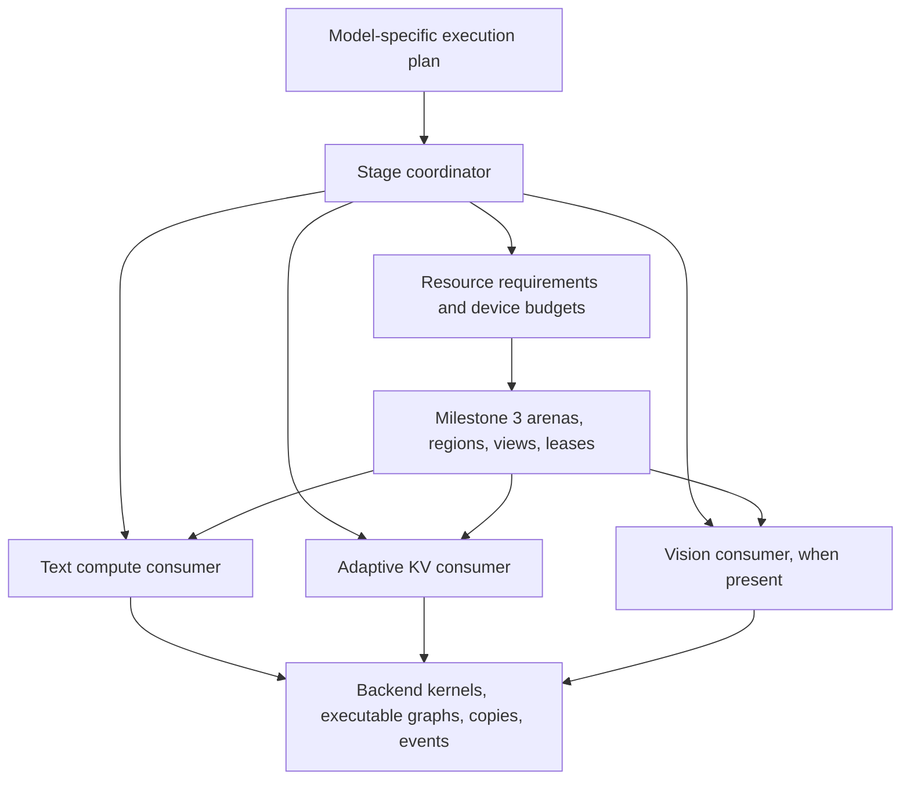
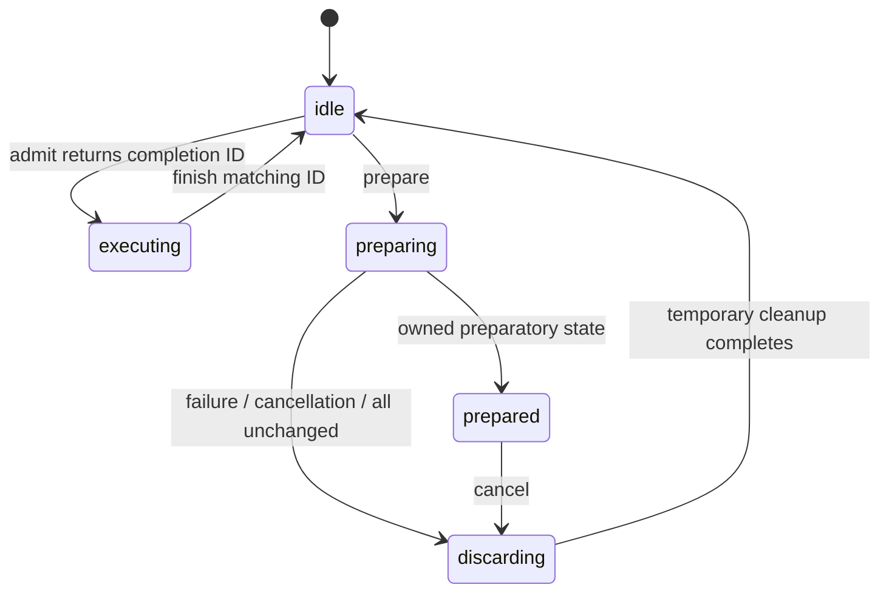
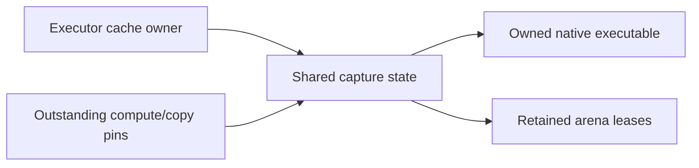
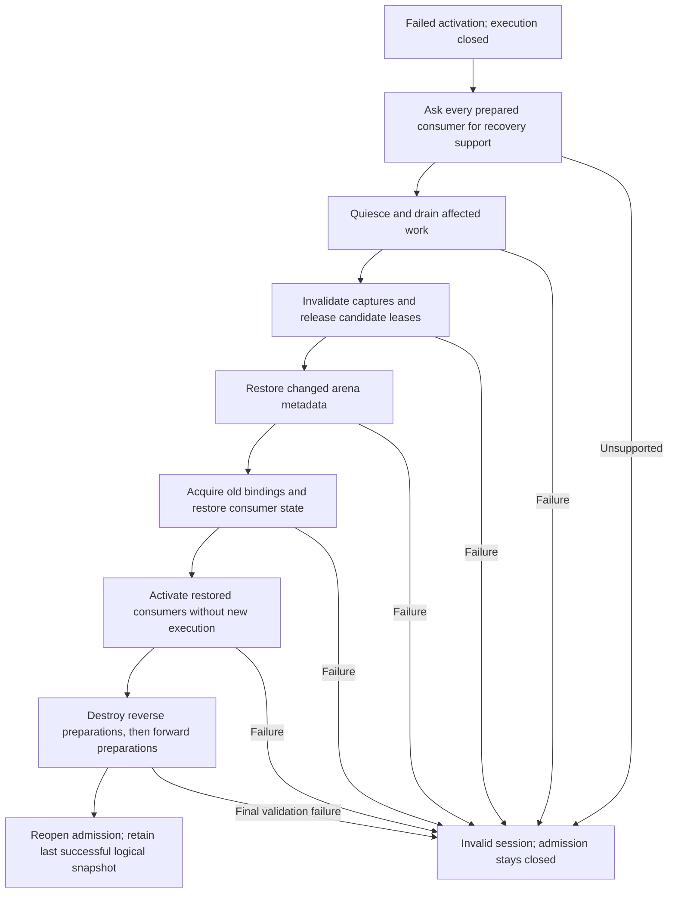
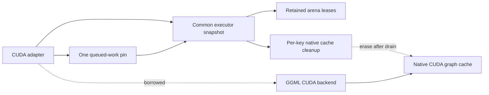
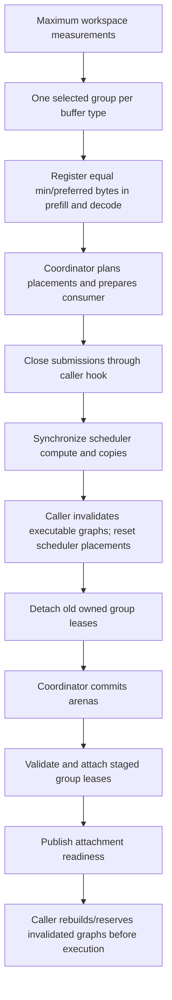
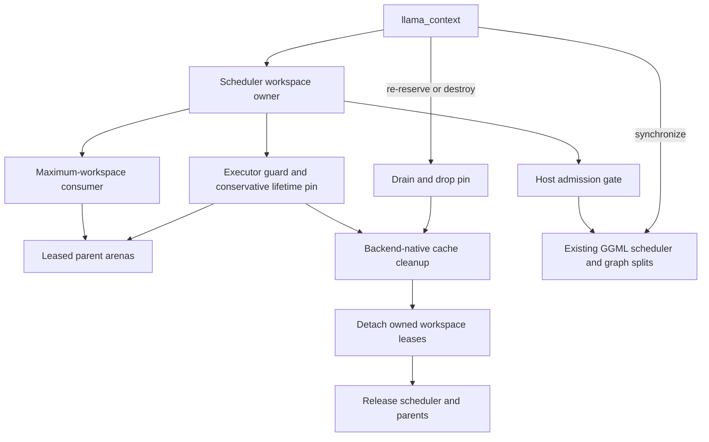
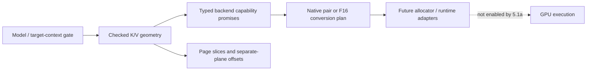
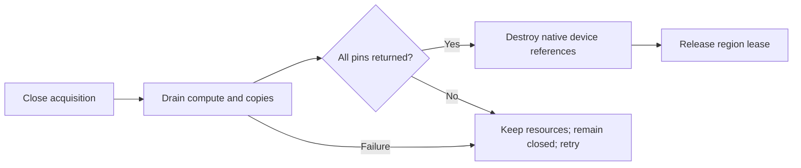

# Device memory consumers: implementation roadmap

Saved: 2026-09-10

Last source review: 2026-09-12, against the checkpoint commits below.

## Status and how to resume

Milestone 4 is committed at `2b3b27bc8` and checkpointed as `feature/device-memory-manager-milestone-4`. Development continues on `feature/device-memory-consumers`. Substages **5.1a** and **5.1b** are committed at `fe2189418` and `74b400abb`. Substage **5.2a** is committed at `4717474c3`; **5.2b** is implemented and validated, awaiting user review and commit. The remainder of milestones 5-8 is planned. The next substage after review is **5.3a: authoritative host KV storage and pinned-memory lifetime**. The new allocation factory is opt-in; no streaming runtime is enabled and production allocation choices are unchanged.

Read this file before continuing implementation. Keep milestone and stage identifiers stable. Parent stage IDs retain their original scope; lettered substages below are the commit units, each containing the implementation and its tests. Stage 8.5 remains a single commit unit. Update the progress ledger after completing a substage, recording its actual commit, validation, and any remaining limitations. A parent stage is complete only when all its required substages pass. Add explicitly named extensions if work expands; do not renumber or retroactively redefine completed stages.

After each completed substage, stage only its implementation, tests, and related documentation for user review. Leave unrelated changes unstaged and let the user create the commit.

This document records the discussed roadmap. Saving it does not start implementation, change branches, or authorize commits or publication.

## Checkpoints and reference implementations

| Reference | Commit | Purpose |
| --- | --- | --- |
| Milestone 3 / feature/device-memory-manager-milestone-3 | 78e002404 | Existing generic arenas, regions, views, leases, and scheduler borrowing, plus Meta ownership and view-factory exception cleanup fixes |
| Milestone 4 / feature/device-memory-manager-milestone-4 | 2b3b27bc8 | Common coordination and qualified serial CPU/single-CUDA context ownership; other backends retain legacy arenas |
| feature/adaptive-kv-stream | d873e5db9 | Reference for fixed-budget adaptive KV algorithms, kernels, and tests |
| feature/kv-stream-phase-arena | ae09597ff | Reference for CUDA prefill/decode memory sharing |
| master at milestone 3 base | ece963f41 | Stock comparison baseline |

Develop on an integration branch based on milestone 3. Create a checkpoint branch only after each milestone passes its acceptance criteria. Branch names can move; the recorded commits identify the reference versions.

## Objectives and initial scope

1. Reimplement adaptive KV streaming using the milestone 3 memory infrastructure.
2. Share memory across text prefill and generation, reclaiming resources no longer needed in each stage.
3. Extend sharing to vision/mmproj execution, supporting separate vision encoders and encoder-free multimodal models.

Initial production scope: one active execution operation per session, one CUDA GPU, ordinary generation without MTP. Common coordination APIs remain backend-agnostic. Streaming kernels, allocation properties, and executable-graph lifecycle support require backend-specific implementation and validation.

Existing buffer-view support on another backend does not imply streamed-attention support.

## Architecture and invariants

The inference session owns a small serial stage coordinator above text and vision contexts. Model integrations describe stages and dependencies. Consumers describe required, preserved, reconstructible, and reclaimable resources. Milestone 3 implements storage ownership and layout validation.

Resource kinds include weights, KV/recurrent state, handoff embeddings, temporary graph workspace, and executable graphs. A resource can survive several stages even when the current stage does not read it.



- Keep device allocation classes explicit. Model weights may use UVM while the shared compute/KV arena remains device-local.
- Keep the parent allocation stable across stage transitions where possible.
- Keep adaptive resident/ring repartition inside one leased KV region. No common-arena transaction, lease lookup, or mutex per page/token.
- Preserve the optimized transfer pipeline, quantized attention, scratch sizing, and asynchronous slot reuse.
- A lease protects ownership but does not automatically track in-flight work or captured device pointers.
- Drain affected work and invalidate stale executable graphs before reusing storage.
- Distinguish graph descriptions, captured executable graphs, tensor workspace, and backend scratch. Releasing one does not imply releasing the others.
- Preserve all live conversation state, including recurrent state outside the streamed KV implementation.
- Keep image embeddings alive until their final consumer finishes. The current host embedding handoff is a useful initial boundary.
- Use explicit stage signals. A one-token prompt is not necessarily generation.
- The coordinator controls stage transitions and total grants; consumers retain specialized internal allocation and execution policies.
- Layout rollback is not inference-state rollback. Device failures after mutable state changes can require session invalidation.

## Source review findings and integration requirements

This review read core implementations and relevant tests at the milestone 3, adaptive KV, and phase-arena checkpoints. It did not run new tests or establish an exhaustive correctness proof. These requirements refine existing stages without renumbering them or marking implementation complete.

### Milestone 3 contracts

- Layout commits update region metadata; they do not move bytes. Consumers must explicitly preserve or reconstruct data when addresses change.
- `ggml_backend_memory_arena_quiesce()` closes admission but does not wait for GPU work. Drain affected compute and copy execution before releasing leases.
- Active leases can survive a commit only for persistent regions unchanged in ID, offset, size, alignment, and flags. Do not require all persistent leases to disappear or the whole arena to become QUIESCENT on every transition.
- A surviving persistent lease retains its acquisition generation after the arena generation increases. A generation mismatch alone does not invalidate that lease.
- Scheduler slots with the same buffer type share allocator storage and lease references. Preserve this aliasing through attachment and detachment.
- The current text consumer reserves maximum workspace across measured phases. It does not reclaim prefill capacity during generation.
- Backend views preserve ownership and native buffer conventions, but do not automatically invalidate captured graphs that refer to reassigned storage.

Sources at `79e25c139`: `ggml/src/ggml-backend-memory.cpp`, `ggml/src/ggml-alloc.c`, `ggml/src/ggml-backend.cpp`, and `src/llama-context-workspace.cpp`. Relevant cases in `tests/test-backend-memory.cpp` cover persistent lease transitions, failed commits, concurrent admission, scheduler detachment, and shared slots.

### Adaptive KV production behavior to preserve

- Prefill uses uniform residency. Decode can concentrate the streamed deficit into selected layers, leaving other layers fully resident to provide prefetch windows. Concentration is bounded by ring size and each layer's active capacity; small rings support multiple waves.
- Resident K and V occupy separate contiguous token-major planes. Ring transfers also use separate K/V planes. A slot is not necessarily a self-contained interleaved K/V byte block.
- Boundary changes can move layer bases and V-plane offsets. The reference invalidates resident metadata and reloads from host when necessary; it does not guarantee non-disruptive device-page migration.
- Preserve batched uploads, resident spans, cross-layer scheduling, producer-ready/consumed event ordering, and slot reuse after the final consuming query tile. Wide micro-batches must not multiply H2D uploads for the same span.
- The real cross-layer queue lives in CUDA's `fattn.cu`. Early helpers `llama_kv_stream_plan_make`, `llama_kv_stream_regions_make`, `llama_kv_stream_extent_make`, and `llama_kv_stream_prefetch_dispatch` have test callers but no production callers in the reviewed adaptive branch. Port from actual execution paths; retain reference helpers only where useful.
- Eligible all-resident decode graphs support CUDA capture. Graphs requiring streamed KV disable capture in the reference. Preserve both paths and their eligibility checks.
- KV-runtime generation covers internal layout changes and authoritative cache replacement. Keep it distinct from arena-layout generation; either can invalidate cached execution assumptions independently.
- Copy-busy feedback extrapolates sampled CUDA copy timing over an evaluation. It is not measured PCIe throughput divided by theoretical bandwidth. Preserve its meaning in policy and diagnostics.

Sources at `d873e5db9`: `src/llama-kv-cache.cpp`, `src/llama-kv-stream-plan.cpp`, `ggml/src/ggml-cuda/fattn.cu`, `ggml/src/ggml-cuda/ggml-cuda.cu`, `ggml/src/ggml-cuda/set-rows.cu`, and `ggml/src/ggml-cuda/kv-stream-span-tuner.h`. Inspect reference branches with `git show <commit>:<path>` without switching the working branch.

### Gaps the new consumers must address

- Host KV buffers retain a runtime that also owns device resources. Current construction requires nonzero staging/resident capacity and offers no complete device-suspension lifecycle. Separate host-cache ownership from device-region binding so host KV can survive without an active device lease.
- Attention partials/accumulators and staged SET_ROWS scratch use CUDA's `ctx.pool()` outside the shared arena. GGML workspace measurements alone do not describe peak memory. Account for overlapping lifetimes and retained backing capacity; explicitly identify what is reclaimed and what remains outside the grant.
- The old phase arena synchronizes, resets CUDA executable state, recreates the scheduler, and substitutes a custom compute buffer type. Replace bespoke ownership with generic leases while preserving required ordering. Partial failure recovery in the old switch is not a complete transactional inference-state guarantee.
- The reviewed integration is restricted to `LLM_ARCH_QWEN35`, the target context, one sequence, and one CUDA device. Attention also checks 256-wide Q/V heads, token-major strides, mask format, and no attention sinks. Runtime pages are 256 tokens, and the phase-arena constructor checks uniform layer page geometry. Broader quantization support does not imply arbitrary model support.
- Storage, online KV writes, direct attention, and conversion fallback are separate capabilities. Validate the entire requested type/shape path before enabling streaming.

Sources for phase transitions at `ae09597ff`: `src/llama-context.cpp`, `src/llama-kv-stream-config.cpp`, and `ggml/src/ggml-cuda/ggml-cuda.cu`.

Existing tests cover all-resident attention, authoritative cache replacement, dirty-row mirroring, batched uploads, cross-layer prefetch, concentrated/multi-wave layouts, wide micro-batches, and phase-arena overlap/lifetime rules. Extend these with delayed execution, complete suspension, and coordinated failure recovery; historical tests do not validate these new lifecycles.

## Development and validation rules

- Write a failing behavioral test before implementation.
- Cover successful operation, invalid input, and meaningful failure/recovery paths.
- Keep each commit buildable and runnable.
- Run focused tests per stage and broader regression checks at milestone boundaries.
- Preserve existing behavior when new functionality is disabled.
- Reuse existing algorithms and tests where suitable; adapt ownership instead of gratuitously rewriting kernels.
- Treat commit-sized stages as reviewable dependent changes, not necessarily independent PRs.
- Keep performance claims proportional to evidence. Existing A/B results are encouraging but include reduced samples, incomplete cells, and a SYCL VMM-fix confounder.
- Use targeted performance checks before broad sweeps: all-resident, streaming onset, moderate streaming, and bandwidth-limited operation.

## Commit sizing and dependency rules

The split below preserves milestones 4-8 and all existing parent stage scopes. It separates independently testable contracts, device execution, integration, failure recovery, and performance changes. It does not add another milestone or mark existing plans as completed.

| Milestone | Commit units | Main reason for subdivision |
| --- | --- | --- |
| 4 | 11 | Separate planning, asynchronous lifetimes, recovery, and the first real consumer. |
| 5 | 22 | Establish exact bounded streaming before adding asynchronous copy, prefetch, tuning, and server/cache integration. |
| 6 | 12 | Separate accounting, growth/shrink, failure handling, phase activation, and budget probing. |
| 7 | 11 | Separate embedding lifetime, KV suspension, projector ownership/reload, and server wiring. |
| 8 | 9, including conditional 8.2b | Separate real model adapters, capability coverage, and sustained lifecycle validation. |

These are planned review units, not a guarantee of final diff size or 65 mandatory code commits. The real cross-attention adapter in 8.2b is conditional; a documented deferral is not an implemented adapter. Do not create empty commits just to satisfy a count. If a substage still contains two independently risky changes, name an additional subdivision before implementing it and preserve completed identifiers.

- The dependency column lists immediate prerequisites. `M3` is the existing checkpoint; `M4` through `M7` mean the preceding milestone has passed its full acceptance gate.
- Tables group work by parent scope, not strict execution order. In milestone 4, implement 4.4a before 4.3b. In milestone 5, implement 5.4a before 5.3c; the host-write baseline does not depend on batched write optimization.
- Define capability rejection at the first affected consumer. Stage 8.3 consolidates and validates those contracts; it is not the first safety gate.
- For code substages, record a failing behavioral test, implement, rerun focused tests, and check existing paths. Documentation/qualification commits instead reproduce their commands and record evidence; do not manufacture a failing test for prose.
- Keep unfinished consumers opt-in or test-only until their integration stage passes. Preserve a runnable baseline at each commit; do not leave production dispatch calling half-ported kernels.
- Use one generic geometry/quant contract from 5.1a onward. Early execution tests can cover a subset while bringing up the pipeline, but must not establish a permanent Q8/Q4 special allocation path.
- Before optimization substages 5.3c and 5.4f-5.4k, retain a targeted result from the preceding working revision. Check numerical correctness, transfer bytes/submissions, and representative latency after each change. Isolate and explain regressions before proceeding.
- Freeze model, quantization, context, b/ub, UVM mode, and pool size for kernel A/B checks. Use separately labeled maximum-allocatable-pool comparisons for phase-sharing gains.
- Save test commands, outcomes, hardware/tool availability, and remaining limitations with each ledger entry. A skipped backend is not a pass; passing tests provide evidence, not a proof that no bug exists.

### Implementation checkpoints within milestone 5

1. Through 5.4a: authoritative host state, leased resident mirrors, and correct all-resident execution.
2. Through 5.4e: correct bounded block streaming and supported quant dispatch, without relying on asynchronous overlap.
3. Through 5.4k: optimized copy/prefetch pipeline, wide micro-batches, feedback, and resident capture.
4. Through 5.5d: real serial server/cache integration and reference-performance qualification.

Do not enable phase-dependent grants before the fixed-pool gate passes. Do not attempt full vision eviction until text phase transitions and host/device KV separation are validated.

## Milestone 4: execution stages and resource coordination

Outcome: multiple consumers can safely share an arena through explicit dependencies. Text behavior remains equivalent to milestone 3.

| Commit unit | Prerequisites | Implementation boundary | Required tests / evidence |
| --- | --- | --- | --- |
| 4.1a | M3 | Resource contracts: IDs, memory domain/allocation class, minimum/preferred bytes, access, preservation, and reconstruction; define explicit unsupported-capability results. | Missing/duplicate IDs, invalid sizes/domains, and a resource surviving an inactive stage. |
| 4.1b | 4.1a | Execution-plan validation: dependencies, last use, and conflicting access; keep model semantics above GGML. | Cycles, missing producers, empty plans, read/write conflicts, and preserved but unread resources. |
| 4.2a | 4.1b | Pure minimum-layout planning with fixed persistent extents and checked alignment/accounting. | Exact fit, overflow, insufficient capacity, persistent overlap, and unchanged persistent region identity. |
| 4.2b | 4.2a | Deterministic elastic grants after minimum requirements; report unused capacity without allocating storage. | Competing preferred sizes, alignment gaps, deterministic ties, and total grants within budget. |
| 4.3a | 4.2b | Transition preparation and admission state machine using fake consumers; no device rebinding yet. | Preparation failure leaves active state usable; cancellation, reentrancy rejection, and no-op transitions. |
| 4.3b | 4.3a, 4.4a | Drain affected execution, invalidate affected executables, release changed leases, commit layout, bind, then activate; preserve unchanged persistent leases. | Delayed compute/copies, admission closure, no reuse before completion, persistent leases surviving a commit, and bind ordering. |
| 4.3c | 4.3b | Failure recovery for transition boundaries; distinguish restorable metadata/bindings from a poisoned inference session. | Injected release/commit/view/bind failures, cancellation after drain, failed recovery, and safe destruction; never claim mutable-state rollback. |
| 4.4a | 4.1a | Executor lifetime contract plus fake executor: affected resources, explicit drain/invalidation, and separate arena/content/executable validity. | Captured stale addresses rejected, unchanged persistent lease remains valid across arena generations, and no-op executable preservation. |
| 4.4b | 4.3c, 4.4a | CUDA adapter for the executor contract using existing capture lifecycle mechanisms. | Real captured replay before/after rebinding, invalidation before storage reuse, no-op capture reuse, and backend-disabled builds. |
| 4.5a | 4.3c | Text workspace consumer: register maximum workspace and attach coordinated leases without phase reclamation. | Create/reserve/detach/destroy, same-buffer-type aliased scheduler slots, failed attachment, and existing backend fallback. |
| 4.5b | 4.5a, 4.4b | Text execution integration and milestone qualification; retain milestone 3 allocation behavior. | Numerical and lifecycle checks on available CPU/CUDA/OpenCL/SYCL/Vulkan/Meta paths; targeted no-op/steady-state overhead comparison. |

Acceptance:

- Fake consumers demonstrate safe sharing and failure recovery.
- Existing text inference passes across available backends.
- No phase-dependent reclamation is enabled yet.
- Coordinator placement remains reusable by text and vision without making GGML image- or server-aware.

## Milestone 5: adaptive KV streaming using leased memory

Outcome: fixed-budget adaptive streaming runs on milestone 3, independently of phase-switching complexity.

| Commit unit | Prerequisites | Implementation boundary | Required tests / evidence |
| --- | --- | --- | --- |
| 5.1a | M4 | Production KV geometry and capability checks with checked quant-aware sizes; audit which reference helpers have real callers. | Independent K/V storage/write/attention/conversion support, unequal row sizes, page tails, overflow, unsupported heads/strides/masks/sinks, and model/sequence limits. |
| 5.1b | 5.1a | Pure resident/ring layout and adaptation policy from production: uniform prefill, concentrated decode, multi-wave capacity, feedback, and hysteresis. | Exact boundaries, short contexts, concentrated deficit, tiny feasible rings, feedback resets, and bounded grants. |
| 5.2a | 5.1a | Device-local CUDA allocation adapter for KV arena storage regardless of weight-UVM setting. | Actual allocation class with UVM on/off, allocation failure, device identity, and teardown. |
| 5.2b | 5.2a, 5.1b | KV runtime borrows one coarse region lease; separate host-cache identity from device binding and cache base/capacity outside token loops. | Undersized/misaligned/wrong-device leases, shared ownership, detach ordering, and no per-page arena transactions. |
| 5.3a | 5.1a | Authoritative host KV storage and pinned-memory lifetime, preserving reference Windows behavior. | Allocation failure, pin/register/unregister ownership, supported quant layouts, and host lifetime independent of device binding; record unavailable OS coverage. |
| 5.3b | 5.3a, 5.2b | Cache writes, dirty rows, mutable tails, and content generation; use a correctness-first synchronized mirror update where needed. | Partial rows/pages, overwrites, cache replacement with unchanged arena generation, pending-write cancellation, and host/device agreement. |
| 5.3c | 5.3b, 5.4a | Batched prefill SET_ROWS/write staging and bounded scratch, replacing the baseline write submission policy. | Quantized batched writes, partial batches, staging reuse after completion, scratch peak, and fewer submissions without changed bytes. |
| 5.4a | 5.3b | Resident K/V planes and ordinary all-resident attention using the leased mirror; no asynchronous streamed execution yet. | Plane offsets, dirty-tail mirror, all-resident numerical equivalence, and existing ordinary attention dispatch. |
| 5.4b | 5.1a | Partial-attention result and stable merge contract; establish reference tests before device integration. | Unequal blocks, masked/empty blocks, causal tails, extreme logits, and tolerance-based comparison with unsplit attention. |
| 5.4c | 5.4a, 5.4b | One explicitly staged KV block and streamed partial-attention integration; start with ordered copy/compute. | Resident plus streamed merge, K/V plane bounds, mutable last block, minimum scratch, and out-of-bounds guards. |
| 5.4d | 5.4c, 5.1b | Multiple streamed blocks with bounded ring-slot reuse and correct concentrated/multi-wave traversal. | Ring wraparound, more blocks than slots, partially filled final block, per-layer bounds, and no premature slot overwrite. |
| 5.4e | 5.4d | Complete supported quant dispatch and bounded F16 conversion fallback through one generic layout contract. | Supported K/V pairs, unequal bytes, direct/fallback agreement, unsupported combinations rejected before allocation, and conversion scratch bounds. |
| 5.4f | 5.4e | Dedicated copy stream and producer-ready/final-consumer events; overlap copies without changing attention semantics. | Artificially delayed producer/consumer, slot reuse hazards, pending-copy teardown, cancellation, and sanitizer-capable host bookkeeping. |
| 5.4g | 5.4f, 5.3c | Contiguous attention spans and batched K/V uploads preserving separate planes. | Partial spans, wraparound, exact transfer bytes, fewer H2D calls, and targeted comparison with the prior commit. |
| 5.4h | 5.4g | Actual cross-layer prefetch queue, bounded lookahead, and immediate safe slot reuse; no fixed three-layer assumption. | Delayed and out-of-order readiness, concentrated/multi-wave schedules, no deadlock, and lookahead constrained by free slots. |
| 5.4i | 5.4h | Wide micro-batch query tiling with slot lifetime extending to the final consuming tile. | b/ub combinations, causal masks, partial query tiles, and no duplicate H2D upload per query tile; preserve 256/256 performance. |
| 5.4j | 5.4i | Runtime miss/copy timing feedback and span tuning connected to the pure policy. | Every consumed span can detect readiness misses, feedback reset, hysteresis, bounded repartitions, and copy-busy units distinct from PCIe utilization. |
| 5.4k | 5.4j | Capture eligibility and invalidation for the completed KV runtime: enable eligible resident replay and gate streamed capture. | Resident replay, resident-to-streamed-to-resident transitions, content/layout generation changes, and no stale captured pointers. |
| 5.5a | 5.4k | Opt-in text-context integration, serial execution gating, and hybrid recurrent-state preservation. | Real-model prefill/decode, context limits, unsupported model/device/sequence rejection, and feature-disabled equivalence. |
| 5.5b | 5.5a | Serial request/reset/cancellation and prompt-cache save/restore integration. | Different content/lengths, reused prefixes, cache replacement, abort followed by another request, and recurrent state equivalence. |
| 5.5c | 5.5b | Qualify fixed-pool performance and add only diagnostics needed to explain differences. | All-resident, streaming onset, moderate streaming, and bandwidth-limited comparisons against the fixed-pool reference; transfer volume and sufficient decode length. |
| 5.5d | 5.5c | Document supported configurations, fixed-budget semantics, limitations, and reproducible focused tests. | Verify documented invocations and capability matrix; no broad model/backend claim from quant-only coverage. |

Acceptance:

- Fixed-pool streaming is correct.
- Targeted comparisons with `feature/adaptive-kv-stream` show comparable performance and transfer volume.
- The KV runtime owns resident/ring subdivision within a coarse lease.
- Concentrated decode layouts and all-resident capture have execution coverage, not just standalone policy tests.
- No broad sweep is required unless representative points reveal an unexplained difference.

## Milestone 6: prefill/decode memory sharing

Outcome: compute and KV share one budget; decode receives space reclaimed from larger prefill workspace.

| Commit unit | Prerequisites | Implementation boundary | Required tests / evidence |
| --- | --- | --- | --- |
| 6.1a | M5 | Separate prefill/decode workspace requirements for actual b/ub, output selection, and attention settings. | Partial batches, TG1, multiple context lengths, output configurations, and budget fitting only one phase. |
| 6.1b | 6.1a | Inventory/account for backend scratch, retained ctx.pool() backing, captures, and transition peaks; define what is inside the shared grant. | Direct/conversion partials, accumulator/write scratch, overlapping lifetimes, and measured peaks versus declared accounting. |
| 6.2a | 6.1b | KV growth/rebind using authoritative host data; rebuild K/V planes and recompute resident/ring split instead of only growing the ring. | Changed layer/V-plane bases, increased residency, lazy reload correctness, and separate arena/KV validity generations. |
| 6.2b | 6.2a | KV shrink/rebind and pending-copy drain; invalidate moved mirrors and bounded scratch safely. | Minimum feasible capacity, concentrated layouts, ring remap, dirty tails, delayed work, and logical cache preservation. |
| 6.2c | 6.2b | Rebind failure handling without relying on simultaneous old/new full-budget allocation. | Rejected resize, failed view/binding creation, recoverable reactivation, poisoned-session rejection, and host KV retained. |
| 6.3a | 6.1a | Explicit text prefill/generation stage signals, with no reclamation enabled yet. | Single-token prompt versus generation, final short prompt batch, TG1, repeated notifications, and speculative execution rejection. |
| 6.3b | 6.3a, 6.2c | Activate phase sharing: drain/invalidate, release workspace, repartition grants, bind, and rebuild only affected execution. | Real prefill-to-decode reclaim, captured-pointer safety, no-op transition, no per-token coordinator work, and measured decode pool increase. |
| 6.4a | 6.3b | Return from expanded decode KV to prefill for serial requests and changed requirements. | Long decode then short/long prompts, repeated alternation, shrink/reload correctness, and numerical equivalence. |
| 6.4b | 6.4a | Prompt reuse, cache restoration, and interrupted phase transitions. | Cached prefixes, restored host KV/recurrent state, cancellation at each boundary, and subsequent request or explicit invalid-session outcome. |
| 6.5a | 6.4b | Generalized shared-budget CLI/API option and deliberate compatibility with existing fixed-pool options. | Parsing, mutually exclusive/conflicting options, old-option behavior, and clear included/excluded allocations. |
| 6.5b | 6.5a | Adapt maximum-pool benchmark probing to both phases and transition peaks, using existing sweep harness. | Startup-only false fits rejected, next-granule OOM boundary, successful decode/return-to-prefill, and no arbitrary new safety reserve. |
| 6.5c | 6.5b | Transition/accounting diagnostics and qualification against the phase-arena reference. | Effective decode KV bytes, streaming onset, reclaimed workspace versus capture storage, resident reload latency separated from steady-state speed. |

Acceptance:

- Reclaimed prefill workspace measurably increases decode KV capacity.
- Streaming begins later when additional capacity permits.
- No common-arena transactions or new device-wide synchronization occur on ordinary steady-state tokens.
- Transition cost and throughput are comparable to `feature/kv-stream-phase-arena`.
- The budget clearly states whether compute, KV, scratch, weights, and driver allocations are included.
- Executable-graph destruction and tensor-workspace reclamation are validated separately.
- Report resident reload cost separately from steady-state throughput; do not assume repartition preserves device pages.

## Milestone 7: separate vision encoder integration

Outcome: a Qwen-style vision encoder and language model safely share phase-specific memory.

| Commit unit | Prerequisites | Implementation boundary | Required tests / evidence |
| --- | --- | --- | --- |
| 7.1a | M6 | Borrowed mtmd compute workspace consumer with explicit requirements and executable lifetime. | Variable image sizes/batches, workspace sizing, attachment failure, and drain before release. |
| 7.1b | 7.1a | Handoff embedding ownership independent of reusable vision workspace; preserve the existing host boundary initially. | Multiple images, partial/chunked consumption, embedding lifetime after workspace release, and cancellation cleanup. |
| 7.2a | 7.1b | Session execution plan for vision encoding followed by embedding prefill; initially retain existing allocations. | Text/image/text ordering, follow-up images with existing state, multiple images, and encoding failure without unsafe text execution. |
| 7.3a | 7.2a | Full KV device suspension: drain authoritative writes/copies, release device binding, and preserve host/runtime identity; explicitly account for recurrent state. | Zero retained KV device lease/pool, dirty tails saved, unchanged host cache, suspended execution rejected, and state outside KV protected. |
| 7.3b | 7.3a | Resume suspended KV into a fresh grant and rebuild affected mirrors/executables. | Different grants/addresses, host content restored, stale capture rejection, and attention/recurrent-state equivalence. |
| 7.3c | 7.3b | Interrupted suspension/restoration and integration with vision-stage borrowing. | Allocation/rebind failure, cancellation before/after eviction, retry versus invalid-session rules, and repeated vision/text transitions. |
| 7.4a | 7.2a | Separate projector device-weight ownership from model metadata and host/reload source while keeping current eager residency. | Shared owners, tensor metadata lifetime, loading equivalence, and destruction without double release. |
| 7.4b | 7.4a | Explicit projector-weight unload/reload with executable invalidation and tensor rebinding. | Repeated new-address reload, stale tensor/capture rejection, drain before unload, and numerical equivalence. |
| 7.4c | 7.4b, 7.3c | Coordinate reloadable projector storage with phase grants and failure recovery; account for weights that stay outside the arena. | Budgets unable to hold both phase allocations, reload failure, no double-allocation assumption, and persistent conversation state. |
| 7.5a | 7.4c | Complete multimodal server flow, image-related cache reuse, and serial session cleanup. | Real image/text requests, follow-up images, reused media prefixes, aborted requests, and handoff final-use ordering. |
| 7.5b | 7.5a | Qualify memory savings, transition latency, and documented supported vision configuration. | Peak below simultaneous phase sum, expected post-request baseline, repeatable outputs, and separate projector reload versus KV reload costs. |

Acceptance:

- A supported request fits a budget that cannot hold all phase-specific allocations at once.
- Subsequent generation remains correct.
- Projector weights are unloaded only through an explicit storage lifecycle.
- Existing KV and hybrid recurrent state survive vision execution.
- Host KV ownership does not force retention of the device pool during vision execution.
- Handoff embeddings remain available for all consumers, including later chunks from a media batch.

## Milestone 8: encoder-free plans and integration hardening

Outcome: one coordinator supports separate encoders and shared multimodal transformers with explicit capability boundaries.

| Commit unit | Prerequisites | Implementation boundary | Required tests / evidence |
| --- | --- | --- | --- |
| 8.1a | M7 | Encoder-free execution-plan adapter for a supported model: lightweight preparation then shared multimodal prefill. | Model-derived dependencies, shared transformer weights never reclaimed as a separate projector, and absent encoder handled explicitly. |
| 8.1b | 8.1a | Real encoder-free inference integration and phase sharing; choose a model verified in the checkout and report streaming support separately. | Image/text output equivalence, prefill-to-decode reclamation, shared-weight lifetime, and safe fixed-layout/rejection when streaming geometry is unsupported. |
| 8.2a | 8.1b | Cross-attention-style persistent visual-resource contract using fake consumers. | Encoder workspace reclaim without dropping features/visual KV, repeated generation consumers, and last-use release. |
| 8.2b | 8.2a | Integrate a real cross-attention adapter only if a suitable supported model/backend is available; otherwise record a named deferred adapter and evidence of the limitation. | Actual model equivalence and lifetimes when implemented; fake tests are explicitly not production support. |
| 8.3a | 8.1b, 8.2a | Consolidate capability/fallback policy already introduced in milestones 4-7; do not defer safety checks until this stage. | Allocation, borrowing, executable invalidation, storage/write/attention streaming capability combinations, and no silent budget violation. |
| 8.3b | 8.3a | Validate existing CPU/CUDA/OpenCL/SYCL/Vulkan/Meta combinations and unsupported-path diagnostics. | Real available-device smoke/numerical tests, aliased Meta ownership, valid fixed-layout fallback, and explicit rejection where no budget-safe path exists. |
| 8.4a | 8.3b | Integrated session fault/lifetime matrix across transitions, caches, suspension, reload, and destruction. | Delayed compute/copy execution, injected failures at boundaries, repeated recovery/invalid-session outcomes, and no use after release. |
| 8.4b | 8.4a | Sustained reuse/leak and applicable sanitizer qualification, keeping host and device coverage distinct. | Repeated multimodal sessions, memory return to expected retained baseline, ASan/UBSan/TSan where supported, and recorded hardware/tool gaps. |
| 8.5 | 8.4b, 8.2b | Finalize architecture/support documentation, examples, and compact performance/memory comparisons using existing harnesses. | Reproducible text-only, separate-encoder, and encoder-free examples; deferred cross-attention support labeled; disabled-feature baseline preserved. |

Acceptance:

- Both real architecture families use the same coordinator.
- Existing backend paths retain their behavior.
- Unsupported streaming paths are explicitly identified.
- If no appropriate cross-attention model is supported locally, its real adapter is a named follow-up; contract tests do not count as production model support.

## Subsequent work, outside milestones 4-8

- Concurrent request execution and overlapping stages.
- Multi-GPU streaming and per-device capacity coordination.
- MTP/speculative execution layouts.
- General model-weight or MoE-expert eviction policies.
- Optimized streaming engines for ROCm, SYCL, Vulkan, OpenCL, and other accelerators.

The contracts should permit these additions without claiming they are implemented.

## Checkpoint meaning

| Milestone | Completed capability |
| --- | --- |
| 3 | Allocation and lifetime infrastructure |
| 4 | Safe execution-stage coordination |
| 5 | Fixed-budget adaptive KV streaming |
| 6 | Text prefill/decode reclamation |
| 7 | Separate vision/text sharing and reloadable projector storage |
| 8 | Encoder-free integration and consolidated validation |

## Progress ledger

Record substage completion here only after the required validation succeeds. Expand the grouped planned rows as work proceeds; keep each completed substage's actual commit and evidence. Milestone 4 is checkpointed. Substages 5.1a and 5.1b are committed; 5.2a is committed at `4717474c3`. Stage 5.2b is ready for review. Do not start 5.3a until the user has reviewed and committed it.

| Stage | Status | Commit | Validation / limitations |
| --- | --- | --- | --- |
| Milestone 3 | Complete | 78e002404 | Original A/B evidence at 79e25c139 under benchmarks/server-ab/results/; prerequisite Meta ownership and view-factory exception fixes tested separately. |
| 4.1a | Complete | f78fba604 | 16 cases / 231 assertions; all five selected suites pass in debug, ASan/leak-checking, and UBSan after integration onto 9c6d4b06f. |
| 4.1b | Complete | 8a31bd381 | 16 cases / 259 assertions; all six selected memory suites pass in debug, ASan/leak-checking, and UBSan. |
| 4.2a | Complete | 0ed96420c | 18 cases / 276 assertions; all seven selected memory suites pass in debug, ASan/leak-checking, and UBSan. |
| 4.2b | Complete | 0949a7605 | Layout suite: 32 cases / 2,170 assertions, including 144 small configurations; all seven selected suites pass in debug, ASan/leak-checking, and UBSan. |
| 4.3a | Complete | 14ec534b6 | 19 cases / 809 assertions; all eight focused memory suites pass in debug, ASan/leak-checking, and UBSan. |
| 4.3b | Complete | 9a7fe0a69 | 16 cases / 232 assertions using real CPU arenas and fake execution; all ten selected suites pass in debug, ASan/leak-checking, and UBSan. |
| 4.3c | Complete | 722371ce9 | 18 cases / 514 assertions with real CPU arenas and fake execution; all eleven focused suites pass in debug, ASan/leak-checking, and UBSan. Recovery needs explicit consumer support; otherwise the session remains invalid and closed. |
| 4.4a | Complete | ac1436010 | 16 cases / 176 assertions using real CPU leases and fake execution; all nine selected suites pass in debug, ASan/leak-checking, and UBSan. |
| 4.4b | Complete | 079417191 | Native CUDA: 10 cases / 226 assertions, capture enabled and disabled; Compute Sanitizer: zero errors/leaks. Twelve focused suites pass in debug CPU/CUDA and CPU ASan/UBSan. Experimental GGML_CUDA_GRAPH_OPT=1 is explicitly rejected. |
| 4.5a | Complete | 6a2917143 | Workspace consumer: 16 cases / 390 assertions using real CPU schedulers and arena leases; all thirteen focused suites pass in debug, ASan/leak-checking, and UBSan. No production wiring or phase reclamation yet. |
| 4.5b | Complete | 2b3b27bc8 | Serial CPU/single-CUDA contexts use coordinated ownership; other configurations retain legacy arenas. Four CPU owner cases / 352 assertions, five CUDA cases / 376 assertions; fourteen focused suites pass in debug and CPU ASan/UBSan. Numerical/lifecycle compatibility passes on available CPU/CUDA/OpenCL/SYCL/Vulkan/Meta paths; HTTP CPU/CUDA smoke and paired dispatch-overhead checks pass. |
| Milestone 4 | Complete within declared scope | 2b3b27bc8 | Checkpoint branch created after the user committed 4.5b. |
| 5.1a | Complete | `fe2189418` | 18 cases / 1,205 assertions; 15 focused suites and existing CPU model regressions pass in debug, ASan/leak-checking, and UBSan. Reference production call paths audited; no streaming runtime is enabled. |
| 5.1b | Complete | `74b400abb` | 20 policy cases / 139,866 assertions; 16 focused suites and existing CPU model regressions pass in debug, ASan/leak-checking, and UBSan. Pure production-derived layout/adaptation policy; no streaming runtime enabled. |
| 5.2a | Complete | `4717474c3` | 10 CUDA cases / 1,055 assertions per UVM mode; actual device pointer attributes and zero memcheck errors/leaks. 18 CUDA-build and 16 CPU debug/ASan/UBSan suites pass; virtual-device identity and native capture checks pass. Opt-in factory only. |
| 5.2b | Ready for user review | Uncommitted | 15 CPU cases / 3,097 assertions; 16 real-CUDA cases / 3,108 assertions per UVM mode; virtual-device rejection passes. 17 focused suites pass in CPU/CUDA Debug and CPU ASan/UBSan; CUDA memcheck reports zero errors/leaks. Binding adapter only. |
| 5.3a-5.5d | Planned | - | See substage dependencies and milestone acceptance gate. |
| 6.1a-6.5c | Planned | - | See substage dependencies and milestone acceptance gate. |
| 7.1a-7.5b | Planned | - | See substage dependencies and milestone acceptance gate. |
| 8.1a-8.5 | Planned | - | Real adapter 8.2b conditional; otherwise explicitly deferred. |

## Substage 4.1a implementation and validation

Implemented on 2026-09-10 in `src/llama-memory-requirements.h/.cpp`, with `tests/test-memory-requirements.cpp` registered through CMake.

- Internal declarations identify session-local placement domains and resources, exact allocation classes, content preservation/reconstruction policies, and per-stage capacities/access/capability requirements.
- The validator is read-only and makes no allocation or backend calls. It checks declaration structure before returning unsupported allocation/capability results, with the relevant domain/resource IDs.
- A resource can remain live with access NONE. These are declaration tests, not a claim that cross-stage byte preservation or GPU synchronization is implemented.
- Allocation classes are exact requirements, not preferences: managed storage does not satisfy a device-local request.
- Zero-byte declarations are allowed, but they do not create zero-byte arena regions. Planner capacity, stage dependencies, execution lifetimes, and actual hardware capabilities are outside 4.1a.
- Existing inference dispatch and allocation are unchanged. No production container or GPU configuration was changed.

TDD evidence: the new test compiled against a placeholder that returned success, then failed 91 assertions. After implementing validation, all 16 cases and 231 assertions passed.

| Configuration | Result |
| --- | --- |
| Existing debug CPU build | New contract test plus allocator, buffer, arena, and Meta tests: 5/5 pass. |
| ASan with leak detection | New contract test plus allocator, buffer, arena, and Meta tests: 5/5 pass on the fixed baseline. |
| UBSan with halt-on-error | New contract test plus allocator, buffer, arena, and Meta tests: 5/5 pass. |
| Strict compiler warnings | New validator passes `-Wall -Wextra -Werror -Wconversion -Wsign-conversion -pedantic`. |

Both sanitizer builds instrument the new llama source, not only GGML. TSan and hardware-specific backend tests were not run for this pure declaration/validation stage; no execution or synchronization implementation changed.

Reproduce the focused normal run from the repository root:

```sh
cmake -S . -B build-device-memory-infra
cmake --build build-device-memory-infra --target test-memory-requirements test-backend-memory test-backend-buffer test-backend-meta test-alloc -j 20
ctest --test-dir build-device-memory-infra -R '^test-(memory-requirements|backend-memory|backend-buffer|backend-meta|alloc)$' --output-on-failure
```

Sanitizer configurations used `-DLLAMA_SANITIZE_ADDRESS=ON` in `build-device-memory-infra-asan` and `-DLLAMA_SANITIZE_UNDEFINED=ON` in `build-device-memory-infra-ubsan`, with the same targets. Runs used `ASAN_OPTIONS=detect_leaks=1:halt_on_error=1` and `UBSAN_OPTIONS=halt_on_error=1:print_stacktrace=1`, respectively.

### Prerequisite Meta leak fix

Before the prerequisite fix, `test-backend-meta` reported 136 bytes in four leaked allocations originating from `ggml_backend_meta_device_get_buffer_type()` at `ggml/src/ggml-backend-meta.cpp:362` in `79e25c139`. The cached buffer-type contexts used raw ownership. The expanded cache regression reproduced 2,440 leaked bytes in 68 allocations.

The same leak was reproduced with the unchanged Meta test linked only to GGML; `readelf -d` confirms the reproducer does not load `libllama` or `libllama-common`, so it excludes the new contract code. The user committed the separate fix as `9c6d4b06f` on the infrastructure baseline before restoring 4.1a. Cached entries now own their contexts, with stable buffer-type addresses. No suppression was added; the standalone check below is expected to pass on the fixed baseline.

```sh
c++ -std=c++17 -g -fsanitize=address -fno-omit-frame-pointer -I ggml/include tests/test-backend-meta.cpp -L build-device-memory-infra-asan/bin -Wl,-rpath,"$PWD/build-device-memory-infra-asan/bin" -lggml -lggml-base -lggml-cpu -o build-device-memory-infra-asan/bin/test-backend-meta-ggml-only
ASAN_OPTIONS=detect_leaks=1:halt_on_error=1 build-device-memory-infra-asan/bin/test-backend-meta-ggml-only
```

## Substage 4.1b implementation and validation

Implemented in `src/llama-memory-plan.h/.cpp`, with `tests/test-memory-plan.cpp` registered through CMake. This stage reuses the 4.1a resource validator and adds no inference call site, allocator, backend call, or GPU work.

### Ordered serial plan contract

- The caller supplies stages in execution order. Dependencies must name earlier stages. This rules out self-dependencies and cycles without a recursive graph traversal or temporary graph allocation.
- An acyclic but incorrectly ordered list is also rejected; validation does not sort it. The serial order itself orders accesses between stages, even without explicit dependency edges.
- Stage IDs are labels, not positions. Every listed stage executes once; repeated decode or return-to-prefill uses another invocation, not a cycle inside one plan.
- Each stage declares at most one requirement per resource. Separate conflicting declarations are rejected by 4.1a; use READ_WRITE to express one stage consuming incoming contents and defining outgoing contents.
- Explicit inputs promise initialized contents at plan entry. READ and READ_WRITE need those inputs or a preceding writer. WRITE defines outgoing contents; NONE keeps a binding but cannot act as a producer. Internal scratch that is initialized by the stage declares WRITE.
- Explicit outputs extend content lifetime through the final stage, even if no stage reads them. A missing output producer is an error at the plan boundary.

### Preservation and limits

- Once initialized, preserved contents must have an explicit requirement in every stage through the last declared use/output, including a NONE requirement in an otherwise inactive stage.
- Preservation is conservative until the last declaration: a later overwrite does not implicitly waive the preservation policy. Reuse disposable scratch with a discardable resource instead.
- A missing binding discards discardable contents. A later read needs reinitialization; a later write can establish new contents.
- Reconstructible contents may cross a binding gap only after initialization. That property is a consumer promise of independent backing, not an implicit producer or an implemented reload operation.
- Validation is read-only and allocation-free. It checks resource-level declarations, not the initialization of individual byte ranges, correctness of reconstruction, device synchronization, available capacity, or actual execution.
- Single-stage structural errors and plan/lifetime errors are checked before returning an unsupported-capability result, so a malformed plan cannot silently select a fallback.
- Parallel execution, unordered DAG scheduling, conditional branches, and runtime transition recovery are not implemented in this substage.

### TDD evidence

The new test compiled against a success-only placeholder and failed 101 of 259 assertions across 16 cases. The implementation then passed all 259 assertions. Cases include empty plans, duplicate/missing IDs, dependencies and cycles, missing producers, preserved-but-unread contents, imported state, outputs and last use, discarded/reconstructible gaps, duplicate access declarations, and diagnostic precedence.

The six selected suites (`test-memory-plan`, `test-memory-requirements`, `test-alloc`, `test-backend-buffer`, `test-backend-memory`, and `test-backend-meta`) pass in the debug CPU, ASan with leak detection, and UBSan builds. Both sanitizer configurations instrument the new llama source. The new validator also passes `-Wall -Wextra -Werror -Wconversion -Wsign-conversion -pedantic`.

```sh
cmake -S . -B build-device-memory-infra
cmake --build build-device-memory-infra --target test-memory-plan test-memory-requirements test-alloc test-backend-buffer test-backend-memory test-backend-meta -j 20
ctest --test-dir build-device-memory-infra -R '^test-(memory-plan|memory-requirements|alloc|backend-buffer|backend-memory|backend-meta)$' --output-on-failure
```

For sanitizers, use the existing `build-device-memory-infra-asan` and `build-device-memory-infra-ubsan` configurations with the same target list and selection. ASan uses `ASAN_OPTIONS=detect_leaks=1:halt_on_error=1`; UBSan uses `UBSAN_OPTIONS=halt_on_error=1:print_stacktrace=1`. TSan and GPU-specific tests were not run for this non-executing, non-concurrent validation stage.

## Substage 4.2a implementation and validation

Implemented in `src/llama-memory-layout.h/.cpp`, with `tests/test-memory-layout.cpp` registered through CMake. The planner validates the complete 4.1b plan, selects one stage, and reuses the milestone 3 `ggml_backend_memory_planner_*` metadata allocator.

### Minimum-layout contract

- Budgets are identified by the exact placement domain and allocation class. A managed-memory budget cannot satisfy a device-local requirement, and duplicate budgets for the same pair are rejected.
- Budget indices identify the arenas in fixed-region snapshots and in the output. They are not GPU ordinals. Independent arenas have independent offset spaces.
- Caller-supplied persistent regions are placed first and retain their ID, offset, size, alignment, and flags exactly. Their current stage must declare the resource; NONE access is sufficient.
- A fixed region must already satisfy the minimum size and alignment. It can exceed the current preferred size; preserving a lease never silently shrinks or relabels its region.
- Content preservation does not automatically imply a fixed address. New placements use non-persistent flags; deciding which new bindings must remain pinned belongs to coordination before lease admission.
- New regions receive exact minimum byte sizes, with offsets aligned to the larger of the budget and requirement alignments. Preferred capacity is deliberately not granted until 4.2b.
- Zero minima create no new region and need no budget. A supplied fixed region still occupies its full extent even when its current minimum becomes zero.
- Regions in each output arena are address-sorted. Used bytes, high-water position, and unused bytes are reported separately; unused includes alignment holes and is not a guarantee of contiguous free space.
- Placement uses deterministic first-fit in requirement order after reserving fixed extents. This is not an optimal packing solver and can reject a fragmented budget despite sufficient total free bytes.

### Safety and scope

Fixed extents are checked for overlap, identity conflicts, allocation-class/domain mismatch, invalid flags, alignment, undersizing, and bounds before metadata planning starts. Byte-range checks use subtraction to avoid overflow. Temporary planners and result vectors are private to the call; the previous output remains unchanged on failure, including failure after another arena or region has been planned.

This stage allocates only small host-side planning metadata. It does not allocate backend storage, inspect VRAM availability, acquire leases, commit a live arena, synchronize devices, or move bytes. Relative offset alignment is a planning constraint; the later binding adapter must verify that the actual parent buffer can satisfy the requested absolute/native alignment. Supplied budgets and fixed-region snapshots are not proof of physical availability or current lease validity.

GGML's boolean reserve API does not distinguish an unavailable aligned interval from an internal metadata-allocation failure, so both are reported as `placement_failed`. Detected planner-construction failures and caught host `std::bad_alloc` exceptions return `allocation_failed`. No status here means a GPU allocation was attempted.

### TDD evidence

The initial 18 cases failed against a success-only placeholder with 109 failed assertions. After implementation, all 276 assertions pass; the higher executed assertion count includes layout checks that were guarded when the placeholder did not return a usable layout.

Coverage includes exact fits, minimum versus preferred capacity, unrounded byte sizes and alignment holes, stronger parent alignment, persistent identity and overlap, zero minima, missing/empty budgets, independent domains/classes, preserved-but-unread bindings, fragmentation, deterministic repeated planning, and unchanged output on failures. A successful `SIZE_MAX`-capacity metadata plan followed by a rejected additional placement exercises range limits without allocating that amount of storage.

All seven selected suites pass in the debug CPU, ASan/leak-checking, and UBSan builds, with sanitizer instrumentation enabled for the new llama source. Strict warnings also pass with `-Wall -Wextra -Werror -Wconversion -Wsign-conversion -pedantic -I ggml/include`. Host metadata OOM was not fault-injected, and no GPU-specific or TSan run was required for this local, non-executing planner.

```sh
cmake -S . -B build-device-memory-infra
cmake --build build-device-memory-infra --target test-memory-layout test-memory-plan test-memory-requirements test-alloc test-backend-buffer test-backend-memory test-backend-meta -j 20
ctest --test-dir build-device-memory-infra -R '^test-(memory-layout|memory-plan|memory-requirements|alloc|backend-buffer|backend-memory|backend-meta)$' --output-on-failure
```

Use the same targets and selection for `build-device-memory-infra-asan` with `ASAN_OPTIONS=detect_leaks=1:halt_on_error=1` and `build-device-memory-infra-ubsan` with `UBSAN_OPTIONS=halt_on_error=1:print_stacktrace=1`. No production service or model configuration was changed.

## Substage 4.2b implementation and validation

Added `llama_memory_layout_elastic()` to `src/llama-memory-layout.h/.cpp` and extended `tests/test-memory-layout.cpp`. The minimum-only entry point remains unchanged.

### Grant policy

1. First obtain a valid minimum layout using 4.2a. Required minima must fit before any preferences are considered.
2. Handle each arena independently. Preserve every fixed persistent region exactly; fixed regions do not participate in growth, even if their preferred size differs.
3. Give each movable consumer the same extra-byte level above its own minimum, capped by its preferred size. Consumers already at their preference stop taking additional bytes.
4. Assign remaining usable capacity in increasing resource-ID order. This step can give more than one byte to a consumer because alignment can leave a larger remainder.
5. Validate/materialize the final region metadata through the existing GGML planner and publish only after all arenas succeed.

For example, minima of 64 and 32 bytes, preferences of 128 and 96 bytes, and a 128-byte arena with unit alignment yield grants of 80 and 48 bytes. With 129 bytes, the lower resource ID receives the extra byte. Alignment can change the distribution; this is capped equal-extra growth followed by deterministic remainder allocation, not a claim of exact fairness under all packing constraints.

Movable regions retain their address order from the minimum layout but can move forward around fixed regions. Optional consumers with zero minima append in declaration order. A zero-minimum consumer without a matching budget remains unallocated rather than borrowing from another allocation class. Zero preferred size remains absent; zero-capacity arenas remain empty.

### Why ordered packing is explicit

General first-fit repacking can change hole assignments as sizes change, so its fit result need not be monotonic. The elastic size search instead packs forward in a fixed movable-resource order around address-sorted fixed obstacles. Increasing a grant can only move subsequent placements forward, making the fit predicate suitable for bounded binary searches. Upper-midpoint and alignment calculations avoid overflow at `SIZE_MAX`.

After the common-level search, each eligible resource receives its largest fitting remainder in stable ID order while other grants stay fixed. Alignment holes that cannot be consumed within this order remain reported as unused. This is not an optimal packing solver: it does not reorder movable resources to find a globally larger grant or change fixed extents.

### Safety and validation

- Minima, allocation domains/classes, fixed identity, bounds, and failure-output atomicity retain their 4.2a semantics.
- No grant exceeds its preference except an already-fixed region whose retained size was explicitly supplied.
- Only host-side metadata is allocated; binary-search probes make no backend-storage allocation or per-byte loop.
- The result is not attached to a live arena. Actual rebinding, capture invalidation, data movement, and device synchronization remain later stages.
- Byte grants do not imply a consumer can use every byte as a whole KV page; consumers retain responsibility for their internal geometry.

TDD began with an elastic entry point delegating to the minimum-only planner. The 31-case suite then failed 39 assertions while the existing minimum tests stayed green. After implementation and an independent exhaustive-growth test, the suite passes 32 cases and 2,170 assertions.

The independent test enumerates 144 small budget/alignment/fixed-obstacle configurations. For feasible minima, a separate brute-force offset enumerator checks that the final grants fit and that no individual grant below its preference can grow by one byte while the others remain fixed in the chosen order. Additional tests cover equal extras, preference caps, resource-ID remainders, unpinned workspace relocation, fixed regions above/below preferences, zero minima, missing optional budgets, independent allocation classes, large alignment remainders, fixed obstacles, repeated planning, failures, and `SIZE_MAX` bounds.

All seven focused suites pass in debug CPU, ASan/leak-checking, and UBSan builds. Strict compiler warnings also pass for the planner. As in 4.2a, host metadata OOM is handled but was not fault-injected. No GPU execution benchmark or TSan run was performed for this non-executing planner; production was not changed.

```sh
cmake --build build-device-memory-infra --target test-memory-layout test-memory-plan test-memory-requirements test-alloc test-backend-buffer test-backend-memory test-backend-meta -j 20
ctest --test-dir build-device-memory-infra -R '^test-(memory-layout|memory-plan|memory-requirements|alloc|backend-buffer|backend-memory|backend-meta)$' --output-on-failure
```

The sanitizer runs use the same targets and selection in `build-device-memory-infra-asan` with `ASAN_OPTIONS=detect_leaks=1:halt_on_error=1` and `build-device-memory-infra-ubsan` with `UBSAN_OPTIONS=halt_on_error=1:print_stacktrace=1`.

## Substage 4.3a implementation and validation

Added `src/llama-memory-transition.h/.cpp` and `tests/test-memory-transition.cpp`. The transition gate copies a target snapshot, invokes the 4.2b planner, and prepares registered consumers in order. It does not activate a target, change a live arena, or rebind device memory.

### Admission and preparation



The diagram describes logical host admission, not GPU execution. Admission is rejected in every non-idle state. Nonzero completion IDs do not repeat; stale, duplicate, and mismatched completions cannot reopen admission for a newer operation or pending transition. Counter wrap is rejected.

This is an owner-thread-only state machine. Callbacks may reenter admission, prepare, finish, or cancel according to the gate rules, but must not destroy the transition object. External cancellation must be marshalled to the owner thread. `finish()` only finishes the admitted host operation; it is not a backend completion fence and does not close or drain GGML arena leases.

### Consumer and rollback contract

- The caller supplies a nonempty complete participant list. Null and duplicate registrations are rejected before callbacks. Consumers are borrowed and must outlive the transition and their preparations.
- The target and computed layout are owned snapshots. Caller mutation/destruction of the request cannot change a prepared target.
- A consumer must not mutate active state or submit device work during preparation. It may return an owned preparation, or return success with no preparation to confirm that no transition is needed for its state.
- No-op classification is negotiated with every consumer, not inferred from stage IDs or layout equality. The consumer must consider its external/runtime state too.
- Returned preparations, including a failing consumer's partial output, are destroyed in reverse registration order. Snapshot metadata stays valid throughout their destruction.
- Cleanup keeps admission closed and rejects reentrant prepare/finish/cancel attempts. Preparation destructors must not throw.
- Cancellation from within a prepare callback sets a flag; it cannot destroy that callback's parameters or output slot. Cleanup happens after the callback returns, before any later consumer is called.
- Cancellation takes precedence over a normal returned failure or no-op. Thrown exceptions remain reported, including their original `exception_ptr`; cancellation does not hide them.
- A successful non-no-op remains prepared with admission closed. There is deliberately no activation API yet. Cancelling or destroying the transition discards only preparatory state.
- The framework guarantees temporary-state cleanup, not rollback of arbitrary consumer side effects. Keeping old state usable depends on consumers honoring the non-mutating preparation contract.

### TDD evidence and scope

The initial 17 cases failed against placeholders with 256 failed assertions. After implementing the gate and adding cancellation-precedence coverage, all 19 cases and 809 assertions pass. Checks cover overlap and stale completion IDs, reentrant callbacks, partial failure at different consumer positions, reverse cleanup, consumer and allocation exceptions, deferred cancellation, no-op negotiation, invalid registration/layout, owned snapshots, pending destruction, and repeated failure/no-op/cancel cycles.

Fake preparations hold references to their target/layout and inspect them during destruction, so ASan also checks the snapshot-versus-token destruction order. Fake consumers retain unchanged active values throughout failed or cancelled preparation. A simulated consumer `std::bad_alloc` tests partial-output cleanup; allocator failures in every metadata-allocation site were not individually injected.

All eight focused suites pass in debug CPU, ASan/leak-checking, and UBSan builds, with the new llama code instrumented. Strict warnings pass with `-Wall -Wextra -Werror -Wconversion -Wsign-conversion -pedantic -I ggml/include`. This is not a thread-safety claim: TSan and cross-thread cancellation were not tested because concurrent calls are outside the contract. No production or GPU configuration was changed.

```sh
cmake -S . -B build-device-memory-infra
cmake --build build-device-memory-infra --target test-memory-transition test-memory-layout test-memory-plan test-memory-requirements test-alloc test-backend-buffer test-backend-memory test-backend-meta -j 20
ctest --test-dir build-device-memory-infra -R '^test-(memory-transition|memory-layout|memory-plan|memory-requirements|alloc|backend-buffer|backend-memory|backend-meta)$' --output-on-failure
```

The sanitizer runs use the same targets and selection in `build-device-memory-infra-asan` with `ASAN_OPTIONS=detect_leaks=1:halt_on_error=1` and `build-device-memory-infra-ubsan` with `UBSAN_OPTIONS=halt_on_error=1:print_stacktrace=1`. Implement 4.4a before adding the 4.3b drain/invalidate/release/commit/bind/activate path.

## Substage 4.4a implementation and validation

Added `src/llama-memory-executor.h/.cpp` and `tests/test-memory-executor.cpp`. This is the common capture-dependency and execution-lifetime contract plus fake-executor validation, not a CUDA adapter or an inference integration.

### Capture identity and ownership

- An executor adopts an idle native executable only after retaining its complete leased dependency set. Rejected adoption leaves the caller's executable ownership unchanged.
- Dependency identity uses the actual buffer-view handle and the region's ID, offset, size, alignment, and flags. Input order and exact aliases do not change the key; conflicting IDs and invalid leases are rejected.
- A separate caller-supplied runtime revision covers captured consumer assumptions. It is not the arena generation and should not advance for ordinary tensor writes that leave captured assumptions unchanged.
- Neither arena generation nor lease acquisition generation is used as a staleness test. A fresh lease for the same surviving persistent view can match a capture that still owns an older lease.
- A stale key or closed executor cannot issue an execution pin. The adapter must obtain a pin before submitting work and retain it until all related compute/copies have completed.
- Dependencies without arena leases must be owned by the native executable itself or otherwise kept alive by its backend. Empty leased sets are supported, but still require correct runtime revisions and completion pin lifetimes.



Pins are move-only and retain the same capture snapshot. Destroying the executor owner does not destroy a snapshot still held by backend work. The snapshot destroys the native executable before releasing its leases, including when the last execution pin is its final owner.

### Explicit retirement

Retirement closes launch admission before asking the backend to drain. If draining fails or throws, the capture and leases remain retained and admission stays closed. If the backend reports completion but any pins remain, retirement reports pending and does not invalidate the native executable.

Once draining succeeds and all pins are returned, retirement destroys the native executable and then releases the captured leases. Reentrant retirement during the drain callback is rejected. A resource-change list that does not intersect captured dependencies is a no-op: it does not drain, destroy, or reopen a previously closed executor.

The tests check that real arena commits cannot resize a captured region before retirement, and can do so afterward. They also change an unrelated region while an older persistent lease survives, acquire a fresh lease at the new generation, and replay the same fake capture successfully without unnecessary invalidation.

### Limits and TDD evidence

This is an owner-thread-only contract. A pin release is the backend's promise of completion, not an automatic GPU fence. Queues, backend contexts, and the code needed to destroy native artifacts must remain alive until their pins are released. Lease retention does not serialize arbitrary tensor writes or verify that the supplied runtime revision is truthful. The adapter must obey these rules; real backend synchronization and integration remain in 4.4b and 4.3b respectively.

TDD began with 13 cases against placeholder methods; 12 assertions failed before implementation. After implementing the contract and adding boundary cases, all 16 cases and 176 assertions pass. Cases include capture adoption, stale runtime/buffer identities, normalized aliases, persistent leases across arena generations, no-op invalidation, delayed compute/copy pins, blocked storage reuse, failed/exceptional/incomplete drains, ownership surviving executor and arena-owner destruction, replacement, empty dependency sets, reserved IDs, and fail-closed retry behavior.

The fake backend records completion and native destruction order and reads from real CPU-backed arena storage. Native destructors assert that the arena lease still exists. ASan exercises the case where the original executor and arena owner disappear before queued work completes; this is not a real CUDA execution test.

All nine focused suites pass in debug CPU, ASan/leak-checking, and UBSan builds. Strict warnings pass with `-Wall -Wextra -Werror -Wconversion -Wsign-conversion -pedantic -I ggml/include`. Host allocation failure during capture adoption is handled but was not fault-injected. TSan and real GPU execution were not tested for this owner-thread contract. No production service or model configuration changed.

```sh
cmake -S . -B build-device-memory-infra
cmake --build build-device-memory-infra --target test-memory-executor test-memory-transition test-memory-layout test-memory-plan test-memory-requirements test-alloc test-backend-buffer test-backend-memory test-backend-meta -j 20
ctest --test-dir build-device-memory-infra -R '^test-(memory-executor|memory-transition|memory-layout|memory-plan|memory-requirements|alloc|backend-buffer|backend-memory|backend-meta)$' --output-on-failure
```

The sanitizer runs use the same target list and selection in `build-device-memory-infra-asan` with `ASAN_OPTIONS=detect_leaks=1:halt_on_error=1` and `build-device-memory-infra-ubsan` with `UBSAN_OPTIONS=halt_on_error=1:print_stacktrace=1`.

## Substage 4.3b implementation and validation

Extended `llama_memory_transition` with an activation protocol and added `tests/test-memory-activation.cpp`. The integration uses real CPU arenas/leases and fake native execution. It is not wired into llama-server or a CUDA adapter yet.

The small supporting additions are `llama_memory_executor::quiesce()`, which closes submission without destroying captures, and `ggml_backend_memory_arena_get_region_at()`, which copies address-ordered committed metadata under the arena lock.

### Ordered activation

```mermaid
flowchart LR
    P["Validate live arenas"] --> Q["Close affected admission"]
    Q --> D["Drain all affected work"]
    D --> I["Invalidate affected captures"]
    I --> R["Release changed bindings"]
    R --> C["Commit changed layouts"]
    C --> B["Acquire staging leases and bind"]
    B --> A["Activate all consumers"]
    A --> O["Publish snapshot and reopen"]
```



- Every applicable consumer completes each protocol phase before the next phase begins. Default preparation hooks reject activation, so old preparation-only consumers cannot silently participate.
- The coordinator verifies arena count, caller-supplied placement/allocation labels, capacity, native alignment, existing gate state, generation consistency, and fixed-region snapshots before changing state. Aliased parent entries are rejected.
- After the first successful activation, physical parent mappings remain stable by domain/allocation class; this stage does not silently substitute another parent or add allocation groups.
- A parent can have more capacity than the logical budget, but grants remain inside that budget. For now, region alignment must equal the parent's reported native alignment. Stronger unreported alignment is rejected rather than guessed.
- Allocation-class labels are caller-supplied provenance, not hardware probes. The caller owns the complete participant list and exclusive arena mutation during activation.
- Closing an arena gate is not a GPU wait. Consumer quiesce/drain hooks close their affected executor paths and explicitly finish affected compute/copies.
- An unchanged whole-arena layout skips commit. If an arena does change, all non-persistent views count as affected even when their individual geometry is unchanged, because milestone 3 recreates them on commit.
- Exact unchanged persistent regions can retain their original leases and captured executables across a commit. The coordinator never requires those leases to disappear or the whole arena to become QUIESCENT.
- Consumers must account for shared-arena view changes when deciding whether to return a preparation. A consumer that owns an affected non-persistent view cannot claim a no-op based only on its tensor shape.
- New lease acquisition temporarily requires OPEN arena admission. The host execution gate stays closed, staging leases are acquired, and arena gates are closed again before consumer binding.
- Bind callbacks retain candidate leases without publishing them. Activate callbacks publish bound state without submitting new execution. Consumer-specific data preservation/reconstruction remains their responsibility.
- After all activation callbacks and temporary cleanup finish, arena admission reopens and the new logical snapshot is published. Coordinator-owned staging leases are then unnecessary; consumers retain their own active leases.

### Errors and deliberate limits

Invalid parent/preflight input leaves the proposal prepared and cancellable without running lifecycle callbacks. Once quiescing starts, callback failure, incomplete draining, cancellation, commit failure, or binding failure enters a failed state. Host admission remains closed, touched arena gates remain closed, and the target, arena metadata snapshots, and remaining temporary state are retained.

Commits across multiple arenas are sequential, not an atomic hardware transaction. A later failure can leave an earlier arena committed. Likewise, a later activation callback can fail after an earlier consumer has published state. Neither case reopens execution or replaces the coordinator's last-successful active snapshot. That logical snapshot is not proof that physical state was rolled back.

Stage 4.3c will add recoverable restoration and session invalidation. This stage does not silently cancel a failed activation back to idle. Destruction cleans owned temporary state, but is not a recovery operation. Captured/in-flight leases still enforce storage lifetime independently.

Generation checks here detect out-of-band arena mutation during the transaction; they do not mark an older surviving persistent lease stale. No new persistence-placement policy is introduced: this stage preserves caller-established persistent regions rather than automatically pinning all preserved content.

### TDD evidence

The initial 12 integration cases failed against placeholder activation/quiesce/enumeration methods with 69 failed assertions. After implementation and boundary coverage, all 16 cases and 232 assertions pass. A boundary test initially mixed cleanup events from a preceding cancelled proposal into its next preflight check; its event log was reset between those independent attempts, and all configurations were rebuilt and rerun.

Coverage includes callback ordering, real metadata enumeration, stale fixed snapshots, native-alignment/capacity/gate rejection, stable parent identity, delayed compute/copy completion, persistent lease/capture survival at an older generation, recreation of unchanged non-persistent views, no-op arena commits with internal runtime changes, external leases blocking commit, callback failures/exceptions/cancellation, partial activation, and partial multi-arena commit.

All ten focused suites pass in debug CPU, ASan/leak-checking, and UBSan builds. Strict warnings pass for the transition/executor code with `-Wall -Wextra -Werror -Wconversion -Wsign-conversion -pedantic -I ggml/include`. The code is still owner-thread-only; TSan and real GPU execution were not tested. Per-site host allocation and backend view-creation fault injection remain part of the recovery work rather than a claim of exhaustive failure coverage here.

```sh
cmake -S . -B build-device-memory-infra
cmake --build build-device-memory-infra --target test-memory-activation test-memory-executor test-memory-transition test-memory-layout test-memory-plan test-memory-requirements test-alloc test-backend-buffer test-backend-memory test-backend-meta -j 20
ctest --test-dir build-device-memory-infra -R '^test-(memory-activation|memory-executor|memory-transition|memory-layout|memory-plan|memory-requirements|alloc|backend-buffer|backend-memory|backend-meta)$' --output-on-failure
```

The sanitizer runs use the same target list and selection in `build-device-memory-infra-asan` with `ASAN_OPTIONS=detect_leaks=1:halt_on_error=1` and `build-device-memory-infra-ubsan` with `UBSAN_OPTIONS=halt_on_error=1:print_stacktrace=1`. Production services and model configuration were not changed.

## Substage 4.3c implementation and validation

Extended `llama_memory_transition` with explicit recovery and terminal session invalidation. Activation and recovery now share the real-CPU-arena/fake-executor fixture in `tests/memory-transition-test.h`; the original activation cases remain intact.

### Recovery contract

`llama_memory_preparation::prepare_recovery()` is opt-in and rejects by default. A consumer returns a reverse preparation only when it can restore both its old bindings and its data/runtime state after the partial forward operation. Returning true with no reverse preparation promises that this consumer needs no restoration. The reverse preparation may borrow its forward preparation; reverse objects are always destroyed before forward objects.

The coordinator does not infer data recoverability from arena metadata. A consumer must retain a valid backup, reconstruct its state, prove that nothing changed, or refuse recovery. In the test consumer, backups are taken only after affected outstanding writes finish. These fake integer backups demonstrate the contract; they are not an implementation of KV or model-state recovery.

`recover()` runs only from a failed activation. Admission remains closed throughout, including reentrant callbacks; cancellation during recovery is rejected. Its successful path is:



- Every consumer completes a given reverse lifecycle phase before the next phase begins. Draining precedes any capture destruction or changed storage release.
- Coordinator-held candidate leases are dropped only after consumers release their candidate bindings. Old staging leases are then acquired for rebinding.
- Arena restoration uses the retained pre-transition region snapshots. An arena whose committed metadata never changed is not recommitted; this preserves its original views and any surviving external leases.
- Exact persistent views can survive both forward and restoration commits. A new arena generation does not by itself invalidate such a lease or its capture.
- Multiple arenas still commit sequentially. A failed later forward commit can be recovered by restoring the earlier changed arenas and leaving the unchanged arenas alone.
- Generation mismatches reject out-of-band committed arena mutation without overwriting it. Exclusive owner-thread mutation remains a caller obligation, including while recovering.
- `last_failure()` preserves the original activation failure, including its exception, while the recovery result separately describes a recovery failure. Successful recovery discards the pending failure and returns `recovered`.
- Unsupported restoration, failed recovery, or a late forward failure after backup descriptors were already discarded leaves an invalid session. It cannot be reopened by cancel/admit or retried through recover; the caller must recreate it.
- Destruction releases owned preparations and leases; it is not a rollback or a substitute for backend completion. Consumer/backend lifetimes and in-flight execution pins retain their existing requirements.

### Prerequisite infrastructure fix and rebase

View-factory fault injection exposed an infrastructure exception-safety bug: when a later backend view factory threw, an earlier temporary view and any temporarily retained persistent views were not released. The user committed the separate fix on `feature/device-memory-infra` as `78e002404`. The arena now frees temporary views and rolls back staged metadata; allocation exceptions return false, while other exceptions propagate after cleanup.

The low-level regression failed at the temporary-view free-count assertion before the fix and passes with it, including persistent-view reuse and a later successful commit. All four focused infrastructure suites passed in debug, ASan/leak-checking, and UBSan before the fix was committed. Milestone 3 was then advanced to that commit and the seven consumer commits rebased on top. `git range-diff` confirmed that all seven replayed patches were unchanged. The earlier stage hashes in the progress ledger now identify those rebased commits.

### TDD evidence and limits

The initial recovery contract tests failed against placeholder recovery methods (14 cases, 37 failed assertions). After implementation and additional boundary coverage, the recovery suite passes 18 cases and 514 assertions.

Coverage includes each forward callback boundary; delayed completion before backup; changed consumer data and runtime revisions; retained active snapshots and successful retry; surviving persistent captures; unsupported recovery; failure of every reverse lifecycle phase; reverse preparation/callback exceptions; foreign committed metadata; partial native view creation returning null or throwing; view failure during restoration; external leases blocking restoration; cancellation after drain; reentrant operations; reverse-before-forward destruction; and recovery after a partial multi-arena commit.

All eleven selected suites pass on the rebased code in debug CPU, ASan with leak checking, and UBSan. Strict transition-code warnings pass with `-Wall -Wextra -Werror -Wconversion -Wsign-conversion -pedantic -I ggml/include`. This covers real arena/lease operations with simulated execution, not CUDA capture replay, TSan, production inference, or exhaustive fault injection at every host allocation site. CUDA adapter qualification remains substage 4.4b.

```sh
cmake -S . -B build-device-memory-infra
cmake --build build-device-memory-infra --target test-memory-recovery test-memory-activation test-memory-executor test-memory-transition test-memory-layout test-memory-plan test-memory-requirements test-alloc test-backend-buffer test-backend-memory test-backend-meta -j 20
ctest --test-dir build-device-memory-infra -R '^test-(memory-recovery|memory-activation|memory-executor|memory-transition|memory-layout|memory-plan|memory-requirements|alloc|backend-buffer|backend-memory|backend-meta)$' --output-on-failure
```

The sanitizer runs use the same targets and selection in `build-device-memory-infra-asan` with `ASAN_OPTIONS=detect_leaks=1:halt_on_error=1` and `build-device-memory-infra-ubsan` with `UBSAN_OPTIONS=halt_on_error=1:print_stacktrace=1`. Production services and model configuration were not changed.

## Substage 4.4b implementation and validation

Added `llama_memory_cuda_executor` in `src/llama-memory-executor-cuda.h/.cpp`, two internal CUDA registry hooks declared in `ggml/src/ggml-cuda-graph.h`, and `tests/test-memory-executor-cuda.cpp`. This adapts the common executor lifetime contract to the existing native CUDA capture cache; it does not replace CUDA graph evaluation, attention kernels, or scheduler allocation policy.

### Ownership and submission

The adapter borrows one backend and one fixed GGML graph. The backend, graph/tensor metadata, and any dependencies not represented by supplied leases must outlive the adapter. The caller supplies the complete leased dependency set and runtime revision, with exclusive ownership of submissions and cache mutation for that graph key. Other graph keys on the backend can have their own adapters.



- `bind()` validates and retains the leased dependency set before adopting its cleanup descriptor. Invalid bindings or replacement of a live attachment are rejected without retiring the existing capture.
- Successful attachment synchronizes the backend and clears any old entry for that first-node key. This prevents reused tensor addresses or graph UIDs from preserving an older binding's capture.
- Native capture remains lazy. Existing CUDA warmup, property checks, replay, and idle cache eviction remain backend-owned. An attached executable can be ready even when no native CUDA graph instance exists.
- `compute_async()` checks the current binding identities and runtime revision through the common executor, then retains a pin before invoking GGML. One pin covers the entire queued sequence until explicit drain; it does not accumulate one allocation or vector entry per token.
- A failed status or exception after partial submission closes admission and retains the pin. It does not assume that an unsuccessful call queued no GPU work.
- `drain()` waits on the backend's primary stream, including work and copies joined into that stream, before dropping the queued pin. This is backend-wide synchronization, not fine-grained per-capture event polling; it can also wait for other graph keys on that backend.
- `retire()` uses the common drain-before-destroy protocol. The cleanup descriptor erases only its native cache key before the common snapshot releases its final leases.
- `retire_if_affected()` is a no-op for unrelated resource IDs: no drain, cache invalidation, or pin release. Exact surviving persistent leases can keep captures valid across arena generations.
- Adapter destruction drains and retires while its borrowed backend still exists. It must not silently free dependencies after unsuccessful draining.

The native release hook assumes completion has already been established; it does not independently synchronize. The query hook inspects whether a native instance exists without creating an entry or exposing a CUDA handle. Both are discovered through the existing registry extension mechanism, so the common llama library does not gain a link dependency on the CUDA runtime.

### Supported scope and deliberate limits

- This is still an owner-thread-only, fixed-graph adapter. The graph's topology and tensor bindings must not be mutated under an attached executable; retire, update/rebind, and attach a new revision instead.
- Ordinary tensor-content writes do not invalidate the runtime revision. Storage identity or capture assumptions do.
- Other streams/backends must join their work into the guarded backend's completion path before relying on this adapter to release shared storage. Arbitrary external CUDA launches are not tracked.
- Optional `GGML_CUDA_GRAPH_OPT=1` is explicitly rejected by withholding these hooks. Its experimental concurrent-stream scheduling metadata is backend-wide and is not retired by erasing one cache entry. Supporting its ownership needs separate work rather than silently clearing metadata needed by sibling graphs. Environment configuration must be fixed before backend initialization.
- CPU and backends without the hooks are rejected without allocation or launch. ROCm/MUSA do not advertise this new CUDA-specific contract; no support is inferred from shared implementation files.
- `GGML_CUDA_DISABLE_GRAPHS=1` is supported: direct CUDA execution still receives the same lease/pin protection. The hooks also have graph-compiled-out implementations, but a separate CUDA build with `GGML_CUDA_GRAPHS=OFF` was not run in this stage.
- Fatal CUDA driver failures still follow the backend's existing `CUDA_CHECK` behavior. The adapter does not convert process-aborting CUDA faults into recoverable transition errors.
- Production llama-context/llama-server does not use the adapter yet. Text-consumer attachment and integration remain stages 4.5a and 4.5b. No prefill/decode memory reclamation, streaming implementation, or performance improvement is claimed here.

### TDD evidence

The initial seven-case suite ran against placeholder adapter methods and failed seven assertions. After implementation, the native CUDA suite passes ten cases and 226 assertions. A separate experimental-optimizer rejection test failed before its capability gate was added and now passes (two cases / 15 assertions including CPU/null-backend checks).

Native tests exercise lazy capture and replay, data updates, stale revisions/dependencies, rejected reattachment preserving capture, no-op invalidation with outstanding work, 32 queued replays sharing one pin, storage reuse blocked until retirement, rebinding at a different arena offset, persistent-view survival across generations, destructor cleanup, independent graph-cache entries on one backend, asynchronous output-copy completion, and injected failure/exception after actual CUDA submission.

Validation on the RTX 5070 Ti with the existing CUDA 13.0 toolkit build, architecture 120a:

- Native suite passes with captures enabled and with `GGML_CUDA_DISABLE_GRAPHS=1`.
- Compute Sanitizer memcheck with full leak checking reports zero errors and zero leaked device allocations for the native suite.
- CPU-referenced CUDA SCALE operator validation passes all four cases using `test-backend-ops`.
- All twelve focused memory suites pass in debug CPU-only and CUDA-enabled builds.
- All twelve focused suites pass in CPU-only ASan/leak-checking and UBSan builds. Their adapter case covers unsupported-backend behavior; these are not host-sanitized CUDA builds.
- Strict adapter warnings pass with `-Wall -Wextra -Werror -Wconversion -Wsign-conversion -pedantic -I ggml/include`.
- `readelf -d` confirms the CPU-only `libllama.so` does not depend on CUDA libraries. TSan, other accelerator adapters, optimized multi-stream graph execution, and full-model performance are not qualified by this stage.

The native fixture uses a small scale graph and a 64 KiB arena. Production stayed running and its configuration was not changed.

```sh
cmake -S . -B build-device-memory-infra-cuda -DGGML_CUDA=ON -DCMAKE_CUDA_ARCHITECTURES=120
cmake --build build-device-memory-infra-cuda --target test-memory-executor-cuda test-backend-ops -j 20
build-device-memory-infra-cuda/bin/test-memory-executor-cuda --cuda
GGML_CUDA_DISABLE_GRAPHS=1 build-device-memory-infra-cuda/bin/test-memory-executor-cuda --cuda --no-graphs
GGML_CUDA_GRAPH_OPT=1 build-device-memory-infra-cuda/bin/test-memory-executor-cuda --cuda --unsupported
compute-sanitizer --tool memcheck --leak-check full --error-exitcode 99 build-device-memory-infra-cuda/bin/test-memory-executor-cuda --cuda
build-device-memory-infra-cuda/bin/test-backend-ops test -b CUDA0 -o SCALE
```

The architecture above is the tested GPU; use the architecture appropriate for another machine. Without `--cuda`, the new test runs only the CPU/null-backend rejection checks, so the explicit native invocation is required to qualify CUDA behavior. Run the twelve-suite selection by adding `memory-executor-cuda` to the 4.3c target list and CTest expression. Use the same CPU sanitizer configurations and environment flags recorded for 4.3c.

## Substage 4.5a implementation and validation

Added `llama_memory_workspace` in `src/llama-memory-workspace.h/.cpp` and `tests/test-memory-workspace.cpp`. This is a coordinator consumer for the text scheduler's existing maximum-sized workspace groups. The production `llama_context` allocation helper is unchanged; adoption and execution integration remain stage 4.5b.

### Registration and allocation boundary

The caller supplies canonical groups produced by `ggml_backend_memory_plan_workspace_groups`, assigns session-unique resource/domain IDs, and selects groups with verified buffer-view support. The consumer checks each selected group against the actual scheduler buffer type and canonical first slot. Duplicate resource IDs, duplicate buffer types, invalid slots, incompatible alignment, and non-discardable content are rejected.

`register_resources()` appends one resource per selected buffer-type group and a WRITE requirement to each requested stage. Both minimum and preferred bytes equal the measured phase maximum. Registration is transactional with respect to the plan; missing/duplicate stages, catalog collisions, or validation failure leave it unchanged.

Registration and preparation allocate only host bookkeeping. They neither allocate physical parent buffers nor discover free VRAM. Parent arenas, domain/allocation labels, and capability probing remain caller responsibilities. Allocation-class labels are not inferred from pointer values.

Aliased scheduler slots receive a single group lease through the existing scheduler attachment API. GGML intentionally reports those shared bytes only on the first slot; a zero size reported on another alias does not mean it lacks workspace.

### Lifecycle



- Two mandatory, idempotent hooks cover submission quiescing and executable invalidation for the entire scheduler, including its fallback groups. A caller without native captures can explicitly provide the corresponding no-op, but absent hooks are not silently accepted.
- The consumer synchronizes the scheduler before invalidation. Invalidation must retire native captures and mark caller-owned graph bindings for reconstruction before leases are detached.
- Any affected workspace group conservatively invalidates this scheduler's executable bindings. This avoids resetting shared scheduler placement metadata underneath an otherwise unaccounted executable.
- If all workspace placements and views are unchanged, activation preserves the existing attachments without quiescing, invalidating, or detaching. Moving from prefill to decode alone does not shrink the grant or force an arena commit.
- Bind validates every selected lease's actual region metadata and buffer type before attaching any. It marks workspace views as COMPUTE, retains its own lease references, and attaches one lease for every shared buffer-type group.
- A failed later attachment detaches only earlier attachments made by this consumer. It does not clear a foreign borrowed range that caused the failure.
- Preparation/cancellation does not touch the active scheduler. Concurrent or reentrant preparations, close while a preparation exists, and reentrant close are rejected.
- `ready()` describes logical attachment readiness, not global execution admission or a rebuilt graph. The caller must obey the coordinator's gate and reconstruct invalidated tensor bindings before using them.
- Explicit close and destruction use quiesce/synchronize/invalidate/detach ordering. Remaining ownership is retained if close fails; destruction asserts successful teardown rather than freeing storage while its use is unproven. Scheduler/backend/hook lifetimes must extend through consumer teardown.

### Recovery and fallback

Workspace resources are explicitly discardable scratch. The consumer's recovery preparation saves placement metadata without retaining old leases that would prevent repartition. After a failed transition, it can detach candidates and reattach restored arena regions; graph reconstruction remains required. It does not copy scratch bytes back or claim rollback of KV/recurrent state, live outputs, or vision handoff data. Such state must remain outside this discardable workspace contract.

Saved arena indices are remapped to the current target's budget order by workspace group. Arena indices are positions in one target layout, not stable resource identities. This matters when recovery follows a transition that reordered budget entries.

Unsupported groups are omitted from the coordinated set and remain on the scheduler's existing allocation path. The consumer does not turn managed-group attachment/allocation failures into silent fallback. The mixed test uses a real CPU buffer type with view support withheld and confirms that the omitted group's scheduler allocation remains usable and is not detached by closing the managed groups.

### TDD evidence and scope

The initial ten cases failed twelve assertions against placeholder methods. After implementation and boundary coverage, the workspace suite passes sixteen cases and 390 assertions.

Additional regressions exposed missing canonical-slot/buffer-type validation and a recovery error when arena budgets were reordered. Both were demonstrated failing before their fixes. An initial alias-size assertion was corrected after checking the existing allocator and shared-lease test: accounting intentionally counts shared storage only once.

Coverage includes phase-maximum registration, transactional registration rejection, real scheduler reserve/allocate/compute, aliased slots, unchanged decode activation, cancellation, partial attachment rollback while preserving a foreign range, relocation recovery after a later consumer fails, failed/throwing invalidation, view-unsupported fallback, destruction, invalid group metadata, missing execution hooks, incorrect grants, sixteen repeated create/compute/detach cycles, and recovery after budget reordering.

All thirteen focused suites pass in debug CPU, ASan with leak checking, and UBSan. Strict workspace-source warnings pass with `-Wall -Wextra -Werror -Wconversion -Wsign-conversion -pedantic -I ggml/include`. No GGML allocator, scheduler, backend kernel, or production context implementation changed in this stage.

This is not full-model, accelerator-consumer, TSan, or performance qualification. The next stage must wire the consumer into actual context ownership, supply correct native-executor invalidation/rebuild hooks, preserve fallback behavior, and run the planned backend/numerical/steady-state qualification. No new arena budgeting, prefill/decode reclamation, or KV streaming is enabled here. Production services and configuration were untouched.

```sh
cmake -S . -B build-device-memory-infra
cmake --build build-device-memory-infra --target test-memory-workspace test-memory-executor-cuda test-memory-recovery test-memory-activation test-memory-executor test-memory-transition test-memory-layout test-memory-plan test-memory-requirements test-alloc test-backend-buffer test-backend-memory test-backend-meta -j 20
ctest --test-dir build-device-memory-infra -R '^test-(memory-workspace|memory-executor-cuda|memory-recovery|memory-activation|memory-executor|memory-transition|memory-layout|memory-plan|memory-requirements|alloc|backend-buffer|backend-memory|backend-meta)$' --output-on-failure
```

Use the same targets and selection with `build-device-memory-infra-asan` and `ASAN_OPTIONS=detect_leaks=1:halt_on_error=1`, or `build-device-memory-infra-ubsan` and `UBSAN_OPTIONS=halt_on_error=1:print_stacktrace=1`.

## Substage 4.5b implementation and qualification

Added `llama_context_memory` in `src/llama-context-memory.h/.cpp` and wired it into `llama_context` reserve, dispatch, synchronization, and teardown. It composes the stage-4 workspace consumer, transition gate, and executor-lifetime guard. There is no per-token layout planning and no phase-dependent workspace shrinking.

### Why the integration guards a scheduler lifetime

The scheduler owns and rebuilds backend graph splits. The 4.4b fixed-graph adapter cannot safely borrow one split descriptor as though it were an immutable context graph. This integration instead guards the complete scheduler workspace lifetime and its backend-native cache domain.

A new optional CUDA registry hook, `ggml_backend_cuda_graph_release_all`, erases that backend instance's graph cache after completion. It does not modify ordinary capture/update/replay code or touch another context's backend instance. The existing per-key adapter remains available for fixed-graph consumers.



- Parent buffers use the same factories and exact measured group maxima as milestone 3. View-unsupported groups remain scheduler-allocated. Managed-group failures are errors, not silent fallback.
- Workspace metadata uses the supported CPU/CUDA factories' existing host, pinned-host, device-local, or managed allocation policy. UVM allocation behavior is not changed; environment configuration must be fixed before initialization.
- Initial setup registers both fixed-maximum text-stage requirements, activates the workspace consumer, and captures its complete leased workspace set. Weights, KV/recurrent state, and other non-workspace dependencies remain context/model-owned.
- Dispatch uses the existing scheduler unchanged. A small host admission gate encloses submission; GPU completion is handled separately.
- One conservative execution pin is acquired for this immutable scheduler lifetime. Normal synchronization waits for work but retains the pin, avoiding repeated validation/locking of the same lease set on each token.
- Actual retirement drains the scheduler and releases that pin, then destroys native captures before releasing guarded leases. Holding the pin after completed work is conservative; it is never released before completion.
- The owner is declared after the scheduler and reset before every scheduler destruction/replacement site. This also gives safe member cleanup during constructor failure.
- Failed/aborted dispatch closes the guard and invalidates scheduler reservation so a subsequent request rebuilds the guarded workspace. The CPU abort-and-next-request numerical regression covers this path; this is not a promise of arbitrary mutable-state rollback after every exception.
- `uses_memory_coordinator()` distinguishes this integration from the legacy arena path. `uses_compute_arenas()` continues to report arena use for either path, preserving existing memory-accounting tests.

### Capability boundary

Coordinated context integration is enabled only for serial contexts with one sequence, no pipeline parallelism, and a verified backend set consisting of CPU plus at most one CUDA backend. CPU needs no native graph-cache destruction; CUDA must advertise the new whole-cache hook.

OpenCL, SYCL, Vulkan, Meta, unverified accelerator backends, multiple CUDA backends, parallel-sequence contexts, and experimental `GGML_CUDA_GRAPH_OPT=1` retain the existing milestone-3 arena path. They are not silently treated as having verified capture invalidation. Their text-inference compatibility was checked below, but coordinated native-lifetime adapters for those backends remain future extensions.

No public context parameter, CLI switch, CUDA kernel, checkpoint, or prompt-cache policy changed. No adaptive KV streaming or prefill/decode/mmproj reclamation is enabled by this milestone.

### TDD and correctness evidence

The scheduler-owner tests first failed three assertions against placeholder methods. A separate real-context assertion then failed before the context wiring was added. The final owner suite passes four CPU cases / 352 assertions and five CUDA cases / 376 assertions.

Coverage includes invalid inputs and the single-CUDA-backend limit, exact maximum capacity, real scheduler compute/output completion, repeated graph reconstruction, queued work at teardown, repeated workspace recreation, foreign attachment preservation after failed creation, allocation failure followed by retry, and clearing real scheduler-created CUDA captures.

The repeated-replay fixture initially allowed in-place input reuse; it now marks the input as preserved output as well as input. The CUDA fixture also restores explicit device assignment after scheduler reservation, which resets assignment metadata. These fixture corrections did not change allocator or kernel behavior.

The existing synthetic LLAMA dense/MoE tests were extended to assert real coordinator use for eligible CPU contexts and verify abort followed by another request. They also exercise prefill, TG1, repeated causal-attention re-reservation, workspace memory accounting, no-allocation contexts, and serialization where supported. Seed: 1234; numerical acceptance threshold: NMSE <= 1e-4.

| Backend path | Context ownership path | Dense / MoE NMSE versus CPU | Result |
| --- | --- | --- | --- |
| CPU | Coordinated | 0 / 0 | Pass |
| CUDA RTX 5070 Ti | Coordinated | 9.34e-8 / 9.39e-8 | Pass |
| OpenCL UHD 770 | Legacy arenas | 1.04e-13 / 1.01e-13 | Pass |
| SYCL UHD 770 | Legacy arenas | 3.26e-12 / 3.27e-12 | Pass |
| Vulkan RTX 5070 Ti and UHD 770 | Legacy arenas | 9.34e-8 / 9.39e-8 | Pass |
| Meta over the available accelerator configurations | Legacy arenas | Within the same 1e-4 threshold | Pass |

Meta serialization roundtrip remains the existing test's explicit skip; it is not reported as passing. CPU-only Meta with no accelerator device list is also an existing skip. SYCL reported its existing unavailable-free-memory warning; it did not prevent these tests from passing.

All fourteen focused suites pass in debug CPU/CUDA builds and CPU-only ASan/leak-checking and UBSan builds. The synthetic CPU model test also passes under both sanitizers after the final pin change. CUDA Compute Sanitizer memcheck with full leak checking reports zero errors and zero leaked device allocations. CUDA managed-allocation owner tests, graph-disabled model tests, and experimental-optimizer legacy-fallback model tests pass. Strict warnings pass for the new owner source.

### Steady-state overhead and HTTP smoke

The optional `test-context-memory --bench` mode compares the new owner with the unchanged legacy arena helper in the same binary, using identical tiny graphs and group capacities. It runs legacy/coordinated/coordinated/legacy order with 10,000 measured graph dispatches per sample, both queued and synchronized after every graph. Logging is disabled for timing; construction and teardown are outside the timed interval.

An initial implementation dropped and reacquired its pin after each synchronization. The measured synchronized overhead was about 0.36 us on CPU and 0.50 us on CUDA. Retaining one pin until retirement reduced that cost without adding a new fast-path executor API.

Final paired means from the Debug-build diagnostic, in microseconds per tiny graph:

| Backend / mode | Legacy | Coordinated | Added time |
| --- | ---: | ---: | ---: |
| CPU queued | 0.331 | 0.427 | 0.096 |
| CPU synchronized | 0.355 | 0.467 | 0.112 |
| CUDA queued | 2.049 | 2.049 | 0.000 |
| CUDA synchronized | 5.161 | 5.328 | 0.167 |

This is a dispatch microbenchmark, not a model tokens/second comparison or a statistically rigorous production performance claim. The relative percentage is large for an extremely small CPU graph; the absolute increment is sub-microsecond. No full production-model throughput improvement or absence of throughput regression is inferred from these numbers.

The complete `llama-server` target was rebuilt, including server implementation libraries. The existing HTTP harness then loaded `stories15M-q4_0.gguf` on CPU and CUDA, processed a 16-token prompt, and generated 32 tokens for two serial measured requests per backend after warmup. All four requests passed the harness checks, including no reused prompt tokens. This was a functionality smoke test, not an A/B throughput claim. Temporary configuration/results are under `/tmp/device-memory-m4-smoke.61YMk3/`; existing benchmark data was not modified or staged.

Production remained running throughout; no production container, model, or compose configuration was changed.

### Reproduction and milestone gate

```sh
cmake --build build-device-memory-infra --target test-context-memory test-llama-archs -j 20
build-device-memory-infra/bin/test-context-memory --bench
build-device-memory-infra/bin/test-llama-archs -a llama -s 1234

cmake --build build-device-memory-infra-cuda --target test-context-memory test-llama-archs -j 20
build-device-memory-infra-cuda/bin/test-context-memory --cuda --bench
build-device-memory-infra-cuda/bin/test-llama-archs -a llama -s 1234
compute-sanitizer --tool memcheck --leak-check full --error-exitcode 99 build-device-memory-infra-cuda/bin/test-context-memory --cuda
```

Build/run `test-llama-archs -a llama -s 1234` with the OpenCL, SYCL, and Vulkan configurations to reproduce their compatibility checks; SYCL needs the installed oneAPI environment. Add `context-memory` to the 4.5a focused target/CTest selection for the fourteen-suite run. Use the previously recorded ASan/UBSan environment flags. Enable `LLAMA_BUILD_SERVER=ON` when building the server smoke target.

The milestone-4 acceptance gate is met for the declared initial integration scope: safe common transitions/executor lifetimes, coordinated serial CPU/CUDA text execution, existing text-inference compatibility across available backends, and no phase reclamation. The user should review and commit this stage before creating a checkpoint or starting 5.1a. Broader coordinated backend adapters and a full production-model performance sweep are explicitly not claimed by this gate.

## Substage 5.1a: reference audit, geometry, and capability contract

Reviewed the fixed-pool implementation at `d873e5db9` and relevant phase-arena integration at `ae09597ff` before writing the new contract. The milestone-4 branch/checkpoint was not changed. The work remains on the existing consumer branch and does not modify production containers, model files, or runtime configuration.

### Why the original implementation succeeds

The reference avoids relying on demand paging for KV access. It keeps authoritative host KV and a bounded device mirror, retaining useful pages and transferring only the nonresident portion. Its performance depends on several mechanisms together:

| Mechanism to preserve | Actual reference code | Why it matters |
| --- | --- | --- |
| Separate contiguous K/V planes and token-major rows | `fattn.cu`: resident layout and `kv_stream_graph_upload[_batch]` | Adjacent pages become one K copy plus one V copy, instead of many per-head/per-page operations. |
| Ordinary attention for eligible resident work | `ggml_cuda_flash_attn_ext_streamed` resident/single-span path | Avoids unnecessary partial-result merging and retains the fast nonstreamed path. |
| Stable partial-attention accumulation | `kv_stream_accumulate_chunk_results`, `kv_stream_normalize_chunk_results` | Rescales partial numerators/denominators by their maxima before final normalization; it does not average independently normalized chunk outputs. |
| Uniform prefill and concentrated decode layouts | `kv_stream_resident_cache_layout` plus `llama_kv_cache::kv_stream_adapt` | Limits split-attention overhead and leaves fully resident layers as prefetch opportunities; very small rings can still use multiple waves. |
| Real cross-layer request queue | `kv_stream_graph_fill_free_slots`, `kv_stream_graph_release` | Reuses consumed slots promptly, with lookahead bounded by ring capacity rather than a fixed three-layer window. |
| Producer/ready/consumed ordering | `fattn.cu` upload and consumption paths | Prevents reading stale mutable tails or overwriting a slot before its GPU consumers finish. |
| Wide-query tiling around one staged span | `ggml_cuda_flash_attn_ext_streamed` | Reuses the same H2D upload for all query tiles; slots are released only after the final consuming tile. |
| Feedback and span tuning | `llama-kv-cache.cpp`, `kv-stream-span-tuner.h` | Bounds repartition churn and chooses span behavior using measured outcomes. Copy-busy is sampled/extrapolated copy time, not PCIe utilization divided by theoretical bandwidth. |

The memory infrastructure does not replace these algorithms or their internal event ordering. A coarse arena lease protects the allocation lifetime; it does not by itself protect individual ring slots from premature reuse.

The reference can invalidate resident metadata and reload from host when layer bases or V offsets move. Non-disruptive repartition is not assumed. Internal KV content/layout generations remain distinct from arena generations.

### Production-call audit

The production `llama-kv-cache.cpp` resolves CUDA type-pair support, page-size, and conversion-size hooks before constructing the runtime. Its controller calls `llama_kv_stream_partition_adapt`; the real layer assignment and copy queue live in CUDA `fattn.cu`.

By contrast, the earlier `llama_kv_stream_plan_make`, `llama_kv_stream_regions_make`, `llama_kv_stream_extent_make`, and `llama_kv_stream_prefetch_dispatch` have test callers but no production callers in the reviewed fixed-pool reference. They were not copied as if they implemented the successful runtime. Stage 5.1b extracts the actual resident/concentrated/multi-wave policy (documented below); 5.4h must preserve the real queue.

The reference type table was checked against `set-rows.cu`, the native partial-attention resolver, and `convert.cu`. Nine destination types have online-write paths in the reference: F32, F16, BF16, Q8_0, Q5_0, Q5_1, Q4_0, Q4_1, and IQ4_NL. The seven types other than F32/IQ4_NL have the reference's native partial-attention matrix with all-quant instantiations enabled. Other encodings may have storage and/or F16 conversion but no online KV writer. Q8_1 and Q8_K are auxiliary formats, not supported KV storage here. SET_ROWS producer dtype/layout and any required initialization remain part of the backend's write-capability proof, not a consequence of destination type alone.

### New implementation and layering

Added `ggml/src/ggml-kv-stream.h/.cpp` for backend-independent metadata calculations and `src/llama-kv-stream-config.h/.cpp` for the initial model/runtime gate. The lower layer has no dependency on llama model architecture or CUDA; the upper layer supplies the current target restrictions.



- Row bytes are calculated independently for K and V from GGML block metadata. Head dimensions must contain whole quant blocks; blocks cannot silently straddle heads.
- Block count is divided first, then multiplied with overflow checks. This avoids overflowing an intermediate `type_size * head_dim` even when the final quantized row fits.
- Every product, combined size, and alignment addition is checked. Failure leaves caller output unchanged.
- Layout returns one K plane followed by an aligned V offset for the entire span. The allocation base must satisfy the stated alignment. It is not an array of interleaved K+V page records.
- Page slices return offsets relative to the separate source planes and copy only live rows in a partial last page. Empty caches have zero pages. Padding initialization/masking remains a responsibility of later write/attention stages.
- Capability records carry integer GGML type codes, so invalid or unknown values can be rejected before converting to `ggml_type`. Removed enum entries and auxiliary/non-KV types are rejected without calling asserting size helpers on invalid input.
- Execution resolution requires storage and online writes independently for K and V. A native pair needs both per-type direct support and pair support. Otherwise both conversion paths and F16 attention must exist.
- Conversion size is calculated for the requested span using F16 K/V planes. It explicitly excludes attention partials, accumulators, staged SET_ROWS scratch, graph workspace, and backend pool capacity.
- Attention validation checks ordinary GGML output axes, matching Q/K widths, KV head agreement and GQA divisibility, batch bounds, key padding, token-major K/V strides, supported Q ordering, F16 masks, no sinks, and bounded query-row arithmetic. It reads metadata only, not tensor data or device pointers.
- The model gate remains restricted to the reference `LLM_ARCH_QWEN35` target context, one sequence, one reported CUDA device, offloaded attention layers, Flash Attention, 256-wide K/V heads, 256-token pages, and 128-byte plane alignment.
- The layer list represents full-attention layers only, not recurrent state. IDs must be unique; geometry and execution mode must be uniform. Equal combined page bytes are insufficient: swapping Q8/Q4 to Q4/Q8 changes plane offsets and is rejected.
- Context capacity is padded safely to a full page and constrained to the initial runtime's index range. Total layer storage is checked separately from per-page/per-layer sizes. These byte counts are KV payload/layout estimates, not total host RAM or VRAM requirements.

For example, D=256 with four KV heads and Q8_0 K / Q4_0 V produces 272-byte K rows and 144-byte V rows per head. A 256-token page is 425,984 bytes (416 KiB). At 262,144 padded tokens and 16 full-attention layers, the paired KV planes total 6,979,321,856 bytes (6.5 GiB), excluding recurrent state and all other allocations.

The test capability profiles are expectations copied from the reviewed reference, not registrations of working streamed kernels in this branch. A future backend adapter must populate capabilities from real compiled/initialized implementations. This stage does not enable the server feature, allocate a device pool, or claim that any quant pair already runs in a new streaming kernel.

### TDD and validation

The initial 14 tests failed 78 assertions against placeholders. Boundary coverage grew to 18 cases and 1,205 assertions, including 81 online-type pairs under both direct-enabled and conversion-only capability profiles, all current type-code entries plus invalid values, independent K/V failures, compact plane layout, tail coverage, intermediate/aggregate overflow, tensor masks/strides/head limits, model scope, and uniformity.

UBSan caught an invalid enum load while testing a negative type code. The new contract was corrected to validate integer codes before casting; no sanitizer suppression was added. Another regression demonstrated that oversized head counts could pass byte sizing but exceed the initial runtime's signed index range; the model gate now rejects them before narrowing.

All 15 focused suites pass in debug CPU, ASan with leak checking, and UBSan. Existing synthetic CPU LLAMA dense/MoE, re-reservation, and abort/retry regressions also pass in all three configurations. Strict warnings pass for both new implementation files using `-Wall -Wextra -Werror -Wconversion -Wsign-conversion -pedantic -I ggml/include`.

The CUDA-enabled build also succeeds, and all four existing CPU-referenced CUDA SCALE cases pass. This is an unchanged-operator smoke check, not streamed-attention execution. Streaming GPU execution, Windows pinning, 32-bit execution, device sanitizer checks, and streaming performance were not qualified in this metadata-only stage. Tests include size-dependent guards for 32-bit builds, but that is not a 32-bit qualification claim. The following stages must prove actual writes, conversion, partial-attention numerics, asynchronous slot safety, and representative performance before streaming is enabled.

```sh
cmake -S . -B build-device-memory-infra
cmake --build build-device-memory-infra --target test-kv-stream-geometry test-context-memory test-memory-workspace test-memory-executor-cuda test-memory-recovery test-memory-activation test-memory-executor test-memory-transition test-memory-layout test-memory-plan test-memory-requirements test-alloc test-backend-buffer test-backend-memory test-backend-meta test-llama-archs -j 20
ctest --test-dir build-device-memory-infra -R '^test-(kv-stream-geometry|context-memory|memory-workspace|memory-executor-cuda|memory-recovery|memory-activation|memory-executor|memory-transition|memory-layout|memory-plan|memory-requirements|alloc|backend-buffer|backend-memory|backend-meta)$' --output-on-failure
build-device-memory-infra/bin/test-llama-archs -a llama -s 1234
cmake --build build-device-memory-infra-cuda --target test-backend-ops -j 20
build-device-memory-infra-cuda/bin/test-backend-ops test -b CUDA0 -o SCALE
```

Repeat the target list and selection with the existing ASan/UBSan configurations and their recorded environment flags. Stage **5.1b**, documented below, builds on this geometry contract rather than skipping ahead to copies or kernel refactoring.

## Substage 5.1b: pure resident/ring layout and adaptation policy

Added `src/llama-kv-stream-policy.h/.cpp` and `tests/test-kv-stream-policy.cpp`. This stage extracts the production policy, not the earlier test-only planners. The immutable reference is `d873e5db9`: `llama_kv_stream_partition_adapt` in `src/llama-kv-stream-plan.cpp`, `kv_stream_resident_cache_layout` in CUDA `fattn.cu`, `llama_kv_cache::kv_stream_adapt`, and the CUDA runtime's pool/conversion reservation. No runtime caller, kernel, CLI flag, or environment-variable lookup is added.

### Budget and layout invariants

The geometry/capability contract resolves native K/V page bytes and any required conversion span first. Whole usable pages are the remaining pool bytes divided by page bytes. There is no added safety reserve. Page accounting requires aligned, linear separate K/V planes; nonlinear per-page padding is rejected rather than silently undercounted.

Let P be usable pages, L the number of full-attention layers in execution order, A active pages per layer, r the balanced resident quota, and R ring slots. Every accepted state conserves exactly:

`r * L + R = P`

Initialization requires at least one resident page per layer plus one ring slot. The automatic ring hint is at most eight slots; integer-division remainder also goes to the ring. The actual initial ring, not merely the hint, becomes the controller's minimum. Later adaptation may demote all residents to zero. Short contexts retain capacity: reserved resident pages need not all contain live KV.

The ring occupies the front of the region, followed by each layer's separate contiguous K/V planes. Conversion storage follows the whole-page region, with any unusable byte tail last. Compared with the reference's tail-positioned conversion area, this preserves the same page budget while keeping conversion aligned even for arbitrary byte-sized grants.

For query counts up to 32, a pressured layout concentrates the deficit onto selected layers; larger query counts use uniform placement. With D = (A - r) * L, the selected-layer count is:

`S = max(min(L, ceil(D / R)), ceil(D / A))`

The deficit is split evenly over S layers, selected at execution ordinals `floor(j * L / S)`. The second bound prevents assigning more streamed pages to a layer than it owns. Very small rings remain valid: a layer can require multiple waves. The ring is shared, not duplicated per layer. A fixed-ring setting freezes the quota, not context-dependent layer placement.

The materialized layout reports capacity, live resident pages, streamed pages, wave counts, and checked plane offsets independently. When copying a partial final page, clipping live rows must **not** change reserved slot strides or global K/V plane boundaries.

### Adaptation and publication

The default overlap target is the largest resident quota whose ring covers 1.10 times the balanced per-layer deficit. The controller preserves the production defaults: miss threshold 1%, copy saturation threshold 80%, light copy/occupancy thresholds 50%, growth hysteresis three evaluations, shrink hysteresis eight, and cooldown 64. These are heuristics, not a claim of global optimality. Copy-busy means the reference's sampled/extrapolated copy time; it is not measured PCIe throughput divided by theoretical bandwidth.

Entering decode can immediately reach the geometric overlap target. Saturation blocks extra feedback-driven demotion, but does not block repairing a ring below that target. Extra feedback growth is bounded to one balanced demotion round beyond the target. An oversized ring can recover resident capacity after cooldown.

The descending reference target search is replaced by a bounded binary search using the same direct floating-point predicate. The no-solution case still permits an all-streamed, multi-wave layout. This avoids work proportional to billions of metadata pages.

`step` proposes state without allocating per-layer vectors; materialization is separate and O(L). Failure leaves output unchanged. A future runtime adapter must publish the proposed state only after accepting the associated layout. It must not consume feedback/repartition history by committing a proposal whose device reconfiguration failed.

The following explicit safety refinements are covered by tests:

- First feedback snapshots and epoch changes establish a baseline, without learning from an unknown prior history.
- Missing or repeated snapshots do not invent evaluations. Backward counters, impossible deltas/totals, and invalid copy metrics reset learning safely.
- Hysteresis and cooldown counters saturate instead of wrapping.
- The decode extent tag is normalized after quota changes.
- `layout_changed` compares physical per-layer capacities/address layouts, not merely a changing active-context tag. It says nothing about content freshness, prefetch validity, or capture eligibility.
- A changed grant/geometry requires reinitialization rather than accepting stale budget metadata.

Repartition may move resident layer bases and V offsets. This stage does **not** implement non-disruptive migration or authorize retaining stale device mirrors. Future adapters must invalidate/reload safely. Feedback epochs, internal KV content/layout generations, and arena generations remain distinct.

### TDD evidence and remaining scope

The initial 15 policy cases failed against placeholders before implementation. The final suite has **20 cases and 139,866 assertions**, including:

- 4,080 small configurations checked against an independent forward layer-assignment oracle, with exact page conservation, live coverage, plane bounds, tails, and multi-wave traversal.
- 6,912 overlap targets compared with the reference descending predicate, including extreme overlap ratios.
- A near-UINT32_MAX-page metadata-only case, guarded by a 30-second test timeout; no corresponding KV storage is allocated.
- 25 K/V combinations from Q4_0, Q5_0, Q8_0, F16, and F32; equivalent page budgets produce equivalent policies without quant-specific allocation logic.
- Startup and zero-residency boundaries, conversion/tail accounting, q32/q33 behavior, feedback reset/epoch/counter anomalies, saturation, cooldown, recovery, invalid state, and unchanged outputs on failure.

All 16 focused suites pass in debug CPU, ASan with leak checking, and UBSan. Existing CPU LLAMA dense/MoE, re-reservation, and abort/retry regressions pass in all three configurations. Strict `-Wall -Wextra -Werror -Wconversion -Wsign-conversion -pedantic` checking passes for the policy implementation.

Reproduce the policy check with:

```sh
cmake --build build-device-memory-infra --target test-kv-stream-policy -j 20
ctest --test-dir build-device-memory-infra -R '^test-kv-stream-policy$' --output-on-failure
```

The focused regression selection is `^test-(kv-stream-policy|kv-stream-geometry|context-memory|memory-workspace|memory-executor-cuda|memory-recovery|memory-activation|memory-executor|memory-transition|memory-layout|memory-plan|memory-requirements|backend-meta|backend-memory|backend-buffer|alloc)$`. Repeat it in the ASan/UBSan builds with `ASAN_OPTIONS=detect_leaks=1:halt_on_error=1` and `UBSAN_OPTIONS=halt_on_error=1:print_stacktrace=1`, respectively.

No CUDA streaming runtime, device event ordering, performance, Windows, 32-bit, or TSan qualification is claimed by this metadata-only stage. Production services/configuration and unrelated working-tree files remain untouched.

Stage **5.2a**, documented below, adds the explicit device-local CUDA allocation factory. Actual copies, kernels, and queue integration remain in their separately identified later stages.

## Substage 5.2a: explicit device-local CUDA arena allocation

Added `ggml_backend_cuda_device_buffer_type(int device)` in `ggml-cuda.h`, also discoverable through the CUDA backend registry under the same name and signature. The ordinal is a GGML CUDA device index, not a raw physical CUDA index. Negative and out-of-range ordinals return null. Factory identity is stable per device and distinct from the ordinary buffer type.

This uses the existing memory infrastructure directly: pass the returned buffer type to `ggml_backend_memory_arena_new(buft, capacity)`. There is no second arena owner, raw-pointer allocator wrapper, process-wide environment mutation, or per-page allocation path. Future consumers must reject an unavailable factory rather than label a default managed allocation as device-local.

### Allocation and compatibility contract

- Nonempty allocations use `cudaMalloc` directly. They ignore `GGML_CUDA_ENABLE_UNIFIED_MEMORY` and have no managed/host fallback on failure.
- The default `ggml_backend_cuda_buffer_type` remains environment-controlled. Weights and other default buffers still use managed allocation when UVM is enabled.
- Device-local names have a `_Device` suffix; alignment, quantized tensor padding, tensor callbacks, view callbacks, and buffer ownership reuse the existing CUDA implementation.
- Buffer types retain the correct GGML device identity, including virtual devices mapped onto one physical GPU. A different GGML device does not accept the type merely because it shares that physical GPU.
- Allocation failure returns null, clears the CUDA error, and leaves the factory reusable. Common zero-sized buffers still contain no device allocation; zero-capacity arenas are rejected by existing infrastructure.
- Existing buffer reference counts, views, and arena leases govern lifetime. No additional reference-counting or free path was introduced.
- Device-local denotes the CUDA allocation class, not an OS-independent physical-page pinning guarantee.

The graph and async tensor I/O paths had six checks that accepted only the exact default buffer-type identity. The tests reproduced aborts in both graph execution and async writes. These checks now accept a CUDA buffer type belonging to the correct GGML device, preserving integrated-GPU host-buffer exceptions. This does not weaken device ownership checks or alter tensor layout, kernel dispatch, or scheduling.

### TDD and validation

Before implementation, both UVM-off and UVM-on tests failed because the factory was absent. After the allocator was added, real graph execution and then explicit async I/O exposed the default-type assumptions before those checks were corrected.

The final dedicated suite contains **10 cases / 1,055 assertions per UVM mode** on the RTX 5070 Ti. It checks actual `cudaPointerGetAttributes` results for parents and interior lease pointers, ordinary UVM behavior, invalid ordinals, stable identity, device support, alignment, synchronous/async/2D tensor I/O, numerical SCALE execution, copies across allocation classes, quantized padding, bounded view clearing, retained lease lifetime, zero sizes, and allocation failure/recovery.

An impossible SIZE_MAX request exercises CUDA's out-of-memory return without consuming available VRAM. The test checks this both directly and through arena creation, then verifies a small allocation still succeeds. The UVM test runs in a separate process; it does not change environment variables around live allocations.

Additional evidence:

- Both UVM modes pass Compute Sanitizer memcheck: **zero errors and zero bytes leaked**. API-error reporting is disabled only because the test deliberately requests failing allocations; memory-error and leak detection remain enabled.
- `GGML_CUDA_DEVICES=2` with UVM enabled passes **18 cases / 2,108 assertions**, covering distinct virtual identities on the single physical GPU. This is not physical multi-GPU qualification.
- All **18 focused CUDA-build suites** pass, including the two new process configurations.
- All **16 focused CPU suites** pass in debug, ASan with leak checking, and UBSan.
- The existing CUDA executor is explicitly run with `--cuda` in both UVM modes: **10 cases / 226 assertions**, including actual capture/replay and retirement. Its default CTest invocation alone does not exercise native CUDA capture.
- All four existing CPU-referenced CUDA SCALE operator cases pass.

Reproduction commands (using the existing CUDA build):

```sh
cmake --build build-device-memory-infra-cuda --target test-cuda-device-buffer test-memory-executor-cuda test-backend-ops -j 20
ctest --test-dir build-device-memory-infra-cuda -R '^test-cuda-device-buffer' --output-on-failure
GGML_CUDA_DEVICES=2 GGML_CUDA_ENABLE_UNIFIED_MEMORY=1 build-device-memory-infra-cuda/bin/test-cuda-device-buffer
GGML_CUDA_ENABLE_UNIFIED_MEMORY=1 compute-sanitizer --tool memcheck --leak-check full --report-api-errors no --error-exitcode 99 build-device-memory-infra-cuda/bin/test-cuda-device-buffer
build-device-memory-infra-cuda/bin/test-memory-executor-cuda --cuda
GGML_CUDA_ENABLE_UNIFIED_MEMORY=1 build-device-memory-infra-cuda/bin/test-memory-executor-cuda --cuda
build-device-memory-infra-cuda/bin/test-backend-ops test -b CUDA0 -o SCALE
```

The CTest registrations explicitly unset UVM for one process and set it for the other. They are compiled only in CUDA builds and report a skip if no CUDA device is available. Repeat memcheck without the UVM variable to check the other allocation mode.

This stage does not select the new type for a production context, add streaming execution, reclaim graph workspace, or change model/compose configuration. Production remained running. HIP/MUSA source reuse, Windows, separate physical GPUs, host-allocation failure injection, and performance are not qualified by these tests.

Stage **5.2b**, documented below, adds the coarse region-lease binding and detach lifetime. Host-cache identity remains independent of device storage.

## Substage 5.2b: coarse KV region-lease binding

Added `src/llama-kv-stream-binding.h/.cpp` and `tests/test-kv-stream-binding.cpp`. This is the ownership/binding adapter for the future streaming runtime, not a port of its copy queue or kernels. The reference `d873e5db9` runtime allocated its own staging pool and destroyed ring/resident metadata before freeing that allocation. The new adapter replaces that ownership pattern with one retained arena-region lease and the existing common execution guard.

### Admission and allocation contracts

`llama_kv_stream_device_buffer_type(device)` resolves the explicit CUDA device-local factory through the backend registry using the correct registry-local ordinal. It verifies the returned device identity and rejects host/default fallback. The common binding accepts a trusted expected buffer type; CPU types are used for lifecycle tests, not advertised as a working CPU streaming-attention backend.

Before native construction, `bind()` validates the lease, exact buffer-type identity, region/view size agreement, requested capacity, checked policy geometry, actual base alignment, and address-range arithmetic. The view base already includes the arena region offset; it must not be offset again. The policy includes conversion reservation. A grant larger than the requested pool does not silently enlarge the pool; callers wanting the entire grant must explicitly set that capacity.

The native factory receives a validated snapshot with the base, capacity, config, initial policy, cache ID, and binding revision. It must copy metadata needed after the call, construct idle resources, and own any required host-cache dependencies. It must not free the borrowed device region or submit asynchronous work during construction/failure cleanup.

A temporary lease reference protects factory callbacks and cleanup. The common executor retains the final dependency before the binding publishes its snapshot. Invalid input, a null result, or allocation failure leaves the binding unchanged; other construction exceptions propagate with ownership and callback admission restored. Live bindings cannot be replaced without detach.

### Independent identities and steady-state behavior

The caller supplies a nonzero, session-unique cache ID. Detaching or moving device storage does not replace it. A separate binding revision advances only after successful attachment; it is neither the arena generation nor a KV-content generation.

This identity does not prove host contents, model geometry compatibility, or cache freshness. Actual authoritative host storage and dirty/content generations remain stages 5.3a/5.3b. Native resources must retain their host dependencies for queued work; the adapter does not create host KV itself.

Base, capacity, and initial policy are cached once per binding. Acquiring an execution pin reuses the one-element dependency list and the common guard; it performs no base-address lookup, KV allocation, or arena transaction. It does not add another region lease object per token/page. The common guard still compares immutable lease metadata. This is lifetime protection, not a data-race lock or global server admission gate.

### Detach and failure ordering



A failed/throwing drain or an outstanding pin retains the executable and lease and leaves acquisition closed. Reentrant binding/retirement callbacks are rejected. Successful detach destroys native resources before releasing the lease; repeated detach is a no-op. Quiesce closes acquisition without itself synchronizing or releasing anything.

Destruction does not implicitly synchronize a backend. Normal coordinated shutdown must call detach. If the binding owner disappears first, queued users must keep their common execution pins until completion; those pins retain both native resources and their leased storage. The executable owns any host dependencies it needs during that interval.

### TDD and validation

The initial stub produced nine failed assertions across eight cases before implementation. The final CPU suite passes **15 cases / 3,097 assertions**. Coverage includes undersized and mismatched grants, absent/misaligned/overflowing addresses, invalid geometry, construction failure/exception, temporary retention when a factory releases the caller handle, reentrancy, quiesce, failed-drain retry, pending pins, destruction order, rebinding, and independent host identity/lifetime.

Two steady-state checks verify 1,000 acquisitions without creating additional region leases or changing arena generation, and 1,000 acquisitions with exactly one total base-address lookup (at bind).

Real CUDA runs pass **16 cases / 3,108 assertions** with UVM disabled and enabled. They reject the ordinary CUDA type, bind the explicit device-local lease, issue real asynchronous H2D/D2H work, and verify completion before native destruction and final lease release. Two virtual devices on the same GPU pass **17 cases / 3,111 assertions**, including wrong-device rejection.

All **17 focused suites** pass in CPU Debug, CUDA Debug, CPU ASan with leak checking, and CPU UBSan. Both UVM modes pass Compute Sanitizer memcheck with zero errors and zero bytes leaked. Strict `-Wall -Wextra -Werror -Wconversion -Wsign-conversion -pedantic` checking passes for the new implementation.

```sh
cmake --build build-device-memory-infra --target test-kv-stream-binding -j 20
ctest --test-dir build-device-memory-infra -R '^test-kv-stream-binding$' --output-on-failure
cmake --build build-device-memory-infra-cuda --target test-kv-stream-binding -j 20
build-device-memory-infra-cuda/bin/test-kv-stream-binding --cuda
GGML_CUDA_ENABLE_UNIFIED_MEMORY=1 build-device-memory-infra-cuda/bin/test-kv-stream-binding --cuda
GGML_CUDA_DEVICES=2 GGML_CUDA_ENABLE_UNIFIED_MEMORY=1 build-device-memory-infra-cuda/bin/test-kv-stream-binding --cuda
GGML_CUDA_ENABLE_UNIFIED_MEMORY=1 compute-sanitizer --tool memcheck --leak-check full --error-exitcode 99 build-device-memory-infra-cuda/bin/test-kv-stream-binding --cuda
```

Explicit `--cuda` is required to execute the hardware portion; the default test uses CPU/fake-native lifecycle fixtures. Repeat memcheck with UVM unset for the other mode. No physical multi-GPU, Windows, TSan, long-context throughput, real host-KV storage, or streamed-attention qualification is claimed here.

Production services and configuration remain untouched. After user review and commit, proceed to **5.3a: authoritative host KV storage and pinned-memory lifetime**, preserving the reference Windows allocation behavior.
