# Device memory consumers: implementation roadmap

Saved: 2026-09-10

Last source review: 2026-09-13, against the checkpoint commits below.

## Status and how to resume

Milestone 4 is committed at `2b3b27bc8` and checkpointed as `feature/device-memory-manager-milestone-4`. Development continues on `feature/device-memory-consumers`. Substages **5.1a** and **5.1b** are committed at `fe2189418` and `74b400abb`. Substage **5.2a** is committed at `4717474c3`; **5.2b** is committed at `0e3d5a0c0`. Stage **5.3a** is committed at `7bfc17ac3`; **5.3b** is committed at `15d47eb72`; **5.4a** is committed at `ff4d3bdef`. Stage **5.3c** is committed at `6c724dee1`; **5.4b** is committed at `6db00070d`; **5.4c** is committed at `28e7999a0`; **5.4d** is committed at `59591b6da`; **5.4e** is committed at `a92107200`; **5.4f** is committed at `d48a1faa8`; **5.4g** is committed at `f069590ef`; **5.4h** is committed at `5887c18a0`; **5.4i** is committed at `6f98b1276`; **5.4j** is committed at `17b92d321`. The combined **5.4j.1-5.4j.4 optimization bundle** is committed at `5ee09b7e1`. **5.4k** is ready for review; after its user commit, next is **5.5a**. The remainder of milestones 5-8 is planned. The new allocation factory is opt-in; no server streaming runtime is enabled and production allocation choices are unchanged.

Read this file before continuing implementation. Keep milestone and stage identifiers stable. Parent stage IDs retain their original scope; lettered substages below are the commit units, each containing the implementation and its tests. Stage 8.5 remains a single commit unit. Update the progress ledger after completing a substage, recording its actual commit, validation, and any remaining limitations. A parent stage is complete only when all its required substages pass. Add explicitly named extensions if work expands; do not renumber or retroactively redefine completed stages.

After each completed substage, stage only its implementation, tests, and related documentation for user review. Leave unrelated changes unstaged and let the user create the commit.

This document records the discussed roadmap. Saving it does not start implementation, change branches, or authorize commits or publication.

## Checkpoints and reference implementations

| Reference | Commit | Purpose |
| --- | --- | --- |
| Milestone 3 / feature/device-memory-manager-milestone-3 | 78e002404 | Existing generic arenas, regions, views, leases, and scheduler borrowing, plus Meta ownership and view-factory exception cleanup fixes |
| Milestone 4 / feature/device-memory-manager-milestone-4 | 2b3b27bc8 | Common coordination and qualified serial CPU/single-CUDA context ownership; other backends retain legacy arenas |
| feature/adaptive-kv-stream | d873e5db9 | Reference for fixed-budget adaptive KV algorithms, kernels, and tests |
| feature/kv-stream-phase-arena | ae09597ff | Reference for CUDA prefill/decode memory sharing |
| master at milestone 3 base | ece963f41 | Stock comparison baseline |

Develop on an integration branch based on milestone 3. Create a checkpoint branch only after each milestone passes its acceptance criteria. Branch names can move; the recorded commits identify the reference versions.

## Objectives and initial scope

1. Reimplement adaptive KV streaming using the milestone 3 memory infrastructure.
2. Share memory across text prefill and generation, reclaiming resources no longer needed in each stage.
3. Extend sharing to vision/mmproj execution, supporting separate vision encoders and encoder-free multimodal models.

Initial production scope: one active execution operation per session, one CUDA GPU, ordinary generation without MTP. Common coordination APIs remain backend-agnostic. Streaming kernels, allocation properties, and executable-graph lifecycle support require backend-specific implementation and validation.

Existing buffer-view support on another backend does not imply streamed-attention support.

## Architecture and invariants

The inference session owns a small serial stage coordinator above text and vision contexts. Model integrations describe stages and dependencies. Consumers describe required, preserved, reconstructible, and reclaimable resources. Milestone 3 implements storage ownership and layout validation.

Resource kinds include weights, KV/recurrent state, handoff embeddings, temporary graph workspace, and executable graphs. A resource can survive several stages even when the current stage does not read it.

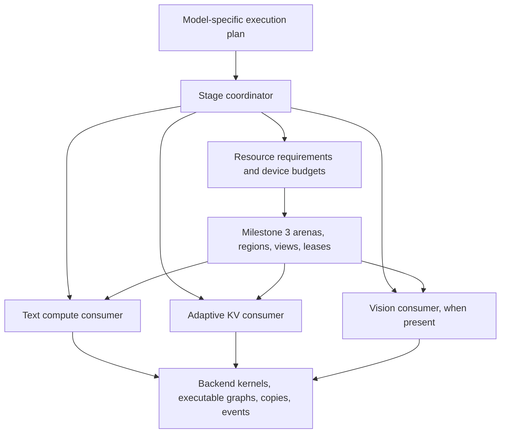

- Keep device allocation classes explicit. Model weights may use UVM while the shared compute/KV arena remains device-local.
- Keep the parent allocation stable across stage transitions where possible.
- Keep adaptive resident/ring repartition inside one leased KV region. No common-arena transaction, lease lookup, or mutex per page/token.
- Preserve the optimized transfer pipeline, quantized attention, scratch sizing, and asynchronous slot reuse.
- A lease protects ownership but does not automatically track in-flight work or captured device pointers.
- Drain affected work and invalidate stale executable graphs before reusing storage.
- Distinguish graph descriptions, captured executable graphs, tensor workspace, and backend scratch. Releasing one does not imply releasing the others.
- Preserve all live conversation state, including recurrent state outside the streamed KV implementation.
- Keep image embeddings alive until their final consumer finishes. The current host embedding handoff is a useful initial boundary.
- Use explicit stage signals. A one-token prompt is not necessarily generation.
- The coordinator controls stage transitions and total grants; consumers retain specialized internal allocation and execution policies.
- Layout rollback is not inference-state rollback. Device failures after mutable state changes can require session invalidation.

## Source review findings and integration requirements

This review read core implementations and relevant tests at the milestone 3, adaptive KV, and phase-arena checkpoints. It did not run new tests or establish an exhaustive correctness proof. These requirements refine existing stages without renumbering them or marking implementation complete.

### Milestone 3 contracts

- Layout commits update region metadata; they do not move bytes. Consumers must explicitly preserve or reconstruct data when addresses change.
- `ggml_backend_memory_arena_quiesce()` closes admission but does not wait for GPU work. Drain affected compute and copy execution before releasing leases.
- Active leases can survive a commit only for persistent regions unchanged in ID, offset, size, alignment, and flags. Do not require all persistent leases to disappear or the whole arena to become QUIESCENT on every transition.
- A surviving persistent lease retains its acquisition generation after the arena generation increases. A generation mismatch alone does not invalidate that lease.
- Scheduler slots with the same buffer type share allocator storage and lease references. Preserve this aliasing through attachment and detachment.
- The current text consumer reserves maximum workspace across measured phases. It does not reclaim prefill capacity during generation.
- Backend views preserve ownership and native buffer conventions, but do not automatically invalidate captured graphs that refer to reassigned storage.

Sources at `79e25c139`: `ggml/src/ggml-backend-memory.cpp`, `ggml/src/ggml-alloc.c`, `ggml/src/ggml-backend.cpp`, and `src/llama-context-workspace.cpp`. Relevant cases in `tests/test-backend-memory.cpp` cover persistent lease transitions, failed commits, concurrent admission, scheduler detachment, and shared slots.

### Adaptive KV production behavior to preserve

- Prefill uses uniform residency. Decode can concentrate the streamed deficit into selected layers, leaving other layers fully resident to provide prefetch windows. Concentration is bounded by ring size and each layer's active capacity; small rings support multiple waves.
- Resident K and V occupy separate contiguous token-major planes. Ring transfers also use separate K/V planes. A slot is not necessarily a self-contained interleaved K/V byte block.
- Boundary changes can move layer bases and V-plane offsets. The reference invalidates resident metadata and reloads from host when necessary; it does not guarantee non-disruptive device-page migration.
- Preserve batched uploads, resident spans, cross-layer scheduling, producer-ready/consumed event ordering, and slot reuse after the final consuming query tile. Wide micro-batches must not multiply H2D uploads for the same span.
- The real cross-layer queue lives in CUDA's `fattn.cu`. Early helpers `llama_kv_stream_plan_make`, `llama_kv_stream_regions_make`, `llama_kv_stream_extent_make`, and `llama_kv_stream_prefetch_dispatch` have test callers but no production callers in the reviewed adaptive branch. Port from actual execution paths; retain reference helpers only where useful.
- Eligible all-resident decode graphs support CUDA capture. Graphs requiring streamed KV disable capture in the reference. Preserve both paths and their eligibility checks.
- KV-runtime generation covers internal layout changes and authoritative cache replacement. Keep it distinct from arena-layout generation; either can invalidate cached execution assumptions independently.
- Copy-busy feedback extrapolates sampled CUDA copy timing over an evaluation. It is not measured PCIe throughput divided by theoretical bandwidth. Preserve its meaning in policy and diagnostics.

Sources at `d873e5db9`: `src/llama-kv-cache.cpp`, `src/llama-kv-stream-plan.cpp`, `ggml/src/ggml-cuda/fattn.cu`, `ggml/src/ggml-cuda/ggml-cuda.cu`, `ggml/src/ggml-cuda/set-rows.cu`, and `ggml/src/ggml-cuda/kv-stream-span-tuner.h`. Inspect reference branches with `git show <commit>:<path>` without switching the working branch.

### Gaps the new consumers must address

- Host KV buffers retain a runtime that also owns device resources. Current construction requires nonzero staging/resident capacity and offers no complete device-suspension lifecycle. Separate host-cache ownership from device-region binding so host KV can survive without an active device lease.
- Attention partials/accumulators and staged SET_ROWS scratch use CUDA's `ctx.pool()` outside the shared arena. GGML workspace measurements alone do not describe peak memory. Account for overlapping lifetimes and retained backing capacity; explicitly identify what is reclaimed and what remains outside the grant.
- The old phase arena synchronizes, resets CUDA executable state, recreates the scheduler, and substitutes a custom compute buffer type. Replace bespoke ownership with generic leases while preserving required ordering. Partial failure recovery in the old switch is not a complete transactional inference-state guarantee.
- The reviewed integration is restricted to `LLM_ARCH_QWEN35`, the target context, one sequence, and one CUDA device. Attention also checks 256-wide Q/V heads, token-major strides, mask format, and no attention sinks. Runtime pages are 256 tokens, and the phase-arena constructor checks uniform layer page geometry. Broader quantization support does not imply arbitrary model support.
- Storage, online KV writes, direct attention, and conversion fallback are separate capabilities. Validate the entire requested type/shape path before enabling streaming.

Sources for phase transitions at `ae09597ff`: `src/llama-context.cpp`, `src/llama-kv-stream-config.cpp`, and `ggml/src/ggml-cuda/ggml-cuda.cu`.

Existing tests cover all-resident attention, authoritative cache replacement, dirty-row mirroring, batched uploads, cross-layer prefetch, concentrated/multi-wave layouts, wide micro-batches, and phase-arena overlap/lifetime rules. Extend these with delayed execution, complete suspension, and coordinated failure recovery; historical tests do not validate these new lifecycles.

## Development and validation rules

- Write a failing behavioral test before implementation.
- Cover successful operation, invalid input, and meaningful failure/recovery paths.
- Keep each commit buildable and runnable.
- Run focused tests per stage and broader regression checks at milestone boundaries.
- Preserve existing behavior when new functionality is disabled.
- Reuse existing algorithms and tests where suitable; adapt ownership instead of gratuitously rewriting kernels.
- Treat commit-sized stages as reviewable dependent changes, not necessarily independent PRs.
- Keep performance claims proportional to evidence. Existing A/B results are encouraging but include reduced samples, incomplete cells, and a SYCL VMM-fix confounder.
- Use targeted performance checks before broad sweeps: all-resident, streaming onset, moderate streaming, and bandwidth-limited operation.

## Commit sizing and dependency rules

The split below preserves milestones 4-8 and all existing parent stage scopes. It separates independently testable contracts, device execution, integration, failure recovery, and performance changes. It does not add another milestone or mark existing plans as completed.

| Milestone | Commit units | Main reason for subdivision |
| --- | --- | --- |
| 4 | 11 | Separate planning, asynchronous lifetimes, recovery, and the first real consumer. |
| 5 | 22 | Establish exact bounded streaming before adding asynchronous copy, prefetch, tuning, and server/cache integration. |
| 6 | 12 | Separate accounting, growth/shrink, failure handling, phase activation, and budget probing. |
| 7 | 11 | Separate embedding lifetime, KV suspension, projector ownership/reload, and server wiring. |
| 8 | 9, including conditional 8.2b | Separate real model adapters, capability coverage, and sustained lifecycle validation. |

These are planned review units, not a guarantee of final diff size or 65 mandatory code commits. The real cross-attention adapter in 8.2b is conditional; a documented deferral is not an implemented adapter. Do not create empty commits just to satisfy a count. If a substage still contains two independently risky changes, name an additional subdivision before implementing it and preserve completed identifiers.

- The dependency column lists immediate prerequisites. `M3` is the existing checkpoint; `M4` through `M7` mean the preceding milestone has passed its full acceptance gate.
- Tables group work by parent scope, not strict execution order. In milestone 4, implement 4.4a before 4.3b. In milestone 5, implement 5.4a before 5.3c; the host-write baseline does not depend on batched write optimization.
- Define capability rejection at the first affected consumer. Stage 8.3 consolidates and validates those contracts; it is not the first safety gate.
- For code substages, record a failing behavioral test, implement, rerun focused tests, and check existing paths. Documentation/qualification commits instead reproduce their commands and record evidence; do not manufacture a failing test for prose.
- Keep unfinished consumers opt-in or test-only until their integration stage passes. Preserve a runnable baseline at each commit; do not leave production dispatch calling half-ported kernels.
- Use one generic geometry/quant contract from 5.1a onward. Early execution tests can cover a subset while bringing up the pipeline, but must not establish a permanent Q8/Q4 special allocation path.
- Before optimization substages 5.3c and 5.4f-5.4k, retain a targeted result from the preceding working revision. Check numerical correctness, transfer bytes/submissions, and representative latency after each change. Isolate and explain regressions before proceeding.
- Freeze model, quantization, context, b/ub, UVM mode, and pool size for kernel A/B checks. Use separately labeled maximum-allocatable-pool comparisons for phase-sharing gains.
- Save test commands, outcomes, hardware/tool availability, and remaining limitations with each ledger entry. A skipped backend is not a pass; passing tests provide evidence, not a proof that no bug exists.

### Implementation checkpoints within milestone 5

1. Through 5.4a: authoritative host state, leased resident mirrors, and correct all-resident execution.
2. Through 5.4e: correct bounded block streaming and supported quant dispatch, without relying on asynchronous overlap.
3. Through 5.4k: optimized copy/prefetch pipeline, wide micro-batches, feedback, and resident capture.
4. Through 5.5d: real serial server/cache integration and reference-performance qualification.

Do not enable phase-dependent grants before the fixed-pool gate passes. Do not attempt full vision eviction until text phase transitions and host/device KV separation are validated.

## Milestone 4: execution stages and resource coordination

Outcome: multiple consumers can safely share an arena through explicit dependencies. Text behavior remains equivalent to milestone 3.

| Commit unit | Prerequisites | Implementation boundary | Required tests / evidence |
| --- | --- | --- | --- |
| 4.1a | M3 | Resource contracts: IDs, memory domain/allocation class, minimum/preferred bytes, access, preservation, and reconstruction; define explicit unsupported-capability results. | Missing/duplicate IDs, invalid sizes/domains, and a resource surviving an inactive stage. |
| 4.1b | 4.1a | Execution-plan validation: dependencies, last use, and conflicting access; keep model semantics above GGML. | Cycles, missing producers, empty plans, read/write conflicts, and preserved but unread resources. |
| 4.2a | 4.1b | Pure minimum-layout planning with fixed persistent extents and checked alignment/accounting. | Exact fit, overflow, insufficient capacity, persistent overlap, and unchanged persistent region identity. |
| 4.2b | 4.2a | Deterministic elastic grants after minimum requirements; report unused capacity without allocating storage. | Competing preferred sizes, alignment gaps, deterministic ties, and total grants within budget. |
| 4.3a | 4.2b | Transition preparation and admission state machine using fake consumers; no device rebinding yet. | Preparation failure leaves active state usable; cancellation, reentrancy rejection, and no-op transitions. |
| 4.3b | 4.3a, 4.4a | Drain affected execution, invalidate affected executables, release changed leases, commit layout, bind, then activate; preserve unchanged persistent leases. | Delayed compute/copies, admission closure, no reuse before completion, persistent leases surviving a commit, and bind ordering. |
| 4.3c | 4.3b | Failure recovery for transition boundaries; distinguish restorable metadata/bindings from a poisoned inference session. | Injected release/commit/view/bind failures, cancellation after drain, failed recovery, and safe destruction; never claim mutable-state rollback. |
| 4.4a | 4.1a | Executor lifetime contract plus fake executor: affected resources, explicit drain/invalidation, and separate arena/content/executable validity. | Captured stale addresses rejected, unchanged persistent lease remains valid across arena generations, and no-op executable preservation. |
| 4.4b | 4.3c, 4.4a | CUDA adapter for the executor contract using existing capture lifecycle mechanisms. | Real captured replay before/after rebinding, invalidation before storage reuse, no-op capture reuse, and backend-disabled builds. |
| 4.5a | 4.3c | Text workspace consumer: register maximum workspace and attach coordinated leases without phase reclamation. | Create/reserve/detach/destroy, same-buffer-type aliased scheduler slots, failed attachment, and existing backend fallback. |
| 4.5b | 4.5a, 4.4b | Text execution integration and milestone qualification; retain milestone 3 allocation behavior. | Numerical and lifecycle checks on available CPU/CUDA/OpenCL/SYCL/Vulkan/Meta paths; targeted no-op/steady-state overhead comparison. |

Acceptance:

- Fake consumers demonstrate safe sharing and failure recovery.
- Existing text inference passes across available backends.
- No phase-dependent reclamation is enabled yet.
- Coordinator placement remains reusable by text and vision without making GGML image- or server-aware.

## Milestone 5: adaptive KV streaming using leased memory

Outcome: fixed-budget adaptive streaming runs on milestone 3, independently of phase-switching complexity.

| Commit unit | Prerequisites | Implementation boundary | Required tests / evidence |
| --- | --- | --- | --- |
| 5.1a | M4 | Production KV geometry and capability checks with checked quant-aware sizes; audit which reference helpers have real callers. | Independent K/V storage/write/attention/conversion support, unequal row sizes, page tails, overflow, unsupported heads/strides/masks/sinks, and model/sequence limits. |
| 5.1b | 5.1a | Pure resident/ring layout and adaptation policy from production: uniform prefill, concentrated decode, multi-wave capacity, feedback, and hysteresis. | Exact boundaries, short contexts, concentrated deficit, tiny feasible rings, feedback resets, and bounded grants. |
| 5.2a | 5.1a | Device-local CUDA allocation adapter for KV arena storage regardless of weight-UVM setting. | Actual allocation class with UVM on/off, allocation failure, device identity, and teardown. |
| 5.2b | 5.2a, 5.1b | KV runtime borrows one coarse region lease; separate host-cache identity from device binding and cache base/capacity outside token loops. | Undersized/misaligned/wrong-device leases, shared ownership, detach ordering, and no per-page arena transactions. |
| 5.3a | 5.1a | Authoritative host KV storage and pinned-memory lifetime, preserving reference Windows behavior. | Allocation failure, pin/register/unregister ownership, supported quant layouts, and host lifetime independent of device binding; record unavailable OS coverage. |
| 5.3b | 5.3a, 5.2b | Cache writes, dirty rows, mutable tails, and content generation; use a correctness-first synchronized mirror update where needed. | Partial rows/pages, overwrites, cache replacement with unchanged arena generation, pending-write cancellation, and host/device agreement. |
| 5.3c | 5.3b, 5.4a | Batched prefill SET_ROWS/write staging and bounded scratch, replacing the baseline write submission policy. | Quantized batched writes, partial batches, staging reuse after completion, scratch peak, and fewer submissions without changed bytes. |
| 5.4a | 5.3b | Resident K/V planes and ordinary all-resident attention using the leased mirror; no asynchronous streamed execution yet. | Plane offsets, dirty-tail mirror, all-resident numerical equivalence, and existing ordinary attention dispatch. |
| 5.4b | 5.1a | Partial-attention result and stable merge contract; establish reference tests before device integration. | Unequal blocks, masked/empty blocks, causal tails, extreme logits, and tolerance-based comparison with unsplit attention. |
| 5.4c | 5.4a, 5.4b | One explicitly staged KV block and streamed partial-attention integration; start with ordered copy/compute. | Resident plus streamed merge, K/V plane bounds, mutable last block, minimum scratch, and out-of-bounds guards. |
| 5.4d | 5.4c, 5.1b | Multiple streamed blocks with bounded ring-slot reuse and correct concentrated/multi-wave traversal. | Ring wraparound, more blocks than slots, partially filled final block, per-layer bounds, and no premature slot overwrite. |
| 5.4e | 5.4d | Complete supported quant dispatch and bounded F16 conversion fallback through one generic layout contract. | Supported K/V pairs, unequal bytes, direct/fallback agreement, unsupported combinations rejected before allocation, and conversion scratch bounds. |
| 5.4f | 5.4e | Dedicated copy stream and producer-ready/final-consumer events; overlap copies without changing attention semantics. | Artificially delayed producer/consumer, slot reuse hazards, pending-copy teardown, cancellation, and sanitizer-capable host bookkeeping. |
| 5.4g | 5.4f, 5.3c | Contiguous attention spans and batched K/V uploads preserving separate planes. | Partial spans, wraparound, exact transfer bytes, fewer H2D calls, and targeted comparison with the prior commit. |
| 5.4h | 5.4g | Actual cross-layer prefetch queue, bounded lookahead, and immediate safe slot reuse; no fixed three-layer assumption. | Delayed and out-of-order readiness, concentrated/multi-wave schedules, no deadlock, and lookahead constrained by free slots. |
| 5.4i | 5.4h | Wide micro-batch query tiling with slot lifetime extending to the final consuming tile. | b/ub combinations, causal masks, partial query tiles, and no duplicate H2D upload per query tile; preserve 256/256 performance. |
| 5.4j | 5.4i | Runtime miss/copy timing feedback and span tuning connected to the pure policy. | Every consumed span can detect readiness misses, feedback reset, hysteresis, bounded repartitions, and copy-busy units distinct from PCIe utilization. |
| 5.4j.1 | 5.4j | Bound copy timing to one sample per execution, independently of deadline probes. | Exact sampled versus total bytes, empty/reset/reuse/tail cases, two timing events independent of ring/context size, and isolated latency comparison. |
| 5.4j.2 | 5.4j.1 | Deferred completed-feedback collection without a measurement-only wait or mandatory immediate counter readback. | Pending/ready/reused snapshots, cancellation and teardown, no stale epochs, bounded retained storage, and latency comparison. Preserve existing correctness fences. |
| 5.4j.3 | 5.4j.2 | Restore decode-phase and producer-constrained-tail filtering for repartition feedback. | TG1 versus prefill, immutable history versus demand-produced tails, mixed spans, and no false demotion from missing eligible feedback. |
| 5.4j.4 | 5.4j.3 | Qualify batch-level deadline/publication optimization while retaining ticket-based reuse safety. | Every eligible upload batch covered, fallback/subspan reuse, delayed publication and consumption, unchanged outputs, and isolated overhead comparison. Do not change the broader attention synchronization contract here. |
| 5.4k | 5.4j.4 | Capture eligibility and invalidation for the completed KV runtime: enable eligible resident replay and gate streamed capture. | Resident replay, resident-to-streamed-to-resident transitions, content/layout generation changes, and no stale captured pointers. |
| 5.5a | 5.4k | Opt-in text-context integration, serial execution gating, and hybrid recurrent-state preservation. | Real-model prefill/decode, context limits, unsupported model/device/sequence rejection, and feature-disabled equivalence. |
| 5.5b | 5.5a | Serial request/reset/cancellation and prompt-cache save/restore integration. | Different content/lengths, reused prefixes, cache replacement, abort followed by another request, and recurrent state equivalence. |
| 5.5c | 5.5b | Qualify fixed-pool performance and add only diagnostics needed to explain differences. | All-resident, streaming onset, moderate streaming, and bandwidth-limited comparisons against the fixed-pool reference; transfer volume and sufficient decode length. |
| 5.5d | 5.5c | Document supported configurations, fixed-budget semantics, limitations, and reproducible focused tests. | Verify documented invocations and capability matrix; no broad model/backend claim from quant-only coverage. |

Acceptance:

- Fixed-pool streaming is correct.
- Targeted comparisons with `feature/adaptive-kv-stream` show comparable performance and transfer volume.
- The KV runtime owns resident/ring subdivision within a coarse lease.
- Concentrated decode layouts and all-resident capture have execution coverage, not just standalone policy tests.
- No broad sweep is required unless representative points reveal an unexplained difference.

## Milestone 6: prefill/decode memory sharing

Outcome: compute and KV share one budget; decode receives space reclaimed from larger prefill workspace.

| Commit unit | Prerequisites | Implementation boundary | Required tests / evidence |
| --- | --- | --- | --- |
| 6.1a | M5 | Separate prefill/decode workspace requirements for actual b/ub, output selection, and attention settings. | Partial batches, TG1, multiple context lengths, output configurations, and budget fitting only one phase. |
| 6.1b | 6.1a | Inventory/account for backend scratch, retained ctx.pool() backing, captures, and transition peaks; define what is inside the shared grant. | Direct/conversion partials, accumulator/write scratch, overlapping lifetimes, and measured peaks versus declared accounting. |
| 6.2a | 6.1b | KV growth/rebind using authoritative host data; rebuild K/V planes and recompute resident/ring split instead of only growing the ring. | Changed layer/V-plane bases, increased residency, lazy reload correctness, and separate arena/KV validity generations. |
| 6.2b | 6.2a | KV shrink/rebind and pending-copy drain; invalidate moved mirrors and bounded scratch safely. | Minimum feasible capacity, concentrated layouts, ring remap, dirty tails, delayed work, and logical cache preservation. |
| 6.2c | 6.2b | Rebind failure handling without relying on simultaneous old/new full-budget allocation. | Rejected resize, failed view/binding creation, recoverable reactivation, poisoned-session rejection, and host KV retained. |
| 6.3a | 6.1a | Explicit text prefill/generation stage signals, with no reclamation enabled yet. | Single-token prompt versus generation, final short prompt batch, TG1, repeated notifications, and speculative execution rejection. |
| 6.3b | 6.3a, 6.2c | Activate phase sharing: drain/invalidate, release workspace, repartition grants, bind, and rebuild only affected execution. | Real prefill-to-decode reclaim, captured-pointer safety, no-op transition, no per-token coordinator work, and measured decode pool increase. |
| 6.4a | 6.3b | Return from expanded decode KV to prefill for serial requests and changed requirements. | Long decode then short/long prompts, repeated alternation, shrink/reload correctness, and numerical equivalence. |
| 6.4b | 6.4a | Prompt reuse, cache restoration, and interrupted phase transitions. | Cached prefixes, restored host KV/recurrent state, cancellation at each boundary, and subsequent request or explicit invalid-session outcome. |
| 6.5a | 6.4b | Generalized shared-budget CLI/API option and deliberate compatibility with existing fixed-pool options. | Parsing, mutually exclusive/conflicting options, old-option behavior, and clear included/excluded allocations. |
| 6.5b | 6.5a | Adapt maximum-pool benchmark probing to both phases and transition peaks, using existing sweep harness. | Startup-only false fits rejected, next-granule OOM boundary, successful decode/return-to-prefill, and no arbitrary new safety reserve. |
| 6.5c | 6.5b | Transition/accounting diagnostics and qualification against the phase-arena reference. | Effective decode KV bytes, streaming onset, reclaimed workspace versus capture storage, resident reload latency separated from steady-state speed. |

Acceptance:

- Reclaimed prefill workspace measurably increases decode KV capacity.
- Streaming begins later when additional capacity permits.
- No common-arena transactions or new device-wide synchronization occur on ordinary steady-state tokens.
- Transition cost and throughput are comparable to `feature/kv-stream-phase-arena`.
- The budget clearly states whether compute, KV, scratch, weights, and driver allocations are included.
- Executable-graph destruction and tensor-workspace reclamation are validated separately.
- Report resident reload cost separately from steady-state throughput; do not assume repartition preserves device pages.

## Milestone 7: separate vision encoder integration

Outcome: a Qwen-style vision encoder and language model safely share phase-specific memory.

| Commit unit | Prerequisites | Implementation boundary | Required tests / evidence |
| --- | --- | --- | --- |
| 7.1a | M6 | Borrowed mtmd compute workspace consumer with explicit requirements and executable lifetime. | Variable image sizes/batches, workspace sizing, attachment failure, and drain before release. |
| 7.1b | 7.1a | Handoff embedding ownership independent of reusable vision workspace; preserve the existing host boundary initially. | Multiple images, partial/chunked consumption, embedding lifetime after workspace release, and cancellation cleanup. |
| 7.2a | 7.1b | Session execution plan for vision encoding followed by embedding prefill; initially retain existing allocations. | Text/image/text ordering, follow-up images with existing state, multiple images, and encoding failure without unsafe text execution. |
| 7.3a | 7.2a | Full KV device suspension: drain authoritative writes/copies, release device binding, and preserve host/runtime identity; explicitly account for recurrent state. | Zero retained KV device lease/pool, dirty tails saved, unchanged host cache, suspended execution rejected, and state outside KV protected. |
| 7.3b | 7.3a | Resume suspended KV into a fresh grant and rebuild affected mirrors/executables. | Different grants/addresses, host content restored, stale capture rejection, and attention/recurrent-state equivalence. |
| 7.3c | 7.3b | Interrupted suspension/restoration and integration with vision-stage borrowing. | Allocation/rebind failure, cancellation before/after eviction, retry versus invalid-session rules, and repeated vision/text transitions. |
| 7.4a | 7.2a | Separate projector device-weight ownership from model metadata and host/reload source while keeping current eager residency. | Shared owners, tensor metadata lifetime, loading equivalence, and destruction without double release. |
| 7.4b | 7.4a | Explicit projector-weight unload/reload with executable invalidation and tensor rebinding. | Repeated new-address reload, stale tensor/capture rejection, drain before unload, and numerical equivalence. |
| 7.4c | 7.4b, 7.3c | Coordinate reloadable projector storage with phase grants and failure recovery; account for weights that stay outside the arena. | Budgets unable to hold both phase allocations, reload failure, no double-allocation assumption, and persistent conversation state. |
| 7.5a | 7.4c | Complete multimodal server flow, image-related cache reuse, and serial session cleanup. | Real image/text requests, follow-up images, reused media prefixes, aborted requests, and handoff final-use ordering. |
| 7.5b | 7.5a | Qualify memory savings, transition latency, and documented supported vision configuration. | Peak below simultaneous phase sum, expected post-request baseline, repeatable outputs, and separate projector reload versus KV reload costs. |

Acceptance:

- A supported request fits a budget that cannot hold all phase-specific allocations at once.
- Subsequent generation remains correct.
- Projector weights are unloaded only through an explicit storage lifecycle.
- Existing KV and hybrid recurrent state survive vision execution.
- Host KV ownership does not force retention of the device pool during vision execution.
- Handoff embeddings remain available for all consumers, including later chunks from a media batch.

## Milestone 8: encoder-free plans and integration hardening

Outcome: one coordinator supports separate encoders and shared multimodal transformers with explicit capability boundaries.

| Commit unit | Prerequisites | Implementation boundary | Required tests / evidence |
| --- | --- | --- | --- |
| 8.1a | M7 | Encoder-free execution-plan adapter for a supported model: lightweight preparation then shared multimodal prefill. | Model-derived dependencies, shared transformer weights never reclaimed as a separate projector, and absent encoder handled explicitly. |
| 8.1b | 8.1a | Real encoder-free inference integration and phase sharing; choose a model verified in the checkout and report streaming support separately. | Image/text output equivalence, prefill-to-decode reclamation, shared-weight lifetime, and safe fixed-layout/rejection when streaming geometry is unsupported. |
| 8.2a | 8.1b | Cross-attention-style persistent visual-resource contract using fake consumers. | Encoder workspace reclaim without dropping features/visual KV, repeated generation consumers, and last-use release. |
| 8.2b | 8.2a | Integrate a real cross-attention adapter only if a suitable supported model/backend is available; otherwise record a named deferred adapter and evidence of the limitation. | Actual model equivalence and lifetimes when implemented; fake tests are explicitly not production support. |
| 8.3a | 8.1b, 8.2a | Consolidate capability/fallback policy already introduced in milestones 4-7; do not defer safety checks until this stage. | Allocation, borrowing, executable invalidation, storage/write/attention streaming capability combinations, and no silent budget violation. |
| 8.3b | 8.3a | Validate existing CPU/CUDA/OpenCL/SYCL/Vulkan/Meta combinations and unsupported-path diagnostics. | Real available-device smoke/numerical tests, aliased Meta ownership, valid fixed-layout fallback, and explicit rejection where no budget-safe path exists. |
| 8.4a | 8.3b | Integrated session fault/lifetime matrix across transitions, caches, suspension, reload, and destruction. | Delayed compute/copy execution, injected failures at boundaries, repeated recovery/invalid-session outcomes, and no use after release. |
| 8.4b | 8.4a | Sustained reuse/leak and applicable sanitizer qualification, keeping host and device coverage distinct. | Repeated multimodal sessions, memory return to expected retained baseline, ASan/UBSan/TSan where supported, and recorded hardware/tool gaps. |
| 8.5 | 8.4b, 8.2b | Finalize architecture/support documentation, examples, and compact performance/memory comparisons using existing harnesses. | Reproducible text-only, separate-encoder, and encoder-free examples; deferred cross-attention support labeled; disabled-feature baseline preserved. |

Acceptance:

- Both real architecture families use the same coordinator.
- Existing backend paths retain their behavior.
- Unsupported streaming paths are explicitly identified.
- If no appropriate cross-attention model is supported locally, its real adapter is a named follow-up; contract tests do not count as production model support.

## Subsequent work, outside milestones 4-8

- Concurrent request execution and overlapping stages.
- Multi-GPU streaming and per-device capacity coordination.
- MTP/speculative execution layouts.
- General model-weight or MoE-expert eviction policies.
- Optimized streaming engines for ROCm, SYCL, Vulkan, OpenCL, and other accelerators.

The contracts should permit these additions without claiming they are implemented.

## Checkpoint meaning

| Milestone | Completed capability |
| --- | --- |
| 3 | Allocation and lifetime infrastructure |
| 4 | Safe execution-stage coordination |
| 5 | Fixed-budget adaptive KV streaming |
| 6 | Text prefill/decode reclamation |
| 7 | Separate vision/text sharing and reloadable projector storage |
| 8 | Encoder-free integration and consolidated validation |

## Progress ledger

Record substage completion here only after the required validation succeeds. Expand the grouped planned rows as work proceeds; keep each completed substage's actual commit and evidence. Milestone 4 is checkpointed. Substages 5.1a and 5.1b are committed; 5.2a is committed at `4717474c3`. Stage 5.2b is committed at `0e3d5a0c0`. Stage 5.3a is committed at `7bfc17ac3`. Stage 5.3b is committed at `15d47eb72`. Stage 5.4a is committed at `ff4d3bdef`. Stage 5.3c is committed at `6c724dee1`, with its baseline/comparison recorded below. Stage 5.4b is committed at `6db00070d`. Stage 5.4c is committed at `28e7999a0`. Stage 5.4d is committed at `59591b6da`. Stage 5.4e is committed at `a92107200`. Stage 5.4f is committed at `d48a1faa8`. Stage 5.4g is committed at `f069590ef`. Stage 5.4h is committed at `5887c18a0`. Stage 5.4i is committed at `6f98b1276`. Stage 5.4j is committed at `17b92d321`. Follow-ups 5.4j.1-5.4j.4 are ready for review as one combined user commit.

| Stage | Status | Commit | Validation / limitations |
| --- | --- | --- | --- |
| Milestone 3 | Complete | 78e002404 | Original A/B evidence at 79e25c139 under benchmarks/server-ab/results/; prerequisite Meta ownership and view-factory exception fixes tested separately. |
| 4.1a | Complete | f78fba604 | 16 cases / 231 assertions; all five selected suites pass in debug, ASan/leak-checking, and UBSan after integration onto 9c6d4b06f. |
| 4.1b | Complete | 8a31bd381 | 16 cases / 259 assertions; all six selected memory suites pass in debug, ASan/leak-checking, and UBSan. |
| 4.2a | Complete | 0ed96420c | 18 cases / 276 assertions; all seven selected memory suites pass in debug, ASan/leak-checking, and UBSan. |
| 4.2b | Complete | 0949a7605 | Layout suite: 32 cases / 2,170 assertions, including 144 small configurations; all seven selected suites pass in debug, ASan/leak-checking, and UBSan. |
| 4.3a | Complete | 14ec534b6 | 19 cases / 809 assertions; all eight focused memory suites pass in debug, ASan/leak-checking, and UBSan. |
| 4.3b | Complete | 9a7fe0a69 | 16 cases / 232 assertions using real CPU arenas and fake execution; all ten selected suites pass in debug, ASan/leak-checking, and UBSan. |
| 4.3c | Complete | 722371ce9 | 18 cases / 514 assertions with real CPU arenas and fake execution; all eleven focused suites pass in debug, ASan/leak-checking, and UBSan. Recovery needs explicit consumer support; otherwise the session remains invalid and closed. |
| 4.4a | Complete | ac1436010 | 16 cases / 176 assertions using real CPU leases and fake execution; all nine selected suites pass in debug, ASan/leak-checking, and UBSan. |
| 4.4b | Complete | 079417191 | Native CUDA: 10 cases / 226 assertions, capture enabled and disabled; Compute Sanitizer: zero errors/leaks. Twelve focused suites pass in debug CPU/CUDA and CPU ASan/UBSan. Experimental GGML_CUDA_GRAPH_OPT=1 is explicitly rejected. |
| 4.5a | Complete | 6a2917143 | Workspace consumer: 16 cases / 390 assertions using real CPU schedulers and arena leases; all thirteen focused suites pass in debug, ASan/leak-checking, and UBSan. No production wiring or phase reclamation yet. |
| 4.5b | Complete | 2b3b27bc8 | Serial CPU/single-CUDA contexts use coordinated ownership; other configurations retain legacy arenas. Four CPU owner cases / 352 assertions, five CUDA cases / 376 assertions; fourteen focused suites pass in debug and CPU ASan/UBSan. Numerical/lifecycle compatibility passes on available CPU/CUDA/OpenCL/SYCL/Vulkan/Meta paths; HTTP CPU/CUDA smoke and paired dispatch-overhead checks pass. |
| Milestone 4 | Complete within declared scope | 2b3b27bc8 | Checkpoint branch created after the user committed 4.5b. |
| 5.1a | Complete | `fe2189418` | 18 cases / 1,205 assertions; 15 focused suites and existing CPU model regressions pass in debug, ASan/leak-checking, and UBSan. Reference production call paths audited; no streaming runtime is enabled. |
| 5.1b | Complete | `74b400abb` | 20 policy cases / 139,866 assertions; 16 focused suites and existing CPU model regressions pass in debug, ASan/leak-checking, and UBSan. Pure production-derived layout/adaptation policy; no streaming runtime enabled. |
| 5.2a | Complete | `4717474c3` | 10 CUDA cases / 1,055 assertions per UVM mode; actual device pointer attributes and zero memcheck errors/leaks. 18 CUDA-build and 16 CPU debug/ASan/UBSan suites pass; virtual-device identity and native capture checks pass. Opt-in factory only. |
| 5.2b | Complete | `0e3d5a0c0` | 15 CPU cases / 3,097 assertions; 16 real-CUDA cases / 3,108 assertions per UVM mode; virtual-device rejection passes. 17 focused suites pass in CPU/CUDA Debug and CPU ASan/UBSan; CUDA memcheck reports zero errors/leaks. Binding adapter only. |
| 5.3a | Complete | `7bfc17ac3` | 8 CPU owner cases / 386 assertions; 9 real-CUDA owner cases / 394 assertions; 5 CUDA pinning cases / 44 assertions. 18 CPU Debug/ASan/UBSan and 22 CUDA-build suites pass; memcheck has zero errors/leaks. Native Windows behavior preserved but not hardware-qualified. |
| 5.3b | Complete | `15d47eb72` | 14 CPU cases / 150,480 assertions; 15 real-CUDA cases / 150,503 assertions. 19 focused suites pass in CPU/CUDA Debug and CPU ASan/UBSan; CUDA memcheck is clean with UVM off/on. Synchronized byte-coherence baseline only. |
| 5.3c | Complete | `6c724dee1` | 10 CPU cases / 607 assertions; 10 CUDA cases / 609 assertions. 21 focused suites pass in CPU/CUDA Debug and CPU ASan/UBSan; CUDA memcheck clean with UVM off/on. Frozen producer baseline and post-change timings recorded; no server integration. |
| 5.4a | Complete | `ff4d3bdef` | 12 CPU cases / 131 assertions; 13 CUDA cases / 245 assertions, including mixed K/V and 257-query prefill. 20 focused suites pass in CPU/CUDA Debug and CPU ASan/UBSan; CUDA memcheck clean with UVM off/on. Ordinary all-resident test adapter; production unchanged. |
| 5.4b | Complete | `6db00070d` | 13 cases / 48,614 assertions; 22 focused CPU/CUDA Debug and CPU ASan/UBSan suites pass. Ordinary GGML attention comparison, CUDA metadata ABI check, and existing GPU regressions pass. Common format/CPU reference only; no new partial GPU kernel. |
| 5.4c | Complete | `28e7999a0` | 8 real-CUDA cases / 126 assertions; ordered resident-plus-one-block export and GPU merge, exact leased scratch, masked/dirty tails, malformed-payload atomicity, and UVM-off/on memcheck. 23 focused CPU/CUDA Debug and CPU ASan/UBSan suites pass. |
| 5.4d | Complete | `59591b6da` | 14 real-CUDA cases / 542 assertions; multi-wave ring reuse, concentrated/zero-resident layouts, incremental GPU folding, and late-block failure recovery. 23 focused suites pass in CPU/CUDA Debug and CPU ASan/UBSan; UVM-off/on memcheck clean. Merge-only racecheck clean; inherited vector-kernel warnings recorded below. |
| 5.4e | Complete | `a92107200` | 81 writable K/V pairs via selected native/fallback paths, plus all 81 forced through bounded F16 fallback; 19 CUDA cases / 656,795 assertions. Exact conversion bounds/values, capability admission, and native/fallback comparisons. 23 focused suites pass in four configurations; GPU memcheck and reduced-build probes recorded below. |
| 5.4f | Complete | `d48a1faa8` | Opt-in within-layer copy overlap; 8 CUDA cases / 1,565 assertions, all 81 pairs bitwise match ordered execution. Producer/consumer gates, cancellation, retained backing and host replacement pass. 24 focused Debug/CUDA-build/ASan/UBSan suites and GPU memcheck pass; targeted host-state TSan passes, broader TSan caveat below. Synthetic latency comparison retained. |
| 5.4g | Complete | `f069590ef` | Contiguous native attention and two-copy K/V batches; 12 CUDA cases / 2,290 assertions. All 81 pairs, arbitrary span ceilings, wrap boundaries, batch-wide event fences and failure recovery pass. 24 focused suites and GPU memcheck pass; targeted host TSan passes. Native latency gains and fallback tradeoffs recorded below. |
| 5.4h | Committed | 5887c18a0 | Bounded cross-layer FIFO reservations and explicit tail publication; 11 CUDA cases / 2,395 assertions. All 81 pairs, more-than-three-layer lookahead, out-of-order readiness, concentrated placement and cancellation pass. 25 focused suites, UVM-off/on memcheck and targeted host TSan pass. Mixed latency results and producer-integration limits recorded below. |
| 5.4i | Committed | 6f98b1276 | Bounded query launches inside each K/V span; 20 CUDA block cases / 656,887 assertions and 15 CUDA copy cases / 2,826 assertions. 25 focused suites pass in CPU/CUDA Debug, ASan and UBSan; UVM-off/on memcheck and targeted host TSan pass. Single-launch baseline preserved within measurement noise; wider-launch overhead and limitations documented below. |
| 5.4j | Committed | 17b92d321 | Opt-in GPU deadline probes, bounded sampled copy timing, process-unique feedback epochs, read-only policy proposals, and measured span trials. CUDA copy 18 cases / 2,978 assertions; runtime prefetch 12 / 2,803. Four 25-suite host matrices, targeted TSan, UVM-off/on copy memcheck and runtime memcheck pass. Default latency within about 1%; instrumentation costs 6-9% in the synthetic check. |
| 5.4j.1 | Committed | 5ee09b7e1 | One first-upload timing sample and two additional timing events per execution; every deadline probe retained. CUDA copy 19 cases / 3,075 assertions, runtime prefetch 12 / 2,803, four 25-suite host matrices and GPU memory checks pass. Instrumented latency improved 2.3-4.1% in the first pass; repeat results and residual overhead are recorded below. |
| 5.4j.2 | Committed | 5ee09b7e1 | Two bounded deferred counter snapshots, run identity, nonblocking polling, and no measurement-only wait. User requested one combined commit for 5.4j.1-5.4j.4. |
| 5.4j.3 | Committed | 5ee09b7e1 | Explicit decode intent/query count and immutable-history eligibility; unknown phase, prefill, one-token prompts, and producer-constrained tails do not train prefetch feedback. |
| 5.4j.4 | Committed | 5ee09b7e1 | One marker/probe per eligible upload batch, with safe partial consumption and first-slot reuse. Full bundle: four 25-suite matrices, CUDA copy 23 / 3,211, runtime-prefetch 14 / 3,048, targeted TSan and CUDA memory checks pass. |
| 5.4k | Ready for review | - | KV-aware resident replay over the existing CUDA executor; retained native roots and leases, fixed metadata admission, streamed-epoch invalidation, and active-capture rejection. 13 CUDA cases / 166 assertions; four 26-suite matrices, graph-disabled checks, targeted host TSan and UVM-off/on CUDA memcheck pass. Scope and measured guard cost below. |
| 5.5a-5.5d | Planned | - | See substage dependencies and milestone acceptance gate. |
| 6.1a-6.5c | Planned | - | See substage dependencies and milestone acceptance gate. |
| 7.1a-7.5b | Planned | - | See substage dependencies and milestone acceptance gate. |
| 8.1a-8.5 | Planned | - | Real adapter 8.2b conditional; otherwise explicitly deferred. |

## Substage 4.1a implementation and validation

Implemented on 2026-09-10 in `src/llama-memory-requirements.h/.cpp`, with `tests/test-memory-requirements.cpp` registered through CMake.

- Internal declarations identify session-local placement domains and resources, exact allocation classes, content preservation/reconstruction policies, and per-stage capacities/access/capability requirements.
- The validator is read-only and makes no allocation or backend calls. It checks declaration structure before returning unsupported allocation/capability results, with the relevant domain/resource IDs.
- A resource can remain live with access NONE. These are declaration tests, not a claim that cross-stage byte preservation or GPU synchronization is implemented.
- Allocation classes are exact requirements, not preferences: managed storage does not satisfy a device-local request.
- Zero-byte declarations are allowed, but they do not create zero-byte arena regions. Planner capacity, stage dependencies, execution lifetimes, and actual hardware capabilities are outside 4.1a.
- Existing inference dispatch and allocation are unchanged. No production container or GPU configuration was changed.

TDD evidence: the new test compiled against a placeholder that returned success, then failed 91 assertions. After implementing validation, all 16 cases and 231 assertions passed.

| Configuration | Result |
| --- | --- |
| Existing debug CPU build | New contract test plus allocator, buffer, arena, and Meta tests: 5/5 pass. |
| ASan with leak detection | New contract test plus allocator, buffer, arena, and Meta tests: 5/5 pass on the fixed baseline. |
| UBSan with halt-on-error | New contract test plus allocator, buffer, arena, and Meta tests: 5/5 pass. |
| Strict compiler warnings | New validator passes `-Wall -Wextra -Werror -Wconversion -Wsign-conversion -pedantic`. |

Both sanitizer builds instrument the new llama source, not only GGML. TSan and hardware-specific backend tests were not run for this pure declaration/validation stage; no execution or synchronization implementation changed.

Reproduce the focused normal run from the repository root:

```sh
cmake -S . -B build-device-memory-infra
cmake --build build-device-memory-infra --target test-memory-requirements test-backend-memory test-backend-buffer test-backend-meta test-alloc -j 20
ctest --test-dir build-device-memory-infra -R '^test-(memory-requirements|backend-memory|backend-buffer|backend-meta|alloc)$' --output-on-failure
```

Sanitizer configurations used `-DLLAMA_SANITIZE_ADDRESS=ON` in `build-device-memory-infra-asan` and `-DLLAMA_SANITIZE_UNDEFINED=ON` in `build-device-memory-infra-ubsan`, with the same targets. Runs used `ASAN_OPTIONS=detect_leaks=1:halt_on_error=1` and `UBSAN_OPTIONS=halt_on_error=1:print_stacktrace=1`, respectively.

### Prerequisite Meta leak fix

Before the prerequisite fix, `test-backend-meta` reported 136 bytes in four leaked allocations originating from `ggml_backend_meta_device_get_buffer_type()` at `ggml/src/ggml-backend-meta.cpp:362` in `79e25c139`. The cached buffer-type contexts used raw ownership. The expanded cache regression reproduced 2,440 leaked bytes in 68 allocations.

The same leak was reproduced with the unchanged Meta test linked only to GGML; `readelf -d` confirms the reproducer does not load `libllama` or `libllama-common`, so it excludes the new contract code. The user committed the separate fix as `9c6d4b06f` on the infrastructure baseline before restoring 4.1a. Cached entries now own their contexts, with stable buffer-type addresses. No suppression was added; the standalone check below is expected to pass on the fixed baseline.

```sh
c++ -std=c++17 -g -fsanitize=address -fno-omit-frame-pointer -I ggml/include tests/test-backend-meta.cpp -L build-device-memory-infra-asan/bin -Wl,-rpath,"$PWD/build-device-memory-infra-asan/bin" -lggml -lggml-base -lggml-cpu -o build-device-memory-infra-asan/bin/test-backend-meta-ggml-only
ASAN_OPTIONS=detect_leaks=1:halt_on_error=1 build-device-memory-infra-asan/bin/test-backend-meta-ggml-only
```

## Substage 4.1b implementation and validation

Implemented in `src/llama-memory-plan.h/.cpp`, with `tests/test-memory-plan.cpp` registered through CMake. This stage reuses the 4.1a resource validator and adds no inference call site, allocator, backend call, or GPU work.

### Ordered serial plan contract

- The caller supplies stages in execution order. Dependencies must name earlier stages. This rules out self-dependencies and cycles without a recursive graph traversal or temporary graph allocation.
- An acyclic but incorrectly ordered list is also rejected; validation does not sort it. The serial order itself orders accesses between stages, even without explicit dependency edges.
- Stage IDs are labels, not positions. Every listed stage executes once; repeated decode or return-to-prefill uses another invocation, not a cycle inside one plan.
- Each stage declares at most one requirement per resource. Separate conflicting declarations are rejected by 4.1a; use READ_WRITE to express one stage consuming incoming contents and defining outgoing contents.
- Explicit inputs promise initialized contents at plan entry. READ and READ_WRITE need those inputs or a preceding writer. WRITE defines outgoing contents; NONE keeps a binding but cannot act as a producer. Internal scratch that is initialized by the stage declares WRITE.
- Explicit outputs extend content lifetime through the final stage, even if no stage reads them. A missing output producer is an error at the plan boundary.

### Preservation and limits

- Once initialized, preserved contents must have an explicit requirement in every stage through the last declared use/output, including a NONE requirement in an otherwise inactive stage.
- Preservation is conservative until the last declaration: a later overwrite does not implicitly waive the preservation policy. Reuse disposable scratch with a discardable resource instead.
- A missing binding discards discardable contents. A later read needs reinitialization; a later write can establish new contents.
- Reconstructible contents may cross a binding gap only after initialization. That property is a consumer promise of independent backing, not an implicit producer or an implemented reload operation.
- Validation is read-only and allocation-free. It checks resource-level declarations, not the initialization of individual byte ranges, correctness of reconstruction, device synchronization, available capacity, or actual execution.
- Single-stage structural errors and plan/lifetime errors are checked before returning an unsupported-capability result, so a malformed plan cannot silently select a fallback.
- Parallel execution, unordered DAG scheduling, conditional branches, and runtime transition recovery are not implemented in this substage.

### TDD evidence

The new test compiled against a success-only placeholder and failed 101 of 259 assertions across 16 cases. The implementation then passed all 259 assertions. Cases include empty plans, duplicate/missing IDs, dependencies and cycles, missing producers, preserved-but-unread contents, imported state, outputs and last use, discarded/reconstructible gaps, duplicate access declarations, and diagnostic precedence.

The six selected suites (`test-memory-plan`, `test-memory-requirements`, `test-alloc`, `test-backend-buffer`, `test-backend-memory`, and `test-backend-meta`) pass in the debug CPU, ASan with leak detection, and UBSan builds. Both sanitizer configurations instrument the new llama source. The new validator also passes `-Wall -Wextra -Werror -Wconversion -Wsign-conversion -pedantic`.

```sh
cmake -S . -B build-device-memory-infra
cmake --build build-device-memory-infra --target test-memory-plan test-memory-requirements test-alloc test-backend-buffer test-backend-memory test-backend-meta -j 20
ctest --test-dir build-device-memory-infra -R '^test-(memory-plan|memory-requirements|alloc|backend-buffer|backend-memory|backend-meta)$' --output-on-failure
```

For sanitizers, use the existing `build-device-memory-infra-asan` and `build-device-memory-infra-ubsan` configurations with the same target list and selection. ASan uses `ASAN_OPTIONS=detect_leaks=1:halt_on_error=1`; UBSan uses `UBSAN_OPTIONS=halt_on_error=1:print_stacktrace=1`. TSan and GPU-specific tests were not run for this non-executing, non-concurrent validation stage.

## Substage 4.2a implementation and validation

Implemented in `src/llama-memory-layout.h/.cpp`, with `tests/test-memory-layout.cpp` registered through CMake. The planner validates the complete 4.1b plan, selects one stage, and reuses the milestone 3 `ggml_backend_memory_planner_*` metadata allocator.

### Minimum-layout contract

- Budgets are identified by the exact placement domain and allocation class. A managed-memory budget cannot satisfy a device-local requirement, and duplicate budgets for the same pair are rejected.
- Budget indices identify the arenas in fixed-region snapshots and in the output. They are not GPU ordinals. Independent arenas have independent offset spaces.
- Caller-supplied persistent regions are placed first and retain their ID, offset, size, alignment, and flags exactly. Their current stage must declare the resource; NONE access is sufficient.
- A fixed region must already satisfy the minimum size and alignment. It can exceed the current preferred size; preserving a lease never silently shrinks or relabels its region.
- Content preservation does not automatically imply a fixed address. New placements use non-persistent flags; deciding which new bindings must remain pinned belongs to coordination before lease admission.
- New regions receive exact minimum byte sizes, with offsets aligned to the larger of the budget and requirement alignments. Preferred capacity is deliberately not granted until 4.2b.
- Zero minima create no new region and need no budget. A supplied fixed region still occupies its full extent even when its current minimum becomes zero.
- Regions in each output arena are address-sorted. Used bytes, high-water position, and unused bytes are reported separately; unused includes alignment holes and is not a guarantee of contiguous free space.
- Placement uses deterministic first-fit in requirement order after reserving fixed extents. This is not an optimal packing solver and can reject a fragmented budget despite sufficient total free bytes.

### Safety and scope

Fixed extents are checked for overlap, identity conflicts, allocation-class/domain mismatch, invalid flags, alignment, undersizing, and bounds before metadata planning starts. Byte-range checks use subtraction to avoid overflow. Temporary planners and result vectors are private to the call; the previous output remains unchanged on failure, including failure after another arena or region has been planned.

This stage allocates only small host-side planning metadata. It does not allocate backend storage, inspect VRAM availability, acquire leases, commit a live arena, synchronize devices, or move bytes. Relative offset alignment is a planning constraint; the later binding adapter must verify that the actual parent buffer can satisfy the requested absolute/native alignment. Supplied budgets and fixed-region snapshots are not proof of physical availability or current lease validity.

GGML's boolean reserve API does not distinguish an unavailable aligned interval from an internal metadata-allocation failure, so both are reported as `placement_failed`. Detected planner-construction failures and caught host `std::bad_alloc` exceptions return `allocation_failed`. No status here means a GPU allocation was attempted.

### TDD evidence

The initial 18 cases failed against a success-only placeholder with 109 failed assertions. After implementation, all 276 assertions pass; the higher executed assertion count includes layout checks that were guarded when the placeholder did not return a usable layout.

Coverage includes exact fits, minimum versus preferred capacity, unrounded byte sizes and alignment holes, stronger parent alignment, persistent identity and overlap, zero minima, missing/empty budgets, independent domains/classes, preserved-but-unread bindings, fragmentation, deterministic repeated planning, and unchanged output on failures. A successful `SIZE_MAX`-capacity metadata plan followed by a rejected additional placement exercises range limits without allocating that amount of storage.

All seven selected suites pass in the debug CPU, ASan/leak-checking, and UBSan builds, with sanitizer instrumentation enabled for the new llama source. Strict warnings also pass with `-Wall -Wextra -Werror -Wconversion -Wsign-conversion -pedantic -I ggml/include`. Host metadata OOM was not fault-injected, and no GPU-specific or TSan run was required for this local, non-executing planner.

```sh
cmake -S . -B build-device-memory-infra
cmake --build build-device-memory-infra --target test-memory-layout test-memory-plan test-memory-requirements test-alloc test-backend-buffer test-backend-memory test-backend-meta -j 20
ctest --test-dir build-device-memory-infra -R '^test-(memory-layout|memory-plan|memory-requirements|alloc|backend-buffer|backend-memory|backend-meta)$' --output-on-failure
```

Use the same targets and selection for `build-device-memory-infra-asan` with `ASAN_OPTIONS=detect_leaks=1:halt_on_error=1` and `build-device-memory-infra-ubsan` with `UBSAN_OPTIONS=halt_on_error=1:print_stacktrace=1`. No production service or model configuration was changed.

## Substage 4.2b implementation and validation

Added `llama_memory_layout_elastic()` to `src/llama-memory-layout.h/.cpp` and extended `tests/test-memory-layout.cpp`. The minimum-only entry point remains unchanged.

### Grant policy

1. First obtain a valid minimum layout using 4.2a. Required minima must fit before any preferences are considered.
2. Handle each arena independently. Preserve every fixed persistent region exactly; fixed regions do not participate in growth, even if their preferred size differs.
3. Give each movable consumer the same extra-byte level above its own minimum, capped by its preferred size. Consumers already at their preference stop taking additional bytes.
4. Assign remaining usable capacity in increasing resource-ID order. This step can give more than one byte to a consumer because alignment can leave a larger remainder.
5. Validate/materialize the final region metadata through the existing GGML planner and publish only after all arenas succeed.

For example, minima of 64 and 32 bytes, preferences of 128 and 96 bytes, and a 128-byte arena with unit alignment yield grants of 80 and 48 bytes. With 129 bytes, the lower resource ID receives the extra byte. Alignment can change the distribution; this is capped equal-extra growth followed by deterministic remainder allocation, not a claim of exact fairness under all packing constraints.

Movable regions retain their address order from the minimum layout but can move forward around fixed regions. Optional consumers with zero minima append in declaration order. A zero-minimum consumer without a matching budget remains unallocated rather than borrowing from another allocation class. Zero preferred size remains absent; zero-capacity arenas remain empty.

### Why ordered packing is explicit

General first-fit repacking can change hole assignments as sizes change, so its fit result need not be monotonic. The elastic size search instead packs forward in a fixed movable-resource order around address-sorted fixed obstacles. Increasing a grant can only move subsequent placements forward, making the fit predicate suitable for bounded binary searches. Upper-midpoint and alignment calculations avoid overflow at `SIZE_MAX`.

After the common-level search, each eligible resource receives its largest fitting remainder in stable ID order while other grants stay fixed. Alignment holes that cannot be consumed within this order remain reported as unused. This is not an optimal packing solver: it does not reorder movable resources to find a globally larger grant or change fixed extents.

### Safety and validation

- Minima, allocation domains/classes, fixed identity, bounds, and failure-output atomicity retain their 4.2a semantics.
- No grant exceeds its preference except an already-fixed region whose retained size was explicitly supplied.
- Only host-side metadata is allocated; binary-search probes make no backend-storage allocation or per-byte loop.
- The result is not attached to a live arena. Actual rebinding, capture invalidation, data movement, and device synchronization remain later stages.
- Byte grants do not imply a consumer can use every byte as a whole KV page; consumers retain responsibility for their internal geometry.

TDD began with an elastic entry point delegating to the minimum-only planner. The 31-case suite then failed 39 assertions while the existing minimum tests stayed green. After implementation and an independent exhaustive-growth test, the suite passes 32 cases and 2,170 assertions.

The independent test enumerates 144 small budget/alignment/fixed-obstacle configurations. For feasible minima, a separate brute-force offset enumerator checks that the final grants fit and that no individual grant below its preference can grow by one byte while the others remain fixed in the chosen order. Additional tests cover equal extras, preference caps, resource-ID remainders, unpinned workspace relocation, fixed regions above/below preferences, zero minima, missing optional budgets, independent allocation classes, large alignment remainders, fixed obstacles, repeated planning, failures, and `SIZE_MAX` bounds.

All seven focused suites pass in debug CPU, ASan/leak-checking, and UBSan builds. Strict compiler warnings also pass for the planner. As in 4.2a, host metadata OOM is handled but was not fault-injected. No GPU execution benchmark or TSan run was performed for this non-executing planner; production was not changed.

```sh
cmake --build build-device-memory-infra --target test-memory-layout test-memory-plan test-memory-requirements test-alloc test-backend-buffer test-backend-memory test-backend-meta -j 20
ctest --test-dir build-device-memory-infra -R '^test-(memory-layout|memory-plan|memory-requirements|alloc|backend-buffer|backend-memory|backend-meta)$' --output-on-failure
```

The sanitizer runs use the same targets and selection in `build-device-memory-infra-asan` with `ASAN_OPTIONS=detect_leaks=1:halt_on_error=1` and `build-device-memory-infra-ubsan` with `UBSAN_OPTIONS=halt_on_error=1:print_stacktrace=1`.

## Substage 4.3a implementation and validation

Added `src/llama-memory-transition.h/.cpp` and `tests/test-memory-transition.cpp`. The transition gate copies a target snapshot, invokes the 4.2b planner, and prepares registered consumers in order. It does not activate a target, change a live arena, or rebind device memory.

### Admission and preparation

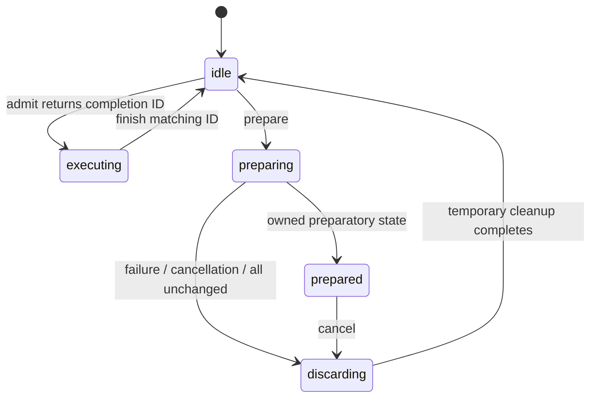

The diagram describes logical host admission, not GPU execution. Admission is rejected in every non-idle state. Nonzero completion IDs do not repeat; stale, duplicate, and mismatched completions cannot reopen admission for a newer operation or pending transition. Counter wrap is rejected.

This is an owner-thread-only state machine. Callbacks may reenter admission, prepare, finish, or cancel according to the gate rules, but must not destroy the transition object. External cancellation must be marshalled to the owner thread. `finish()` only finishes the admitted host operation; it is not a backend completion fence and does not close or drain GGML arena leases.

### Consumer and rollback contract

- The caller supplies a nonempty complete participant list. Null and duplicate registrations are rejected before callbacks. Consumers are borrowed and must outlive the transition and their preparations.
- The target and computed layout are owned snapshots. Caller mutation/destruction of the request cannot change a prepared target.
- A consumer must not mutate active state or submit device work during preparation. It may return an owned preparation, or return success with no preparation to confirm that no transition is needed for its state.
- No-op classification is negotiated with every consumer, not inferred from stage IDs or layout equality. The consumer must consider its external/runtime state too.
- Returned preparations, including a failing consumer's partial output, are destroyed in reverse registration order. Snapshot metadata stays valid throughout their destruction.
- Cleanup keeps admission closed and rejects reentrant prepare/finish/cancel attempts. Preparation destructors must not throw.
- Cancellation from within a prepare callback sets a flag; it cannot destroy that callback's parameters or output slot. Cleanup happens after the callback returns, before any later consumer is called.
- Cancellation takes precedence over a normal returned failure or no-op. Thrown exceptions remain reported, including their original `exception_ptr`; cancellation does not hide them.
- A successful non-no-op remains prepared with admission closed. There is deliberately no activation API yet. Cancelling or destroying the transition discards only preparatory state.
- The framework guarantees temporary-state cleanup, not rollback of arbitrary consumer side effects. Keeping old state usable depends on consumers honoring the non-mutating preparation contract.

### TDD evidence and scope

The initial 17 cases failed against placeholders with 256 failed assertions. After implementing the gate and adding cancellation-precedence coverage, all 19 cases and 809 assertions pass. Checks cover overlap and stale completion IDs, reentrant callbacks, partial failure at different consumer positions, reverse cleanup, consumer and allocation exceptions, deferred cancellation, no-op negotiation, invalid registration/layout, owned snapshots, pending destruction, and repeated failure/no-op/cancel cycles.

Fake preparations hold references to their target/layout and inspect them during destruction, so ASan also checks the snapshot-versus-token destruction order. Fake consumers retain unchanged active values throughout failed or cancelled preparation. A simulated consumer `std::bad_alloc` tests partial-output cleanup; allocator failures in every metadata-allocation site were not individually injected.

All eight focused suites pass in debug CPU, ASan/leak-checking, and UBSan builds, with the new llama code instrumented. Strict warnings pass with `-Wall -Wextra -Werror -Wconversion -Wsign-conversion -pedantic -I ggml/include`. This is not a thread-safety claim: TSan and cross-thread cancellation were not tested because concurrent calls are outside the contract. No production or GPU configuration was changed.

```sh
cmake -S . -B build-device-memory-infra
cmake --build build-device-memory-infra --target test-memory-transition test-memory-layout test-memory-plan test-memory-requirements test-alloc test-backend-buffer test-backend-memory test-backend-meta -j 20
ctest --test-dir build-device-memory-infra -R '^test-(memory-transition|memory-layout|memory-plan|memory-requirements|alloc|backend-buffer|backend-memory|backend-meta)$' --output-on-failure
```

The sanitizer runs use the same targets and selection in `build-device-memory-infra-asan` with `ASAN_OPTIONS=detect_leaks=1:halt_on_error=1` and `build-device-memory-infra-ubsan` with `UBSAN_OPTIONS=halt_on_error=1:print_stacktrace=1`. Implement 4.4a before adding the 4.3b drain/invalidate/release/commit/bind/activate path.

## Substage 4.4a implementation and validation

Added `src/llama-memory-executor.h/.cpp` and `tests/test-memory-executor.cpp`. This is the common capture-dependency and execution-lifetime contract plus fake-executor validation, not a CUDA adapter or an inference integration.

### Capture identity and ownership

- An executor adopts an idle native executable only after retaining its complete leased dependency set. Rejected adoption leaves the caller's executable ownership unchanged.
- Dependency identity uses the actual buffer-view handle and the region's ID, offset, size, alignment, and flags. Input order and exact aliases do not change the key; conflicting IDs and invalid leases are rejected.
- A separate caller-supplied runtime revision covers captured consumer assumptions. It is not the arena generation and should not advance for ordinary tensor writes that leave captured assumptions unchanged.
- Neither arena generation nor lease acquisition generation is used as a staleness test. A fresh lease for the same surviving persistent view can match a capture that still owns an older lease.
- A stale key or closed executor cannot issue an execution pin. The adapter must obtain a pin before submitting work and retain it until all related compute/copies have completed.
- Dependencies without arena leases must be owned by the native executable itself or otherwise kept alive by its backend. Empty leased sets are supported, but still require correct runtime revisions and completion pin lifetimes.

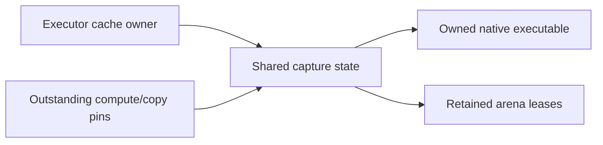

Pins are move-only and retain the same capture snapshot. Destroying the executor owner does not destroy a snapshot still held by backend work. The snapshot destroys the native executable before releasing its leases, including when the last execution pin is its final owner.

### Explicit retirement

Retirement closes launch admission before asking the backend to drain. If draining fails or throws, the capture and leases remain retained and admission stays closed. If the backend reports completion but any pins remain, retirement reports pending and does not invalidate the native executable.

Once draining succeeds and all pins are returned, retirement destroys the native executable and then releases the captured leases. Reentrant retirement during the drain callback is rejected. A resource-change list that does not intersect captured dependencies is a no-op: it does not drain, destroy, or reopen a previously closed executor.

The tests check that real arena commits cannot resize a captured region before retirement, and can do so afterward. They also change an unrelated region while an older persistent lease survives, acquire a fresh lease at the new generation, and replay the same fake capture successfully without unnecessary invalidation.

### Limits and TDD evidence

This is an owner-thread-only contract. A pin release is the backend's promise of completion, not an automatic GPU fence. Queues, backend contexts, and the code needed to destroy native artifacts must remain alive until their pins are released. Lease retention does not serialize arbitrary tensor writes or verify that the supplied runtime revision is truthful. The adapter must obey these rules; real backend synchronization and integration remain in 4.4b and 4.3b respectively.

TDD began with 13 cases against placeholder methods; 12 assertions failed before implementation. After implementing the contract and adding boundary cases, all 16 cases and 176 assertions pass. Cases include capture adoption, stale runtime/buffer identities, normalized aliases, persistent leases across arena generations, no-op invalidation, delayed compute/copy pins, blocked storage reuse, failed/exceptional/incomplete drains, ownership surviving executor and arena-owner destruction, replacement, empty dependency sets, reserved IDs, and fail-closed retry behavior.

The fake backend records completion and native destruction order and reads from real CPU-backed arena storage. Native destructors assert that the arena lease still exists. ASan exercises the case where the original executor and arena owner disappear before queued work completes; this is not a real CUDA execution test.

All nine focused suites pass in debug CPU, ASan/leak-checking, and UBSan builds. Strict warnings pass with `-Wall -Wextra -Werror -Wconversion -Wsign-conversion -pedantic -I ggml/include`. Host allocation failure during capture adoption is handled but was not fault-injected. TSan and real GPU execution were not tested for this owner-thread contract. No production service or model configuration changed.

```sh
cmake -S . -B build-device-memory-infra
cmake --build build-device-memory-infra --target test-memory-executor test-memory-transition test-memory-layout test-memory-plan test-memory-requirements test-alloc test-backend-buffer test-backend-memory test-backend-meta -j 20
ctest --test-dir build-device-memory-infra -R '^test-(memory-executor|memory-transition|memory-layout|memory-plan|memory-requirements|alloc|backend-buffer|backend-memory|backend-meta)$' --output-on-failure
```

The sanitizer runs use the same target list and selection in `build-device-memory-infra-asan` with `ASAN_OPTIONS=detect_leaks=1:halt_on_error=1` and `build-device-memory-infra-ubsan` with `UBSAN_OPTIONS=halt_on_error=1:print_stacktrace=1`.

## Substage 4.3b implementation and validation

Extended `llama_memory_transition` with an activation protocol and added `tests/test-memory-activation.cpp`. The integration uses real CPU arenas/leases and fake native execution. It is not wired into llama-server or a CUDA adapter yet.

The small supporting additions are `llama_memory_executor::quiesce()`, which closes submission without destroying captures, and `ggml_backend_memory_arena_get_region_at()`, which copies address-ordered committed metadata under the arena lock.

### Ordered activation

```mermaid
flowchart LR
    P["Validate live arenas"] --> Q["Close affected admission"]
    Q --> D["Drain all affected work"]
    D --> I["Invalidate affected captures"]
    I --> R["Release changed bindings"]
    R --> C["Commit changed layouts"]
    C --> B["Acquire staging leases and bind"]
    B --> A["Activate all consumers"]
    A --> O["Publish snapshot and reopen"]
```

- Every applicable consumer completes each protocol phase before the next phase begins. Default preparation hooks reject activation, so old preparation-only consumers cannot silently participate.
- The coordinator verifies arena count, caller-supplied placement/allocation labels, capacity, native alignment, existing gate state, generation consistency, and fixed-region snapshots before changing state. Aliased parent entries are rejected.
- After the first successful activation, physical parent mappings remain stable by domain/allocation class; this stage does not silently substitute another parent or add allocation groups.
- A parent can have more capacity than the logical budget, but grants remain inside that budget. For now, region alignment must equal the parent's reported native alignment. Stronger unreported alignment is rejected rather than guessed.
- Allocation-class labels are caller-supplied provenance, not hardware probes. The caller owns the complete participant list and exclusive arena mutation during activation.
- Closing an arena gate is not a GPU wait. Consumer quiesce/drain hooks close their affected executor paths and explicitly finish affected compute/copies.
- An unchanged whole-arena layout skips commit. If an arena does change, all non-persistent views count as affected even when their individual geometry is unchanged, because milestone 3 recreates them on commit.
- Exact unchanged persistent regions can retain their original leases and captured executables across a commit. The coordinator never requires those leases to disappear or the whole arena to become QUIESCENT.
- Consumers must account for shared-arena view changes when deciding whether to return a preparation. A consumer that owns an affected non-persistent view cannot claim a no-op based only on its tensor shape.
- New lease acquisition temporarily requires OPEN arena admission. The host execution gate stays closed, staging leases are acquired, and arena gates are closed again before consumer binding.
- Bind callbacks retain candidate leases without publishing them. Activate callbacks publish bound state without submitting new execution. Consumer-specific data preservation/reconstruction remains their responsibility.
- After all activation callbacks and temporary cleanup finish, arena admission reopens and the new logical snapshot is published. Coordinator-owned staging leases are then unnecessary; consumers retain their own active leases.

### Errors and deliberate limits

Invalid parent/preflight input leaves the proposal prepared and cancellable without running lifecycle callbacks. Once quiescing starts, callback failure, incomplete draining, cancellation, commit failure, or binding failure enters a failed state. Host admission remains closed, touched arena gates remain closed, and the target, arena metadata snapshots, and remaining temporary state are retained.

Commits across multiple arenas are sequential, not an atomic hardware transaction. A later failure can leave an earlier arena committed. Likewise, a later activation callback can fail after an earlier consumer has published state. Neither case reopens execution or replaces the coordinator's last-successful active snapshot. That logical snapshot is not proof that physical state was rolled back.

Stage 4.3c will add recoverable restoration and session invalidation. This stage does not silently cancel a failed activation back to idle. Destruction cleans owned temporary state, but is not a recovery operation. Captured/in-flight leases still enforce storage lifetime independently.

Generation checks here detect out-of-band arena mutation during the transaction; they do not mark an older surviving persistent lease stale. No new persistence-placement policy is introduced: this stage preserves caller-established persistent regions rather than automatically pinning all preserved content.

### TDD evidence

The initial 12 integration cases failed against placeholder activation/quiesce/enumeration methods with 69 failed assertions. After implementation and boundary coverage, all 16 cases and 232 assertions pass. A boundary test initially mixed cleanup events from a preceding cancelled proposal into its next preflight check; its event log was reset between those independent attempts, and all configurations were rebuilt and rerun.

Coverage includes callback ordering, real metadata enumeration, stale fixed snapshots, native-alignment/capacity/gate rejection, stable parent identity, delayed compute/copy completion, persistent lease/capture survival at an older generation, recreation of unchanged non-persistent views, no-op arena commits with internal runtime changes, external leases blocking commit, callback failures/exceptions/cancellation, partial activation, and partial multi-arena commit.

All ten focused suites pass in debug CPU, ASan/leak-checking, and UBSan builds. Strict warnings pass for the transition/executor code with `-Wall -Wextra -Werror -Wconversion -Wsign-conversion -pedantic -I ggml/include`. The code is still owner-thread-only; TSan and real GPU execution were not tested. Per-site host allocation and backend view-creation fault injection remain part of the recovery work rather than a claim of exhaustive failure coverage here.

```sh
cmake -S . -B build-device-memory-infra
cmake --build build-device-memory-infra --target test-memory-activation test-memory-executor test-memory-transition test-memory-layout test-memory-plan test-memory-requirements test-alloc test-backend-buffer test-backend-memory test-backend-meta -j 20
ctest --test-dir build-device-memory-infra -R '^test-(memory-activation|memory-executor|memory-transition|memory-layout|memory-plan|memory-requirements|alloc|backend-buffer|backend-memory|backend-meta)$' --output-on-failure
```

The sanitizer runs use the same target list and selection in `build-device-memory-infra-asan` with `ASAN_OPTIONS=detect_leaks=1:halt_on_error=1` and `build-device-memory-infra-ubsan` with `UBSAN_OPTIONS=halt_on_error=1:print_stacktrace=1`. Production services and model configuration were not changed.

## Substage 4.3c implementation and validation

Extended `llama_memory_transition` with explicit recovery and terminal session invalidation. Activation and recovery now share the real-CPU-arena/fake-executor fixture in `tests/memory-transition-test.h`; the original activation cases remain intact.

### Recovery contract

`llama_memory_preparation::prepare_recovery()` is opt-in and rejects by default. A consumer returns a reverse preparation only when it can restore both its old bindings and its data/runtime state after the partial forward operation. Returning true with no reverse preparation promises that this consumer needs no restoration. The reverse preparation may borrow its forward preparation; reverse objects are always destroyed before forward objects.

The coordinator does not infer data recoverability from arena metadata. A consumer must retain a valid backup, reconstruct its state, prove that nothing changed, or refuse recovery. In the test consumer, backups are taken only after affected outstanding writes finish. These fake integer backups demonstrate the contract; they are not an implementation of KV or model-state recovery.

`recover()` runs only from a failed activation. Admission remains closed throughout, including reentrant callbacks; cancellation during recovery is rejected. Its successful path is:

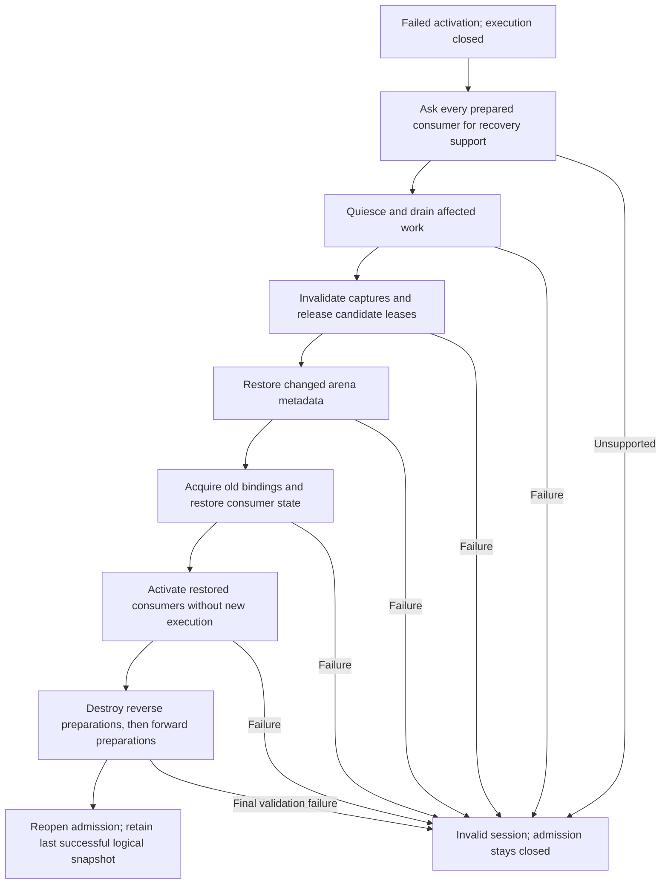

- Every consumer completes a given reverse lifecycle phase before the next phase begins. Draining precedes any capture destruction or changed storage release.
- Coordinator-held candidate leases are dropped only after consumers release their candidate bindings. Old staging leases are then acquired for rebinding.
- Arena restoration uses the retained pre-transition region snapshots. An arena whose committed metadata never changed is not recommitted; this preserves its original views and any surviving external leases.
- Exact persistent views can survive both forward and restoration commits. A new arena generation does not by itself invalidate such a lease or its capture.
- Multiple arenas still commit sequentially. A failed later forward commit can be recovered by restoring the earlier changed arenas and leaving the unchanged arenas alone.
- Generation mismatches reject out-of-band committed arena mutation without overwriting it. Exclusive owner-thread mutation remains a caller obligation, including while recovering.
- `last_failure()` preserves the original activation failure, including its exception, while the recovery result separately describes a recovery failure. Successful recovery discards the pending failure and returns `recovered`.
- Unsupported restoration, failed recovery, or a late forward failure after backup descriptors were already discarded leaves an invalid session. It cannot be reopened by cancel/admit or retried through recover; the caller must recreate it.
- Destruction releases owned preparations and leases; it is not a rollback or a substitute for backend completion. Consumer/backend lifetimes and in-flight execution pins retain their existing requirements.

### Prerequisite infrastructure fix and rebase

View-factory fault injection exposed an infrastructure exception-safety bug: when a later backend view factory threw, an earlier temporary view and any temporarily retained persistent views were not released. The user committed the separate fix on `feature/device-memory-infra` as `78e002404`. The arena now frees temporary views and rolls back staged metadata; allocation exceptions return false, while other exceptions propagate after cleanup.

The low-level regression failed at the temporary-view free-count assertion before the fix and passes with it, including persistent-view reuse and a later successful commit. All four focused infrastructure suites passed in debug, ASan/leak-checking, and UBSan before the fix was committed. Milestone 3 was then advanced to that commit and the seven consumer commits rebased on top. `git range-diff` confirmed that all seven replayed patches were unchanged. The earlier stage hashes in the progress ledger now identify those rebased commits.

### TDD evidence and limits

The initial recovery contract tests failed against placeholder recovery methods (14 cases, 37 failed assertions). After implementation and additional boundary coverage, the recovery suite passes 18 cases and 514 assertions.

Coverage includes each forward callback boundary; delayed completion before backup; changed consumer data and runtime revisions; retained active snapshots and successful retry; surviving persistent captures; unsupported recovery; failure of every reverse lifecycle phase; reverse preparation/callback exceptions; foreign committed metadata; partial native view creation returning null or throwing; view failure during restoration; external leases blocking restoration; cancellation after drain; reentrant operations; reverse-before-forward destruction; and recovery after a partial multi-arena commit.

All eleven selected suites pass on the rebased code in debug CPU, ASan with leak checking, and UBSan. Strict transition-code warnings pass with `-Wall -Wextra -Werror -Wconversion -Wsign-conversion -pedantic -I ggml/include`. This covers real arena/lease operations with simulated execution, not CUDA capture replay, TSan, production inference, or exhaustive fault injection at every host allocation site. CUDA adapter qualification remains substage 4.4b.

```sh
cmake -S . -B build-device-memory-infra
cmake --build build-device-memory-infra --target test-memory-recovery test-memory-activation test-memory-executor test-memory-transition test-memory-layout test-memory-plan test-memory-requirements test-alloc test-backend-buffer test-backend-memory test-backend-meta -j 20
ctest --test-dir build-device-memory-infra -R '^test-(memory-recovery|memory-activation|memory-executor|memory-transition|memory-layout|memory-plan|memory-requirements|alloc|backend-buffer|backend-memory|backend-meta)$' --output-on-failure
```

The sanitizer runs use the same targets and selection in `build-device-memory-infra-asan` with `ASAN_OPTIONS=detect_leaks=1:halt_on_error=1` and `build-device-memory-infra-ubsan` with `UBSAN_OPTIONS=halt_on_error=1:print_stacktrace=1`. Production services and model configuration were not changed.

## Substage 4.4b implementation and validation

Added `llama_memory_cuda_executor` in `src/llama-memory-executor-cuda.h/.cpp`, two internal CUDA registry hooks declared in `ggml/src/ggml-cuda-graph.h`, and `tests/test-memory-executor-cuda.cpp`. This adapts the common executor lifetime contract to the existing native CUDA capture cache; it does not replace CUDA graph evaluation, attention kernels, or scheduler allocation policy.

### Ownership and submission

The adapter borrows one backend and one fixed GGML graph. The backend, graph/tensor metadata, and any dependencies not represented by supplied leases must outlive the adapter. The caller supplies the complete leased dependency set and runtime revision, with exclusive ownership of submissions and cache mutation for that graph key. Other graph keys on the backend can have their own adapters.

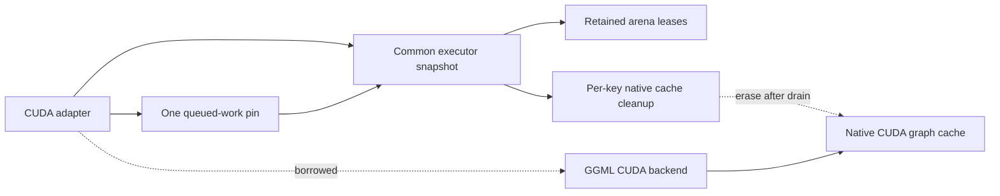

- `bind()` validates and retains the leased dependency set before adopting its cleanup descriptor. Invalid bindings or replacement of a live attachment are rejected without retiring the existing capture.
- Successful attachment synchronizes the backend and clears any old entry for that first-node key. This prevents reused tensor addresses or graph UIDs from preserving an older binding's capture.
- Native capture remains lazy. Existing CUDA warmup, property checks, replay, and idle cache eviction remain backend-owned. An attached executable can be ready even when no native CUDA graph instance exists.
- `compute_async()` checks the current binding identities and runtime revision through the common executor, then retains a pin before invoking GGML. One pin covers the entire queued sequence until explicit drain; it does not accumulate one allocation or vector entry per token.
- A failed status or exception after partial submission closes admission and retains the pin. It does not assume that an unsuccessful call queued no GPU work.
- `drain()` waits on the backend's primary stream, including work and copies joined into that stream, before dropping the queued pin. This is backend-wide synchronization, not fine-grained per-capture event polling; it can also wait for other graph keys on that backend.
- `retire()` uses the common drain-before-destroy protocol. The cleanup descriptor erases only its native cache key before the common snapshot releases its final leases.
- `retire_if_affected()` is a no-op for unrelated resource IDs: no drain, cache invalidation, or pin release. Exact surviving persistent leases can keep captures valid across arena generations.
- Adapter destruction drains and retires while its borrowed backend still exists. It must not silently free dependencies after unsuccessful draining.

The native release hook assumes completion has already been established; it does not independently synchronize. The query hook inspects whether a native instance exists without creating an entry or exposing a CUDA handle. Both are discovered through the existing registry extension mechanism, so the common llama library does not gain a link dependency on the CUDA runtime.

### Supported scope and deliberate limits

- This is still an owner-thread-only, fixed-graph adapter. The graph's topology and tensor bindings must not be mutated under an attached executable; retire, update/rebind, and attach a new revision instead.
- Ordinary tensor-content writes do not invalidate the runtime revision. Storage identity or capture assumptions do.
- Other streams/backends must join their work into the guarded backend's completion path before relying on this adapter to release shared storage. Arbitrary external CUDA launches are not tracked.
- Optional `GGML_CUDA_GRAPH_OPT=1` is explicitly rejected by withholding these hooks. Its experimental concurrent-stream scheduling metadata is backend-wide and is not retired by erasing one cache entry. Supporting its ownership needs separate work rather than silently clearing metadata needed by sibling graphs. Environment configuration must be fixed before backend initialization.
- CPU and backends without the hooks are rejected without allocation or launch. ROCm/MUSA do not advertise this new CUDA-specific contract; no support is inferred from shared implementation files.
- `GGML_CUDA_DISABLE_GRAPHS=1` is supported: direct CUDA execution still receives the same lease/pin protection. The hooks also have graph-compiled-out implementations, but a separate CUDA build with `GGML_CUDA_GRAPHS=OFF` was not run in this stage.
- Fatal CUDA driver failures still follow the backend's existing `CUDA_CHECK` behavior. The adapter does not convert process-aborting CUDA faults into recoverable transition errors.
- Production llama-context/llama-server does not use the adapter yet. Text-consumer attachment and integration remain stages 4.5a and 4.5b. No prefill/decode memory reclamation, streaming implementation, or performance improvement is claimed here.

### TDD evidence

The initial seven-case suite ran against placeholder adapter methods and failed seven assertions. After implementation, the native CUDA suite passes ten cases and 226 assertions. A separate experimental-optimizer rejection test failed before its capability gate was added and now passes (two cases / 15 assertions including CPU/null-backend checks).

Native tests exercise lazy capture and replay, data updates, stale revisions/dependencies, rejected reattachment preserving capture, no-op invalidation with outstanding work, 32 queued replays sharing one pin, storage reuse blocked until retirement, rebinding at a different arena offset, persistent-view survival across generations, destructor cleanup, independent graph-cache entries on one backend, asynchronous output-copy completion, and injected failure/exception after actual CUDA submission.

Validation on the RTX 5070 Ti with the existing CUDA 13.0 toolkit build, architecture 120a:

- Native suite passes with captures enabled and with `GGML_CUDA_DISABLE_GRAPHS=1`.
- Compute Sanitizer memcheck with full leak checking reports zero errors and zero leaked device allocations for the native suite.
- CPU-referenced CUDA SCALE operator validation passes all four cases using `test-backend-ops`.
- All twelve focused memory suites pass in debug CPU-only and CUDA-enabled builds.
- All twelve focused suites pass in CPU-only ASan/leak-checking and UBSan builds. Their adapter case covers unsupported-backend behavior; these are not host-sanitized CUDA builds.
- Strict adapter warnings pass with `-Wall -Wextra -Werror -Wconversion -Wsign-conversion -pedantic -I ggml/include`.
- `readelf -d` confirms the CPU-only `libllama.so` does not depend on CUDA libraries. TSan, other accelerator adapters, optimized multi-stream graph execution, and full-model performance are not qualified by this stage.

The native fixture uses a small scale graph and a 64 KiB arena. Production stayed running and its configuration was not changed.

```sh
cmake -S . -B build-device-memory-infra-cuda -DGGML_CUDA=ON -DCMAKE_CUDA_ARCHITECTURES=120
cmake --build build-device-memory-infra-cuda --target test-memory-executor-cuda test-backend-ops -j 20
build-device-memory-infra-cuda/bin/test-memory-executor-cuda --cuda
GGML_CUDA_DISABLE_GRAPHS=1 build-device-memory-infra-cuda/bin/test-memory-executor-cuda --cuda --no-graphs
GGML_CUDA_GRAPH_OPT=1 build-device-memory-infra-cuda/bin/test-memory-executor-cuda --cuda --unsupported
compute-sanitizer --tool memcheck --leak-check full --error-exitcode 99 build-device-memory-infra-cuda/bin/test-memory-executor-cuda --cuda
build-device-memory-infra-cuda/bin/test-backend-ops test -b CUDA0 -o SCALE
```

The architecture above is the tested GPU; use the architecture appropriate for another machine. Without `--cuda`, the new test runs only the CPU/null-backend rejection checks, so the explicit native invocation is required to qualify CUDA behavior. Run the twelve-suite selection by adding `memory-executor-cuda` to the 4.3c target list and CTest expression. Use the same CPU sanitizer configurations and environment flags recorded for 4.3c.

## Substage 4.5a implementation and validation

Added `llama_memory_workspace` in `src/llama-memory-workspace.h/.cpp` and `tests/test-memory-workspace.cpp`. This is a coordinator consumer for the text scheduler's existing maximum-sized workspace groups. The production `llama_context` allocation helper is unchanged; adoption and execution integration remain stage 4.5b.

### Registration and allocation boundary

The caller supplies canonical groups produced by `ggml_backend_memory_plan_workspace_groups`, assigns session-unique resource/domain IDs, and selects groups with verified buffer-view support. The consumer checks each selected group against the actual scheduler buffer type and canonical first slot. Duplicate resource IDs, duplicate buffer types, invalid slots, incompatible alignment, and non-discardable content are rejected.

`register_resources()` appends one resource per selected buffer-type group and a WRITE requirement to each requested stage. Both minimum and preferred bytes equal the measured phase maximum. Registration is transactional with respect to the plan; missing/duplicate stages, catalog collisions, or validation failure leave it unchanged.

Registration and preparation allocate only host bookkeeping. They neither allocate physical parent buffers nor discover free VRAM. Parent arenas, domain/allocation labels, and capability probing remain caller responsibilities. Allocation-class labels are not inferred from pointer values.

Aliased scheduler slots receive a single group lease through the existing scheduler attachment API. GGML intentionally reports those shared bytes only on the first slot; a zero size reported on another alias does not mean it lacks workspace.

### Lifecycle

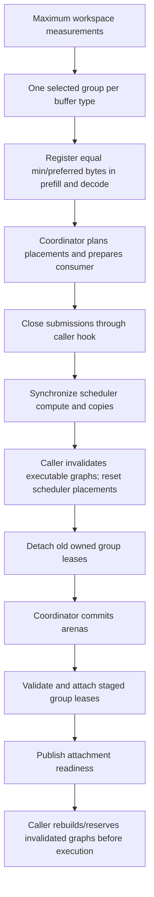

- Two mandatory, idempotent hooks cover submission quiescing and executable invalidation for the entire scheduler, including its fallback groups. A caller without native captures can explicitly provide the corresponding no-op, but absent hooks are not silently accepted.
- The consumer synchronizes the scheduler before invalidation. Invalidation must retire native captures and mark caller-owned graph bindings for reconstruction before leases are detached.
- Any affected workspace group conservatively invalidates this scheduler's executable bindings. This avoids resetting shared scheduler placement metadata underneath an otherwise unaccounted executable.
- If all workspace placements and views are unchanged, activation preserves the existing attachments without quiescing, invalidating, or detaching. Moving from prefill to decode alone does not shrink the grant or force an arena commit.
- Bind validates every selected lease's actual region metadata and buffer type before attaching any. It marks workspace views as COMPUTE, retains its own lease references, and attaches one lease for every shared buffer-type group.
- A failed later attachment detaches only earlier attachments made by this consumer. It does not clear a foreign borrowed range that caused the failure.
- Preparation/cancellation does not touch the active scheduler. Concurrent or reentrant preparations, close while a preparation exists, and reentrant close are rejected.
- `ready()` describes logical attachment readiness, not global execution admission or a rebuilt graph. The caller must obey the coordinator's gate and reconstruct invalidated tensor bindings before using them.
- Explicit close and destruction use quiesce/synchronize/invalidate/detach ordering. Remaining ownership is retained if close fails; destruction asserts successful teardown rather than freeing storage while its use is unproven. Scheduler/backend/hook lifetimes must extend through consumer teardown.

### Recovery and fallback

Workspace resources are explicitly discardable scratch. The consumer's recovery preparation saves placement metadata without retaining old leases that would prevent repartition. After a failed transition, it can detach candidates and reattach restored arena regions; graph reconstruction remains required. It does not copy scratch bytes back or claim rollback of KV/recurrent state, live outputs, or vision handoff data. Such state must remain outside this discardable workspace contract.

Saved arena indices are remapped to the current target's budget order by workspace group. Arena indices are positions in one target layout, not stable resource identities. This matters when recovery follows a transition that reordered budget entries.

Unsupported groups are omitted from the coordinated set and remain on the scheduler's existing allocation path. The consumer does not turn managed-group attachment/allocation failures into silent fallback. The mixed test uses a real CPU buffer type with view support withheld and confirms that the omitted group's scheduler allocation remains usable and is not detached by closing the managed groups.

### TDD evidence and scope

The initial ten cases failed twelve assertions against placeholder methods. After implementation and boundary coverage, the workspace suite passes sixteen cases and 390 assertions.

Additional regressions exposed missing canonical-slot/buffer-type validation and a recovery error when arena budgets were reordered. Both were demonstrated failing before their fixes. An initial alias-size assertion was corrected after checking the existing allocator and shared-lease test: accounting intentionally counts shared storage only once.

Coverage includes phase-maximum registration, transactional registration rejection, real scheduler reserve/allocate/compute, aliased slots, unchanged decode activation, cancellation, partial attachment rollback while preserving a foreign range, relocation recovery after a later consumer fails, failed/throwing invalidation, view-unsupported fallback, destruction, invalid group metadata, missing execution hooks, incorrect grants, sixteen repeated create/compute/detach cycles, and recovery after budget reordering.

All thirteen focused suites pass in debug CPU, ASan with leak checking, and UBSan. Strict workspace-source warnings pass with `-Wall -Wextra -Werror -Wconversion -Wsign-conversion -pedantic -I ggml/include`. No GGML allocator, scheduler, backend kernel, or production context implementation changed in this stage.

This is not full-model, accelerator-consumer, TSan, or performance qualification. The next stage must wire the consumer into actual context ownership, supply correct native-executor invalidation/rebuild hooks, preserve fallback behavior, and run the planned backend/numerical/steady-state qualification. No new arena budgeting, prefill/decode reclamation, or KV streaming is enabled here. Production services and configuration were untouched.

```sh
cmake -S . -B build-device-memory-infra
cmake --build build-device-memory-infra --target test-memory-workspace test-memory-executor-cuda test-memory-recovery test-memory-activation test-memory-executor test-memory-transition test-memory-layout test-memory-plan test-memory-requirements test-alloc test-backend-buffer test-backend-memory test-backend-meta -j 20
ctest --test-dir build-device-memory-infra -R '^test-(memory-workspace|memory-executor-cuda|memory-recovery|memory-activation|memory-executor|memory-transition|memory-layout|memory-plan|memory-requirements|alloc|backend-buffer|backend-memory|backend-meta)$' --output-on-failure
```

Use the same targets and selection with `build-device-memory-infra-asan` and `ASAN_OPTIONS=detect_leaks=1:halt_on_error=1`, or `build-device-memory-infra-ubsan` and `UBSAN_OPTIONS=halt_on_error=1:print_stacktrace=1`.

## Substage 4.5b implementation and qualification

Added `llama_context_memory` in `src/llama-context-memory.h/.cpp` and wired it into `llama_context` reserve, dispatch, synchronization, and teardown. It composes the stage-4 workspace consumer, transition gate, and executor-lifetime guard. There is no per-token layout planning and no phase-dependent workspace shrinking.

### Why the integration guards a scheduler lifetime

The scheduler owns and rebuilds backend graph splits. The 4.4b fixed-graph adapter cannot safely borrow one split descriptor as though it were an immutable context graph. This integration instead guards the complete scheduler workspace lifetime and its backend-native cache domain.

A new optional CUDA registry hook, `ggml_backend_cuda_graph_release_all`, erases that backend instance's graph cache after completion. It does not modify ordinary capture/update/replay code or touch another context's backend instance. The existing per-key adapter remains available for fixed-graph consumers.

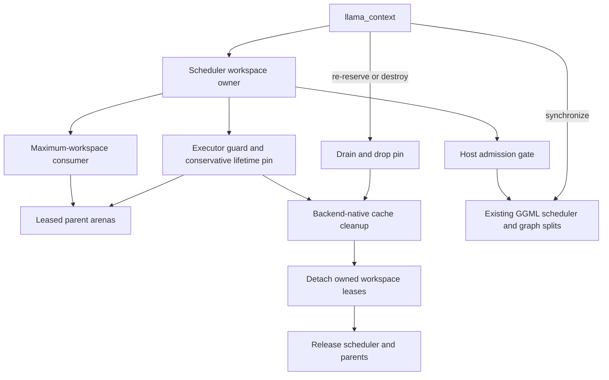

- Parent buffers use the same factories and exact measured group maxima as milestone 3. View-unsupported groups remain scheduler-allocated. Managed-group failures are errors, not silent fallback.
- Workspace metadata uses the supported CPU/CUDA factories' existing host, pinned-host, device-local, or managed allocation policy. UVM allocation behavior is not changed; environment configuration must be fixed before initialization.
- Initial setup registers both fixed-maximum text-stage requirements, activates the workspace consumer, and captures its complete leased workspace set. Weights, KV/recurrent state, and other non-workspace dependencies remain context/model-owned.
- Dispatch uses the existing scheduler unchanged. A small host admission gate encloses submission; GPU completion is handled separately.
- One conservative execution pin is acquired for this immutable scheduler lifetime. Normal synchronization waits for work but retains the pin, avoiding repeated validation/locking of the same lease set on each token.
- Actual retirement drains the scheduler and releases that pin, then destroys native captures before releasing guarded leases. Holding the pin after completed work is conservative; it is never released before completion.
- The owner is declared after the scheduler and reset before every scheduler destruction/replacement site. This also gives safe member cleanup during constructor failure.
- Failed/aborted dispatch closes the guard and invalidates scheduler reservation so a subsequent request rebuilds the guarded workspace. The CPU abort-and-next-request numerical regression covers this path; this is not a promise of arbitrary mutable-state rollback after every exception.
- `uses_memory_coordinator()` distinguishes this integration from the legacy arena path. `uses_compute_arenas()` continues to report arena use for either path, preserving existing memory-accounting tests.

### Capability boundary

Coordinated context integration is enabled only for serial contexts with one sequence, no pipeline parallelism, and a verified backend set consisting of CPU plus at most one CUDA backend. CPU needs no native graph-cache destruction; CUDA must advertise the new whole-cache hook.

OpenCL, SYCL, Vulkan, Meta, unverified accelerator backends, multiple CUDA backends, parallel-sequence contexts, and experimental `GGML_CUDA_GRAPH_OPT=1` retain the existing milestone-3 arena path. They are not silently treated as having verified capture invalidation. Their text-inference compatibility was checked below, but coordinated native-lifetime adapters for those backends remain future extensions.

No public context parameter, CLI switch, CUDA kernel, checkpoint, or prompt-cache policy changed. No adaptive KV streaming or prefill/decode/mmproj reclamation is enabled by this milestone.

### TDD and correctness evidence

The scheduler-owner tests first failed three assertions against placeholder methods. A separate real-context assertion then failed before the context wiring was added. The final owner suite passes four CPU cases / 352 assertions and five CUDA cases / 376 assertions.

Coverage includes invalid inputs and the single-CUDA-backend limit, exact maximum capacity, real scheduler compute/output completion, repeated graph reconstruction, queued work at teardown, repeated workspace recreation, foreign attachment preservation after failed creation, allocation failure followed by retry, and clearing real scheduler-created CUDA captures.

The repeated-replay fixture initially allowed in-place input reuse; it now marks the input as preserved output as well as input. The CUDA fixture also restores explicit device assignment after scheduler reservation, which resets assignment metadata. These fixture corrections did not change allocator or kernel behavior.

The existing synthetic LLAMA dense/MoE tests were extended to assert real coordinator use for eligible CPU contexts and verify abort followed by another request. They also exercise prefill, TG1, repeated causal-attention re-reservation, workspace memory accounting, no-allocation contexts, and serialization where supported. Seed: 1234; numerical acceptance threshold: NMSE <= 1e-4.

| Backend path | Context ownership path | Dense / MoE NMSE versus CPU | Result |
| --- | --- | --- | --- |
| CPU | Coordinated | 0 / 0 | Pass |
| CUDA RTX 5070 Ti | Coordinated | 9.34e-8 / 9.39e-8 | Pass |
| OpenCL UHD 770 | Legacy arenas | 1.04e-13 / 1.01e-13 | Pass |
| SYCL UHD 770 | Legacy arenas | 3.26e-12 / 3.27e-12 | Pass |
| Vulkan RTX 5070 Ti and UHD 770 | Legacy arenas | 9.34e-8 / 9.39e-8 | Pass |
| Meta over the available accelerator configurations | Legacy arenas | Within the same 1e-4 threshold | Pass |

Meta serialization roundtrip remains the existing test's explicit skip; it is not reported as passing. CPU-only Meta with no accelerator device list is also an existing skip. SYCL reported its existing unavailable-free-memory warning; it did not prevent these tests from passing.

All fourteen focused suites pass in debug CPU/CUDA builds and CPU-only ASan/leak-checking and UBSan builds. The synthetic CPU model test also passes under both sanitizers after the final pin change. CUDA Compute Sanitizer memcheck with full leak checking reports zero errors and zero leaked device allocations. CUDA managed-allocation owner tests, graph-disabled model tests, and experimental-optimizer legacy-fallback model tests pass. Strict warnings pass for the new owner source.

### Steady-state overhead and HTTP smoke

The optional `test-context-memory --bench` mode compares the new owner with the unchanged legacy arena helper in the same binary, using identical tiny graphs and group capacities. It runs legacy/coordinated/coordinated/legacy order with 10,000 measured graph dispatches per sample, both queued and synchronized after every graph. Logging is disabled for timing; construction and teardown are outside the timed interval.

An initial implementation dropped and reacquired its pin after each synchronization. The measured synchronized overhead was about 0.36 us on CPU and 0.50 us on CUDA. Retaining one pin until retirement reduced that cost without adding a new fast-path executor API.

Final paired means from the Debug-build diagnostic, in microseconds per tiny graph:

| Backend / mode | Legacy | Coordinated | Added time |
| --- | ---: | ---: | ---: |
| CPU queued | 0.331 | 0.427 | 0.096 |
| CPU synchronized | 0.355 | 0.467 | 0.112 |
| CUDA queued | 2.049 | 2.049 | 0.000 |
| CUDA synchronized | 5.161 | 5.328 | 0.167 |

This is a dispatch microbenchmark, not a model tokens/second comparison or a statistically rigorous production performance claim. The relative percentage is large for an extremely small CPU graph; the absolute increment is sub-microsecond. No full production-model throughput improvement or absence of throughput regression is inferred from these numbers.

The complete `llama-server` target was rebuilt, including server implementation libraries. The existing HTTP harness then loaded `stories15M-q4_0.gguf` on CPU and CUDA, processed a 16-token prompt, and generated 32 tokens for two serial measured requests per backend after warmup. All four requests passed the harness checks, including no reused prompt tokens. This was a functionality smoke test, not an A/B throughput claim. Temporary configuration/results are under `/tmp/device-memory-m4-smoke.61YMk3/`; existing benchmark data was not modified or staged.

Production remained running throughout; no production container, model, or compose configuration was changed.

### Reproduction and milestone gate

```sh
cmake --build build-device-memory-infra --target test-context-memory test-llama-archs -j 20
build-device-memory-infra/bin/test-context-memory --bench
build-device-memory-infra/bin/test-llama-archs -a llama -s 1234

cmake --build build-device-memory-infra-cuda --target test-context-memory test-llama-archs -j 20
build-device-memory-infra-cuda/bin/test-context-memory --cuda --bench
build-device-memory-infra-cuda/bin/test-llama-archs -a llama -s 1234
compute-sanitizer --tool memcheck --leak-check full --error-exitcode 99 build-device-memory-infra-cuda/bin/test-context-memory --cuda
```

Build/run `test-llama-archs -a llama -s 1234` with the OpenCL, SYCL, and Vulkan configurations to reproduce their compatibility checks; SYCL needs the installed oneAPI environment. Add `context-memory` to the 4.5a focused target/CTest selection for the fourteen-suite run. Use the previously recorded ASan/UBSan environment flags. Enable `LLAMA_BUILD_SERVER=ON` when building the server smoke target.

The milestone-4 acceptance gate is met for the declared initial integration scope: safe common transitions/executor lifetimes, coordinated serial CPU/CUDA text execution, existing text-inference compatibility across available backends, and no phase reclamation. The user should review and commit this stage before creating a checkpoint or starting 5.1a. Broader coordinated backend adapters and a full production-model performance sweep are explicitly not claimed by this gate.

## Substage 5.1a: reference audit, geometry, and capability contract

Reviewed the fixed-pool implementation at `d873e5db9` and relevant phase-arena integration at `ae09597ff` before writing the new contract. The milestone-4 branch/checkpoint was not changed. The work remains on the existing consumer branch and does not modify production containers, model files, or runtime configuration.

### Why the original implementation succeeds

The reference avoids relying on demand paging for KV access. It keeps authoritative host KV and a bounded device mirror, retaining useful pages and transferring only the nonresident portion. Its performance depends on several mechanisms together:

| Mechanism to preserve | Actual reference code | Why it matters |
| --- | --- | --- |
| Separate contiguous K/V planes and token-major rows | `fattn.cu`: resident layout and `kv_stream_graph_upload[_batch]` | Adjacent pages become one K copy plus one V copy, instead of many per-head/per-page operations. |
| Ordinary attention for eligible resident work | `ggml_cuda_flash_attn_ext_streamed` resident/single-span path | Avoids unnecessary partial-result merging and retains the fast nonstreamed path. |
| Stable partial-attention accumulation | `kv_stream_accumulate_chunk_results`, `kv_stream_normalize_chunk_results` | Rescales partial numerators/denominators by their maxima before final normalization; it does not average independently normalized chunk outputs. |
| Uniform prefill and concentrated decode layouts | `kv_stream_resident_cache_layout` plus `llama_kv_cache::kv_stream_adapt` | Limits split-attention overhead and leaves fully resident layers as prefetch opportunities; very small rings can still use multiple waves. |
| Real cross-layer request queue | `kv_stream_graph_fill_free_slots`, `kv_stream_graph_release` | Reuses consumed slots promptly, with lookahead bounded by ring capacity rather than a fixed three-layer window. |
| Producer/ready/consumed ordering | `fattn.cu` upload and consumption paths | Prevents reading stale mutable tails or overwriting a slot before its GPU consumers finish. |
| Wide-query tiling around one staged span | `ggml_cuda_flash_attn_ext_streamed` | Reuses the same H2D upload for all query tiles; slots are released only after the final consuming tile. |
| Feedback and span tuning | `llama-kv-cache.cpp`, `kv-stream-span-tuner.h` | Bounds repartition churn and chooses span behavior using measured outcomes. Copy-busy is sampled/extrapolated copy time, not PCIe utilization divided by theoretical bandwidth. |

The memory infrastructure does not replace these algorithms or their internal event ordering. A coarse arena lease protects the allocation lifetime; it does not by itself protect individual ring slots from premature reuse.

The reference can invalidate resident metadata and reload from host when layer bases or V offsets move. Non-disruptive repartition is not assumed. Internal KV content/layout generations remain distinct from arena generations.

### Production-call audit

The production `llama-kv-cache.cpp` resolves CUDA type-pair support, page-size, and conversion-size hooks before constructing the runtime. Its controller calls `llama_kv_stream_partition_adapt`; the real layer assignment and copy queue live in CUDA `fattn.cu`.

By contrast, the earlier `llama_kv_stream_plan_make`, `llama_kv_stream_regions_make`, `llama_kv_stream_extent_make`, and `llama_kv_stream_prefetch_dispatch` have test callers but no production callers in the reviewed fixed-pool reference. They were not copied as if they implemented the successful runtime. Stage 5.1b extracts the actual resident/concentrated/multi-wave policy (documented below); 5.4h must preserve the real queue.

The reference type table was checked against `set-rows.cu`, the native partial-attention resolver, and `convert.cu`. Nine destination types have online-write paths in the reference: F32, F16, BF16, Q8_0, Q5_0, Q5_1, Q4_0, Q4_1, and IQ4_NL. The seven types other than F32/IQ4_NL have the reference's native partial-attention matrix with all-quant instantiations enabled. Other encodings may have storage and/or F16 conversion but no online KV writer. Q8_1 and Q8_K are auxiliary formats, not supported KV storage here. SET_ROWS producer dtype/layout and any required initialization remain part of the backend's write-capability proof, not a consequence of destination type alone.

### New implementation and layering

Added `ggml/src/ggml-kv-stream.h/.cpp` for backend-independent metadata calculations and `src/llama-kv-stream-config.h/.cpp` for the initial model/runtime gate. The lower layer has no dependency on llama model architecture or CUDA; the upper layer supplies the current target restrictions.

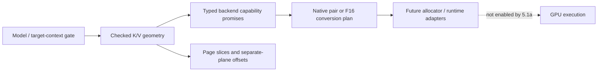

- Row bytes are calculated independently for K and V from GGML block metadata. Head dimensions must contain whole quant blocks; blocks cannot silently straddle heads.
- Block count is divided first, then multiplied with overflow checks. This avoids overflowing an intermediate `type_size * head_dim` even when the final quantized row fits.
- Every product, combined size, and alignment addition is checked. Failure leaves caller output unchanged.
- Layout returns one K plane followed by an aligned V offset for the entire span. The allocation base must satisfy the stated alignment. It is not an array of interleaved K+V page records.
- Page slices return offsets relative to the separate source planes and copy only live rows in a partial last page. Empty caches have zero pages. Padding initialization/masking remains a responsibility of later write/attention stages.
- Capability records carry integer GGML type codes, so invalid or unknown values can be rejected before converting to `ggml_type`. Removed enum entries and auxiliary/non-KV types are rejected without calling asserting size helpers on invalid input.
- Execution resolution requires storage and online writes independently for K and V. A native pair needs both per-type direct support and pair support. Otherwise both conversion paths and F16 attention must exist.
- Conversion size is calculated for the requested span using F16 K/V planes. It explicitly excludes attention partials, accumulators, staged SET_ROWS scratch, graph workspace, and backend pool capacity.
- Attention validation checks ordinary GGML output axes, matching Q/K widths, KV head agreement and GQA divisibility, batch bounds, key padding, token-major K/V strides, supported Q ordering, F16 masks, no sinks, and bounded query-row arithmetic. It reads metadata only, not tensor data or device pointers.
- The model gate remains restricted to the reference `LLM_ARCH_QWEN35` target context, one sequence, one reported CUDA device, offloaded attention layers, Flash Attention, 256-wide K/V heads, 256-token pages, and 128-byte plane alignment.
- The layer list represents full-attention layers only, not recurrent state. IDs must be unique; geometry and execution mode must be uniform. Equal combined page bytes are insufficient: swapping Q8/Q4 to Q4/Q8 changes plane offsets and is rejected.
- Context capacity is padded safely to a full page and constrained to the initial runtime's index range. Total layer storage is checked separately from per-page/per-layer sizes. These byte counts are KV payload/layout estimates, not total host RAM or VRAM requirements.

For example, D=256 with four KV heads and Q8_0 K / Q4_0 V produces 272-byte K rows and 144-byte V rows per head. A 256-token page is 425,984 bytes (416 KiB). At 262,144 padded tokens and 16 full-attention layers, the paired KV planes total 6,979,321,856 bytes (6.5 GiB), excluding recurrent state and all other allocations.

The test capability profiles are expectations copied from the reviewed reference, not registrations of working streamed kernels in this branch. A future backend adapter must populate capabilities from real compiled/initialized implementations. This stage does not enable the server feature, allocate a device pool, or claim that any quant pair already runs in a new streaming kernel.

### TDD and validation

The initial 14 tests failed 78 assertions against placeholders. Boundary coverage grew to 18 cases and 1,205 assertions, including 81 online-type pairs under both direct-enabled and conversion-only capability profiles, all current type-code entries plus invalid values, independent K/V failures, compact plane layout, tail coverage, intermediate/aggregate overflow, tensor masks/strides/head limits, model scope, and uniformity.

UBSan caught an invalid enum load while testing a negative type code. The new contract was corrected to validate integer codes before casting; no sanitizer suppression was added. Another regression demonstrated that oversized head counts could pass byte sizing but exceed the initial runtime's signed index range; the model gate now rejects them before narrowing.

All 15 focused suites pass in debug CPU, ASan with leak checking, and UBSan. Existing synthetic CPU LLAMA dense/MoE, re-reservation, and abort/retry regressions also pass in all three configurations. Strict warnings pass for both new implementation files using `-Wall -Wextra -Werror -Wconversion -Wsign-conversion -pedantic -I ggml/include`.

The CUDA-enabled build also succeeds, and all four existing CPU-referenced CUDA SCALE cases pass. This is an unchanged-operator smoke check, not streamed-attention execution. Streaming GPU execution, Windows pinning, 32-bit execution, device sanitizer checks, and streaming performance were not qualified in this metadata-only stage. Tests include size-dependent guards for 32-bit builds, but that is not a 32-bit qualification claim. The following stages must prove actual writes, conversion, partial-attention numerics, asynchronous slot safety, and representative performance before streaming is enabled.

```sh
cmake -S . -B build-device-memory-infra
cmake --build build-device-memory-infra --target test-kv-stream-geometry test-context-memory test-memory-workspace test-memory-executor-cuda test-memory-recovery test-memory-activation test-memory-executor test-memory-transition test-memory-layout test-memory-plan test-memory-requirements test-alloc test-backend-buffer test-backend-memory test-backend-meta test-llama-archs -j 20
ctest --test-dir build-device-memory-infra -R '^test-(kv-stream-geometry|context-memory|memory-workspace|memory-executor-cuda|memory-recovery|memory-activation|memory-executor|memory-transition|memory-layout|memory-plan|memory-requirements|alloc|backend-buffer|backend-memory|backend-meta)$' --output-on-failure
build-device-memory-infra/bin/test-llama-archs -a llama -s 1234
cmake --build build-device-memory-infra-cuda --target test-backend-ops -j 20
build-device-memory-infra-cuda/bin/test-backend-ops test -b CUDA0 -o SCALE
```

Repeat the target list and selection with the existing ASan/UBSan configurations and their recorded environment flags. Stage **5.1b**, documented below, builds on this geometry contract rather than skipping ahead to copies or kernel refactoring.

## Substage 5.1b: pure resident/ring layout and adaptation policy

Added `src/llama-kv-stream-policy.h/.cpp` and `tests/test-kv-stream-policy.cpp`. This stage extracts the production policy, not the earlier test-only planners. The immutable reference is `d873e5db9`: `llama_kv_stream_partition_adapt` in `src/llama-kv-stream-plan.cpp`, `kv_stream_resident_cache_layout` in CUDA `fattn.cu`, `llama_kv_cache::kv_stream_adapt`, and the CUDA runtime's pool/conversion reservation. No runtime caller, kernel, CLI flag, or environment-variable lookup is added.

### Budget and layout invariants

The geometry/capability contract resolves native K/V page bytes and any required conversion span first. Whole usable pages are the remaining pool bytes divided by page bytes. There is no added safety reserve. Page accounting requires aligned, linear separate K/V planes; nonlinear per-page padding is rejected rather than silently undercounted.

Let P be usable pages, L the number of full-attention layers in execution order, A active pages per layer, r the balanced resident quota, and R ring slots. Every accepted state conserves exactly:

`r * L + R = P`

Initialization requires at least one resident page per layer plus one ring slot. The automatic ring hint is at most eight slots; integer-division remainder also goes to the ring. The actual initial ring, not merely the hint, becomes the controller's minimum. Later adaptation may demote all residents to zero. Short contexts retain capacity: reserved resident pages need not all contain live KV.

The ring occupies the front of the region, followed by each layer's separate contiguous K/V planes. Conversion storage follows the whole-page region, with any unusable byte tail last. Compared with the reference's tail-positioned conversion area, this preserves the same page budget while keeping conversion aligned even for arbitrary byte-sized grants.

For query counts up to 32, a pressured layout concentrates the deficit onto selected layers; larger query counts use uniform placement. With D = (A - r) * L, the selected-layer count is:

`S = max(min(L, ceil(D / R)), ceil(D / A))`

The deficit is split evenly over S layers, selected at execution ordinals `floor(j * L / S)`. The second bound prevents assigning more streamed pages to a layer than it owns. Very small rings remain valid: a layer can require multiple waves. The ring is shared, not duplicated per layer. A fixed-ring setting freezes the quota, not context-dependent layer placement.

The materialized layout reports capacity, live resident pages, streamed pages, wave counts, and checked plane offsets independently. When copying a partial final page, clipping live rows must **not** change reserved slot strides or global K/V plane boundaries.

### Adaptation and publication

The default overlap target is the largest resident quota whose ring covers 1.10 times the balanced per-layer deficit. The controller preserves the production defaults: miss threshold 1%, copy saturation threshold 80%, light copy/occupancy thresholds 50%, growth hysteresis three evaluations, shrink hysteresis eight, and cooldown 64. These are heuristics, not a claim of global optimality. Copy-busy means the reference's sampled/extrapolated copy time; it is not measured PCIe throughput divided by theoretical bandwidth.

Entering decode can immediately reach the geometric overlap target. Saturation blocks extra feedback-driven demotion, but does not block repairing a ring below that target. Extra feedback growth is bounded to one balanced demotion round beyond the target. An oversized ring can recover resident capacity after cooldown.

The descending reference target search is replaced by a bounded binary search using the same direct floating-point predicate. The no-solution case still permits an all-streamed, multi-wave layout. This avoids work proportional to billions of metadata pages.

`step` proposes state without allocating per-layer vectors; materialization is separate and O(L). Failure leaves output unchanged. A future runtime adapter must publish the proposed state only after accepting the associated layout. It must not consume feedback/repartition history by committing a proposal whose device reconfiguration failed.

The following explicit safety refinements are covered by tests:

- First feedback snapshots and epoch changes establish a baseline, without learning from an unknown prior history.
- Missing or repeated snapshots do not invent evaluations. Backward counters, impossible deltas/totals, and invalid copy metrics reset learning safely.
- Hysteresis and cooldown counters saturate instead of wrapping.
- The decode extent tag is normalized after quota changes.
- `layout_changed` compares physical per-layer capacities/address layouts, not merely a changing active-context tag. It says nothing about content freshness, prefetch validity, or capture eligibility.
- A changed grant/geometry requires reinitialization rather than accepting stale budget metadata.

Repartition may move resident layer bases and V offsets. This stage does **not** implement non-disruptive migration or authorize retaining stale device mirrors. Future adapters must invalidate/reload safely. Feedback epochs, internal KV content/layout generations, and arena generations remain distinct.

### TDD evidence and remaining scope

The initial 15 policy cases failed against placeholders before implementation. The final suite has **20 cases and 139,866 assertions**, including:

- 4,080 small configurations checked against an independent forward layer-assignment oracle, with exact page conservation, live coverage, plane bounds, tails, and multi-wave traversal.
- 6,912 overlap targets compared with the reference descending predicate, including extreme overlap ratios.
- A near-UINT32_MAX-page metadata-only case, guarded by a 30-second test timeout; no corresponding KV storage is allocated.
- 25 K/V combinations from Q4_0, Q5_0, Q8_0, F16, and F32; equivalent page budgets produce equivalent policies without quant-specific allocation logic.
- Startup and zero-residency boundaries, conversion/tail accounting, q32/q33 behavior, feedback reset/epoch/counter anomalies, saturation, cooldown, recovery, invalid state, and unchanged outputs on failure.

All 16 focused suites pass in debug CPU, ASan with leak checking, and UBSan. Existing CPU LLAMA dense/MoE, re-reservation, and abort/retry regressions pass in all three configurations. Strict `-Wall -Wextra -Werror -Wconversion -Wsign-conversion -pedantic` checking passes for the policy implementation.

Reproduce the policy check with:

```sh
cmake --build build-device-memory-infra --target test-kv-stream-policy -j 20
ctest --test-dir build-device-memory-infra -R '^test-kv-stream-policy$' --output-on-failure
```

The focused regression selection is `^test-(kv-stream-policy|kv-stream-geometry|context-memory|memory-workspace|memory-executor-cuda|memory-recovery|memory-activation|memory-executor|memory-transition|memory-layout|memory-plan|memory-requirements|backend-meta|backend-memory|backend-buffer|alloc)$`. Repeat it in the ASan/UBSan builds with `ASAN_OPTIONS=detect_leaks=1:halt_on_error=1` and `UBSAN_OPTIONS=halt_on_error=1:print_stacktrace=1`, respectively.

No CUDA streaming runtime, device event ordering, performance, Windows, 32-bit, or TSan qualification is claimed by this metadata-only stage. Production services/configuration and unrelated working-tree files remain untouched.

Stage **5.2a**, documented below, adds the explicit device-local CUDA allocation factory. Actual copies, kernels, and queue integration remain in their separately identified later stages.

## Substage 5.2a: explicit device-local CUDA arena allocation

Added `ggml_backend_cuda_device_buffer_type(int device)` in `ggml-cuda.h`, also discoverable through the CUDA backend registry under the same name and signature. The ordinal is a GGML CUDA device index, not a raw physical CUDA index. Negative and out-of-range ordinals return null. Factory identity is stable per device and distinct from the ordinary buffer type.

This uses the existing memory infrastructure directly: pass the returned buffer type to `ggml_backend_memory_arena_new(buft, capacity)`. There is no second arena owner, raw-pointer allocator wrapper, process-wide environment mutation, or per-page allocation path. Future consumers must reject an unavailable factory rather than label a default managed allocation as device-local.

### Allocation and compatibility contract

- Nonempty allocations use `cudaMalloc` directly. They ignore `GGML_CUDA_ENABLE_UNIFIED_MEMORY` and have no managed/host fallback on failure.
- The default `ggml_backend_cuda_buffer_type` remains environment-controlled. Weights and other default buffers still use managed allocation when UVM is enabled.
- Device-local names have a `_Device` suffix; alignment, quantized tensor padding, tensor callbacks, view callbacks, and buffer ownership reuse the existing CUDA implementation.
- Buffer types retain the correct GGML device identity, including virtual devices mapped onto one physical GPU. A different GGML device does not accept the type merely because it shares that physical GPU.
- Allocation failure returns null, clears the CUDA error, and leaves the factory reusable. Common zero-sized buffers still contain no device allocation; zero-capacity arenas are rejected by existing infrastructure.
- Existing buffer reference counts, views, and arena leases govern lifetime. No additional reference-counting or free path was introduced.
- Device-local denotes the CUDA allocation class, not an OS-independent physical-page pinning guarantee.

The graph and async tensor I/O paths had six checks that accepted only the exact default buffer-type identity. The tests reproduced aborts in both graph execution and async writes. These checks now accept a CUDA buffer type belonging to the correct GGML device, preserving integrated-GPU host-buffer exceptions. This does not weaken device ownership checks or alter tensor layout, kernel dispatch, or scheduling.

### TDD and validation

Before implementation, both UVM-off and UVM-on tests failed because the factory was absent. After the allocator was added, real graph execution and then explicit async I/O exposed the default-type assumptions before those checks were corrected.

The final dedicated suite contains **10 cases / 1,055 assertions per UVM mode** on the RTX 5070 Ti. It checks actual `cudaPointerGetAttributes` results for parents and interior lease pointers, ordinary UVM behavior, invalid ordinals, stable identity, device support, alignment, synchronous/async/2D tensor I/O, numerical SCALE execution, copies across allocation classes, quantized padding, bounded view clearing, retained lease lifetime, zero sizes, and allocation failure/recovery.

An impossible SIZE_MAX request exercises CUDA's out-of-memory return without consuming available VRAM. The test checks this both directly and through arena creation, then verifies a small allocation still succeeds. The UVM test runs in a separate process; it does not change environment variables around live allocations.

Additional evidence:

- Both UVM modes pass Compute Sanitizer memcheck: **zero errors and zero bytes leaked**. API-error reporting is disabled only because the test deliberately requests failing allocations; memory-error and leak detection remain enabled.
- `GGML_CUDA_DEVICES=2` with UVM enabled passes **18 cases / 2,108 assertions**, covering distinct virtual identities on the single physical GPU. This is not physical multi-GPU qualification.
- All **18 focused CUDA-build suites** pass, including the two new process configurations.
- All **16 focused CPU suites** pass in debug, ASan with leak checking, and UBSan.
- The existing CUDA executor is explicitly run with `--cuda` in both UVM modes: **10 cases / 226 assertions**, including actual capture/replay and retirement. Its default CTest invocation alone does not exercise native CUDA capture.
- All four existing CPU-referenced CUDA SCALE operator cases pass.

Reproduction commands (using the existing CUDA build):

```sh
cmake --build build-device-memory-infra-cuda --target test-cuda-device-buffer test-memory-executor-cuda test-backend-ops -j 20
ctest --test-dir build-device-memory-infra-cuda -R '^test-cuda-device-buffer' --output-on-failure
GGML_CUDA_DEVICES=2 GGML_CUDA_ENABLE_UNIFIED_MEMORY=1 build-device-memory-infra-cuda/bin/test-cuda-device-buffer
GGML_CUDA_ENABLE_UNIFIED_MEMORY=1 compute-sanitizer --tool memcheck --leak-check full --report-api-errors no --error-exitcode 99 build-device-memory-infra-cuda/bin/test-cuda-device-buffer
build-device-memory-infra-cuda/bin/test-memory-executor-cuda --cuda
GGML_CUDA_ENABLE_UNIFIED_MEMORY=1 build-device-memory-infra-cuda/bin/test-memory-executor-cuda --cuda
build-device-memory-infra-cuda/bin/test-backend-ops test -b CUDA0 -o SCALE
```

The CTest registrations explicitly unset UVM for one process and set it for the other. They are compiled only in CUDA builds and report a skip if no CUDA device is available. Repeat memcheck without the UVM variable to check the other allocation mode.

This stage does not select the new type for a production context, add streaming execution, reclaim graph workspace, or change model/compose configuration. Production remained running. HIP/MUSA source reuse, Windows, separate physical GPUs, host-allocation failure injection, and performance are not qualified by these tests.

Stage **5.2b**, documented below, adds the coarse region-lease binding and detach lifetime. Host-cache identity remains independent of device storage.

## Substage 5.2b: coarse KV region-lease binding

Added `src/llama-kv-stream-binding.h/.cpp` and `tests/test-kv-stream-binding.cpp`. This is the ownership/binding adapter for the future streaming runtime, not a port of its copy queue or kernels. The reference `d873e5db9` runtime allocated its own staging pool and destroyed ring/resident metadata before freeing that allocation. The new adapter replaces that ownership pattern with one retained arena-region lease and the existing common execution guard.

### Admission and allocation contracts

`llama_kv_stream_device_buffer_type(device)` resolves the explicit CUDA device-local factory through the backend registry using the correct registry-local ordinal. It verifies the returned device identity and rejects host/default fallback. The common binding accepts a trusted expected buffer type; CPU types are used for lifecycle tests, not advertised as a working CPU streaming-attention backend.

Before native construction, `bind()` validates the lease, exact buffer-type identity, region/view size agreement, requested capacity, checked policy geometry, actual base alignment, and address-range arithmetic. The view base already includes the arena region offset; it must not be offset again. The policy includes conversion reservation. A grant larger than the requested pool does not silently enlarge the pool; callers wanting the entire grant must explicitly set that capacity.

The native factory receives a validated snapshot with the base, capacity, config, initial policy, cache ID, and binding revision. It must copy metadata needed after the call, construct idle resources, and own any required host-cache dependencies. It must not free the borrowed device region or submit asynchronous work during construction/failure cleanup.

A temporary lease reference protects factory callbacks and cleanup. The common executor retains the final dependency before the binding publishes its snapshot. Invalid input, a null result, or allocation failure leaves the binding unchanged; other construction exceptions propagate with ownership and callback admission restored. Live bindings cannot be replaced without detach.

### Independent identities and steady-state behavior

The caller supplies a nonzero, session-unique cache ID. Detaching or moving device storage does not replace it. A separate binding revision advances only after successful attachment; it is neither the arena generation nor a KV-content generation.

This identity does not prove host contents, model geometry compatibility, or cache freshness. Actual authoritative host storage and dirty/content generations remain stages 5.3a/5.3b. Native resources must retain their host dependencies for queued work; the adapter does not create host KV itself.

Base, capacity, and initial policy are cached once per binding. Acquiring an execution pin reuses the one-element dependency list and the common guard; it performs no base-address lookup, KV allocation, or arena transaction. It does not add another region lease object per token/page. The common guard still compares immutable lease metadata. This is lifetime protection, not a data-race lock or global server admission gate.

### Detach and failure ordering

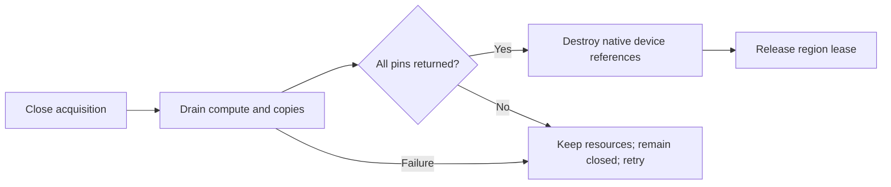

A failed/throwing drain or an outstanding pin retains the executable and lease and leaves acquisition closed. Reentrant binding/retirement callbacks are rejected. Successful detach destroys native resources before releasing the lease; repeated detach is a no-op. Quiesce closes acquisition without itself synchronizing or releasing anything.

Destruction does not implicitly synchronize a backend. Normal coordinated shutdown must call detach. If the binding owner disappears first, queued users must keep their common execution pins until completion; those pins retain both native resources and their leased storage. The executable owns any host dependencies it needs during that interval.

### TDD and validation

The initial stub produced nine failed assertions across eight cases before implementation. The final CPU suite passes **15 cases / 3,097 assertions**. Coverage includes undersized and mismatched grants, absent/misaligned/overflowing addresses, invalid geometry, construction failure/exception, temporary retention when a factory releases the caller handle, reentrancy, quiesce, failed-drain retry, pending pins, destruction order, rebinding, and independent host identity/lifetime.

Two steady-state checks verify 1,000 acquisitions without creating additional region leases or changing arena generation, and 1,000 acquisitions with exactly one total base-address lookup (at bind).

Real CUDA runs pass **16 cases / 3,108 assertions** with UVM disabled and enabled. They reject the ordinary CUDA type, bind the explicit device-local lease, issue real asynchronous H2D/D2H work, and verify completion before native destruction and final lease release. Two virtual devices on the same GPU pass **17 cases / 3,111 assertions**, including wrong-device rejection.

All **17 focused suites** pass in CPU Debug, CUDA Debug, CPU ASan with leak checking, and CPU UBSan. Both UVM modes pass Compute Sanitizer memcheck with zero errors and zero bytes leaked. Strict `-Wall -Wextra -Werror -Wconversion -Wsign-conversion -pedantic` checking passes for the new implementation.

```sh
cmake --build build-device-memory-infra --target test-kv-stream-binding -j 20
ctest --test-dir build-device-memory-infra -R '^test-kv-stream-binding$' --output-on-failure
cmake --build build-device-memory-infra-cuda --target test-kv-stream-binding -j 20
build-device-memory-infra-cuda/bin/test-kv-stream-binding --cuda
GGML_CUDA_ENABLE_UNIFIED_MEMORY=1 build-device-memory-infra-cuda/bin/test-kv-stream-binding --cuda
GGML_CUDA_DEVICES=2 GGML_CUDA_ENABLE_UNIFIED_MEMORY=1 build-device-memory-infra-cuda/bin/test-kv-stream-binding --cuda
GGML_CUDA_ENABLE_UNIFIED_MEMORY=1 compute-sanitizer --tool memcheck --leak-check full --error-exitcode 99 build-device-memory-infra-cuda/bin/test-kv-stream-binding --cuda
```

Explicit `--cuda` is required to execute the hardware portion; the default test uses CPU/fake-native lifecycle fixtures. Repeat memcheck with UVM unset for the other mode. No physical multi-GPU, Windows, TSan, long-context throughput, real host-KV storage, or streamed-attention qualification is claimed here.

Production services and configuration remain untouched. Stage **5.3a**, documented below, adds independent authoritative host storage and pinned-memory lifetime.

## Substage 5.3a: authoritative host storage and strict pinned-memory ownership

Added `src/llama-kv-stream-host.h/.cpp`, the optional CUDA KV-host registry adapters, and dedicated host-owner/backend tests. The owner contains canonical host bytes, not device pool storage or an arena lease. Device-side executables can retain its shared ownership through stage 5.2b without tying host lifetime to an arena generation or device-binding revision.

### Checked storage layout

The owner validates the independent K/V storage/write/attention capability contract before allocation. Context capacity is padded to whole pages with checked arithmetic. Each full-attention execution ordinal has one contiguous K plane followed by an aligned V plane; each layer's stride is aligned separately, including cases where the plane byte counts are not alignment multiples. Aggregate layer storage and alignment additions are overflow-checked.

Creation allocates and zeros the canonical storage span. Import retains an exact-type host buffer and preserves its bytes. Both reject missing/undersized storage and out-of-range address arithmetic; creation also rejects a backend that silently returns a different fallback buffer type.

The allocator request includes at most alignment-minus-one bytes beyond the canonical span so even a host allocator with weaker base alignment can supply aligned planes. `bytes()` reports canonical storage including inter-layer padding, while the backing buffer reports the full allocation. This is host-address alignment slack, not a VRAM safety reserve or a larger device KV pool.

The original context capacity, padded layout, shape, and caller-assigned nonzero cache ID remain with the host owner. Layer lookup returns bounded host pointers without allocating. Raw access is deliberately not yet a dirty-tracking or synchronization API: writes must be serialized against readers/copies until stage 5.3b adds content bookkeeping. Initialization to zero does not mark context tokens logically valid.

### CUDA allocation and registration contracts

The historical runtime at `d873e5db9` uses mapped pinned host allocation, with write-combining omitted under `_WIN32` because mapped write-combined decode writes had faulted under WDDM. The new strict allocator preserves that choice. The existing generic helpers are unchanged: their pageable-allocation fallback and read-only registration policy are not appropriate substitutes for mutable KV backing.

| Storage origin | Admission | Final cleanup |
| --- | --- | --- |
| New CUDA KV backing | `cudaHostAllocMapped`; additionally `cudaHostAllocWriteCombined` outside native Windows | `cudaFreeHost` |
| Caller-owned host buffer | A new writable `cudaHostRegisterMapped` registration; retain the owner | `cudaHostUnregister`, then release owner |
| Buffer view | Borrow bytes and retain the parent through existing GGML view ownership | Release the view/parent reference; do not independently free/unregister |

The private registry hooks are `ggml_backend_cuda_kv_host_buffer_type(int)` and `ggml_backend_cuda_kv_host_buffer_register(int, ggml_backend_buffer_t)`. Their caller-side resolvers verify device and exact buffer-type identity without linking llama to CUDA. Only the native CUDA adapter is enabled; no HIP/MUSA registration behavior is claimed.

Both allocation and registration fail explicitly when pinning is unavailable or `GGML_CUDA_NO_PINNED` is set. They do not use the generic `GGML_CUDA_REGISTER_HOST` opt-in/read-only path, do not fall back to pageable memory, and do not use UVM. A duplicate/existing registration is rejected without adopting or undoing it. Callers must not externally unregister a successful wrapper, and their owner buffer must keep its bytes alive.

Mapping is checked before publication. Host pointers and mapped GPU aliases are not assumed equal: future CUDA kernels must obtain the device alias rather than blindly use a CPU address. Imported storage inherits the caller's cache policy; this adapter does not add a write-combining hint to registration.

CPU tensor-copy callbacks are reused, with buffer base, clear, view, and destruction callbacks adjusted for the allocation/registration owner. Views clear only their bounded spans. Temporary native ownership handles allocation/registration failure cleanup, and successful registrations release their owner only after unregistering.

### Lifetime separation

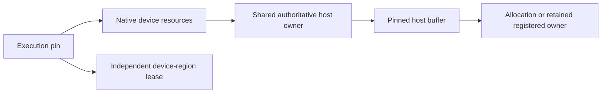

The host owner does not capture a particular device lease. A queued native executable must retain the host owner until completion, just as it retains device storage through the execution guard. The tests exercise pending detach with live pins and final release after completion. No implicit device synchronization is added to the host destructor.

### TDD evidence and limitations

The initial host stub failed 86 assertions; CUDA tests separately failed because the strict allocation/registration hooks did not exist. Final results:

- **8 CPU host-owner cases / 386 assertions**, including all 81 pairs of the nine online KV storage types, invalid/overflowing geometry before allocation, injected null/throwing allocators, exact-type fallback rejection, preserved imported contents, non-page-aligned unequal planes, and device-independent lifetime.
- **9 real-CUDA host-owner cases / 394 assertions**, adding pinned owner integration, registration-adapter import, and retained contents after caller handles are released.
- **5 CUDA backend cases / 44 assertions**, covering actual mapping flags and GPU writes, retained views, duplicate registration/allocation ownership, re-registration after cleanup, and recoverable impossible-size allocation failure. The separate disabled-pinning process also passes.
- All **18 focused CPU suites** pass in Debug, ASan with leak checking, and UBSan. All **22 selected CUDA-build suites** pass, including both new pinning modes and the existing device-local/UVM allocator tests.
- Compute Sanitizer reports zero errors and zero bytes leaked for both the backend and host-owner hardware suites. API-error reporting is disabled only for the backend suite's deliberate OOM/duplicate-registration calls; memory-error and leak detection remain active.
- All four CPU-referenced CUDA SCALE cases pass. Strict warning checking passes for the host-owner implementation.

```sh
cmake --build build-device-memory-infra --target test-kv-stream-host -j 20
ctest --test-dir build-device-memory-infra -R '^test-kv-stream-host$' --output-on-failure
cmake --build build-device-memory-infra-cuda --target test-kv-stream-host test-cuda-kv-host -j 20
ctest --test-dir build-device-memory-infra-cuda -R '^test-cuda-kv-host' --output-on-failure
build-device-memory-infra-cuda/bin/test-kv-stream-host --cuda
compute-sanitizer --tool memcheck --leak-check full --report-api-errors no --error-exitcode 99 build-device-memory-infra-cuda/bin/test-cuda-kv-host
compute-sanitizer --tool memcheck --leak-check full --error-exitcode 99 build-device-memory-infra-cuda/bin/test-kv-stream-host --cuda
```

The 81-pair tests validate storage geometry, not execution of 81 attention kernels. Native Windows flag selection is preserved and the hardware test has a Windows-specific expectation, but Windows execution was unavailable. Physical multi-GPU, HIP/MUSA/SYCL/Vulkan mapping, TSan, and long-context performance are not qualified here.

Production services, models, and compose configuration remain unchanged. Stage **5.3b**, documented below, adds writes, dirty rows, mutable tails, and content generations with synchronized mirror updates.

## Substage 5.3b: encoded writes, dirty rows, and content generations

Added `src/llama-kv-stream-content.h/.cpp` and `tests/test-kv-stream-content.cpp`. This is a correctness-first coherence layer over the independent host owner and coarse device binding. It does not add SET_ROWS kernels, graph construction, streamed attention, or asynchronous prefetch.

The reviewed reference distinguishes tracked dirty rows from full invalidation: its direct host set/memset/clear callbacks reset resident metadata and advance the runtime generation. The new layer preserves that distinction while separating content identity from arena placement. Explicit encoded writes dirty only intersecting rows; external restores/replacement invalidate the whole mirror.

### Transactional encoded writes

A write span selects a layer, K or V, and a byte range in that encoded plane. The API neither quantizes floating-point inputs nor interprets partial quant blocks as complete values. It bounds every range against the validated plane layout.

`prepare()` validates the entire batch and snapshots all sources before mutation, including sources aliasing the destination cache. The move-only ticket retains its originating state and content generation. Invalid batches/allocation failures preserve an existing output ticket. Cancellation or destruction releases the snapshot without changing host bytes.

`commit()` rejects cancelled, foreign, or stale tickets. A valid batch applies overlapping patches in input order and advances content generation once. Every token row intersecting a changed byte becomes dirty in that layer/plane; a row includes all KV heads. K and V have independently derived encoded row sizes. Empty batches are no-ops. Large checkpoint restores must use bounded batches because staging duplicates the submitted encoded payload.

Only one tracker may be the mutation authority for a backing allocation. Independent trackers over aliased host bytes are not coherent. Raw writes through existing host pointers must be externally serialized and reported through `invalidate()`; zero-filled storage and dirty marks do not establish logical token validity.

### Compact mirror bookkeeping

The bitmap stores one dirty bit per token row per K/V plane. For 16 attention layers at 262,144 padded tokens this is 1 MiB, rather than a per-row 64-bit generation table. Initial rows are dirty until explicitly copied. Partial-page selections do not force uploads of unrelated rows or another plane.

Updates handle partial first/last bitmap words and skip clean/full words when finding dirty runs. The implementation does not allocate an arena region or a bitmap entry for each page operation. There is still a bitmap scan over requested ranges; no steady-state speedup is claimed without the later runtime benchmarks.

| Event | Content generation | Mirror epoch | Effect |
| --- | --- | --- | --- |
| Committed nonempty encoded batch | Advance | Unchanged | Dirty intersecting K/V rows |
| External completed host change: `invalidate()` | Advance | Unchanged | Dirty all rows; supersede pending writes |
| Replace backing, even with the same cache ID | Advance | Advance | Prepare fresh bitmap, preserve supplied bytes, reject old tickets |
| Device rebind/repartition: `reset_mirror()` | Unchanged | Advance | Dirty all rows; pending host writes remain valid |

These counters are independent of arena generations and binding revisions. Counter exhaustion is rejected rather than wrapped. Replacement prepares metadata before publication and releases old backing after the new metadata is consistent.

The tracker represents one logical mirror, not arbitrary ring-slot/page-location coherence. A caller must reset it on every relevant device mapping change, even if pointer values or arena generations match. If replacement changes geometry, the caller must also rebuild or validate the device mapping; replacing a host object does not make an old destination layout compatible. Ring-slot identity and event ordering remain responsibilities of later runtime stages.

### Synchronized mirror update baseline

`flush()` validates all requested ranges before copying and emits contiguous dirty source runs only. The callback receives layer/plane coordinates, source bytes, cache ID, content generation, and mirror epoch. Destination mapping belongs to the adapter. Overlapping requested ranges may repeat copies; callers should supply disjoint ranges when that duplication is unnecessary.

Tracked writes, replacement, invalidation, and reentrant flush are blocked during callbacks. Every callback must finish all accesses before returning or throwing, including its failure path. The actual CUDA test uses synchronous GGML tensor writes. An asynchronous callback that merely enqueues DMA would violate this interface; asynchronous readiness/consumption comes later.

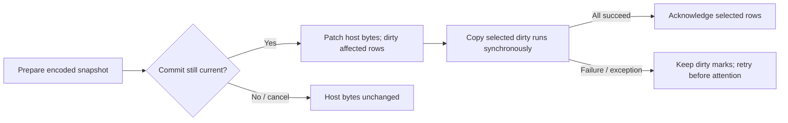

Acknowledgement occurs only after all requested copies succeed. Partial device writes can occur before failure, but all relevant dirty marks are retained; those ranges must not be consumed as a valid mirror until retry succeeds. Readiness does not replace the coordinator's global admission gate. The caller must retain host/device dependencies for any other in-flight compute or mapped-host access.

### TDD and validation

The initial ten cases failed 25 assertions against stubs. The final suite has **14 CPU cases / 150,480 assertions** and **15 real-CUDA cases / 150,503 assertions**.

Coverage includes partial rows across page boundaries, K/V independence, cancelled/moved/stale/foreign tickets, invalid-batch atomicity, aliasing/overlapping writes, empty ranges, same-ID and same-backing replacement/restoration, copy failure/exception, reentrancy, and retained ownership after the tracker owner disappears. An independent row-by-row oracle checks 136 write/flush cycles across four planes and 136 padded rows, including 64-bit word boundaries and failed-copy retries. All 81 online K/V pairs use independent GGML row-size expectations for encoded copy lengths; this is byte-coherence testing, not 81 attention-kernel or model-quality tests.

The CUDA test allocates pinned authoritative host storage and a real device-local arena region, binds it through stage 5.2b, and holds an execution pin across the copies. It compares all canonical bytes after a partial-row patch and after an external restore with unchanged arena generation and binding revision. This is a flat leased test mirror; production resident/ring plane placement and attention integration remain stage 5.4a and later.

All **19 focused suites** pass in CPU Debug, CUDA Debug, CPU ASan/leak checking, and CPU UBSan. Compute Sanitizer reports **zero errors and zero bytes leaked** for the CUDA test with UVM disabled and enabled. Strict warning checking passes for the implementation.

```sh
cmake --build build-device-memory-infra --target test-kv-stream-content -j 20
ctest --test-dir build-device-memory-infra -R '^test-kv-stream-content$' --output-on-failure
cmake --build build-device-memory-infra-cuda --target test-kv-stream-content -j 20
build-device-memory-infra-cuda/bin/test-kv-stream-content --cuda
GGML_CUDA_ENABLE_UNIFIED_MEMORY=1 build-device-memory-infra-cuda/bin/test-kv-stream-content --cuda
compute-sanitizer --tool memcheck --leak-check full --error-exitcode 99 build-device-memory-infra-cuda/bin/test-kv-stream-content --cuda
```

No Windows, physical multi-GPU, TSan, asynchronous event ordering, model-output accuracy, or throughput qualification is claimed by this stage. Production services/configuration and existing checkpoint/cache data remain unchanged.

Stage **5.4a**, documented below, adds resident planes and ordinary all-resident attention before the 5.3c write optimization, following the roadmap's explicit dependency order.

## Substage 5.4a: leased resident planes and ordinary attention

Added `src/llama-kv-stream-resident.h/.cpp` and `tests/test-kv-stream-resident.cpp`. This native resource object is created through the stage-5.2b binding factory and retains the stage-5.3b content owner. It provides ordinary `GGML_OP_FLASH_ATTN_EXT` nodes over policy-derived resident K/V views. No new attention kernel or production dispatch path is introduced.

The reviewed reference at `d873e5db9` keeps the ring at the front of the pool, computes each resident layer's base from its capacity, and uses token-major head strides. When all required chunks are resident, it avoids streamed partial-attention work. This stage reproduces those storage and ordinary-dispatch properties with leased memory rather than allocating a second KV pool.

### Exact plane binding

The factory checks the cache ID, shape, layer count, fixed budget, backend buffer compatibility, and direct-attention policy. It materializes the initial resident/ring layout from 5.1b. Each layer's K/V offsets come from that layout, including the reserved ring and capacity-sized K plane; they are not copied from the host allocation's layer stride or current live length.

The backing tensors are flat typed roots. This matters for CUDA: allocating a quantized root whose first dimension is merely the head dimension can request additional matrix-row padding. Flat roots naturally satisfy the relevant padding for the supported page geometry. The adapter verifies that the backend's allocation size equals the exact plane size before binding, so it cannot silently consume bytes from V, the next layer, or scratch.

The roots borrow the leased buffer. Graph views expose `[head_dim, padded_keys, kv_heads, 1]` with token stride equal to all heads' encoded row bytes and head stride equal to one encoded row. K and V sizes/strides are independent. The factory constructs only metadata and borrowed bindings; it does not upload, clear, or allocate KV device storage.

### Synchronization and ordinary dispatch

`synchronize(active_tokens)` rejects zero/out-of-host-capacity contexts and any extent whose padded keys exceed a resident plane. It currently uses 256-key padding and requires compatible page geometry. No adaptive repartition or partial-resident fallback is attempted.

Before overwriting resident inputs it synchronizes the backend. On first use it resets mirror bookkeeping, then flushes only dirty runs through synchronous GGML tensor writes into the correct K/V roots. Upload byte/call counters report completed transfers for that attempt. Clean repeated synchronization uploads zero bytes. A changed V row refreshes only that row, not the full page or K plane.

Readiness requires successful synchronization for the requested active length and matching content generation/mirror epoch. Failed validation or copy leaves readiness closed; copy exceptions propagate with admission restored and dirty marks retained for retry. Compatible replacement can refresh existing roots; changed encoding/geometry requires a new binding and is rejected.

`attention()` validates stack descriptors before calling GGML constructors, so malformed Q/mask metadata is rejected before asserting constructors run. It checks the generic attention contract and the actual backend's ordinary attention support, then creates leased K/V views and a standard Flash Attention node. Q, mask, and output workspace remain caller-owned.

The initial interface uses F32 queries, a finite positive scale, no sinks/ALiBi/softcap arguments, and one sequence. A supplied mask must hide padded/future keys; no-mask attention is accepted only when the active length needs no padding. This adapter checks mask metadata, not the device-resident mask values. The caller must gate execution on readiness for the graph's active extent.

Conversion-only configurations, contexts needing streamed pages, and unsupported native type pairs are rejected. They are not silently routed to an unimplemented fallback. Conversion/streamed partial attention remains in its later substages.

### Ownership and graph lifetime

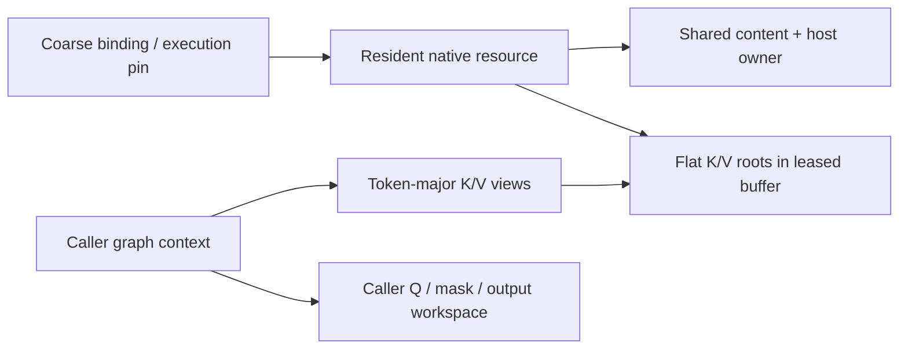

The backend must outlive these native resources. External graphs, including captures, must hold a binding execution pin for their entire usable lifetime and retire their native captures before returning that pin. A separate CUDA executor guard in the tests retains the same lease and retires its graph entries before graph metadata is freed. The outer binding cannot destroy resident roots while an external graph pin remains outstanding.

This is still an owner-thread-only, single-logical-mirror adapter. It is not an automatic scheduler of host mutations, multiple mirrors, graph rebuilds, or producer dependencies. New SET_ROWS producers and server graph integration must respect the existing synchronization and admission contracts.

### TDD and numerical evidence

An ordinary head-major attention control first passed an independent scalar causal-softmax oracle. The resident tests then failed against stubs. Final results are **12 CPU cases / 131 assertions** and **13 CUDA cases / 245 assertions**.

The oracle dequantizes the actual encoded cache values and computes scores/softmax in double precision. It does not assume that quantization preserved the original floats. The same-backend ordinary head-major allocation and leased token-major paths are each compared with this oracle using a maximum absolute error threshold of 1e-3.

Coverage includes:

- F16 CPU/CUDA decode and prefill with 1, 8, 33, and 257 queries, causal masks, GQA, and different attention layers.
- 129/257-token contexts and 769 active tokens padded to 1,024 keys, exactly filling resident capacity.
- CUDA Q8_0/Q4_0, Q4_0/Q8_0, and Q5_1/Q4_1 pairs through ordinary and resident paths.
- Exact policy offsets, no extra quant-root padding, and untouched ring bytes.
- Dirty-tail numerical changes, one-row V upload accounting, and zero-byte clean refresh.
- Copy-exception retry, smaller-context replacement without rebinding, mirror reset, stale geometry, malformed queries/masks, insufficient residency, and conversion rejection.
- External graph pins preventing native destruction and three repeated CUDA dispatches per numerical evaluation through the executor guard.

All **20 focused suites** pass in CPU Debug, CUDA Debug, CPU ASan/leak checking, and CPU UBSan. Compute Sanitizer reports **zero errors and zero bytes leaked** with UVM disabled and enabled. Strict warning checking passes for the new implementation.

The experimental CUDA build originally had `GGML_CUDA_FA_ALL_QUANTS=OFF`, which makes ordinary CUDA attention reject mixed K/V types. It was rebuilt with that option enabled for these tests. This reuses existing CUDA support; it is not a new mixed-quant kernel implementation and did not change production images or flags.

```sh
cmake --build build-device-memory-infra --target test-kv-stream-resident -j 20
ctest --test-dir build-device-memory-infra -R '^test-kv-stream-resident$' --output-on-failure
cmake -S . -B build-device-memory-infra-cuda -DGGML_CUDA_FA_ALL_QUANTS=ON
cmake --build build-device-memory-infra-cuda --target test-kv-stream-resident -j 20
build-device-memory-infra-cuda/bin/test-kv-stream-resident --cuda
GGML_CUDA_ENABLE_UNIFIED_MEMORY=1 build-device-memory-infra-cuda/bin/test-kv-stream-resident --cuda
compute-sanitizer --tool memcheck --leak-check full --error-exitcode 99 build-device-memory-infra-cuda/bin/test-kv-stream-resident --cuda
```

This establishes the first milestone-5 implementation checkpoint for the tested scope: authoritative host state, leased resident mirrors, and correct ordinary all-resident attention execution. It does not establish whole-model quality, long-context throughput, Windows/physical multi-GPU support, or all quant/backend combinations. The CLI/server remains unchanged; streamed attention and asynchronous overlap are not enabled.

Stage **5.3c**, documented below, adds bounded batched SET_ROWS/write staging after capturing the required ff4d3bdef baseline. No new checkpoint branch is created automatically.

## Substage 5.3c: bounded batched SET_ROWS production

Added `src/llama-kv-stream-writer.h/.cpp`, resident writer configuration/publication methods, generated transactional payload support, and `tests/test-kv-stream-writer.cpp`. No CUDA quantization kernel was modified.

The production reference at `d873e5db9` quantizes a consecutive row range into GPU scratch, then copies the encoded batch to authoritative host storage and, when available, its resident mirror. The new implementation uses ordinary `GGML_OP_SET_ROWS` with relative indices `0..tile_rows-1` to achieve that contiguous staging without a new destination-base variant of the quantization kernel. The host/resident destination offset is applied separately.

### Frozen baseline before library changes

A benchmark harness was added and run against committed library code **ff4d3bdef**, before changing `src/` or GGML library code. Both controls use the same ordinary GPU SET_ROWS quantization:

- Coalesced control: one encoded D2H download, existing content prepare/commit, then resident H2D refresh.
- Row-wise control: one D2H download per encoded row, followed by the same batched host commit and coalesced resident refresh.

This is a synthetic K-plane producer benchmark, not a model prefill/decode benchmark. Fixed parameters: RTX 5070 Ti, F32 source already on GPU, head dimension 256, four KV heads, Q8_0 K / Q4_0 V, one cache layer, context capacity 1,024, pool **6,815,744 bytes**, UVM disabled, CUDA FA all-quants test build enabled. Each mode uses 10 warmups and 100 measured calls; source pointer and shape remain stable. Setup, initial input/index uploads, graph construction warmup, and producer-source changes are excluded. Production was not stopped, so these are indicative local timings, not isolated latency guarantees.

Frozen ff4d3bdef results, in microseconds:

| Rows | Encoded bytes | Coalesced median / p95 | Row-wise median / p95 |
| --- | --- | --- | --- |
| 32 | 34,816 | 35.844 / 44.649 | 168.303 / 191.261 |
| 256 | 278,528 | 78.674 / 92.751 | 1,174.280 / 1,240.520 |
| 512 | 557,056 | 135.893 / 150.588 | 2,342.680 / 2,408.150 |

These controls transferred the encoded byte count once D2H and once H2D. Row-wise D2H call counts were 32/256/512; coalesced D2H and H2D each used one call.

### Scratch, source, and cache contracts

`configure_writes(max_batch_rows)` takes the caller's physical micro-batch ceiling (for example, ub), not a hardcoded 256-row limit. It places encoded scratch and aligned I64 relative indices in the already-leased unused ring region. Actual backend quantized allocation padding is included when choosing capacity. If the configured batch is larger than the ring tile capacity, generation uses multiple tiles; it never enlarges the device pool.

The initial writer admits completed dense F32 `[head_dim * heads, rows]` sources and consecutive destination rows within both host and resident capacity. It rejects wrong devices/layouts, oversized batches, invalid layer/operand/ranges, and unsupported SET_ROWS dispatch. Sparse/duplicate indices, F16 sources, and writes beyond resident capacity are not silently reinterpreted as this fast path; callers must retain a supported baseline or later adapter path.

Each source is represented by an independent data-only leaf alias. Building the quantization graph must not traverse and recompute the original model graph. A regression test gives the completed source producer metadata and verifies that its existing values are used unchanged.

One cached writer graph bounds metadata and retained-source ownership. Shape/type/source changes replace that graph rather than accumulating variants. `release_write_workspace()` retires it and releases its retained input buffer before a future phase transition reclaims prefill workspace. It does not free the KV pool. Callers must coordinate any source-workspace leases and invoke this hook while quiescent; this stage is not yet registered with the phase-transition/server graph consumer.

Reported device scratch covers encoded staging plus relative indices. The private host payload is bounded by the configured physical batch and encoded row size. Source activation storage, metadata, CUDA graph/driver allocations, and the authoritative cache are separate from those counters. The test source/control buffers are present in all benchmark modes. No VRAM safety reserve or additional KV device allocation is introduced.

### Ordered production and atomic host publication

`prepare_generated()` shares the existing transaction validation and ownership machinery, but lets a synchronous producer fill private ticket bytes directly. Input data pointers must be null. Failure preserves existing tickets and authoritative host bytes; cancellation discards the generated payload.

For each tile, SET_ROWS, D2H download, and D2D resident publication are ordered on the existing backend stream. The tile drains before scratch reuse and before the generated callback can return. The API therefore remains synchronous even though its copy submissions use async backend calls. This does not implement a dedicated copy stream, cross-layer lookahead, or the later producer/consumer event pipeline.

The host payload is cacheable transaction storage, followed by a CPU copy at commit. Unlike the reference's direct D2H into authoritative host bytes, this retains the 5.3b atomic/cancellable host-publication contract. No redundant H2D refresh is needed for rows already published D2D.

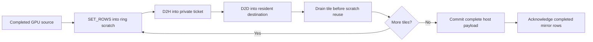

D2D writes are speculative until the complete host batch commits. If a later tile fails, all queued accesses are drained before the private payload is freed. Host bytes remain unchanged before commit, resident readiness stays closed, and mirror bookkeeping is invalidated so the next synchronization restores canonical bytes. If mirror invalidation cannot advance its epoch, the resident object stays poisoned and requires rebinding. Post-commit acknowledgement failure also leaves the mirror invalid rather than admitting stale attention.

The caller holds a binding pin and source ownership until return, then calls `synchronize(active_tokens)` before attention. Other dirty/padded rows can still require synchronization uploads; zero H2D applies to the completed D2D row ranges, not every possible cache state. Failure counters are diagnostic, not a complete hardware trace of partially submitted operations.

### Measured optimization and regression check

The first staged version improved 256/512-row writes but was about 5% slower at 32 rows. Removing an upfront drain reduced that overhead, but a small difference remained. The final refinement queues the quantization and both transfers behind one tile completion wait. A queued-reader test confirms that earlier backend work reads old resident values before they are overwritten.

Post-refinement measurements, same parameters, in microseconds:

| Rows | Coalesced median / p95 | Staged median / p95 | Interpretation |
| --- | --- | --- | --- |
| 32 | 35.835 / 42.798 | 35.417 / 36.656 | Roughly equal at this scale |
| 256 | 78.372 / 85.047 | 67.769 / 71.013 | About 14% lower median |
| 512 | 135.248 / 147.735 | 125.124 / 128.811 | About 7-8% lower median |

The contemporaneous row-wise medians were 167.558, 1,176.490, and 2,345.490 microseconds. Staged calls in this ample-ring benchmark used one quantization graph submission, one D2H copy, one D2D copy, and **zero H2D refresh bytes/calls**. A tight ring can require multiple tiles and submissions. Counts describe explicit encoded transfers, not driver-internal PCIe packets or UVM migrations.

The existing coalesced control remained close to its frozen baseline. These figures do not establish full-model prefill gains, cold/source-changing graph costs, every quant's performance, or improvement at every batch size.

### TDD and qualification

The original producer control passed before new library code was added. Generated-ticket and staged-writer tests then failed against stubs. Final results: **10 CPU cases / 607 assertions** and **10 CUDA cases / 609 assertions**.

Coverage includes all nine online destination encodings across six K/V pairs, both planes, and batches of 1, 7, 256, 257, and 512 rows; encoded output is compared byte-for-byte with ordinary SET_ROWS on the same backend. Tests also cover scratch bounds/reuse, smaller final tiles, invalid input/configuration, content-generation preservation, queued-reader ordering, source-graph isolation, and explicit cached-source release.

A failure injected after the second tile's real copy verifies that queued DMA completes before ticket teardown, host data stays unchanged, and the mirror is restored from canonical bytes before retry. The CPU test targets its actual host-copy callback; the CUDA test targets the queued native copy hook.

All **21 focused suites** pass in CPU/CUDA Debug and CPU ASan/leak checking/UBSan. CUDA memcheck reports **zero errors and zero bytes leaked** with UVM disabled and enabled. Strict warning checking passes for the writer, resident adapter, and content implementation. No quantization kernel or ordinary SET_ROWS operator was changed.

```sh
cmake --build build-device-memory-infra --target test-kv-stream-writer -j 20
ctest --test-dir build-device-memory-infra -R '^test-kv-stream-writer$' --output-on-failure
cmake --build build-device-memory-infra-cuda --target test-kv-stream-writer -j 20
build-device-memory-infra-cuda/bin/test-kv-stream-writer --cuda
env -u GGML_CUDA_ENABLE_UNIFIED_MEMORY build-device-memory-infra-cuda/bin/test-kv-stream-writer --bench
compute-sanitizer --tool memcheck --leak-check full --error-exitcode 99 build-device-memory-infra-cuda/bin/test-kv-stream-writer --cuda
```

`--bench-baseline` runs only the row-wise/coalesced controls; `--bench` includes the staged implementation. The frozen measurements above preserve the pre-change reference independently of later recompilation.

This remains a synchronous, test-only producer boundary, not an in-graph SET_ROWS interception or server integration. The caller must provide completed activation tensors; invoking this nested graph executor inside an active backend capture is not supported. Native Windows, other accelerator backends, physical multi-GPU, TSan, and full-model throughput are unqualified. Producer encoding coverage does not imply native attention support for every tested type.

Production services, model/checkpoint/cache data, and compose configuration remain unchanged. Stage **5.4b**, documented below, adds the partial-result and stable merge contract before streamed device integration.

## Substage 5.4b: common partial-attention result and stable merge contract

Added `ggml/src/ggml-kv-stream-partial.h/.cpp` and `tests/test-kv-stream-partial.cpp`. The common GGML layer now defines checked partial-result layout, a host-readable representation, and CPU reference merge/normalization. It does not launch a partial-attention or merge kernel.

### Production reference audit

The reviewed production code is `d873e5db9`: `kv_stream_accumulate_chunk_results`, `kv_stream_normalize_chunk_results`, the vector partial exporter, and the MMA partial exporter. Their representation is an **unnormalized** weighted-value vector plus a maximum and normalization sum, not a normalized attention output for each block.

The older `src/llama-kv-stream-softmax.cpp` helper was also inspected, but not treated as the production implementation. In particular, it rejects empty contributions and does not check every FP32 narrowing result. The new reference explicitly defines those cases.

The CUDA vector kernel divides by its sum and omits partial metadata when its split grid dimension is one. The reference caller restricts vector splits to 2/4/8/16. A future adapter must not feed that single-split ordinary output into this merge contract. The MMA exporter has a distinct explicit partial-output mode and can produce one partial. **One part is valid in the common representation; it is not proof that every kernel exports a partial with a one-split launch.**

Both reviewed producer paths and the production merge use natural-exponential rescaling. Any backend using a different internal exponent convention must convert/export consistent metadata.

### Packed layout and meaning

For each logical row and disjoint contribution, the producer exports:

```text
m = local maximum in the score's natural-exponential coordinates
L = sum(exp(score - m))
U = sum(exp(score - m) * V)       # unnormalized vector
```

Scores must already include the appropriate scale, causal/padding masks, and supported bias/softcap treatment. The merge cannot infer missing masks or detect duplicated/missing KV contributions. Producers must agree on row identity and supply the intended disjoint coverage.

| Plane | Index | Representation |
| --- | --- | --- |
| Numerator | `(row * parts + part) * width + channel` | FP32 |
| Metadata | `row * parts + part` | `max_logit`, `normalizer`: two FP32 values |
| Merged accumulator | Same indexing with `parts = 1` | Still unnormalized |
| Final value | `row * width + channel` | Normalize only after accumulation |

For ordinary single-sequence GGML attention, `row = query * query_heads + head`. The metadata record is eight bytes with eight-byte alignment; size, alignment, and field offsets were checked against the installed CUDA 13.0 `float2` header.

The layout helper checks dimensions, products, alignment rounding, and metadata-tail addition before publishing offsets. Metadata follows the numerator plane at the requested power-of-two alignment, at least eight bytes. Raw views can point to separate planes and provide larger capacities, but only the declared prefix is read. Null, short, misaligned, and address-wrapping views are rejected before dereferencing. These checks do not prove that arbitrary caller-supplied pointers are readable, that device launch dimensions fit a particular kernel, or that the memory is actually allocated.

### Stable accumulation and empty rows

Choose M from **nonempty** contributions, then compute:

```text
M = max(m_i)
L = sum(exp(m_i - M) * L_i)
U = sum(exp(m_i - M) * U_i)
output = U / L
```

The same weights rescale both numerator and denominator. Averaging separately normalized block outputs loses their relative mass and is incorrect, especially for unequal blocks.

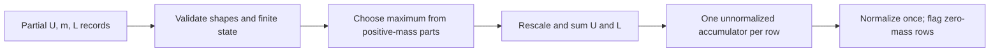

Zero mass is an identity only when its numerator is zero. Finite or negative-infinity empty maxima are accepted, including the reference CUDA finite sentinels, but ignored during maximum selection. Merged empty rows are canonicalized to negative-infinity maximum, zero mass, and zero numerator. This avoids both an empty sentinel dominating a real negative-logit block and `-infinity - -infinity`.

Normalization requires a one-part accumulator. An all-empty/all-masked row produces zero values and an explicit empty flag, rather than dividing zero by zero. A valid zero-valued attention result has the flag clear. This is the new contract's explicit empty-row policy; equivalence to ordinary GGML attention is tested on rows with visible keys, not by assuming ordinary all-masked behavior.

Nonempty metadata and all numerators must be finite, with positive mass. NaN/infinite/negative mass, invalid maxima, and inconsistent empty numerators are rejected with input/row/part diagnostics. FP64 reference intermediates are checked before FP32 publication; representational overflow is rejected even if a final normalized quotient could otherwise be finite. Underflow is allowed. This is a high-precision host reference, not a claim of bitwise equivalence to FP32 GPU summation or every floating-point environment.

Merge inputs may have different part counts but must share row/value dimensions. A previously merged accumulator can be included in the next merge. Temporary outputs make merge and normalization alias-safe and failure-atomic, including failure after some rows have been computed. The CPU reference allocates host vectors and validates payloads; it is not intended as the GPU hot path.

### TDD and validation

The initial stub failed 199 assertions before implementation. The final suite passes **13 cases / 48,614 assertions**:

- 160 partition configurations across row counts 1/6, token counts 1/7/33/257, and value widths 1/7/64/256, including unequal chunks, explicit empty chunks, causal tails, and fully masked rows.
- Independent unsplit stable-softmax comparison, and a separately executed ordinary GGML F16 attention graph checking query/head output order.
- Reverse/hierarchical merging with accumulator aliasing, plus 1,024 incremental block merges over 4,096 tokens.
- Extreme finite maxima, positive subnormal mass, valid zero results, canonical empty rows, and FP32 publication overflow.
- Checked byte/alignment overflow, prefix capacities, malformed raw views/partials, normalization preconditions, and unchanged output payloads on failure.

Pure reference comparisons use a 2e-5 absolute tolerance; the long incremental FP32-publication case uses 1e-4. The ordinary GGML attention comparison uses 1e-3 to account for its arithmetic path.

All **22 focused suites** pass in CPU Debug, CUDA Debug, CPU ASan/leak checking, and CPU UBSan. Strict warning checking passes for the new common implementation. Existing real-CUDA resident attention regressions pass (**13 cases / 245 assertions**), as do all four CPU-referenced CUDA SCALE cases. The CUDA-header ABI check is a compile-time layout check, not execution of a new partial kernel.

```sh
cmake --build build-device-memory-infra --target test-kv-stream-partial -j 20
ctest --test-dir build-device-memory-infra -R '^test-kv-stream-partial$' --output-on-failure
cmake --build build-device-memory-infra-cuda --target test-kv-stream-partial test-kv-stream-resident test-backend-ops -j 20
build-device-memory-infra-cuda/bin/test-kv-stream-partial
build-device-memory-infra-cuda/bin/test-kv-stream-resident --cuda
build-device-memory-infra-cuda/bin/test-backend-ops test -b CUDA0 -o SCALE
```

No new GPU partial/merge execution, GPU overflow diagnostics, asynchronous event ordering, Windows/other accelerator runtime support, TSan, or model throughput/quality qualification is claimed here. Later kernels must implement and test this contract rather than blindly copy the old unguarded empty-row division.

Production services, model/checkpoint/cache data, and compose configuration remain unchanged. Stage **5.4c**, documented below, integrates one explicitly staged block with ordered copy/compute.

## Substage 5.4c: one staged block and CUDA partial/merge execution

**Status:** committed at `28e7999a0`, following 5.4b (`6db00070d`). It is an opt-in consumer method, not server enablement or a throughput optimization.

### Execution and ownership

`llama_kv_stream_resident::compute_one_block` computes attention over a resident prefix and one nonresident tail block. It does not change the ordinary all-resident attention path or allocate a second full KV cache.

1. Validate both attention descriptions, the complete mask row pitch, tensor bounds, and workspace/pool aliases.
2. Refresh dirty resident rows through the existing content owner. Retire the cached writer before reusing its ring scratch.
3. Export resident-prefix partials with the existing CUDA F16 vector kernel.
4. Copy the live host tail into one bounded packed K/V block at the start of the ring. Zero padded rows so stale NaNs cannot contaminate masked attention.
5. Export tail partials with the same kernel and the correctly offset, row-strided causal mask.
6. Rescale and merge on the GPU; normalize once. Publish the staged result only after validation succeeds.

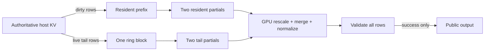

The caller holds the binding execution pin and keeps Q, mask, and output alive. The method retains a separate caller-owned partial-workspace lease until all operations complete. The registry extension is backend-neutral; its v1 CUDA adapter is synchronous and must be called outside active capture. Layout/numerical rejection returns false; CUDA execution errors retain the backend's existing error handling.

The ring contains only one staged KV block in this stage. Partial exports, normalized staging output, and the validation flag use a separate explicit device-local lease. This preserves a one-slot minimum ring and makes partial scratch part of caller budgeting, rather than hiding allocations in the CUDA pool. For four rows of width 256, the exact workspace is 20,740 bytes. The common layout helper checks dimensions, alignment, additions, and products before publishing offsets.

The authoritative host tail is uploaded on every call; it is not marked as persistent resident content. This handles updates to the last token without stale ring reuse. Upload statistics count actual host K/V payload bytes, excluding zero fills, merge traffic, and the four-byte validation readback.

### Native kernel integration and numerical contract

The adapter reuses `flash_attn_ext_vec<256,1,F16,F16,false>` with two splits for each range. Split count one is deliberately avoided because it produces already-normalized output. The two exported planes retain the 5.4b row/part/channel layout, and the metadata record is checked against CUDA's `float2`.

One detail found during integration: the native kernel shifts its maximum by `FATTN_KQ_MAX_OFFSET`. It is a valid exponential reference coordinate, not necessarily the literal maximum score. Numerator and normalizer use the same shift, so the existing stable merge remains correct; tests compare actual exported device partials with the CPU merge/normalization reference.

The correctness-first GPU merge uses FP64 intermediates across four contributions. It handles empty/all-masked rows as zero, ignores empty maxima when selecting the common reference, and checks malformed metadata, nonfinite numerators, inconsistent empty parts, and FP32 publication overflow. A separate normalized staging plane prevents partial public-output writes when a later row fails. This baseline intentionally includes synchronization and a four-byte device-to-host validation result; it makes no performance claim.

### TDD and validation

The initial stubs failed ten assertions while the ordinary attention control passed. Additional adversarial tests then exposed a full-mask row-pitch validation gap; the regression test failed before the validation was corrected.

The final real-CUDA suite passes **8 cases / 126 assertions**:

- One-slot ring with 256- and 512-token resident prefixes; tails of 1, 255, and 256 live tokens; query batches of 1, 8, 33, and 257.
- Independent scalar attention comparison, plus CPU merging of the actual GPU-exported partials.
- Exact-sized workspace at a nonzero parent offset; rejection of one-byte-short scratch, pool aliases, output/input aliases, unsupported quant pairs, extra tail blocks, oversized metadata, and malformed mask pitch.
- Fully masked output, initially NaN-filled ring storage, mutable last-row refresh, and exact live-tail upload counts.
- GPU merge rejection after earlier rows have been computed: invalid mass/maxima/numerators, inconsistent empty records, accumulation overflow, normalization overflow, and unchanged public output. Empty sentinels with large maxima do not dominate valid negative-score contributions.

All **23 focused suites** pass in CPU Debug, CUDA Debug, CPU ASan with leak checking, and CPU UBSan. Existing real-CUDA resident attention passes **13 cases / 245 assertions**, and the four CPU-referenced CUDA SCALE cases pass. Compute Sanitizer memcheck reports **zero errors and zero leaked bytes** for the expanded block suite with UVM disabled and enabled. The new CUDA translation unit also compiles with flash attention disabled; the optional getter returns null in that configuration. That is a translation-unit compatibility check, not a separate full no-FA build/runtime qualification.

```sh
cmake --build build-device-memory-infra-cuda --target test-kv-stream-block test-kv-stream-resident test-backend-ops -j 20
build-device-memory-infra-cuda/bin/test-kv-stream-block --cuda
build-device-memory-infra-cuda/bin/test-kv-stream-resident --cuda
build-device-memory-infra-cuda/bin/test-backend-ops test -b CUDA0 -o SCALE
env -u GGML_CUDA_ENABLE_UNIFIED_MEMORY compute-sanitizer --tool memcheck --leak-check full --error-exitcode 99 build-device-memory-infra-cuda/bin/test-kv-stream-block --cuda
GGML_CUDA_ENABLE_UNIFIED_MEMORY=1 compute-sanitizer --tool memcheck --leak-check full --error-exitcode 99 build-device-memory-infra-cuda/bin/test-kv-stream-block --cuda
```

### Deliberate boundary

This adapter supports F16/F16 K/V, F32 Q/output, head size 256, one sequence, a supplied padded mask, and no attention sinks, bias, or softcap. Other pairs are rejected, not silently converted. Generic quant dispatch remains **5.4e**. No ROCm/SYCL/OpenCL/Vulkan adapter, asynchronous overlap, multi-block traversal, capture integration, model benchmark, or production-server enablement is claimed.

Production services, model/checkpoint/cache data, and compose configuration remain unchanged. Stage **5.4d**, documented below, extends this baseline to bounded multi-block traversal.

## Substage 5.4d: bounded multi-block traversal and incremental accumulation

**Status:** committed at `59591b6da`, following 5.4c (`28e7999a0`).

### Bounded storage and ordered execution

`compute_streamed` traverses any number of nonresident blocks. It uses the selected layer's actual capacity, rounded active extent, and the existing policy's ring slot count. A layer can be fully resident, partially resident, or entirely streamed. The earlier `compute_one_block` remains a narrow admission wrapper over this implementation.

Ring storage now follows the complete policy-derived planes: all K slots first, then the aligned V plane. Slot `i` selects `i * page.k_bytes` in K and `ring.v_offset + i * page.v_bytes` in V. It does not treat each slot as a packed K+V record; this preserves contiguous same-operand storage for later batched copies.

Blocks use `block_index % ring_slots`. Each native attention call completes all query work before returning, and each intermediate fold completes before the next block is admitted. Consequently a wrapped slot cannot be overwritten while a query still reads it. This is a synchronous correctness baseline, not an asynchronous prefetch queue.

The backend extension is version 2, appending empty-initialization and unnormalized-fold operations. After an intermediate block, the first export holds one accumulated `(m,L,U)` record per row plus an empty second split. The second export is overwritten by the next block. Only the last block triggers normalization and publication. Both exports and staging output retain the exact 5.4c workspace layout: scratch depends on query rows and head width, not context length, number of blocks, or ring size.

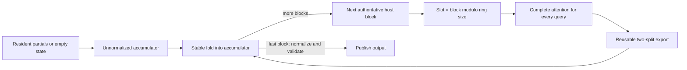

The implementation always uploads the live tail bytes for this invocation and clears padded rows in the last slot. It does not retain a cross-request ring content cache. Tests inspect the final bytes of each used K/V slot, not just output numerics, and verify that H2D volume does not multiply with query batch width.

### Placement and ownership

The idle factory accepts an optional validated policy snapshot. This makes concentrated placement executable without introducing live repartitioning. Capacities are fixed until the owner constructs another executable; evaluating a shorter or longer active context does not reinterpret those capacities or implicitly change the policy.

Zero-capacity layers keep tensor metadata but allocate no resident tensor storage. Resident refresh uses `min(active_padded_tokens, layer_capacity)` independently for each layer. The existing all-resident synchronization API still rejects a context that does not fit every layer. Policy startup minima remain unchanged; ring-only execution is tested using a valid post-adaptation snapshot rather than weakening initial admission.

This snapshot is local to the executable. It is not a publication of live policy changes into the binding or transition coordinator; that integration remains later work. Binding pins, retained workspace leases, backend completion, and cached-writer retirement retain the 5.4c ownership rules. Intermediate fold failure may invalidate scratch but never publishes public output; a retry reinitializes it from resident data or an empty contribution.

### Numerical hardening found by TDD

The initial multi-block stub failed 24 assertions. The expanded tests then exercised incremental folds whose intermediate normalized quotient would overflow even though their unnormalized values remain representable and later normalization succeeds. Folding must not normalize early.

These tests exposed fast-math `cvt.ftz.f64.f32` instructions in the emitted CUDA PTX: tiny positive FP32 masses were being flushed to zero during promotion. The merge adapter now uses explicit non-FTZ conversion instructions for widening inputs and rounding published FP32 accumulators/results. The native attention kernel's fast-math compilation is unchanged. This preserves the reference contract for subnormal payloads and avoids mistaking a positive-mass contribution for an empty one.

### Validation and remaining caveat

The final real-CUDA suite passes **14 cases / 542 assertions**, including:

- One, two, and three ring slots with more blocks than slots, repeated wraparound, exact slot payload checks, partial final blocks, and sequential execution of different layers/context lengths.
- Concentrated placements with unequal per-layer capacities, fully resident layers, zero-resident layers, and an entirely streamed fixed layout.
- Query batches of 1, 33, and 257 over multiple waves. Six tail blocks always use twelve K/V uploads, independent of query count.
- Independent scalar attention comparison and 37 incremental GPU folds compared with the CPU partial-result reference.
- Empty contributions, extreme reference coordinates, subnormal mass, malformed intermediate payloads, overflowing accumulators, deferred normalization, final-block failure, and successful retry without stale accumulator state.
- CPU-testable placement validation, rejection of inconsistent snapshots, and zero-resident metadata construction.

All **23 focused suites** pass in CPU Debug, CUDA Debug, CPU ASan/leak checking, and CPU UBSan. Existing real-CUDA resident attention passes **13 cases / 245 assertions**, the writer suite passes **10 cases / 609 assertions**, and all four CPU-referenced CUDA SCALE cases pass. UVM-disabled and UVM-enabled memcheck runs report **zero errors and zero leaked bytes**.

The isolated changed merge kernel passes racecheck with **zero hazards, errors, or warnings**. The unfiltered suite reports **19 vector-attention warning groups, zero errors**; the existing resident/ordinary-attention control also reports warnings in the unchanged `flash_attn_ext_vec` kernel (**36 groups, zero errors**). This is not a clean whole-suite racecheck result, nor proof that those inherited warnings are harmless. The vector-kernel warning needs separate investigation before broad kernel/performance qualification; no native attention-kernel synchronization change is included in this stage.

```sh
cmake --build build-device-memory-infra-cuda --target test-kv-stream-block test-kv-stream-resident test-kv-stream-writer test-backend-ops -j 20
build-device-memory-infra-cuda/bin/test-kv-stream-block --cuda
env -u GGML_CUDA_ENABLE_UNIFIED_MEMORY compute-sanitizer --tool memcheck --leak-check full --error-exitcode 99 build-device-memory-infra-cuda/bin/test-kv-stream-block --cuda
GGML_CUDA_ENABLE_UNIFIED_MEMORY=1 compute-sanitizer --tool memcheck --leak-check full --error-exitcode 99 build-device-memory-infra-cuda/bin/test-kv-stream-block --cuda
compute-sanitizer --tool racecheck --kernel-name kns=merge_kernel --error-exitcode 99 build-device-memory-infra-cuda/bin/test-kv-stream-block --cuda
compute-sanitizer --tool racecheck --error-exitcode 99 build-device-memory-infra-cuda/bin/test-kv-stream-resident --cuda
```

No asynchronous overlap, cross-layer prefetch queue, live policy transition, server enablement, throughput improvement, or broader backend/quant support is claimed. The device adapter remains F16/F16, head size 256, one sequence, a supplied padded mask, and no sinks/bias/softcap. Production services, compose files, models, and checkpoints remain unchanged.

Stage **5.4e**, documented below, adds supported quant dispatch and bounded F16 conversion. Dedicated copy-stream/event overlap remains **5.4f**.

## Substage 5.4e: generic quant dispatch and bounded F16 fallback

**Status:** committed at `a92107200`, following 5.4d (`59591b6da`).

### Capability admission and compiled dispatch

Version 3 of the optional backend extension adds capability discovery and validated, synchronous conversion into caller-supplied F16 planes. Query the backend before resolving the execution path and planning the pool. The capability query checks storage geometry, the actual CUDA SET_ROWS admission, compiled native kernel availability, and the existing F16 converter. A GGUF weight format having a dequantizer does not mean it supports online KV writes.

The current CUDA writer admits nine cache storage types: **F32, F16, BF16, Q4_0, Q4_1, Q5_0, Q5_1, Q8_0, IQ4_NL**. All 81 ordered K/V combinations can use the native or bounded-conversion path in the tested build. K and V are selected independently; there is no special Q8_0/Q4_0 allocation or dispatch path.

| Build configuration | Native pairs | Other writable pairs |
| --- | --- | --- |
| FA enabled, `GGML_CUDA_FA_ALL_QUANTS=ON` | All 49 combinations of F16/BF16/Q4_0/Q4_1/Q5_0/Q5_1/Q8_0 | 32 pairs use bounded F16 conversion |
| FA enabled, all-quants option OFF | F16/F16, BF16/BF16, Q4_0/Q4_0, Q8_0/Q8_0 | 77 pairs resolve to bounded F16 conversion |
| FA disabled | No streamed attention kernels | Optional adapter getter returns null |

Seven generated translation units, one per K type, expose the existing head-256, one-column vector kernel for compiled V types. This keeps compilation parallel without modifying the stock attention kernel, stock generated instances, or ordinary dispatch. Reduced-build guards omit unavailable instantiations entirely; a probe caught an NVCC discarded-branch template warning, which was fixed with preprocessor guards rather than suppressing diagnostics.

Cache planning still uses `ggml_kv_stream_resolve` and the quant-aware policy layout. The idle factory verifies the proposed path against actual backend capabilities before constructing tensor bindings. It rejects a fabricated native declaration for a fallback-only pair instead of silently using conversion space that the caller did not budget. Unknown, auxiliary, and non-writable weight-only types remain rejected.

### Memory layout and bounded execution

| Path | Resident and ring storage | Conversion storage | Partial workspace |
| --- | --- | --- | --- |
| Native | Original K/V encodings, with independent row/plane sizes | None | Existing caller-owned, query-sized lease |
| F16 fallback | Original K/V encodings, with independent row/plane sizes | One F16 K page and one F16 V page inside the pool's reserved conversion range | Same layout as native |

The device range validator now counts quant blocks along dimension zero, not scalar elements, and checks the alignment needed by vectorized accesses. K/V allocation, copy offsets, slot strides, and conversion destinations remain derived independently from the common geometry.

Fallback uses the existing CUDA converters, or D2D copying for an already-F16 operand. It does not allocate a conversion graph, use the CUDA temporary pool, or round-trip KV through the CPU. Converted values are consumed before that one-page workspace is reused.

Resident prefixes also become page-sized attention spans on the fallback path. Converting the whole prefix would violate the fixed conversion quota even if the encoded prefix fits in VRAM. Each converted resident/streamed page exports partials into the existing bounded accumulator, and normalization occurs only once at the end. Native resident spans retain the previous direct path.

For the test geometry (head dimensions 256, two KV heads, 256 tokens per page), the conversion quota is exactly **524,288 bytes**, regardless of context length or ring size. This number is a test expectation, not an allocation constant in the implementation. The quota is included in `pool_bytes` and reserved before splitting the remaining encoded page budget.

Fallback explicitly rounds/dequantizes values to F16. It is not bitwise equivalent to native attention and does not preserve the full exponent range of F32/BF16; the existing partial/merge checks reject invalid resulting numerical state. The ordinary attention API still refuses a policy requiring conversion, preventing accidental unbudgeted whole-context conversion through that API.

### TDD and validation

The initial matrix failed **52 assertions**: 48 newly requested native pairs and four fallback cases. The implementation fixed the F16-only admission, block-aware span validation, and missing bounded conversion path. Legacy tests that assumed fallback binding was unavailable were updated to verify the new admission boundary; the writer fixture now discovers actual capabilities and reserves conversion space rather than advertising every pair as native.

The final real-CUDA suite passes **19 cases / 656,795 assertions**:

- All 81 writable K/V pairs through the discovered path: 49 native and 32 converted in the all-quants build.
- The same 81 pairs forced through fallback, including one-slot ring reuse and a partial last page.
- Multi-page resident-prefix conversion, streamed-tail conversion, and direct-versus-fallback attention comparisons.
- Exact-size and one-byte-short F16 destination planes; alias, alignment, and stride rejection.
- 655,360 converted values checked against CPU F16 rounding for F32, BF16, Q8_0, Q4_1, and IQ4_NL sources.
- Invalid/auxiliary/non-writable type rejection and prevention of fabricated native capability bypassing the conversion quota.
- Existing concentrated placement, wide-query, dirty-tail, failure-atomicity, and incremental-merge regressions.

Attention comparisons use a **2e-4 absolute tolerance** for the new quant matrix and native/fallback comparisons; native quantized-K kernels may quantize Q differently from the scalar reference. Conversion-value checks compare encoded F16 values directly. These are deterministic correctness tests, not model perplexity, long-response quality, or throughput qualification.

All **23 focused suites** pass in CPU Debug, CUDA Debug, CPU ASan/leak checking, and CPU UBSan. The existing real-CUDA resident suite passes **13 cases / 246 assertions**, the writer suite **10 cases / 609 assertions**, and the four CPU-referenced CUDA SCALE cases pass. Full GPU memcheck runs with UVM off and on report **zero errors and zero leaked bytes**.

Standalone compiled dispatch probes check all 49 native-table entries with all-quants disabled (four available pairs) and FA disabled (zero pairs). These are dispatch compilation/link/execution checks, not full alternate-flag llama-server builds. The main all-quants build separately exercises every pair through conversion. The inherited vector-kernel racecheck warnings recorded in 5.4d remain unresolved; this stage makes no whole-kernel race-clean claim.

```sh
cmake --build build-device-memory-infra-cuda --target test-kv-stream-block test-kv-stream-resident test-kv-stream-writer test-backend-ops -j 20
build-device-memory-infra-cuda/bin/test-kv-stream-block --cuda
build-device-memory-infra-cuda/bin/test-kv-stream-resident --cuda
build-device-memory-infra-cuda/bin/test-kv-stream-writer --cuda
build-device-memory-infra-cuda/bin/test-backend-ops test -b CUDA0 -o SCALE
env -u GGML_CUDA_ENABLE_UNIFIED_MEMORY compute-sanitizer --tool memcheck --leak-check full --error-exitcode 99 build-device-memory-infra-cuda/bin/test-kv-stream-block --cuda
GGML_CUDA_ENABLE_UNIFIED_MEMORY=1 compute-sanitizer --tool memcheck --leak-check full --error-exitcode 99 build-device-memory-infra-cuda/bin/test-kv-stream-block --cuda
```

The streamed device adapter still requires head size 256, one sequence, a supplied padded mask, and no sinks/bias/softcap. No new accelerator backend, live repartition, asynchronous overlap, server enablement, or model benchmark is included. Production services, compose configuration, models, checkpoints, and caches remain unchanged.

Stage **5.4f**, documented below, adds copy-stream overlap. The synchronous baseline remains its correctness control.

## Substage 5.4f: dedicated copy stream and event-driven slot reuse

**Status:** committed at `d48a1faa8`, following 5.4e (`a92107200`).

### Execution boundary

`compute_streamed(..., workspace, true)` opts into copy overlap. The default remains ordered execution, and the complete method still finishes before returning. No production server configuration or model integration is enabled by this stage.

One cached queue per executable owns a nonblocking CUDA copy stream, one initial producer-ready event, and ready/consumed events for each ring slot. It retains the explicit device-local buffer and pinned host buffer without allocating additional KV storage. Event/stream bookkeeping is created on first use and reused; a changed authoritative host buffer retires and recreates the queue. No three-layer lookahead constant is introduced.

The prefetch window is confined to the current layer and bounded by the existing ring capacity. The first available slots are submitted before resident-prefix attention. Consumed slots are immediately scheduled for their next block, with a GPU-side dependency preventing overwrite before the old consumer finishes. The same shared ring is reused across layer calls; cross-layer queuing remains 5.4h.

| Dependency | Purpose |
| --- | --- |
| Compute producer-ready event -> copy stream | Fence earlier backend work before touching the ring |
| Slot copy-ready event -> compute stream | Prevent attention/conversion from reading incomplete K/V copies |
| Slot final-consumer event -> next copy into that slot | Prevent wrapped slots from overwriting live inputs |
| Both streams drained -> reset/free | Retire outstanding accesses before resetting ownership or releasing backing |

Native attention is the final encoded-slot consumer. In fallback mode, conversion of both operands is the final encoded-slot consumer; subsequent attention reads the separate F16 workspace. This permits earlier encoded-slot reuse without overwriting converted inputs. K and V remain separate transfers in separate contiguous planes, and padded tails are zeroed on the copy stream before readiness is recorded.

Partial/convert/fold operations retain their existing synchronous completion contract. Copies already queued on the separate stream can progress while these compute calls run. This stage does not convert the entire compute pipeline into asynchronous submissions or batch multiple pages into one attention/copy span.

### Ownership, cancellation, and validation

The backend-neutral slot state tracks `empty -> queued -> acquired -> released`; a released slot can be queued again only with the backend's final-consumer dependency. These are owner-thread admission states, not GPU completion indicators. `ready()` is a non-owning observation; it never replaces the mandatory event wait or serves as a lifetime fence for all host content.

The caller holds the coarse device lease/execution pin and keeps authoritative host content immutable until the method completes. The method retains its partial-workspace lease through a scoped queue drain on success, failure, or exception. Queue destruction also drains before destroying events and releasing retained device/pinned-host buffers. Cached writer resources are retired before the ring is reused.

Cancellation here means abandoning logical slots after already-submitted work drains, not retracting an in-flight DMA operation or implementing server request cancellation. Admission checks reject invalid slot transitions, short/wrapping source ranges, insufficient ring capacity, non-device-local destinations, and pageable host buffers. Opting into overlap with unsupported backing fails; it does not silently claim overlap while using pageable copies. Calls remain owner-thread-only and outside active CUDA capture.

### TDD and lifecycle evidence

The initial state-machine/registry stubs failed **503 assertions**. The final copy suite passes **8 CUDA cases / 1,565 assertions**, including:

- One hundred state-machine reuse rounds, invalid transitions, bounds, and drain/restart behavior.
- Ordered-versus-overlapped bitwise equality for all 81 writable K/V pairs.
- One, two, and three slots with native and fallback attention and query batches of 1, 33, and 257.
- Artificially blocked GPU producers and consumers. The test proves that a copy remains blocked until producer readiness and that the old slot contents survive a pending consumer even after the next copy is submitted.
- Cancellation with queued and acquired slots, invalid source spans, finite partial-tail padding, and readiness reset.
- Dropping caller-owned buffer references while a copy is gated, followed by destruction with pending work; retained backing and teardown complete safely.
- Failed attention with prefetch in flight, unchanged public output, successful retry, and authoritative-host replacement with queue rebinding.

All **24 focused suites** pass in CPU Debug, CUDA-build Debug, CPU ASan/leak checking, and CPU UBSan. The actual GPU copy suite passes memcheck with **zero errors and zero leaked bytes**, both with UVM disabled and enabled. Existing GPU controls pass: block attention **19 cases / 656,795 assertions**, resident attention **13 / 246**, writer **10 / 609**, and all four CPU-referenced CUDA SCALE cases.

The new host-state test passes TSan (**908 assertions**), both within the attempted sweep and in a targeted `setarch x86_64 -R` run. The broader TSan sweep is **not clean**: most failures are runtime `unexpected memory mapping` startup errors, and the existing CPU/OpenMP graph path also emits race reports. Those CPU paths were not modified or resolved in this stage; this is not a clean whole-repository TSan claim or CUDA-runtime TSan qualification. Process-local ASLR was changed only for the targeted child process, not through system settings. The vector-attention racecheck warning recorded in 5.4d also remains unresolved.

### Targeted comparison against 5.4e

Before changing execution, the benchmark captured revision `a92107200`'s synchronous path. It uses Q8_0/Q4_0, head size 256, two KV heads, four query heads, two layers, a four-page encoded pool (one resident page per layer and two ring slots), and UVM disabled. Each point has three warmups and twenty measured calls; the table shows medians, with ranges across two post-change runs.

| Active tokens | Query rows | 5.4e baseline ms | Post-change ordered ms | Opt-in overlap ms |
| ---: | ---: | ---: | ---: | ---: |
| 1,025 | 1 | 0.1976 | 0.1881-0.1994 | 0.1495-0.1521 |
| 1,025 | 33 | 0.2486 | 0.2507-0.2567 | 0.2078-0.2081 |
| 8,193 | 1 | 1.3121 | 1.3055-1.3928 | 1.1007-1.1021 |
| 8,193 | 33 | 1.7169 | 1.7164-1.7251 | 1.3925-1.4227 |
| 32,769 | 1 | 5.2702 | 5.1701-5.4077 | 4.3530-4.3701 |
| 32,769 | 33 | 6.8229 | 6.7509-6.8460 | 5.4674-5.5289 |

Overlap reduced observed wall latency by roughly **16-24%** relative to the original baseline. Ordered controls show run-to-run variation, including about 6% on one point; these are not clock-locked production benchmarks. The gain combines asynchronous submission and transfer/compute overlap, not an isolated measurement of PCIe latency hiding.

All checksums and transfer counts are identical. The three context sizes upload respectively **639,808 / 6,603,584 / 27,050,816 bytes** in **8 / 64 / 256 K/V copy calls**, independent of query count. Fewer copy calls are explicitly left to 5.4g. These synthetic attention-call latencies are not llama-server token throughput or a full-model performance forecast.

```sh
cmake --build build-device-memory-infra-cuda --target test-kv-stream-copy -j 20
build-device-memory-infra-cuda/bin/test-kv-stream-copy --cuda
env -u GGML_CUDA_ENABLE_UNIFIED_MEMORY build-device-memory-infra-cuda/bin/test-kv-stream-copy --bench-ordered
env -u GGML_CUDA_ENABLE_UNIFIED_MEMORY build-device-memory-infra-cuda/bin/test-kv-stream-copy --bench
env -u GGML_CUDA_ENABLE_UNIFIED_MEMORY compute-sanitizer --tool memcheck --leak-check full --error-exitcode 99 build-device-memory-infra-cuda/bin/test-kv-stream-copy --cuda
GGML_CUDA_ENABLE_UNIFIED_MEMORY=1 compute-sanitizer --tool memcheck --leak-check full --error-exitcode 99 build-device-memory-infra-cuda/bin/test-kv-stream-copy --cuda
setarch x86_64 -R build-device-memory-infra-tsan/bin/test-kv-stream-copy
```

No Windows/other-accelerator runtime qualification, allocation-failure injection for every driver event/stream call, live repartition, cross-layer scheduling, server cancellation, or production throughput claim is included. Production services, compose configuration, models, checkpoints, and caches remain unchanged.

Stage **5.4g**, documented below, adds contiguous spans and batched uploads. Cross-layer bounded lookahead remains **5.4h**.

## Substage 5.4g: contiguous attention spans and batched K/V uploads

**Status:** committed at `f069590ef`, following 5.4f (`d48a1faa8`).

### Span selection and bounded memory

The streamed consumer now accepts a positive `span_pages` ceiling, defaulting to **one**. A pure helper clamps each span to the remaining logical pages, the physical end of the ring, and that ceiling. A request wider than the ring is safely clamped; zero is rejected. There is no power-of-two requirement or implicit pool enlargement.

For a five-slot ring with a three-page ceiling, the physical groups repeat as `[0,1,2]`, `[3,4]`, then wrap to `[0,1,2]`. The last logical group may be shorter. This same grouping is used for admission, transfer, attention, and refill, so an uneven ring does not create mismatched ownership boundaries.

The backend copy extension is version 2. `enqueue_span` validates every covered slot and both complete source ranges before submitting any operation. It waits for each covered slot's previous final consumer, sends **one contiguous K copy and one contiguous V copy**, fills only the padded tail, then records readiness for every covered slot. The v1 single-page enqueue entry retains its original admission boundary. A batch never crosses the physical ring end or combines K and V into an interleaved record.

Slot admission is atomic: a busy member or an invalid range leaves every slot unchanged. A released prefix is not enough to submit a DMA batch whose remaining destination slots still have readers. Refilling a group therefore waits until all its members are reusable; this is a batching tradeoff, not a promise of immediate one-page refill at every span width.

### Native attention and F16 fallback

Native attention consumes a contiguous span in one partial-attention call. The existing vector kernel accepts its runtime key length, so no new span-specific kernels or attention mathematics are introduced. Stable accumulation and final normalization retain the existing bounded workspace.

Fallback shares the batched encoded K/V transfer but converts and computes **one page at a time**. Its one-page F16 conversion quota is unchanged. Each encoded page's final consumer remains its conversion; the next batch can be submitted after the group's final conversion, while subsequent attention reads the separate F16 planes. Ordered and overlapped copy modes both support spans.

Changing native partition boundaries changes floating-point reduction order. Tests use a 1e-6 absolute comparison with the qualified page control rather than asserting bitwise identity. This is not a full-model quality/perplexity qualification.

The copy adapter exposes actual submitted payload bytes and CUDA memcpy-call counts, excluding padding fills. The consumer exposes completed partial-attention call counts. These distinguish fewer transfer submissions from fewer compute submissions; they are not PCIe packet counts, measured bandwidth, or copy-engine utilization.

### TDD and validation

The initial span/helper stubs failed **14 assertions**. The final copy/span suite passes **12 CUDA cases / 2,290 assertions**, covering:

- Checked wrap/ceiling arithmetic, including SIZE_MAX boundaries, zero limits, and atomic rejection of partly busy spans.
- Three- and five-slot rings with ceilings of two, three, and SIZE_MAX; partial final groups and multiple waves in ordered and overlapped modes.
- All 81 writable K/V pairs through two-page spans, compared with page-at-a-time results and unchanged payload bytes.
- Fewer native partial-attention calls, while fallback retains page-sized compute and its existing conversion quota.
- A deliberately delayed consumer of the last slot in a batch. The next batch cannot overwrite either slot early, and old/new payloads and padding are checked separately.
- Actual backend copy counts, invalid wrapping batches, intermediate/final numerical failure, unchanged public output, and successful retry after draining partially consumed batches.
- Existing producer fences, retained backing, host replacement, cancellation, and wide-query regressions.

All **24 focused suites** pass in CPU Debug, CUDA-build Debug, CPU ASan/leak checking, and CPU UBSan. Targeted host-state TSan passes **922 assertions** with process-local ASLR disabled. GPU memcheck reports **zero errors and zero leaked bytes** with UVM disabled and enabled. Existing GPU controls also pass: block attention **19 cases / 656,795 assertions**, resident attention **13 / 246**, writer **10 / 609**, and four CPU-referenced CUDA SCALE cases.

The broader TSan startup/CPU-OpenMP issues and inherited vector-kernel racecheck warnings recorded in earlier stages remain unresolved. No clean whole-repository TSan or whole-kernel racecheck claim is made here.

### Targeted performance comparison

The pre-change control was captured at `d48a1faa8`. Tests use the same synthetic Q8_0/Q4_0 setup as 5.4f, with UVM off, three warmups, and twenty measured calls per point. Comparisons below use matched pool/ring sizes. These are attention-call medians, not llama-server token throughput.

| Active tokens | Query rows | Pre-change page ms | Post-change page ms (two runs) | Two-page span ms (two runs) |
| ---: | ---: | ---: | ---: | ---: |
| 1,025 | 1 | 0.1500 | 0.1542-0.1555 | 0.0995-0.1010 |
| 1,025 | 33 | 0.2103 | 0.2086-0.2140 | 0.1390-0.1390 |
| 8,193 | 1 | 1.1385 | 1.1082-1.1416 | 0.6670-0.6691 |
| 8,193 | 33 | 1.3997 | 1.4012-1.4305 | 0.9045-0.9057 |
| 32,769 | 1 | 4.3615 | 4.3591-4.3681 | 2.6077-2.6161 |
| 32,769 | 33 | 5.4885 | 5.4590-5.4741 | 3.5408-3.5420 |

With two ring slots, native two-page spans reduce observed latency by roughly **33-41%** relative to the pre-change page control. Copy calls fall from **8/64/256 to 4/32/128**, and partial-attention calls from **5/33/129 to 3/17/65**. Payload bytes remain **639,808 / 6,603,584 / 27,050,816**. Small checksum differences are expected from the changed native reduction partition; numerical tests pass the stated tolerance.

A separate matched five-slot comparison with a three-page ceiling also improves every sampled native point. At 32,769 tokens, page versus span medians are **4.3607 -> 2.2061 ms** for one query and **5.5138 -> 3.1202 ms** for 33 queries. Copy calls fall from 256 to 102, and partial calls from 129 to 52; physical wrap prevents treating every group as three pages.

**Fallback is not a universal speedup.** Forced Q8_0/Q4_0-to-F16 tests halve copy calls but leave partial-attention counts at 5/33/129, with two converters per page as before. Two-slot results are broadly flat, with small improvements and regressions across runs; the long 33-query case is about 1% slower with batching. A five-slot probe also shows mixed results, including approximately 4% slower at that point. Batching delays refill until a whole group is reusable and does not remove fallback compute submissions; these results are consistent with that tradeoff, but are not an isolated GPU timing attribution for every difference. Larger copy batches are therefore not recommended automatically for fallback. The one-page default preserves the established behavior; measured span selection remains 5.4j.

```sh
cmake --build build-device-memory-infra-cuda --target test-kv-stream-copy -j 20
build-device-memory-infra-cuda/bin/test-kv-stream-copy --cuda
env -u GGML_CUDA_ENABLE_UNIFIED_MEMORY build-device-memory-infra-cuda/bin/test-kv-stream-copy --bench
env -u GGML_CUDA_ENABLE_UNIFIED_MEMORY build-device-memory-infra-cuda/bin/test-kv-stream-copy --bench-span
env -u GGML_CUDA_ENABLE_UNIFIED_MEMORY build-device-memory-infra-cuda/bin/test-kv-stream-copy --bench 1 5
env -u GGML_CUDA_ENABLE_UNIFIED_MEMORY build-device-memory-infra-cuda/bin/test-kv-stream-copy --bench-span 3 5
env -u GGML_CUDA_ENABLE_UNIFIED_MEMORY build-device-memory-infra-cuda/bin/test-kv-stream-copy --bench-fallback 1 2
env -u GGML_CUDA_ENABLE_UNIFIED_MEMORY build-device-memory-infra-cuda/bin/test-kv-stream-copy --bench-fallback 2 2
compute-sanitizer --tool memcheck --leak-check full --error-exitcode 99 build-device-memory-infra-cuda/bin/test-kv-stream-copy --cuda
setarch x86_64 -R build-device-memory-infra-tsan/bin/test-kv-stream-copy
```

The benchmark accepts optional span ceiling and ring-slot count after its mode and appends the attention-call count after the original checksum column. Pool budgeting, conversion storage, head/sequence restrictions, and production configuration are unchanged. No automatic tuning, cross-layer queue, live repartition, new backend, or server enablement is included.

Stage **5.4h**, documented below, adds the actual cross-layer queue.

## Substage 5.4h: bounded cross-layer prefetch sessions

**Status:** implemented and ready for review; not committed by the implementation agent. This stage follows committed 5.4g (`f069590ef`).

### Queue and scheduling model

`begin_sequence(layers, active_tokens, span_pages, stable_tokens)` opens an opt-in serial attention session over an explicit, unique layer order. Existing single-layer calls remain the default control. A session supplies future K/V addresses without needing future Q tensors, retains queued transfers between layer calls, and ends automatically after the final valid layer. `cancel_sequence()` drains pending work between calls.

The planner stores per-layer capacities/readiness and at most one request record per ring slot: **O(layers + slots)** metadata, not O(context pages). Requests are generated incrementally. A circular record queue preserves demand order, while a physical occupancy map allows immediate reuse of consumed prefixes, including the first consumed page of a larger fallback span. Requests never cross a layer boundary or the physical end of the ring.

Lookahead is constrained by free ring slots, not a fixed layer count. Fully resident layers have no ring requests and are skipped by admission without skipping their attention execution. The eight-layer test queues data more than three layers ahead; concentrated layouts and multi-wave traversal use the same planner. Global ring placement can split spans differently from the single-layer control, so native comparisons use the established numerical tolerance rather than requiring bitwise identity.

### Stable history, mutable tails, and readiness

Future layers' newest K/V rows may not exist yet. The caller declares a stable prefix. Spans wholly inside it can be copied ahead; a boundary page containing mutable rows, and later mutable pages, remain reserved but unsubmitted until that layer is entered. A reserved demand tail occupies capacity, so later speculative copies cannot take the space needed to satisfy it. Later stable requests may finish first, but consumption still follows the FIFO demand head.

The default `stable_tokens=SIZE_MAX` means **all active rows are already ready and immutable**. It is suitable for a completed snapshot, not an implicit assumption for online decoding. Online callers must pass the actual immutable prefix and prepare each layer's remaining rows before computing it.

`publish_sequence_tail` accepts encoded host-row spans only within the mutable range of unconsumed layers. It validates all spans before using the existing atomic content-write mechanism and advances the session's expected generation. Stable history writes, writes to consumed layers, malformed row ranges, and unknown content-generation/epoch changes are rejected. Untracked raw writes still violate the host-content contract; generation counters are not a data-race cure.

The current boundary page is conservatively deferred in full, even if most of it is historical. Speculative partial-tail copies followed by row patching are not implemented here. Calling the current layer's compute method declares that its tail is ready. Its reserved copies are then submitted before consumption.

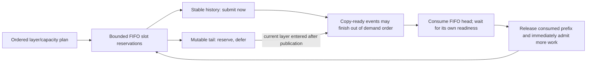

### Lifetime and integration boundaries

The caller holds the coarse binding execution pin and host-content contract through completion/cancellation. Each layer's Q, mask, output, and partial workspace are needed only until that layer call returns: future prefetch stores K/V references, not future graph/workspace pointers. Pending DMA is drained before a session is discarded, and backing buffers remain retained until their last GPU use.

The resident mirror is refreshed at session entry. Authorized publications track which resident tails need refreshing; unchanged layers do not repeatedly rescan every cache plane. Reentrant calls reject without cancelling the outer operation. A bad layer order, mismatched active/span settings, unknown mutation, or failed attention cancels pending prefetch without publishing that failed layer's new output. Earlier completed layer outputs and authoritative host writes are not rolled back; request-level recovery remains the server/context owner's responsibility.

The existing writer uses ring scratch and is therefore blocked while a session is active. This stage provides encoded-host tail publication, not the real-model GPU producer bridge. **5.5a must connect producer completion and provide non-conflicting writer workspace (or explicitly suspend/drain prefetch) before enabling sessions in a server.** Ordinary graph attention is also not a bypass around the session's layer-completion protocol.

The copy extension is version 3. `release_completed` is an explicit optimization for callers that already synchronized every encoded-slot reader. Current partial/conversion callbacks meet that contract, so sessions avoid redundant consumer-event submissions. Asynchronous consumers retain the original event-record/wait release path; tests verify that switching back from completed releases restores the queued fence. No caller may use completed release merely because a kernel was submitted.

### TDD and validation

The initial queue/session stubs failed **15 assertions**. Additional regressions caught an invalid-padding case that could admit a wholly empty source page. The completed-consumer optimization was separately introduced through a failing capability test.

The final cross-layer suite passes **11 CUDA cases / 2,395 assertions**, including:

- Bounded request/slot counts across many waves, partial-span consumption, and invalid padding/range rejection.
- Eight-layer lookahead, zero-resident and fully resident layers in concentrated placement, and arbitrary supplied layer order.
- All 81 writable K/V pairs across layer-boundary wrap and partial-slot reuse, compared with the qualified single-layer control.
- A future historical page observed ready on the GPU while the FIFO demand tail remains reserved and unsubmitted.
- Explicit mutable-tail publication, resident-tail refresh, rejection of stable/consumed-row mutations, and reentrant rejection without destroying the outer session.
- Invalid execution order, unknown content mutation, numerical failure, cancellation, and recovery with unchanged failed-call output.

All **25 focused suites** pass in CPU Debug, CUDA-build Debug, CPU ASan/leak checking, and CPU UBSan. Targeted host-planner TSan passes **1,121 assertions** with process-local ASLR disabled. Cross-layer memcheck reports **zero errors and zero leaked bytes** with UVM off and on; the copy suite also passes memcheck (**13 cases / 2,302 assertions**) including both release contracts. Existing GPU block/resident/writer controls remain required and are recorded in the final handoff evidence. Previously documented broad TSan and vector-kernel racecheck limitations remain unresolved; no whole-repository sanitizer claim is made.

### Targeted latency comparison and remaining overhead

Before implementation, `f069590ef` was measured with eight synthetic Q8_0/Q4_0 attention consumers, one resident page per layer, eight ring slots, two-page spans, and UVM off. Each point uses three warmups and twenty measured traversals. There are **no intervening model-weight computations** in this test, so it does not measure the main opportunity to hide future K/V traffic during other transformer work.

Initial session measurements regressed at longer points. The implementation removed duplicated page preflight, unnecessary readiness rescans, repeated resident-mirror checks, and redundant fences for explicitly completed consumers. Byte flags also avoid bit-proxy overhead in hot owner-thread bookkeeping. The final observed medians are:

| Active tokens | Query rows | Pre-change control ms | Matched post-change control ms | Cross-layer session ms |
| ---: | ---: | ---: | ---: | ---: |
| 257 | 1 | 0.4890 | 0.5016 | 0.4494 |
| 257 | 33 | 0.6235 | 0.6320 | 0.5846 |
| 2,049 | 1 | 1.3417 | 1.3767 | 1.4022 |
| 2,049 | 33 | 1.9440 | 1.9648 | 1.9633 |
| 8,193 | 1 | 5.0696 | 5.1438 | 5.2223 |
| 8,193 | 33 | 7.1858 | 7.1987 | 7.1714 |

Short cases improve; longer attention-only cases are near the matched control or modestly slower. Queue/setup work and the absence of intervening layer computation limit gains here. These Debug-build, non-clock-locked measurements are not a universal speedup or a llama-server token-rate prediction. Sessions remain explicit opt-in; real-model qualification is still 5.5c.

For these aligned test layouts, both paths transfer identical payloads (**6,656 / 11,934,208 / 52,828,672 bytes**) in **16 / 64 / 256** K/V copy calls, and their final checksums agree. Other layer/ring boundaries or deferred tails may split batches differently. The queue avoids duplicate payload copies but does not promise identical call counts for every layout.

```sh
cmake --build build-device-memory-infra-cuda --target test-kv-stream-prefetch test-kv-stream-copy -j 20
build-device-memory-infra-cuda/bin/test-kv-stream-prefetch --cuda
env -u GGML_CUDA_ENABLE_UNIFIED_MEMORY build-device-memory-infra-cuda/bin/test-kv-stream-prefetch --bench
env -u GGML_CUDA_ENABLE_UNIFIED_MEMORY build-device-memory-infra-cuda/bin/test-kv-stream-prefetch --bench-sequence
compute-sanitizer --tool memcheck --leak-check full --error-exitcode 99 build-device-memory-infra-cuda/bin/test-kv-stream-prefetch --cuda
GGML_CUDA_ENABLE_UNIFIED_MEMORY=1 compute-sanitizer --tool memcheck --leak-check full --error-exitcode 99 build-device-memory-infra-cuda/bin/test-kv-stream-prefetch --cuda
setarch x86_64 -R build-device-memory-infra-tsan/bin/test-kv-stream-prefetch
```

Readiness statistics are observations, not lifetime fences or copy-bandwidth estimates; layer distance refers to the supplied attention order. No feedback-driven tuning, capture replay, live repartition, multi-GPU/backend port, or server enablement is included. Production services, compose files, models, checkpoints, and caches remain unchanged.

Stage **5.4i**, documented below, adds query tiling while preserving that lifetime boundary.

## Substage 5.4i: wide micro-batch query tiling

The CUDA partial-attention callback now launches at most 256 queries per tile. A checked common helper derives the query count and accumulator-row range, including the final partial tile. Query and mask pointers advance using their actual row strides; output numerator and metadata pointers advance in the full-batch accumulator. GQA head indexing and the existing native attention arithmetic are unchanged.

Tiling is inside the K/V-span consumer, not outside the context scan:

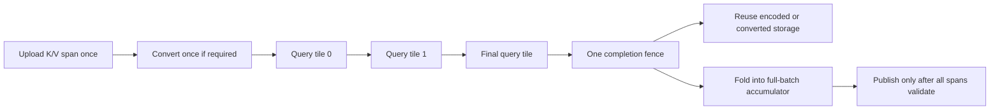

For native K/V, the ring slots cannot be recycled until every query tile finishes. For fallback, encoded slots may be recycled after conversion completes, but the converted K/V planes cannot be overwritten until the partial callback returns. All tile launches share the same stream and existing final synchronization. Cross-layer reservations and the bounded conversion tail require no extra allocation or new lifetime mechanism.

The full-query accumulator, normalized staging output, and whole-output publication check remain explicit in `ggml_kv_stream_block_layout_make`. Tiling bounds each kernel launch; it does **not** make the accumulator constant-sized or reduce its required lease size. No output is published if a late query or later K/V span is invalid. The callback ABI, pool geometry, quant-pair selection, and 256-query single-launch path remain unchanged. `last_attention_calls()` still counts K/V partial callbacks, not individual query-tile kernel launches.

### TDD and validation

The new boundary/overflow test first failed to compile because the query-tile contract did not exist. The implementation then passed coverage for 1/255/256/257/511/512/1,025 queries, exact coverage without overlapping rows, zero dimensions, exhausted ranges, and overflow with unchanged output metadata on rejection.

GPU coverage compares wide calls with independent calls of at most 128 queries using different tile boundaries. Tests cover head-major and token-major Q, causal masks with full-context row pitch, partial final tiles, native Q8_0/Q4_0 and forced F16 fallback, repeated three-slot ring reuse, cross-layer sequences, undersized workspace rejection, a NaN confined to the final query, retry after cancellation, and entirely masked batches. Scalar attention references check queries on both sides of a tile boundary and the last partial tile.

Final validation:

- All 25 focused suites pass in CPU Debug, CUDA-build Debug, ASan and UBSan. The default CTest runs are host tests; real GPU runs are listed separately.
- CUDA block: 20 cases / 656,887 assertions. CUDA copy: 15 cases / 2,826 assertions, including the new wide-query cases and existing all-81-pair transfer coverage.
- CUDA prefetch, resident and writer regression suites pass. `test-backend-ops test -b CUDA0 -o SCALE` passes all four CPU-reference comparisons.
- Compute Sanitizer memcheck of the final copy suite passes with UVM disabled and enabled: zero errors and zero leaked bytes in both runs.
- Targeted host TSan block suite passes 4 cases / 111 assertions using process-local `setarch x86_64 -R`. This is not a claim that the previously documented broader TSan or native-kernel racecheck limitations are resolved.
- Wide-call versus independently sliced-call results are bit-identical in the new tests; selected scalar-oracle errors are below 0.000023 (test tolerance 0.001).

These are physical micro-batch/consumer tests, not claims that a real server `-b/-ub` matrix already ran. Logical-batch splitting and the model/server bridge remain **5.5a**; realistic performance qualification remains **5.5c**. In particular, the existing 256/256 workload shape keeps a single query launch, but the synthetic measurements below are not full-model prefill rates.

### Pre-change comparison

Before changing CUDA execution, `test-kv-stream-copy --bench-wide 2 4` was added and run against the 5.4h implementation at `5887c18a0`. It uses Q8_0/Q4_0, four ring slots, two-page spans, three warmups and 20 measured calls per point. Values below are median milliseconds for one synthetic attention call in the existing Debug CUDA build, UVM disabled:

| Active tokens | Queries | Before ms | After ms | After repeat ms |
| ---: | ---: | ---: | ---: | ---: |
| 1,025 | 256 | 0.5347 | 0.5339 | 0.5380 |
| 1,025 | 512 | 0.9982 | 1.0008 | 1.0063 |
| 1,025 | 1,025 | 1.8942 | 1.9572 | 1.9623 |
| 8,193 | 256 | 3.6207 | 3.6136 | 3.6372 |
| 8,193 | 512 | 6.5909 | 6.6795 | 6.7015 |
| 8,193 | 1,025 | 12.7593 | 13.1001 | 13.1078 |
| 32,769 | 256 | 14.2004 | 14.2389 | 15.3427 |
| 32,769 | 512 | 26.0394 | 26.3704 | 28.3667 |
| 32,769 | 1,025 | 50.5529 | 51.9960 | 54.4041 |

For the first post-change pass, the 256-query cases stay within 0.3% of baseline. Wider batches have about 0.3-3.3% additional latency, consistent with extra launches; this stage is not a speedup claim. The repeat's longest cases also slow down in the unchanged single-launch control, so these non-clock-locked measurements do not isolate a small code effect from run-to-run drift. An initial run overlapping sanitizer activity was discarded; the tabulated GPU timings ran separately from GPU tests and instrumentation. Production was not stopped or reconfigured.

All query counts and both implementations transfer exactly **639,808 / 6,603,584 / 27,050,816 bytes**, using **4 / 32 / 128 K/V uploads** for the three active-token points. Output checksums are unchanged. This verifies no re-upload per query tile.

```sh
cmake --build build-device-memory-infra-cuda --target test-kv-stream-block test-kv-stream-copy -j 20
build-device-memory-infra-cuda/bin/test-kv-stream-block --cuda
build-device-memory-infra-cuda/bin/test-kv-stream-copy --cuda
env -u GGML_CUDA_ENABLE_UNIFIED_MEMORY build-device-memory-infra-cuda/bin/test-kv-stream-copy --bench-wide 2 4
compute-sanitizer --tool memcheck --leak-check full --error-exitcode 99 build-device-memory-infra-cuda/bin/test-kv-stream-copy --cuda
GGML_CUDA_ENABLE_UNIFIED_MEMORY=1 compute-sanitizer --tool memcheck --leak-check full --error-exitcode 99 build-device-memory-infra-cuda/bin/test-kv-stream-copy --cuda
```

Stage **5.4j**, documented below, adds opt-in feedback and span trials. No server opt-in, capture replay, live repartition, or backend port was added in 5.4i.

## Substage 5.4j: runtime feedback and measured span selection

This section records the baseline committed at `17b92d321`. Follow-ups 5.4j.1-5.4j.4 below refine its measurement strategy before capture integration; their changes supersede the corresponding baseline details.

The optional copy extension is now version 4. Existing callers retain their uninstrumented execution path. `configure_feedback(true, bounded_span_pages)` enables the new diagnostics while idle; the bounded candidate defaults to 32 pages and is clamped to the existing ring size. Disabling feedback frees its diagnostic allocation/events and clears its learning history. No KV storage is resized.

### GPU deadlines and copy timing

Each measured `acquire_span` submits one small probe on the consuming GPU stream, immediately before that span's mandatory ready-event waits. The probe checks **every page** in the consumed span. A sample is a consumed span, and a miss means at least one of its pages had not published the expected ready ticket when the probe executed. Fallback samples at the encoded-page/conversion boundary; native attention samples once for its combined span, not once per query tile.

The copy stream publishes a monotonically increasing ticket after both encoded planes and padding complete. Tickets distinguish successive occupants of a reused slot, avoiding a stale ready bit or a racing reset. Atomic ticket operations make the probe/publication access well-defined. Ticket observation never grants ownership: ready-event waits, final-reader ordering, and lease retention still establish correctness. Probing itself has overhead and can change the timing being observed.

```mermaid
sequenceDiagram
    participant H as Owner thread
    participant C as Copy stream
    participant G as Compute stream
    H->>C: Enqueue K/V span after prior consumer
    C->>C: Timed copy interval, then publish ticket
    H->>G: Probe every page's expected ticket
    G->>G: Increment sample; miss if any ticket is absent
    G->>C: Wait on the mandatory ready events
    G->>G: Consume encoded span or convert it
    G->>H: Complete final reader
    H->>H: Drain completed window, validate feedback
```

Measurement uses an explicit device-local diagnostic buffer requested at `8 * (ring_slots + 2)` bytes plus two timing events per ring slot. These resources are **outside the KV lease** and exist only when opted in; backend/driver allocation granularity and event overhead are additional implementation costs. The report exposes the buffer's reported allocation size. KV page geometry, weights, resident/ring grants, and conversion storage are unchanged.

Timing samples are bounded by ring size, not context length. Start/end events bracket copy-stream service after dependency waits, including K/V submissions and finite tail padding. Completed event pairs are harvested before reuse or at drain. If a timing pair is still pending, that upload is not sampled rather than blocking the stream or allocating an unbounded event list. Actual copied bytes and sampled bytes are reported separately.

The pure feedback adapter calculates:

`copy_busy_ratio = min(1, (sampled_copy_ms / copy_window_elapsed_ms) * (copied_bytes / sampled_bytes))`

This is a sampled/extrapolated **copy-stream interval ratio**, not physical copy-engine occupancy, PCIe throughput divided by 64 GB/s, or a measure of UVM migration. The denominator is the host window from copy-run begin through drain; the numerator excludes producer/final-consumer waits but can include command scheduling gaps. With full sample coverage no extrapolation is needed. Invalid, absent, nonfinite, zero-duration, inconsistent, or overflowing observations do not become light-load feedback.

Reports are unavailable while a run is active and are collected only after GPU completion. Cancellation can produce backend diagnostics, but the consumer discards them for learning. Readiness inspection via `sequence_stats()` remains a separate observation, not the GPU deadline counter.

### Policy proposals and span trials

Successful standalone overlap calls and complete cross-layer sequences feed cumulative sample/miss counters into the existing pure policy type. The runtime supplies process-unique feedback epochs so recreation cannot accidentally continue another instance's counters. Unknown content generation/mirror changes, page-extent changes, different query counts or layer orders, cancellation, failures, and runs with no streamed work reset learning. Authorized sequence-tail publications remain valid within their running window. Mixed query counts across one sequence do not train a timing trial. Cache-write continuity is intentionally conservative until the real producer bridge in 5.5a can identify authorized append history.

`recommend_policy(previous, active_tokens, query_tokens, decision)` connects completed feedback to `llama_kv_stream_policy_step`. It rejects in-flight recommendations and excludes old-context/query feedback. It does **not** publish `decision.next`, advance the caller's accepted cursor, or move device pointers. The existing pure policy retains its cooldown, hysteresis, saturation guard, and one-balanced-round feedback growth bound. A caller must accept the corresponding device layout before accepting a proposal; this stage does not implement live repartition or bypass the later context integration.

`suggested_span_pages()` exposes the timing trial's candidate. Callers explicitly pass it to the next `begin_sequence`/`compute_streamed`; explicit spans and the existing one-page default remain available. The tuner compares full-ring against bounded spans using whole successful execution latency, including validation/planning/refresh and all supplied layers. It uses one warmup and 16 measured samples per candidate, requires a 0.5% gain to choose the bounded candidate, and learns only TG1 samples matching the candidate actually being tested. No duplicate candidate is trained when the ring already fits the bounded ceiling. This is a resettable two-candidate heuristic, not a proof of globally optimal spans at every context.

### TDD and review findings

- The version-4 capability test first failed against version 3. Pure feedback/tuner tests then failed before their helper existed and passed after implementation.
- GPU tests cover queued-versus-completed reports, every-span sample counts, invalid/mixed-ticket admission, repeated slot reuse, reset/drain idempotence, and disabled measurement. A delayed compute gate proves that host submission timing is not used as the deadline: completed copies report zero misses when the GPU finally consumes them.
- A separate 256 MiB transfer test observed **3/3 GPU deadline misses** on this machine. The assertion permits zero misses on a different schedule: missing a deadline is an observed condition, not an outcome that every GPU must exhibit.
- The cold gated test exposed first-use CUDA kernel loading synchronizing behind a held gate. Diagnostic kernels are now resolved during idle measurement setup. The gated case intentionally runs before the large-transfer case so an earlier measured launch cannot hide that regression.
- Native and fallback session tests cover successful cumulative feedback, actual full-ring/bounded trials, read-only policy proposals, no-streamed-work reset, stale query rejection, unknown cache invalidation, cancellation, a failed final layer, and standalone overlap.
- A new behavioral test caught identical feedback epochs in two separate runtime instances. Runtime reset IDs now come from a relaxed atomic identity counter; policy/tuning arithmetic remains backend-neutral and locally owned.

Final validation:

- All 25 focused suites pass in CPU Debug, CUDA-build Debug, ASan, and UBSan. The default CTest runs exercise host contracts; the following results are separate real-GPU runs.
- CUDA copy/deadline suite: 18 cases / 2,978 assertions. CUDA prefetch/runtime suite: 12 cases / 2,803 assertions.
- CUDA block attention: 20 cases / 656,887 assertions; resident mirror: 13 / 246; writer: 10 / 609. CPU-reference CUDA SCALE passes all four comparisons.
- Compute Sanitizer memcheck passes the cold-load copy/deadline suite with UVM off and on, plus the final runtime-feedback suite: zero errors and zero leaked bytes in each run.
- Targeted TSan policy/tuner: 22 cases / 139,910 assertions; host prefetch planner: 3 / 1,121, using process-local `setarch x86_64 -R`. Previously documented broader TSan and native-attention racecheck limitations are not claimed resolved.
- `git diff --check` passes. Only this stage's source, tests, and roadmap are staged for user review; unrelated README/documentation/benchmark work is preserved.

### Targeted comparison

Baseline was captured at **6f98b1276** using the existing eight-layer Q8_0/Q4_0 synthetic benchmark, span ceiling 2, ring size 8, UVM disabled, three warmups and 20 measured runs. The post-change measurements keep that explicit span fixed to isolate instrumentation cost; they are not an adaptive-winner or real-model speedup claim.

| Active tokens | Queries | Before ms | Feedback off ms | Feedback on ms |
| ---: | ---: | ---: | ---: | ---: |
| 257 | 1 | 0.4531 | 0.4519 | 0.4912 |
| 257 | 33 | 0.5866 | 0.5903 | 0.6294 |
| 2,049 | 1 | 1.4138 | 1.4258 | 1.5549 |
| 2,049 | 33 | 1.9731 | 1.9733 | 2.0879 |
| 8,193 | 1 | 5.2346 | 5.2480 | 5.6624 |
| 8,193 | 33 | 7.2059 | 7.1888 | 7.6243 |

The uninstrumented cases remain within about 1% of the prior stage. Enabling every-span probes and timing adds approximately **6-9%** in this Debug synthetic benchmark, so instrumentation remains opt-in. The probes, readiness publications, timing events, and completed counter readback are real costs; no automatic production performance gain is claimed. GPU timings ran separately from sanitizer work and are not clock-locked.

Payloads remain **6,656 / 11,934,208 / 52,828,672 bytes** in **16 / 64 / 256 K/V uploads**, and output checksums agree. Diagnostic counter traffic is not counted as K/V payload traffic.

```sh
cmake --build build-device-memory-infra-cuda --target test-kv-stream-policy test-kv-stream-copy test-kv-stream-prefetch -j 20
build-device-memory-infra-cuda/bin/test-kv-stream-policy
build-device-memory-infra-cuda/bin/test-kv-stream-copy --cuda
build-device-memory-infra-cuda/bin/test-kv-stream-prefetch --cuda
env -u GGML_CUDA_ENABLE_UNIFIED_MEMORY build-device-memory-infra-cuda/bin/test-kv-stream-prefetch --bench-sequence
env -u GGML_CUDA_ENABLE_UNIFIED_MEMORY build-device-memory-infra-cuda/bin/test-kv-stream-prefetch --bench-feedback
compute-sanitizer --tool memcheck --leak-check full --error-exitcode 99 build-device-memory-infra-cuda/bin/test-kv-stream-copy --cuda
GGML_CUDA_ENABLE_UNIFIED_MEMORY=1 compute-sanitizer --tool memcheck --leak-check full --error-exitcode 99 build-device-memory-infra-cuda/bin/test-kv-stream-copy --cuda
```

The source comparison with `feature/adaptive-kv-stream` found avoidable measurement costs and different feedback eligibility. Complete the explicit follow-ups **5.4j.1-5.4j.4** before resuming **5.4k**. Server enablement and accepted live-layout transitions remain later integration work. Production services, compose files, models, checkpoints and prompt caches are unchanged.

## Follow-up 5.4j.1: bounded copy timing

This commit-sized optimization changes only copy-time sampling. One pair of timing events records the first successful upload of each copy execution. The pair is reused only after the execution drains. Empty runs never read unrecorded or previous-run timestamps, and rejected uploads do not consume the sample. `timed_bytes` records the first upload's actual live K/V payload, excluding padding; `bytes` still records every upload.

The previous implementation allocated two additional timing events per ring slot and repeatedly recorded, queried, and harvested them. The new implementation has **two additional timing events total**, records them once per nonempty execution, and reads their elapsed time once at drain. The upload loop no longer calls `cudaEventQuery` or `cudaEventElapsedTime` for timing. No optional ABI layout or callback signature changed.

This does not reduce deadline coverage: every consumed span still gets its GPU deadline probe and all expected tickets are checked. Ticket publication, actual K/V transfers, ready/final-consumer events, quant conversion, and output publication are unchanged. Device diagnostic flags and their host ticket metadata remain O(ring slots); only timing events and timing bookkeeping become constant-sized. The existing synchronous readback/drain, phase/tail eligibility, and per-span publication/probe strategy are deliberately left for 5.4j.2-5.4j.4 so their costs can be measured separately.

The existing byte-weighted estimate uses this smaller sample:

`copy_busy_ratio = min(1, (first_copy_ms / copy_window_elapsed_ms) * (total_live_bytes / first_live_bytes))`

This restores the old branch's first-batch sampling strategy while retaining explicit live-byte accounting. A single first sample can be noisy or unrepresentative, especially for a short padded tail followed by larger transfers. It is still a copy-stream activity estimate, not measured PCIe utilization. The tests verify accounting and lifecycle, not that every proposed partition will be optimal. Feedback filtering and real-model qualification remain necessary.

### TDD and validation

Changing the expected sampled-byte totals first produced **three failing assertions** against `17b92d321`: the old implementation timed all uploads in the repeated-slot and large-transfer tests. They pass after bounding the sample.

New tests cover an empty run before every measured run, rejection before the first valid copy, a one-token padded first upload, a full first upload followed by a short tail, nonzero ring offsets, event reuse across runs, and independent K/V sizes (Q8_0/Q4_0, F16/F16, IQ4_NL/F32). Existing cold-load/gated-readiness tests continue to count every deadline sample. The copy suite now has **19 cases / 3,075 assertions**; the native/fallback runtime-prefetch suite remains **12 / 2,803**.

Final checks:

- All 25 focused suites pass in CPU Debug, CUDA-build Debug, ASan and UBSan. These CTest matrices exercise host contracts; real GPU checks are listed separately.
- CUDA copy and runtime-prefetch suites pass with the counts above. Compute Sanitizer memcheck passes the copy suite with UVM off/on and the runtime-prefetch suite: zero errors and zero leaked bytes in all three runs.
- CUDA block attention passes 20 cases / 656,887 assertions, resident mirror 13 / 246, and writer 10 / 609. CUDA SCALE passes all four CPU-reference comparisons.
- `git diff --check` passes. Existing asynchronous ownership and capture limitations are unchanged; deferred collection is not part of this optimization.

### Isolated comparison

The baseline was captured from `17b92d321` before changing CUDA execution. Parameters remain eight synthetic Q8_0/Q4_0 attention layers, eight ring slots, two-page spans, UVM disabled, three warmups and 20 measured runs per point. Each cell is median milliseconds for the complete synthetic sequence, not tokens/second. Benchmarks ran sequentially without competing GPU tests or sanitizer work.

| Active tokens | Queries | Before, off | Before, on | After, off | After, on | Repeat, on |
| ---: | ---: | ---: | ---: | ---: | ---: | ---: |
| 257 | 1 | 0.4513 | 0.4926 | 0.4494 | 0.4769 | 0.4778 |
| 257 | 33 | 0.5835 | 0.6271 | 0.5857 | 0.6082 | 0.6190 |
| 2,049 | 1 | 1.4038 | 1.5520 | 1.4345 | 1.4881 | 1.4879 |
| 2,049 | 33 | 1.9584 | 2.0909 | 1.9586 | 2.0344 | 2.0400 |
| 8,193 | 1 | 5.2381 | 5.6773 | 5.2242 | 5.4650 | 5.4645 |
| 8,193 | 33 | 7.1920 | 7.6057 | 7.1766 | 7.4311 | 7.4178 |

Instrumented latency fell **2.3-4.1%** in the first pass and **1.3-4.1%** in the repeat. Remaining overhead relative to the corresponding uninstrumented runs is approximately **3-6%**; this stage does not eliminate instrumentation cost. Most off-path points are within 1% of baseline. The 2,049-token/TG1 off-path point was 2.2% slower in the first pass and 1.4% slower in the repeat (1.4228 ms); these non-clock-locked Debug samples do not isolate a small host-code effect from run-to-run variance. No extra GPU operations were added to the uninstrumented path.

All three implementations/runs preserve **6,656 / 11,934,208 / 52,828,672 K/V bytes**, **16 / 64 / 256 memcpy submissions**, and identical output checksums. Sampling uses only the first batch; those transfer counts still cover all K/V uploads.

```sh
cmake --build build-device-memory-infra-cuda --target test-kv-stream-copy test-kv-stream-prefetch -j 20
build-device-memory-infra-cuda/bin/test-kv-stream-copy --cuda
build-device-memory-infra-cuda/bin/test-kv-stream-prefetch --cuda
env -u GGML_CUDA_ENABLE_UNIFIED_MEMORY build-device-memory-infra-cuda/bin/test-kv-stream-prefetch --bench-sequence
env -u GGML_CUDA_ENABLE_UNIFIED_MEMORY build-device-memory-infra-cuda/bin/test-kv-stream-prefetch --bench-feedback
```

After review and commit, proceed to **5.4j.2: deferred completed-feedback collection**. Do not resume 5.4k until the remaining follow-ups have been reviewed and qualified. Production, model files, compose configuration, and user-owned unrelated edits remain untouched.

## Follow-up 5.4j.2: deferred completed-feedback collection

This follow-up was developed against the staged 5.4j.1 implementation on `17b92d321`. The user subsequently requested that 5.4j.1-5.4j.4 be committed together; their implementation and benchmark checkpoints remain documented separately within the combined change.

The copy extension is version 5. Its new `feedback_id()` identifies the current/latest measured window, and `poll_feedback()` delivers completed snapshots in FIFO order without waiting. Each snapshot carries its own ID and frozen copy statistics. The legacy version-4 `feedback()` getter remains compatible but may wait for the current snapshot's readback; the runtime no longer calls that getter.

### Bounded ownership and completion

Two snapshot slots each own a GPU flag/counter bank and a 16-byte slice of a pinned host buffer. After the existing copy/compute correctness drains, the adapter freezes timing metadata, queues an asynchronous counter readback on a separate nonblocking stream, records completion, and returns. Polling checks the oldest snapshot's event and reads host counters only after completion. Pending results never trigger a telemetry-only wait on the compute or KV-copy streams.

```mermaid
flowchart TD
    A["Inference and KV work"] --> B["Existing correctness drain"]
    B --> C["Queue counter readback into reserved snapshot slot"]
    C --> D["Continue next inference execution"]
    C --> E["Readback completion event"]
    E --> F["Nonblocking poll: return only if ready"]
    F --> G["Match run ID and feedback epoch"]
    G --> H["Accept original timing/span or discard stale result"]
    H --> I["Free snapshot slot for reuse"]
    D --> J["If both slots are retained, skip measurement instead of waiting"]
```

A completed but uncollected slot remains occupied. A later execution cannot overwrite it. If both slots are occupied, that execution still copies and computes normally but receives measurement ID zero and adds no deadline samples. IDs are never wrapped into a new history: ID exhaustion also suppresses measurement rather than failing inference. This is bounded, best-effort telemetry, not a requirement that every production execution be measured.

The two banks isolate subsequent flag initialization and counter updates from older DMA reads. Each measured window still uses one flag/counter clear and the 5.4j.1 first-upload timing sample. Requested diagnostic storage is `2 * (ring_slots + 2) * sizeof(uint64_t)` on the device and 32 bytes of pinned host counters, plus two completion events and one readback stream; allocation granularity and driver bookkeeping are additional costs. KV grants, encoded data storage, and conversion scratch do not change.

Disabling/reconfiguring measurement or freeing the queue can wait for its readback stream before freeing diagnostic buffers/events. That teardown wait is required for ownership safety and is not part of normal deferred collection. Existing KV correctness drains and synchronous partial-attention/merge contracts remain intact. The redundant second drain in the successful standalone measured path was removed; the required first drain remains.

### Runtime feedback identity

The runtime keeps at most two corresponding metadata records containing the window ID, process-unique feedback epoch, original span choice, query count, and whole-execution latency captured at completion. A delayed result uses those saved values, not the parameters of the execution running when it is collected. Backend copy-window elapsed time is also frozen at completion, so CPU polling delay cannot inflate it.

Pending collection does not reset valid learning history or create a zero-copy/light-load observation. Public feedback accessors can return the last accepted cumulative counters while a newer result is pending; callers must use the existing counter-delta/epoch contract rather than treating `available` as a new-sample notification. Repeated polls cannot train twice. Cancellation, cache changes, and feedback resets discard stale metadata; late backend snapshots may free their slots but cannot enter a new epoch. Newly created backend queues/configurations cannot reuse IDs against retained runtime metadata.

The backend polling interface is single-consumer and permits at most `ggml_kv_stream_feedback_slots::capacity` uncollected snapshots. Do not mix external legacy getter calls with the runtime's tracked polling, since the legacy getter consumes snapshots too. The old getter is retained for compatibility tests and direct old callers, not for the new inference path.

### TDD and validation

- The version-5 capability test failed against version 4, and pure slot tests failed before the bounded admission helper existed.
- Pure tests cover two occupied slots, skipped measurement with continued admission, strict FIFO retirement, reuse with a fresh ID, and ID exhaustion.
- CUDA tests retain two distinct uncollected windows, run a third unmeasured execution, collect while that later execution is active, and verify exact originating sample/byte counts. They also cover legacy-getter compatibility, pending teardown, and elapsed-time independence from delayed polling.
- A scoped test-only backend wrapper withholds snapshot delivery. The runtime continues generating identical output, never calls the blocking getter, drops only the third measurement under backpressure, and rejects old successful/failed snapshots after cancellation. Delayed full-ring/bounded trials retain their original span identity.
- A separate drain-count assertion failed with two standalone drains and passes after removing the redundant second drain. It does not remove any event or synchronization needed for KV lifetime safety.

The final CUDA copy suite has **21 cases / 3,146 assertions**, and runtime-prefetch has **13 / 2,984**. The benchmark explicitly waits outside its timed region to verify all 23 expected measured windows were collected at every point; a result with skipped windows is rejected instead of reported as a speedup.

### Targeted comparison

Baseline is the 5.4j.1 staged implementation on `17b92d321`, captured before deferred collection changes. Configuration remains eight synthetic Q8_0/Q4_0 attention layers, eight ring slots, two-page spans, UVM disabled, three warmups and 20 measured executions. Values are median milliseconds for a complete synthetic sequence. Instrumentation is enabled in all three columns; GPU timing runs are separate from sanitizer work.

| Active tokens | Queries | 5.4j.1 baseline | Deferred | Deferred repeat |
| ---: | ---: | ---: | ---: | ---: |
| 257 | 1 | 0.4764 | 0.4750 | 0.4746 |
| 257 | 33 | 0.6248 | 0.6173 | 0.6123 |
| 2,049 | 1 | 1.4855 | 1.4841 | 1.4926 |
| 2,049 | 33 | 2.0287 | 2.0288 | 2.0399 |
| 8,193 | 1 | 5.4667 | 5.4719 | 5.4905 |
| 8,193 | 33 | 7.4159 | 7.4160 | 7.4160 |

Performance is broadly flat: most differences are below 1%, with a roughly 1-2% improvement at the shortest 33-query point. These Debug, non-clock-locked measurements do not establish a general throughput gain. The meaningful change is nonblocking collection and bounded ownership, not an assumed speedup. All 23 windows were included; K/V traffic remains **6,656 / 11,934,208 / 52,828,672 bytes** in **16 / 64 / 256 memcpy submissions**, with identical output checksums.

```sh
cmake --build build-device-memory-infra-cuda --target test-kv-stream-copy test-kv-stream-prefetch -j 20
build-device-memory-infra-cuda/bin/test-kv-stream-copy --cuda
build-device-memory-infra-cuda/bin/test-kv-stream-prefetch --cuda
env -u GGML_CUDA_ENABLE_UNIFIED_MEMORY build-device-memory-infra-cuda/bin/test-kv-stream-prefetch --bench-feedback
compute-sanitizer --tool memcheck --leak-check full --error-exitcode 99 build-device-memory-infra-cuda/bin/test-kv-stream-copy --cuda
GGML_CUDA_ENABLE_UNIFIED_MEMORY=1 compute-sanitizer --tool memcheck --leak-check full --error-exitcode 99 build-device-memory-infra-cuda/bin/test-kv-stream-copy --cuda
```

Next is **5.4j.3: decode-phase and producer-constrained-tail filtering**, followed by 5.4j.4 before 5.4k. No production server, compose, model, checkpoint, or prompt-cache changes were made.

## Follow-up 5.4j.3: explicit decode and immutable-history filtering

The copy extension's version-6 callbacks allow the owner to declare measurement eligibility per execution and per upload. Version-7 batching below retains those callbacks. Disabling feedback for one execution neither reallocates diagnostic resources nor disables actual KV copies. Ineligible uploads keep their mandatory readiness/consumer fences but do not publish diagnostic tickets, record deadlines, or supply the first timing sample. Total copy bytes still include their traffic.

The consumer now requires **explicit decode intent and exactly one query** for feedback. A one-token prompt is not assumed to be decode. Profiled sequences pass `llama_kv_stream_feedback_context{1, true}` to `begin_sequence`; its default `{}` means unknown phase and remains unprofiled without breaking legacy inference calls. A declared nonzero query count must match actual layer inputs. Standalone `compute_streamed` calls and `recommend_policy` also require an explicit final `decode_feedback=true` argument to collect/use decode feedback. This prevents a one-token prompt from borrowing a previous decode's counters.

The existing prefetch planner supplies each upload's `stable` provenance. A page containing producer-constrained rows is excluded as a whole; immutable history remains eligible. The planner already splits requests at that boundary, so filtering does not change the transfer partition or payload. A known immutable partial final page can still be eligible: exclusion depends on provenance, not simply being the last page. Sequences with no prefetchable immutable history skip profiling entirely rather than feeding a false light-load observation to the policy.

```cpp
// Serial generation: immutable history is known before current-token producers run.
resident.begin_sequence(layers, active_tokens, span_pages, stable_tokens, {1, true});
// Prefill: declare its actual query count, but do not label it as generation.
resident.begin_sequence(layers, active_tokens, span_pages, stable_tokens, {query_tokens, false});
```

TDD added a failing version-6 capability test, then tests for per-run/per-upload eligibility with unchanged copied bytes. Runtime tests cover native and fallback paths with mixed immutable history and producer-constrained tails, tail-only work, multi-query prefill, unknown phase, one-token prompts, declared-query mismatch, and refusal to use decode feedback for an unlabelled one-token policy proposal.

The following isolated native Q8_0/Q4_0 benchmark compares 5.4j.2 with filtering. Setup remains eight layers, eight ring slots, two-page spans, UVM disabled, three warmups and 20 measured runs. Values are median milliseconds. The 33-query points are intentionally unprofiled after filtering, so their improvement is instrumentation removal, not faster attention mathematics.

| Active tokens | Queries | Before filtering | After filtering |
| ---: | ---: | ---: | ---: |
| 257 | 1 | 0.4750 | 0.4801 |
| 257 | 33 | 0.6173 | 0.5869 |
| 2,049 | 1 | 1.4841 | 1.4945 |
| 2,049 | 33 | 2.0288 | 1.9659 |
| 8,193 | 1 | 5.4719 | 5.5120 |
| 8,193 | 33 | 7.4160 | 7.1963 |

Decode points are approximately flat (within about 1.1% here); prefill loses its unnecessary profiling cost. This does not add server integration or automatically apply repartition proposals.

## Follow-up 5.4j.4: batch-level deadline markers

Version 7 changes the deadline unit to **one eligible upload batch at its first consumption**, matching the old branch's batch-level intent. A single atomic ticket published after both contiguous K/V plane copies and padding represents the whole batch. The first consumer checks that marker before its mandatory ready-event waits. Native whole-batch consumption needs one check; fallback or other partial consumers do not repeat the same check for every page.

CPU metadata records each slot's upload ticket, original batch range, eligibility, and whether that batch has already been sampled. On partial first consumption, every remaining batch member remembers that the probe was issued. Therefore the first physical slot can be released and reused by a newer upload without making an old remaining page check the newer marker. The whole-batch fast path avoids that extra marking loop because every member becomes acquired together and cannot be acquired again without a fresh upload. Actual GPU readiness and final-consumer events remain unchanged; this does not introduce batch-shared lifetime events or asynchronous attention/merge callbacks.

The new test first failed twice against per-span sampling. It checks both first-slot and out-of-order first consumption, reuses the consumed slot before consuming the old remaining page, verifies exactly two batch samples with no forced deadline miss, and downloads both K and V to verify the old/new payloads. Native/fallback runtime sample expectations now use actual eligible upload batches rather than fallback page counts. Every expected decode window is still verified outside benchmark timing; skipped telemetry cannot appear as a speedup.

Native Q8_0/Q4_0, same benchmark configuration as above:

| Active tokens | Queries | Before batching | After batching |
| ---: | ---: | ---: | ---: |
| 257 | 1 | 0.4801 | 0.4758 |
| 257 | 33 | 0.5869 | 0.5888 |
| 2,049 | 1 | 1.4945 | 1.4850 |
| 2,049 | 33 | 1.9659 | 1.9681 |
| 8,193 | 1 | 5.5120 | 5.4994 |
| 8,193 | 33 | 7.1963 | 7.2026 |

Forced Q8_0/Q4_0-to-F16 conversion uses the same 16 encoded-page budget plus its explicitly reserved conversion plane, not a smaller effective pool:

| Active tokens | Queries | Before batching | After batching |
| ---: | ---: | ---: | ---: |
| 257 | 1 | 0.7784 | 0.7751 |
| 257 | 33 | 0.9748 | 0.9725 |
| 2,049 | 1 | 3.3669 | 3.3825 |
| 2,049 | 33 | 4.1533 | 4.0578 |
| 8,193 | 1 | 12.2406 | 12.3654 |
| 8,193 | 33 | 15.0295 | 14.5077 |

These results are small or mixed and do not establish a general speedup for batching alone. In particular, 33-query work is already unprofiled, so changes there are not evidence of a deadline optimization. Immediate one-page fallback refill limits batching in this benchmark: decode samples fall from 8/64/256 pages to 8/60/252 upload batches. Only four probes are saved at each larger fallback point. The 8,193-token fallback decode point was about 1% slower in this run, within a comparison whose unaffected prefill controls also varied; do not claim a universal performance win.

Native traffic stays at 6,656 / 11,934,208 / 52,828,672 bytes in 16 / 64 / 256 memcpy submissions. Fallback traffic has the same bytes but 16 / 120 / 504 submissions because of its refill pattern. Before/after checksums agree within each path. The benchmark flags are `--bench-feedback` and `--bench-feedback-fallback`; the latter now accounts explicitly for conversion storage.

The user requested one combined review/commit for **5.4j.1-5.4j.4**. After this bundle is reviewed and committed, resume **5.4k**, not server enablement. Production services, compose configuration, model files, checkpoints, and prompt caches remain untouched.

### Final four-substage qualification

- All 25 focused suites pass in CPU Debug, CUDA-build Debug, ASan, and UBSan. Real CUDA checks are separate from the default CTest contract matrix.
- CUDA copy/deadline/snapshot suite: 23 cases / 3,211 assertions. Runtime-prefetch/eligibility suite: 14 / 3,048.
- CUDA block attention: 20 / 656,887; resident mirror: 13 / 246; writer: 10 / 609. CUDA SCALE passes all four CPU-reference comparisons.
- Compute Sanitizer memcheck passes the final batch-marker/snapshot suite with UVM disabled and enabled, and the final runtime suite: zero errors and zero leaked bytes in all runs.
- Targeted TSan passes snapshot/copy admission (3 / 946), host prefetch planning (3 / 1,121), and policy/tuning (22 / 139,910), using process-local `setarch x86_64 -R`. This does not resolve or claim coverage of previously documented broader TSan/native-kernel racecheck limitations.
- The first-upload timing change provides the clearest instrumented latency saving; prefill filtering removes profiling work from non-decode execution. Deferred collection and batch-level probes establish the intended low-interference contracts, but their individual timings are flat or mixed. The bundle does not make profiling free or prove full-model speedup.
- `git diff --check` passes. All four follow-ups are staged together for the user's commit; unrelated README/documentation/benchmark changes remain unstaged. No commit or push was created by the assistant.

## Substage 5.4k: resident capture eligibility and invalidation

This stage adds `llama_kv_stream_cuda_executor`, a KV-aware admission layer over the existing stage-4 `llama_memory_cuda_executor`. It reuses that executor's native CUDA graph cache, queued-execution pins, failure handling, and retirement ordering. It does not introduce another native cache or enable the production server path.

### Ownership and admission

- Bind only native, fully resident, TG1-shaped attention. Converted KV, multi-query prefill and streamed graphs remain outside this capture path. The entire bound resident consumer must fit its resident allocation, not just one layer.
- Move an authentic KV binding execution pin only after successful admission. Retain every supplied lease, including the explicit KV lease and all mutable graph workspace leases. Read-only, non-view WEIGHTS buffers may be unleased; retain their backing buffer handles separately.
- KV storage is read-only inside the captured graph. Producer writes and resident synchronization remain outside it. Reject writable outputs that overlap any byte of the KV region, including through a different buffer-view handle.
- Require attention K/V views to reference this consumer's actual native root tensors. Equal physical addresses and shapes do not prove metadata ownership: two consumers can bind the same lease but own different root tensors.
- The caller must keep the backend and fixed graph/context/tensor metadata alive. The retained binding pin owns resident root metadata; buffer retention does not own arbitrary caller-created tensor metadata. All submissions for one graph key must use this wrapper.

### Replay and retirement

Admission records buffer identity, binding revision, residency revision, host-mirror epoch and padded token extent. Before each replay, check these values plus graph node/leaf identity and tensor pointers, shapes, strides, operations, sources and view metadata. Tensor names and backend-owned `extra` fields are not replay keys.

Synchronized value updates at the same padded extent can reuse the graph. Exact context growth within that extent also works when the caller updates the mask contents. Dirty host data temporarily rejects replay without destroying the capture; after resident synchronization, it can replay again. A new padded extent, host replacement/reset, pointer/topology change or streamed epoch retires the old capture before releasing dependencies. Streaming followed by a return to the original resident extent cannot resurrect the old capture. An unrelated arena commit does not invalidate an unchanged persistent lease merely because the arena generation increased.

The backend exposes an internal active-capture query, including when automatic CUDA graphs are disabled. Host-driven resident updates, streaming entry points and raw partial/convert/combine submissions reject active capture before they allocate or synchronize. Rejection leaves the enclosing capture usable. Ordinary graph-disabled CUDA execution remains available through the same ownership path; the previously unsupported `GGML_CUDA_GRAPH_OPT=1` mode remains rejected. These are owner-thread APIs, not a concurrent scheduler.

Logical invalidation may leave a native cache entry allocated until replay admission or explicit retirement observes it. Leases stay pinned in that interval, so its addresses cannot be reassigned. `ready()` describes eligibility; `is_captured()` only describes native cache presence.

### TDD and qualification

The initial backend-hook test failed before implementation. Expanded tests then exposed two separate admission bugs: an alias handle concealed a write into KV storage, and an authentic pin for a second consumer did not own the first consumer's tensor roots. Each regression was observed failing before its fix, then passed with the implementation corrected.

- Capture suite: 13 cases / 166 assertions on CUDA, also passing with automatic graphs disabled. Coverage includes changed payloads, same-page growth, dirty data, wrong/missing owners and leases, aliased writes, same-address/different-owner roots, streaming-return invalidation, host replacement, padded extent changes, persistent leases, raw weight retention, queued replay and native retirement. Numerical results are checked against the CPU attention oracle.
- Compute Sanitizer memcheck: all capture cases pass with UVM off and on, with zero errors and zero leaked bytes. These tests qualify lifecycle/address safety, not a claim that all CUDA kernels are race-free.
- All 26 focused suites pass in CPU Debug, CUDA-build Debug, ASan and UBSan. Default CTest covers host contracts; actual GPU execution is checked separately.
- GPU regressions pass: resident 13 / 246; writer 10 / 609; block attention 20 / 656,887; copy 23 / 3,211; prefetch 14 / 3,048; reused CUDA executor 10 / 226, including failure after submission. CUDA SCALE passes all four CPU-reference comparisons.
- Targeted CPU TSan passes the unsupported-backend capture contract (1 / 4) and common executor ownership (16 / 176), using process-local `setarch x86_64 -R`. This does not expand coverage to CUDA execution or resolve the broader TSan/native racecheck limitations documented earlier.

### Performance qualification

RTX 5070 Ti, Q8_0/Q4_0, 256 active tokens, five warmups and 50 measured synchronized replays. Values are median milliseconds. Control and guarded runs use the same leased attention graphs; the control is the existing generic CUDA executor.

| Attention layers | Control | KV-guarded replay | Additional time |
| ---: | ---: | ---: | ---: |
| 1 | 0.012986 | 0.013631 | 0.645 us |
| 8 | 0.068074 | 0.068995 | 0.921 us |
| 16 | 0.130349 | 0.131805 | 1.456 us |

The checks are not free: approximately 5% on the smallest synthetic graph and 1-1.4% on the larger graphs in this run. This is not a full-model token/s estimate. Graph identity checks use contiguous metadata comparisons only when the struct layout has no padding, with a portable field-wise fallback otherwise. Checksums match the control. The committed-head pre-change control was 0.012968 / 0.068178 / 0.130180 ms, consistent with the post-change control above.

The existing streaming benchmark (`test-kv-stream-prefetch --bench-feedback`) also retains its prior transfer counts and checksums:

| Active tokens | Queries | Committed 5ee09b7e1 | After capture guards |
| ---: | ---: | ---: | ---: |
| 257 | 1 | 0.475754 | 0.477224 |
| 257 | 33 | 0.588761 | 0.586714 |
| 2,049 | 1 | 1.484998 | 1.485597 |
| 2,049 | 33 | 1.968067 | 1.965638 |
| 8,193 | 1 | 5.499386 | 5.473363 |
| 8,193 | 33 | 7.202582 | 7.201057 |

These differences are within about 0.5%; no material streaming regression or general speedup is established. H2D bytes remain 6,656 / 11,934,208 / 52,828,672 in 16 / 64 / 256 submissions. Capture-state queries are kept out of repeated partial-capability preflight; actual submission entry points still enforce capture safety.

Reproduce the new checks with `build-device-memory-infra-cuda/bin/test-kv-stream-capture --cuda`; use `GGML_CUDA_DISABLE_GRAPHS=1` with `--cuda --no-graphs` for eager execution, and `GGML_CUDA_GRAPH_OPT=1` with `--cuda --unsupported` for the unsupported-mode contract. The replay comparison uses `--bench` and `--bench-guarded`. Local validation logs are `/tmp/kv-54k-*.log` and are not repository artifacts.

After user review and commit, proceed to **5.5a: opt-in text-context integration, serial execution gating and hybrid recurrent-state preservation**. Full-model producer/writeback wiring remains there; this stage does not claim a captured complete decode graph. No production service, compose configuration, model, checkpoint or prompt cache was changed. Task files are staged for the user; unrelated README/documentation/benchmark edits remain untouched, and no commit or push was created.
