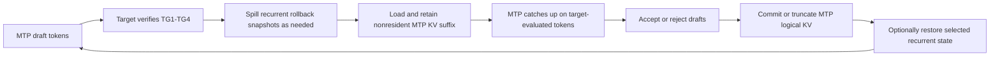

# Adaptive KV Streaming and MTP Integration Roadmap

## Background

This branch already provides a backend-neutral device-memory infrastructure, adaptive KV streaming for a single serial target context, phase-aware sharing between prefill compute workspace and decode KV storage, asynchronous K/V publication, cross-token prefetch, and sparse deadline feedback.

The next objective is to reintroduce Qwen3.8 Multi-Token Prediction (MTP) without giving up those properties. The target use case is a 16 GiB GPU running a Qwen3.8-27B target model with a 262144-token context. The target KV cache uses Q8_0 keys and Q4_0 values. The initial supported configuration remains one serial request, one accelerator, Flash Attention, and no parallel slots.

Qwen3.8-27B has 48 recurrent Gated DeltaNet blocks and 16 full-attention blocks. Its MTP head adds one logical full-attention layer. At 262144 tokens, the MTP layer has about 416 MiB of Q8_0/Q4_0 KV state. Reserving that entire layer as a separate permanent allocation would materially reduce target residency and long-context decode speed.

The desired design therefore treats the 16 target attention layers and the MTP attention layer as 17 logical layers sharing one physical KV budget. For each layer, a resident prefix remains in device memory and the nonresident suffix is copied into a shared ring. During an MTP phase, the complete MTP layer is present in device memory as two ordered spans: its resident prefix and its retained ring suffix. The suffix is loaded once, retained across catch-up and sequential draft steps, and released only after the MTP phase completes.

## Goals

- Preserve the current adaptive target-KV streaming behavior and its bounded device-memory budget.
- Support target verification widths from TG1 through TG4.
- Preserve stock attention arithmetic as closely as practical, especially the stock F16 MMA path used by quantized TG3/TG4 attention.
- Avoid a permanent 416 MiB MTP-only device allocation.
- Load the nonresident MTP KV suffix once per MTP phase, not once per draft token.
- Spill recurrent rollback snapshots to pinned host memory so speculative depth does not reserve several full device snapshot planes.
- Share phase-exclusive compute workspace among target decode, MTP catch-up, and MTP drafting.
- Keep policy, ownership, phase transitions, and span descriptions backend-neutral. Backend-specific code should implement execution only.
- Maintain explicit lifetime, generation, publication, and failure boundaries through the common memory infrastructure.

## Initial restrictions

The first production integration is intentionally restricted to the measured Qwen3.8-27B configuration:

- one serial sequence and one accelerator;
- 48 recurrent blocks, 16 target full-attention blocks, and one MTP full-attention block;
- Q8_0 key cache and Q4_0 value cache;
- target verification width of one through four tokens;
- Flash Attention and KV offload enabled;
- no mmproj, parallel requests, multi-GPU split, shared cache, or SWA cache;
- no claim of optimized streamed attention on non-CUDA backends until those adapters are implemented and measured.

The common contracts must not encode these restrictions. Unsupported configurations fail closed at the model integration gate.

## Core execution model

### Logical ownership

The target and MTP contexts keep separate logical cache identities, token frontiers, publication generations, and truncate/commit rules. They may share one physical arena, but they are not one logical cache.

### MTP layer residency

At the representative full-context layout, about 6593 Q8_0/Q4_0 pages are required across 17 attention layers. A feasible partition is approximately 348 resident pages per layer plus 677 shared ring pages. The MTP layer then needs 348 resident pages and 676 retained ring pages. Together those spans cover the complete layer.

The exact values are policy outputs, not constants. The invariant is:

```text
MTP resident prefix + retained MTP ring suffix = complete active MTP KV
```

The retained suffix is a lease on ring slots. Those slots cannot be recycled for target prefetch until the MTP catch-up and draft sequence finishes. Target-layer lookahead can use only genuinely spare ring capacity or capacity created by an explicit repartition.

### Speculative cycle

The intended steady-state cycle is:



Acceptance is decided only after the MTP context has caught up to the tokens evaluated by the target. Rejected suffixes are truncated in the MTP logical cache. The retained MTP span lease can remain active for the next draft sequence when its logical identity and publication generation still match.

### Why segmented attention is required

The complete logical KV sequence is not necessarily one contiguous allocation. A layer can be split among resident and ring ranges. Gathering the whole sequence into another contiguous buffer would either exceed the budget or add an avoidable full-layer copy.

The attention backend therefore receives an ordered list of physical spans that exactly cover one logical token interval. The kernel must preserve the stock algorithm's arithmetic order. For TG3/TG4 on the target CUDA configuration, this means extending the stock F16 MMA path to consume spans and perform bounded tile-local quantized conversion, rather than replacing it with a different online-softmax reduction tree.

## Numerical policy

Bit identity is required where the ordinary all-resident stock path is used. Streamed execution should minimize absolute error and preserve stock dispatch and accumulation order wherever possible.

- TG1/TG2 may use the existing stock vector family extended with span addressing.
- TG3/TG4 must use a span-aware extension of the stock F16 MMA family.
- Q8_0/Q4_0 conversion for MMA must be bounded and tile-local. It must preserve the stock conversion and tile traversal order.
- A generic merge of independently normalized per-span attention results is a correctness reference and fallback experiment, not the preferred production arithmetic.
- Every new path is compared against stock logits, recurrent state, and continuation tokens before performance qualification.

## Milestone 7: span-aware attention foundation

Outcome: stock attention families can consume one logical KV sequence represented by multiple retained physical spans without changing cache policy or model semantics.

| Stage | Implementation boundary | Required TDD evidence |
| --- | --- | --- |
| 7.1 | Add a backend-neutral ordered segmented-KV contract. Validate exact logical coverage, nonempty ordered spans, overflow-safe byte ranges, query width, and buffer lifetime ownership. Do not change runtime dispatch. | Pure CPU tests for one/multiple spans, gaps, overlaps, reorder, zero lengths, arithmetic overflow, out-of-range K/V storage, transactional failure, and retained-buffer lifetime. Existing KV geometry tests remain green under Debug, ASan/leak checking, and UBSan. |
| 7.2 | Add an exact CPU/reference evaluator over the segmented contract. It is the semantic oracle, not the optimized production path. | Random and adversarial partitions, tails, masks, TG1-TG4, all-resident equivalence, empty/invalid rejection, and deterministic comparison with contiguous reference attention. |
| 7.3 | Add a retained complete-layer lease that atomically reserves resident and ring spans for one logical layer and prevents ring reuse until retirement. | Delayed consumers, cancellation, generation mismatch, repartition rejection while leased, failure rollback, and release after last execution. |
| 7.4 | Extend the stock vector attention family to address ordered spans for TG1/TG2 while retaining stock arithmetic. | Partition-boundary cases, quantized K/V tails, masks, CUDA memcheck, stock logit/state comparison, and no gather-sized scratch. |
| 7.5 | Extend the stock F16 MMA attention family to consume spans for TG3/TG4 without changing tile or reduction order. | Every boundary position around MMA tiles, TG3/TG4, causal masks, sinks if supported, stock numerical comparison, bounded scratch, and Nsight dispatch confirmation. |
| 7.6 | Add bounded tile-local Q8_0/Q4_0 conversion for span-aware MMA. Avoid full-layer F16 gathering. | Conversion boundary/tail tests, exact converted tile comparison, fixed scratch ceiling independent of context, OOM tests, memcheck, and stock TG3/TG4 error qualification. |
| 7.7 | Route target TG1-TG4 attention through the segmented contract when a layer is streamed; retain ordinary stock dispatch when it is contiguous. | Real Qwen3.8 target inference, all-resident zero-regression control, streamed numerical qualification, 8K-192K performance sweep, H2D telemetry, and explicit fallback/rejection matrix. |
| 7.8 | Admit TG2-TG4 decode through the ring with exact vector/MMA workspace planning and stock Qwen MMA geometry. TG3/TG4 require a complete layer in the ring. | Byte-identical Qwen 64/8 output after session publication, wrapped-ring tests, incomplete-ring rejection, memcheck, and two-layer short/long-context latency. |

Milestone 7 acceptance:

- One immutable plan exactly describes the logical K/V sequence and retains every backing buffer through execution.
- Invalid or stale span plans fail before backend work is submitted.
- Contiguous input retains the stock dispatch and output.
- Streamed TG1-TG4 uses bounded scratch and does not gather the full active cache.
- Quantized TG3/TG4 follows the stock MMA arithmetic structure closely enough to meet the recorded numerical threshold.

## Milestone 8: host-spilled recurrent rollback

Outcome: speculative recurrent rollback depth no longer consumes multiple permanent device-sized state planes.

| Stage | Implementation boundary | Required TDD evidence |
| --- | --- | --- |
| 8.1 | Inventory recurrent state tensors, exact snapshot bytes, mutation points, and rollback semantics for the target model. | Layout and overflow tests, token-depth accounting, and byte-exact stock snapshot comparison. |
| 8.2 | Allocate authoritative rollback snapshots in pinned host memory with explicit sequence/generation identity. | Bounded host allocation, cancellation, stale identity rejection, leak checks, and no device allocation increase. |
| 8.3 | Add a bounded device staging region and asynchronous D2H snapshot publication. | Delayed completion, overwrite prevention, publication ordering, failure injection, and exact host bytes. |
| 8.4 | Restore only the accepted rollback point through asynchronous H2D before target reuse. | Every acceptance length, full rejection, no-rollback fast path, dependency ordering, and recurrent-state equivalence. |
| 8.5 | Overlap snapshot spill/restore with independent target and MTP work where dependencies permit. | Timeline evidence, no extra device-wide synchronization, unchanged outputs, and measured latency impact. |

## Milestone 9: shared target/MTP phase arena

Outcome: target decode, MTP catch-up, and MTP drafting share one stable physical device budget while keeping separate logical executions.

| Stage | Implementation boundary | Required TDD evidence |
| --- | --- | --- |
| 9.1 | Extend the phase vocabulary and requirements to target verify, recurrent spill/restore, MTP catch-up, and MTP draft. | Repeated transitions, cancellation at every boundary, and no per-token replan in a stable phase. |
| 9.2 | Add a session-level owner for target and MTP requirements, leases, executions, and generations. | Independent logical identities, aliased physical grants, delayed work, destruction order, and stale capture rejection. |
| 9.3 | Plan the target TG4 maximum requirement using span-aware attention and rollback staging. | Exact accounting, maximum-width execution, smaller-width reuse, and phase-safe fit boundary. |
| 9.4 | Plan MTP prompt/catch-up and sequential draft requirements without simultaneous target-only workspace. | Catch-up widths one through four, TG1 draft reuse, fixed parent identity, and reclaimed-byte diagnostics. |
| 9.5 | Publish one shared compute workspace to both schedulers with explicit exclusive admission. | No simultaneous alias use, drain before handoff, graph invalidation/rebuild, and recovery after failed activation. |

## Milestone 10: adaptive MTP KV integration

Outcome: the MTP logical cache participates in the same bounded physical KV budget as the target cache.

| Stage | Implementation boundary | Required TDD evidence |
| --- | --- | --- |
| 10.1 | Generalize physical policy from 16 target layers to 17 logical attention layers without merging target and MTP cache identities. | Dynamic geometry, exact total bytes, minimum-ring feasibility, and no hardcoded 16-layer arithmetic. |
| 10.2 | Add separate authoritative host cache, revision, publication frontiers, and truncate/commit operations for MTP. | Accepted/rejected suffixes, cache reuse, cancellation, save/restore, and cross-context identity rejection. |
| 10.3 | Populate authoritative MTP prompt KV through the common writer/publication path without claiming device residency. | Prompt chunking, wide ubatch, exact host contents, delayed completion, an unadvanced device frontier, and restart from host state. |
| 10.4 | Acquire and populate a retained complete-MTP-layer lease from resident plus ring spans. | One H2D load per lease, exact resident/ring device bytes, full logical coverage, ring exclusion, failure rollback, and release/reuse rules. |
| 10.5 | Reconcile target/MTP frontier lag, coordinate target ring admission, and run catch-up over retained spans with TG1-TG4. | All catch-up widths, no overwrite of retained MTP spans, exact frontier advancement, span-aware attention qualification, and no repeated suffix transfer. |
| 10.6 | Run sequential MTP draft tokens while retaining the same complete-layer lease. | Multiple draft tokens, append publication, mutable tail handling, and one-transfer invariant. |
| 10.7 | Integrate acceptance, MTP truncate/commit, and retained-lease invalidation. | Every accepted length, full rejection, target/MTP frontier agreement, cache generation changes, and retry behavior. |
| 10.8 | Add optional target-L1 prefetch only from spare capacity, with deadline feedback. | No eviction of retained MTP spans, miss recovery, disabled-equivalence control, and measured benefit. |

Stage 10.4 checkpoint: lease population is backend-neutral and synchronized before return.

Stage 10.5 infrastructure checkpoint: phase-scoped ring guards mask MTP-owned slots from target prefetch and survive prime/adopt. A populated MTP lease can expose a committed prefix while reserving physical slots up to the target frontier; future bytes remain untouched.

Still required for catch-up: map the target's 16 cache-local layers into the shared 17-layer physical layout, pass the guard through the live target session, publish the new MTP tail without re-uploading history, advance content generations, and run TG1-TG4 span attention.

## Milestone 11: end-to-end speculative server integration

Outcome: supported Qwen3.8 MTP requests execute through the adaptive memory system with bounded device memory and measured long-context benefit.

| Stage | Implementation boundary | Required TDD evidence |
| --- | --- | --- |
| 11.1 | Add a strict capability gate and configuration diagnostics for the initial supported setup. | Every accepted/rejected configuration and clear resource estimates. |
| 11.2 | Integrate the complete speculative cycle into llama-server without parallel execution. | Real prompts, serial follow-up requests, prompt cache, cancellation, and context truncation. |
| 11.3 | Coordinate cross-token retained-MTP reuse, target prefetch, recurrent spill/restore, and sparse feedback. | Long decode across repartitions, no stale work, bounded leases, and transfer telemetry. |
| 11.4 | Complete allocation, publication, execution, and recovery failure matrices. | Injected failures at every transition, explicit retry or invalid-session outcome, sanitizers, and sustained leak tests. |
| 11.5 | Qualify numerical behavior, memory, acceptance, and throughput from 8K through native context. | Stock/no-MTP controls, old adaptive-KV comparison, 256+ decoded tokens per point, pool/residency/H2D plots, and acceptance statistics. |

## Milestone 12: generalization

After the initial configuration is correct and useful:

- support other K/V quant pairs through the existing generic geometry/capability model;
- support other Qwen3.8 sizes and differing target/MTP attention geometries;
- add native span-aware execution adapters for ROCm, SYCL, Vulkan, OpenCL, and other accelerators;
- evaluate parallel slots, multiple devices, and split-mode layer placement;
- generalize retained logical-layer leases for paged attention and other cache policies.

## Cross-cutting correctness rules

1. Host KV remains authoritative whenever a device layout can be rebuilt.
2. Logical cache identity, content generation, arena generation, KV layout revision, and executable generation remain distinct.
3. A span plan is immutable after publication and retains all backing storage until the final consumer retires.
4. Repartition cannot reuse leased ring slots.
5. Failure leaves the previously committed logical and physical state valid, or marks the session explicitly invalid.
6. No stage may depend on UVM eviction for correctness or capacity accounting.
7. Common policy and ownership code contains no CUDA stream, event, pointer-attribute, or kernel type.
8. Performance claims require matched model, context, batch/ubatch, K/V type, device budget, prompt, decode length, and UVM mode.

## TDD workflow

Each stage follows the same sequence:

1. Add the smallest behavioral test that fails for the missing contract.
2. Record the expected compile or runtime failure.
3. Implement only the stage boundary.
4. Run focused Debug tests, then relevant existing regressions.
5. Run ASan/leak checking and UBSan for host/common code.
6. Run real-backend tests and memory checking when device execution changes.
7. Run stock numerical comparison before performance measurement.
8. Update this document with actual evidence and limitations.
9. Stage only the reviewed stage files; the user creates the commit.

## Progress ledger

| Stage | Status | Commit | Evidence / limitations |
| --- | --- | --- | --- |
| 7.1 | Complete | bff7edad3 | Ordered exact-coverage plans retain arena leases and support reference-counted asynchronous consumers. The new suite passes 7 cases / 60 assertions in CPU Debug, CUDA, OpenCL, oneAPI SYCL, and Vulkan-ASan builds, plus CPU ASan/leak checking and UBSan. Six focused Debug ownership/KV suites pass. No production dispatch changes. |
| 7.2 | Complete | 82879f1a9 | Scalar host oracle consumes retained plans continuously across physical boundaries, supports GQA, TG1-TG4, explicit/no mask, softcap, F16 and Q8_0/Q4_0, and transactional failure. The suite passes 5 cases / 4,591 assertions in all configured builds and sanitizers. No production dispatch changes. |
| 7.3 | Complete | ffba29bea | One common owner reserves a complete layer's resident prefix and contiguous ring suffix, shares that reservation across query widths, rejects identity changes/repartition while live, and releases slots after final retirement. The suite passes 5 cases / 338 assertions across configured builds and sanitizers. Production prefetch is not connected yet. |
| 7.4 | Complete | c78a5f5ec | CUDA stock vector attention consumes retained ordered spans for TG1/TG2 with one continuous per-thread softmax state, tail-safe loads, global causal-mask coordinates, stock split topology, and bounded query-aware scratch. New and legacy CUDA suites pass with errors below 3.8e-9 and clean memcheck. The plan hook is not routed into production yet. |
| 7.5 | Complete | f32351849 | CUDA TG3/TG4 F16 MMA restores the stock two-stage `cp.async` pipeline and uses the stock affine loader for span-contained tiles; only boundary tiles resolve rows. Production-shaped TG1 maps stock vector partial blocks wholly onto one of at most three page-aligned regions. At 128K, synthetic one-layer overhead is 5.3%/5.0% for two/three-span TG1 and 1.5%/1.6% for TG4. Numerical suites and memcheck pass. |
| 7.6 | Complete | 3287593cc | Q8_0 keys and Q4_0 values use bounded shared-memory conversion with stock-exact FP16 bytes and no context-sized F16 plane. Compressed K/V tiles are prefetched asynchronously into one existing MMA buffer and decoded into the other while the previous phase computes. All 24 span/context cases remain exact; at 128K TG4 is 7.9-10.7% faster than stock with unchanged workspace and clean memcheck. |
| 7.7 | Ready for review | - | Production TG1-TG4 dispatch consumes the physical resident/pre-wrap/post-wrap layout as at most three retained spans; contiguous layers remain on stock direct attention and suffixes larger than the ring retain branch-free aligned TG1 resume. Qwen3.8 continuation tokens match the production control exactly. CUDA, sanitizer, cross-backend contract, no-all-quants, memcheck, and 8K-192K performance qualifications pass. |
| 7.8 | Ready for review | - | TG2 uses aligned stock-split resume and preserves all output bytes across 32-page transfers. TG3/TG4 use the stock 4x8 MMA shape over a complete resident-plus-ring layer, including wrap or zero resident pages. Exact scratch is queried from the backend and incomplete-ring layouts fail before mutation. Qwen 64/8 tests, session append, model arena tests, no-all-quants compile, and memcheck pass. |


### Stage 7.1 implementation and validation

The first test build failed because the segmented-KV source, immutable plan, view, and lifecycle API did not exist. The implementation adds those types to the existing common `ggml-kv-stream` layer rather than creating a backend-specific subsystem. Creation validates a nonempty ordered partition of `[0, active_tokens)`, query width, K/V geometry, alignment, overflow-safe physical extents, and exact buffer bounds before publishing anything. Failure leaves the caller's output handle unchanged.

A successful plan retains every input arena lease, converts the inputs to an immutable buffer-and-offset view for backend execution, and exposes no mutable policy state. The plan itself is reference counted so asynchronous consumers can share it. Releasing the caller's original leases does not permit arena repartition: the test observes both source arenas in `DRAINING` state until the last plan reference is freed, after which both become `QUIESCENT`.

TDD and validation evidence:

- The intentional red build reported all missing span-plan types and functions.
- The focused suite passes 7 cases / 60 assertions, covering one and multiple spans, gaps, overlaps, reordered and empty spans, invalid query widths, alignment, independent K/V bounds, logical and byte overflow, transactional failure, immutable views, retained arena lifetime, and final-consumer reference counting.
- Existing geometry passes 18 cases / 1,205 assertions. The Debug memory-executor, backend-memory, KV binding, and KV session regressions also pass; six selected suites pass in total.
- The span, geometry, and backend-memory suites pass under ASan with leak detection and UBSan.
- The final reference-counted span suite builds and passes unchanged in CPU, CUDA, OpenCL, oneAPI SYCL, and Vulkan-ASan configurations.
- This stage adds no attention kernel, runtime dispatch, cache policy, device transfer, or production-server behavior. Stage 7.2 remains the exact segmented CPU/reference evaluator.

### Stage 7.2 implementation and validation

The first test build failed because the host reference header and segmented-attention evaluator did not exist. The implementation adds a separate common `ggml-kv-stream-reference` component to `ggml-base`. It accepts only a retained 7.1 plan backed by host-readable buffers, packed FP32 queries, an optional packed mask, query-head count, scale, and optional logit softcap. It returns packed FP32 output plus an explicit empty marker for every all-masked query/head row.

The oracle decodes each K/V row through GGML's existing type traits and traverses logical tokens in one continuous order. Physical span boundaries do not start a new softmax, merge partial results, or change accumulation order. Q8_0/Q4_0 and F16 contiguous-versus-segmented controls are therefore bit-identical in the oracle. Double-precision scalar dot, softmax, and weighted-value intermediates make it a semantic qualification tool, not an emulation of a particular optimized kernel's rounding. Unsupported device-only buffers and malformed/nonfinite inputs fail before output publication.

TDD and validation evidence:

- The intentional red build stopped on the missing `ggml-kv-stream-reference.h`. The first implementation build then exposed and corrected one missing direct standard-library include before any runtime test ran.
- The focused suite passes 5 cases / 4,591 assertions. It covers TG1-TG4, random data, one-token and irregular tail partitions, every-token partitions, physically reversed span placement, causal and finite masks, no-mask operation, softcap, GQA, all-masked rows, F32/F16/Q8_0/Q4_0 storage, invalid plans/shapes/buffers/values, and transactional output.
- Arbitrarily segmented F32 results match an independent scalar oracle. F16 and Q8_0/Q4_0 results are exactly equal between one-span and multi-span plans. The F32 segmented oracle also matches ordinary contiguous CPU Flash Attention within 2e-5.
- Five focused Debug suites pass: reference, spans, partial attention, geometry, and backend memory. The reference, span, and partial suites pass under ASan with leak detection and UBSan.
- The final 4,591-assertion suite builds and passes unchanged in CPU, CUDA, OpenCL, oneAPI SYCL, and Vulkan-ASan configurations.
- This stage adds no backend execution hook, attention kernel, cache policy, transfer, or production-server behavior. Stage 7.3 remains the retained complete-layer lease and ring-reuse exclusion boundary.

### Stage 7.3 implementation and validation

The first test build failed because no complete-layer reservation or lease contract existed. The implementation adds a common `llama-kv-stream-layer-lease` owner above the stage 7.1 span plan and the existing policy-derived physical layout. It retains the pool arena lease, validates the complete layout and identity, allocates one nonwrapping contiguous ring run for a layer's nonresident suffix, and creates an immutable resident-plus-ring plan. It performs no KV copy or publication; content population remains stage 10.4.

The physical reservation is independent of query width. A TG4 catch-up plan and TG1 draft plan for the same layer, layout revision, content generation, and active frontier share one reservation and therefore one future suffix upload. Each query-specific handle is reference counted. Ring slots, layout identity, and pool storage remain protected until the final handle reference retires, even after the owner is closed or destroyed. Different-layer reservations cannot reuse occupied slots, and rebind/repartition is rejected while any reservation or handle is live.

TDD and validation evidence:

- The intentional red build stopped on the missing `llama-kv-stream-layer-lease.h`.
- The focused suite passes 5 cases / 338 assertions. It covers resident-plus-ring coverage, policy-derived K/V offsets, numerical attention over a known physical resident/ring split, shared TG4/TG1 reservation, final-reference retirement, insufficient/fragmented capacity, layer/query/revision/generation mismatch, transactional failure, rebind rejection and success, close, delayed consumers, and owner destruction before the consumer.
- Five focused Debug suites pass: layer lease, segmented reference, spans, policy, and backend memory. The layer-lease, reference, and span suites pass under ASan with leak detection and UBSan.
- The final suite builds and passes unchanged in CPU, CUDA, OpenCL, oneAPI SYCL, and Vulkan-ASan configurations. The TSan configuration builds, but its runtime cannot start on this host and exits with `unexpected memory mapping`; no TSan runtime claim is made.
- This owner is not connected to the existing production prefetch scheduler. When MTP integration begins, it must become the single ring-admission authority so ordinary prefetch cannot bypass retained slots. This stage adds no device copy, attention kernel, policy decision, or production-server behavior. Stage 7.4 remains span-aware stock vector attention for TG1/TG2.

### Stage 7.4 implementation and validation

The first CUDA test build failed on the missing query-aware resume layout, TG2 resume state, and plan-consuming backend hook. The implementation extends the existing stock CUDA vector kernel rather than adding a second attention algorithm. Per-thread maximum, normalizer, and weighted-value accumulators are saved for one or two queries and restored across every ordered physical span. Normalization and cross-split reduction occur only after the final span.

Backend hook version 6 accepts the immutable stage 7.1 span plan. The common plan remains backend-neutral; CUDA validates every buffer, byte range, mask/output alias, query width, type pair, and exact workspace before the first launch. Query-aware workspace accounting is tied to the logical token extent. CUDA instantiates TG1/TG2 stock and resumed vector variants per native K/V pair and derives split count from the same ordinary-vector occupancy topology as stock. Arbitrary final tails skip invalid K/V lanes rather than reading padded bytes outside a span.

TDD exposed two correctness details before acceptance. First, resumed-kernel occupancy produced a different split topology from stock, so planning now uses the matching ordinary vector specialization. Second, K/V pointers are span-local but the causal mask remains globally indexed. Advancing the mask by a local offset admitted one extra TG2 token and caused a context-inverse error; the kernel now keeps global mask coordinates, while the legacy per-span adapter reconstructs the original mask base.

TDD and validation evidence:

- The intentional red build reported the missing query dimension, `spans` hook, and query-aware planner ABI.
- The new suite passes 4 cases / 62 assertions. It covers TG1/TG2 workspace accounting, hook discovery, Q8_0/Q4_0 contexts of 257, 513, and 1017 tokens, contiguous and highly fragmented boundaries at 1/127/128/255/256/257 and final tails, causal masks, stock comparison, null/mismatched plans, undersized workspace, and output preservation.
- Across all six TG/context points, segmented-versus-contiguous and segmented-versus-stock maximum absolute error is at most 3.72529e-9, below the explicit 1e-7 partition gate. Byte identity is not claimed.
- The legacy TG1 resume suite passes 4 cases / 110 assertions across Q8_0/Q4_0, Q5_1/Q4_1, and Q4_0/F16 at 513, 769, and 4097 active tokens. Maximum stock error is at most 2.79397e-9.
- The full CUDA block suite passes 20 cases / 656,887 assertions, the session suite 9 / 481, and the model suite 7 / 159. Compute Sanitizer memcheck reports zero errors and zero leaked bytes for both new and legacy vector suites.
- CPU Debug, ASan with leak detection, UBSan, OpenCL, oneAPI SYCL, and Vulkan-ASan builds pass the common query-aware layout and host-only contract tests.
- Existing production workspace planning explicitly requests TG1, so its behavior and allocation remain unchanged. The new `spans` hook is not yet called by production inference. The production container was restored with its existing configuration and `/health` reports `ok`. Stage 7.5 remains the span-aware stock F16 MMA path for TG3/TG4.

### Stage 7.5 implementation and validation

The intentional red test changed the immutable-plan backend contract to request TG3/TG4 execution and exact workspace sizing. It failed because version 6 exposed only the resumed vector family. Version 7 adds a bounded `spans_workspace` query and one private generic CUDA span descriptor shared by the vector and MMA execution families. The common span plan remains unchanged and backend-neutral.

The CUDA implementation refactors the ordinary F16 MMA kernel body behind contiguous and span-aware wrappers. Span-contained K/V tiles resolve their physical interval once and delegate directly to the stock affine loader. Tiles crossing a physical boundary use tail-safe row resolution. Both paths retain the stock two-stage `cp.async` schedule, shared-memory layout, `ncols1=4`/`ncols2=2` MMA traversal, Stream-K block selection, partial metadata, and uniform/general fixup kernels. Physical span boundaries therefore do not create independently normalized MMA results or alter its reduction tree.

The production TG1 fast path takes advantage of the physical layout invariant: resident, pre-wrap ring, and post-wrap ring form at most three regions with 128-token-aligned starts. One launch assigns each stock vector partial block wholly to one region, runs the unchanged affine stock-vector body, and combines all partials through the stock combine kernel. An exact final tail is copied into one bounded zero-padded 128-token staging record and may become an internal fourth descriptor; TG2 and nonaligned interior boundaries retain the stage 7.4 resumable fallback. This keeps the general immutable-span contract correct without imposing its most conservative path on page-aligned production layouts.

Workspace contains only span descriptors plus the existing stock partial/fixup state; it never contains a full gathered layer. Descriptor publication is asynchronous on the execution stream. The ordinary all-resident wrappers retain their public launch ABI and arithmetic path; stage 7.7 remains responsible for bypassing segmented dispatch entirely when the logical cache is already contiguous.

TDD and validation evidence:

- The initial CUDA build failed on the missing version-7 workspace hook. Restoring two-stage MMA first exposed the dynamic shared-memory attribute requirement; matching stock attribute setup fixed occupancy planning before any kernel launch.
- The focused suite passes 7 cases / 253 assertions. It covers TG1/TG2 Q8_0/Q4_0, page-aligned one/two/wrapped-three-span TG1, TG3/TG4 F16, exact tails, and adversarial cuts at 1, 63/64/65, 127/128, 255/256/257, and final boundaries under causal masks.
- Page-aligned and exact-tail TG1 differs from stock by at most 2.79397e-9. Tail-safe/resumable TG1/TG2 differs by at most 4.65661e-9. All tested TG3/TG4 contiguous, two-span, wrapped-three-span, and adversarial fragmented outputs are exactly equal to ordinary stock F16 MMA.
- Both contiguous and heavily fragmented MMA workspace sizes remain below the corresponding full K/V gather size. Nsight Systems confirms the span-aware MMA plus stock Stream-K fixup dispatch and no gather kernel.
- The opt-in one-layer benchmark uses warmed repeated executions at 8K, 32K, 64K, and 128K. At 128K, resident-plus-ring overhead is 5.3% for TG1 and 1.5% for TG4; adding a ring-wrap region yields 5.0% and 1.6%. At 128K plus one token, bounded tail handling measures 9.2%/11.7% for two/three-region TG1 and approximately 12% for the current F16 TG4 boundary path. At 32K, production-shaped results remain within approximately 10% for both families. A 64K two-span TG1 point remains an observed scheduling discontinuity at 14.3%, while its wrapped-three-span case is 4.4%. Short-context percentages are dominated by fixed launch/planning cost; production should retain stock dispatch before streaming is necessary.
- Compute Sanitizer memcheck reports zero errors. The legacy TG1 resume suite passes 4 cases / 110 assertions, and the CUDA block suite passes 20 cases / 656,887 assertions across all native/fallback quant pairs.
- CPU Debug, ASan with leak detection, UBSan, OpenCL, oneAPI SYCL, and Vulkan-ASan builds pass the unchanged host contract. The CUDA backend also compiles with `GGML_CUDA_FA_ALL_QUANTS` disabled.
- The optimized vector path currently requires TG1 and 128-token-aligned physical starts; it handles one exact final tail through bounded staging, while other vector shapes fail over to the resumable implementation. The MMA executor still rejects sinks, softcap, ALiBi, other head geometries, multi-sequence batches, non-F16 spans, and widths outside TG3/TG4 before launch. Stage 7.6 supplies bounded Q8_0/Q4_0 tile conversion, and production routing remains stage 7.7.

### Stage 7.6 implementation and validation

The intentional red suite added Q8_0/Q4_0 TG3/TG4 execution over one, two, wrapped-three, and adversarial span layouts. All 24 executions were rejected by the version-7 F16-only gate while every Stage 7.5 control remained green.

Version 8 adds typed K/V storage parameters to the span-aware MMA specialization. F16 spans retain their asynchronous affine loader. Q8_0 keys and Q4_0 values preserve the same stock arithmetic while loading paired quant bytes and storing packed `half2` results. Q4_0 deliberately preserves stock FP32 multiply-then-add order before FP16 rounding; algebraically folding the offset initially caused 35 of 1,792 half values to differ and was rejected by the byte test.

The final multi-stage path reuses the two existing shared MMA buffers asymmetrically: one holds the asynchronously prefetched compressed K or V tile while the other holds the decoded F16 tile consumed by MMA. During KQ, V is prefetched; during VKQ, the next K tile is prefetched. No extra shared allocation, global conversion plane, arithmetic regrouping, or softmax-order change is introduced.

No full-cache conversion allocation is introduced. The only device workspace remains the descriptor table and stock Stream-K fixup metadata already planned in Stage 7.5. Conversion storage is the existing bounded shared MMA tile. A private version-8 row-conversion hook invokes the same device helper for direct byte qualification and reusable backend testing; it allocates nothing and remains outside the public llama API.

TDD and validation evidence:

- The focused CUDA suite passes 11 cases / 446 assertions. It covers TG3/TG4, contexts 257/513/1017, causal tails, one/two/wrapped-three/adversarial spans, exact final boundaries, and all Stage 7.4/7.5 controls.
- The tile-local Q8_0 and Q4_0 converters are byte-identical to stock for all 1,792 tested FP16 values per type. All 24 quantized span-attention comparisons have maximum absolute error exactly zero against ordinary stock attention.
- Quantized MMA workspace is 266,624 bytes in the focused matrix and 582,656 bytes at 8K, below a fixed 1 MiB qualification ceiling and far below the 16 MiB full F16 K/V gather. An exact-size-minus-one workspace is rejected before output mutation.
- Compute Sanitizer memcheck reports zero errors. The legacy resume suite passes 4 cases / 110 assertions and the full CUDA block/type-pair suite passes 20 cases / 656,887 assertions.
- CPU Debug, ASan with leak detection, UBSan, OpenCL, oneAPI SYCL, and Vulkan-ASan retain the backend-neutral host contract. The CUDA path remains gated to Q8_0/Q4_0 or F16/F16 with the measured Qwen3.8 geometry.
- Nsight isolated the rejected synchronous prototype: 93.47% of scheduler cycles had no eligible warp, 64.4% of sampled stalls were long-scoreboard waits, 84% of global sectors and 58% of shared wavefronts were excessive, while SM and DRAM throughput were only 5.61% and 4.69%. Paired loads/stores improved 128K by about 13%; restoring compressed `cp.async` overlap reduced TG4 from 2.35-2.41 ms to 0.73-0.75 ms.
- Relative to stock at 128K, one/two/three-span TG4 is 10.7%/8.4%/8.2% faster. At 64K it ranges from 2.2% faster to 0.7% slower; at 32K it costs 7.3-11.0%. The 8K fixed cost is 60-65%, so Stage 7.7 must route contiguous caches to ordinary stock execution and qualify the streamed real model. Production dispatch remains unchanged.

### Stage 7.7 implementation and validation

Production decode now constructs one immutable complete-layer plan directly from the resident prefix and the submitted ring ranges. The binding publishes its borrowed arena lease to the native factory, the resident owner retains that lease, and every asynchronous span plan remains retained until the complete layer sequence drains. Copy-slot retirement records a completion event after attention on the compute stream; a ring slot cannot be overwritten merely because its H2D transfer completed.

The optimized route is deliberately narrow. An all-resident layer continues through ordinary stock attention. A streamed production layer is represented by at most three page-aligned ranges: resident prefix, ring before wrap, and ring after wrap. Streamed Q8_0/Q4_0 TG1-TG4 and F16/F16 TG3/TG4 use that fixed-span executor whenever the complete suffix fits the ring. If the suffix exceeds ring capacity, TG1 retains the resumable copy/compute pipeline but selects a separate compile-time branch-free kernel for 256-token-aligned waves; arbitrary-tail TG1/TG2 remains a correctness fallback, not the production hot path. Zero-resident layouts, unsupported types or geometry, missing hooks, insufficient workspace, and non-covering plans fail over or fail closed rather than partially publishing output. The CUDA validator checks Q, mask, output, workspace, and every retained physical span independently; it no longer requires a fictitious contiguous K/V prototype allocation.

TDD and validation evidence:

- The production-shaped CUDA route covers 64 query heads, 8 KV heads, Q8_0/Q4_0 storage, TG1-TG4, 769/1025 active-token controls, and resident-plus-pre-wrap-plus-post-wrap layouts. The final resume suite passes 6 cases / 217 assertions; the span executor passes 11 / 476, resident 13 / 273, session 9 / 481, copy 23 / 3,211, and binding 16 / 3,109.
- All-resident graph execution remains on stock attention for query widths 1, 2, 3, 4, 8, and 33. Streamed production-geometry comparisons remain within 7.45058e-9 absolute error; TG3/TG4 quantized span tests remain exactly equal to stock.
- A real Qwen3.8-27B IQ4_XS run at 131072 prompt tokens produced the same 32/32 deterministic continuation token IDs as the production implementation. It measured 24.96 tok/s decode versus 23.20 tok/s for that production control while using the same 2688 MiB phase arena.
- The 8K-192K, 8K-step sweep showed no material pre-streaming regression. Relative to the preceding memory-infrastructure implementation, decode was within -1.91% to +0.15% through 112K and improved by 4.50%, 2.87%, and 0.45% at 120K, 128K, and 136K. Its long-context regression triggered the matched causal investigation below.
- A final 144K fallback A/B used an independently built clean `3287593cc` worktree with identical model, context, arena, batch, UVM, and request. Clean HEAD measured 10.6679 tok/s and Stage 7.7 measured 10.6700 tok/s with identical 256-token output, demonstrating that Stage 7.7 itself does not further regress fallback decode.
- A second matched causal A/B used the same current driver, model, 147456 context, 147200-token prompt, 256-token decode, 2688 MiB arena, 256/256 batch, resident-399/ring-209 layout, and 1,144.83 MiB H2D per token. The exact pre-Stage-7 boundary `ffba29bea` measured 23.57 tok/s while the Stage 7.4-derived path measured 10.67 tok/s; pinned H2D measured 49.22 GB/s. The regression came from applying arbitrary-tail guards and fragmented resume topology to the aligned production case.
- The final fixed-span build uses 106 H2D calls rather than 394 for the same 1,144.83 MiB and reaches 21.41 tok/s, recovering 90.8% of the 23.57 tok/s baseline and meeting the 5-10% overhead target within measurement rounding. The new 161-page-suffix test proves a suffix larger than the rejected cutoff still executes as one fixed-span attention launch. Aligned resumable Q8_0/Q4_0, Q5_1/Q4_1, and Q4_0/F16 controls are bit-exact with stock; arbitrary-tail TG1/TG2 tests retain their prior error bounds.
- Nsight Systems at 144K attributes 79.1% of the decode window to kernels and 52.3% to H2D, with 67.7% copy/compute overlap, 96.0% combined GPU activity, 25.13 GB/s averaged over the whole token window, and 48.02 GB/s while DMA is active. The apparent 50-60% H2D utilization is therefore exposed-copy duty cycle, not an underfilled PCIe burst; raw pinned H2D is 49.22 GB/s on this host.
- Cross-token feedback now advances with successful owner-session publication instead of being reset by every content generation. A primed sequence evaluates feedback before adoption and falls back transactionally when a new layout is required. Opt-in `LLAMA_KV_STREAM_TRACE_POLICY=1` logging exposes accepted sample deltas, misses, copy duty, peak slots, and proposed layout transitions without affecting default execution.
- Version 9 samples one complete immutable layer before any acquire waits. At 160K the controller converges from resident-395/ring-273 to resident-387/ring-401 and then reports 16/16 layer hits, but steady decode remains about 17.5 tok/s. This proves current-layer readiness is necessary but not sufficient to hide transfer time; ring growth beyond the zero-miss point is rejected as added traffic without throughput benefit.
- A matched stable ring-401 Nsight window measures 40.3 ms/token of kernels, 36.1 ms/token of H2D, but only 18.7 ms/token of overlap (52.0%). Historical phase arena measures 42.4/35.2/34.0 ms respectively (96.6% overlap). The current kernels are faster and active H2D remains 48.0 GB/s; approximately 17.3 ms/token is copy-only scheduling time.
- Version 10 assigns one retained ready fence and one retained final-consumer fence to each transfer batch while preserving per-slot logical ownership and partial-consumer fallback. Direct tests prove a two-page production batch uses one record/wait at each boundary, while partial consumers safely share readiness and retain individual consumed fences. The focused CUDA copy suite passes 25 cases / 3,260 assertions. The 160K fixed-span A/B is throughput-neutral (16.97 versus 16.95 tok/s), so this is retained as a complexity/dependency reduction rather than claimed as a speedup.
- Progressive TG1 reuses the stock 17 interleaved split states and final combine across streamed ranges. Transport and execution granularities are separate: each prefetch request and ready/consumed fence remains bounded to 32 pages, while up to three physically contiguous ready requests share one resumed-attention launch. A ring wrap ends the group rather than widening or copying across it. The production-shaped CUDA test proves 3 + 4 K/V DMA batches across two layers, 2 + 3 attention launches, and zero error against stock.
- The earlier opt-in A/B measured 19.48/19.69/20.08 tok/s for coupled 32/64/96-page copy/resume ceilings. With strict 32-page DMA and 96-page resume grouping enabled in production, the matched 160K IQ4_XS run reaches 20.66 tok/s over 256 decode tokens, versus approximately 17.42 tok/s for fixed-span execution, while retaining the 2,688 MiB arena and 1,602.33 MiB H2D per token. Measured H2D utilization is 69.4%.
- The zero-resident shrink test first exposed a wrapped-layer error of 0.00216693 on the complete-span route. Making zero residency an explicit resumable fallback restored the established 1.6e-5-class test error and all 481 session assertions.
- Compute Sanitizer reports zero errors. The CUDA backend compiles with `GGML_CUDA_FA_ALL_QUANTS` disabled. Binding and host-contract tests pass under ASan/leak checking, UBSan, OpenCL, oneAPI SYCL/Level Zero, and Vulkan-ASan.
- The remaining optimized production gate is intentionally limited to the documented single-sequence Qwen3.8 geometry. Other types, sinks, bias/softcap, multi-sequence batches, and unqualified head shapes retain existing paths; broader backend execution remains later work.

### Stage 7.8 implementation and validation

TG2 uses the page-aligned stock vector specialization, retaining each stock split's softmax state across at most 32-page DMA requests. A resume launch may consume up to three contiguous ready requests without widening their copy or fence ownership. TG3/TG4 use the stock 4x8 F16 MMA shape for Qwen's 64 query heads and 8 KV heads. The backend reports the exact maximum scratch requirement for three physical spans; the session checks that the complete streamed layer fits in the ring before changing the layout.

The production-shaped 25,601-token and 163,840-token tests compare the public FP32 attention output byte for byte with stock Q8_0/Q4_0 attention. TG2, TG3, and TG4 match for both layers at both lengths, including a wrapped ring layer. Session tests also match stock after appending and publishing new KV rows. A fixed ring too small to contain a full TG4 layer is rejected without changing the committed token frontier or layout revision.

| Active tokens | TG | Previous partial path (ms) | Exact native path (ms) | H2D calls |
| ---: | ---: | ---: | ---: | ---: |
| 25,601 | 2 | 3.515 | 4.264 | 14 |
| 25,601 | 3 | 3.875 | 3.600 | 14 |
| 25,601 | 4 | 4.780 | 3.583 | 14 |
| 163,840 | 2 | 13.693 | 8.790 | 32 |
| 163,840 | 3 | 20.351 | 10.729 | 32 |
| 163,840 | 4 | 27.321 | 11.065 | 32 |

These are uncontended medians of 12 measured two-layer evaluations after three warmups, not full-model token rates. The previous partial path has different arithmetic, so stock byte identity is qualified separately. TG2 is slower at the forced-streaming 25K point; the actual target normally stays all-resident there. The 160K two-layer speed gains are 35.8%, 47.3%, and 59.5% for TG2, TG3, and TG4 respectively.

The focused resume suite passes 9 cases / 311 assertions, including zero-resident complete-ring TG3/TG4 and a transactional MMA workspace query; session 13 / 603; model 7 / 159; span executor 11 / 476; copy 25 / 3,260. Compute Sanitizer reports zero errors. The CUDA target also compiles with `GGML_CUDA_FA_ALL_QUANTS=OFF`. TG3/TG4 multi-wave attention when one complete layer cannot fit the ring remains unsupported; the session fails closed. The MTP speculative cycle and its end-to-end token-rate benefit remain later milestones.

### Milestones 8-9 implementation checkpoint (2026-09-24)

The experimental `LLAMA_RS_HOST_SPILL=1` path is isolated from the default server configuration. `LLAMA_RS_STAGED_PUBLICATION=1` additionally selects the bounded device-stage publication path on CPU or CUDA; other backends fail closed until they add an adapter.

- Stage 8.1: an exact type/row/depth layout accounts for stock recurrent R/S device planes, one current device plane, host snapshots, and transient stage bytes. Overflow and invalid-quant geometry are tested.
- Stages 8.2-8.4: a versioned host bank supports CPU-host and CUDA-pinned allocations, asynchronous snapshot capture, mixed-generation and pristine-zero restore, cancellation, and identity checks. The staged path copies each R/S rollback snapshot to a backend-selected device ring, then uses a backend-local execution-buffer marker to queue D2H on an independent copy backend. No scheduler eval callback or whole-graph synchronization is used. Normal inference defers selected-state H2D until graph execution; host checkpoints read the selected snapshot directly, while device-native checkpoints materialize it before writing.
- Stage 8.3: a checked stage-ring layout allocates two device-local TG4 slots using 18.70 MiB for the measured 48-layer Qwen geometry. Per-part producer-ready events and per-slot D2H-consumed events prevent early reuse. CPU and CUDA tests verify exact bytes across three recurrent layers sharing two slots, partial-capture cancellation/retry, and CUDA memcheck with zero errors.
- Stage 8.4: tiny Qwen35 CPU/CUDA tests compare host snapshots and logits with stock, exercise rollback depths zero through eight, and verify host/device checkpoint replay. A generated three-recurrent-layer fixture covers actual graph slot reuse with TG4 depth. CPU ASan with leak detection passes. Full IQ4_XS on the 5070 Ti under UVM passes every TG4 rollback depth and checkpoint subcase against stock.
- Stage 8.5: a CUDA handoff test runs an MTP-side graph on the target's former arena before the target's staged D2H publication completes. Nsight Systems on the full IQ4_XS test records 4.15 GB of recurrent D2H traffic; 72.2% of copy time overlaps GPU kernels versus 38.9% for a matched direct-host-spill control. Active D2H throughput is 47.9 versus 43.9 GB/s. This is transfer overlap evidence, not a demonstrated end-to-end token-rate improvement.
- Stages 9.1–9.2: a backend-neutral work-phase tracker and serial session owner track independent target/MTP cache identities, admission, transition recovery, and stale-generation rejection.
- Stages 9.3–9.4, infrastructure only: an aligned byte planner takes measured TG1–TG4 target verification and MTP catch-up graphs plus *additional* staging bytes, chooses the peak shared-parent grant, and reports phase-specific reclaimed bytes. Width admission rejects a request wider than its planned grant. This planner is not yet fed by both live model contexts.
- Stage 9.5, infrastructure scope: two real CPU schedulers and two CUDA schedulers alternately compute on one physical arena, with one active lease and equal workspace addresses. The CUDA test retires native captures before release and proves that an independent staged D2H copy remains valid across handoff. The actual target/MTP contexts are not yet constructed under this owner; that bridge depends on MTP KV integration and remains part of Milestones 10-11.

The existing KV-streaming speculative gate remains in place. Do not claim MTP-on-adaptive-KV inference or a long-context token-rate speedup from these tests. Milestone 9's generic workspace contract is validated; real-context construction and MTP KV ownership remain for Milestones 10-11. Before enabling the path by default, benchmark verification and draft throughput at several context lengths, qualify cancellation under real server requests, and add adapters for other backends.
