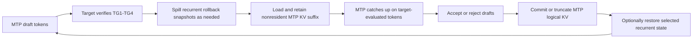

# Adaptive KV Streaming and MTP Integration Roadmap

## Background

This branch already provides a backend-neutral device-memory infrastructure, adaptive KV streaming for a single serial target context, phase-aware sharing between prefill compute workspace and decode KV storage, asynchronous K/V publication, cross-token prefetch, and sparse deadline feedback.

The next objective is to reintroduce Qwen3.8 Multi-Token Prediction (MTP) without giving up those properties. The target use case is a 16 GiB GPU running a Qwen3.8-27B target model with a 262144-token context. The target KV cache uses Q8_0 keys and Q4_0 values. The initial supported configuration remains one serial request, one accelerator, Flash Attention, and no parallel slots.

Qwen3.8-27B has 48 recurrent Gated DeltaNet blocks and 16 full-attention blocks. Its MTP head adds one logical full-attention layer. At 262144 tokens, the MTP layer has about 416 MiB of Q8_0/Q4_0 KV state. Reserving that entire layer as a separate permanent allocation would materially reduce target residency and long-context decode speed.

The desired design therefore treats the 16 target attention layers and the MTP attention layer as 17 logical layers sharing one physical KV budget. For each layer, a resident prefix remains in device memory and the nonresident suffix is copied into a shared ring. During an MTP phase, the complete MTP layer is present in device memory as two ordered spans: its resident prefix and its retained ring suffix. The suffix is loaded once, retained across catch-up and sequential draft steps, and released only after the MTP phase completes.

## Goals

- Preserve the current adaptive target-KV streaming behavior and its bounded device-memory budget.
- Support target verification widths from TG1 through TG4.
- Preserve stock attention arithmetic as closely as practical, especially the stock F16 MMA path used by quantized TG3/TG4 attention.
- Avoid a permanent 416 MiB MTP-only device allocation.
- Load the nonresident MTP KV suffix once per MTP phase, not once per draft token.
- Spill recurrent rollback snapshots to pinned host memory so speculative depth does not reserve several full device snapshot planes.
- Share phase-exclusive compute workspace among target decode, MTP catch-up, and MTP drafting.
- Keep policy, ownership, phase transitions, and span descriptions backend-neutral. Backend-specific code should implement execution only.
- Maintain explicit lifetime, generation, publication, and failure boundaries through the common memory infrastructure.

## Initial restrictions

The first production integration is intentionally restricted to the measured Qwen3.8-27B configuration:

- one serial sequence and one accelerator;
- 48 recurrent blocks, 16 target full-attention blocks, and one MTP full-attention block;
- Q8_0 key cache and Q4_0 value cache;
- target verification width of one through four tokens;
- Flash Attention and KV offload enabled;
- no mmproj, parallel requests, multi-GPU split, shared cache, or SWA cache;
- no claim of optimized streamed attention on non-CUDA backends until those adapters are implemented and measured.

The common contracts must not encode these restrictions. Unsupported configurations fail closed at the model integration gate.

## Core execution model

### Logical ownership

The target and MTP contexts keep separate logical cache identities, token frontiers, publication generations, and truncate/commit rules. They may share one physical arena, but they are not one logical cache.

### MTP layer residency

At the representative full-context layout, about 6593 Q8_0/Q4_0 pages are required across 17 attention layers. A feasible partition is approximately 348 resident pages per layer plus 677 shared ring pages. The MTP layer then needs 348 resident pages and 676 retained ring pages. Together those spans cover the complete layer.

The exact values are policy outputs, not constants. The invariant is:

```text
MTP resident prefix + retained MTP ring suffix = complete active MTP KV
```

The retained suffix is a lease on ring slots. Those slots cannot be recycled for target prefetch until the MTP catch-up and draft sequence finishes. Target-layer lookahead can use only genuinely spare ring capacity or capacity created by an explicit repartition.

### Speculative cycle

The intended steady-state cycle is:



Acceptance is decided only after the MTP context has caught up to the tokens evaluated by the target. Rejected suffixes are truncated in the MTP logical cache. The retained MTP span lease can remain active for the next draft sequence when its logical identity and publication generation still match.

### Why segmented attention is required

The complete logical KV sequence is not necessarily one contiguous allocation. A layer can be split among resident and ring ranges. Gathering the whole sequence into another contiguous buffer would either exceed the budget or add an avoidable full-layer copy.

The attention backend therefore receives an ordered list of physical spans that exactly cover one logical token interval. The kernel must preserve the stock algorithm's arithmetic order. For TG3/TG4 on the target CUDA configuration, this means extending the stock F16 MMA path to consume spans and perform bounded tile-local quantized conversion, rather than replacing it with a different online-softmax reduction tree.

## Numerical policy

Bit identity is required where the ordinary all-resident stock path is used. Streamed execution should minimize absolute error and preserve stock dispatch and accumulation order wherever possible.

- TG1/TG2 may use the existing stock vector family extended with span addressing.
- TG3/TG4 must use a span-aware extension of the stock F16 MMA family.
- Q8_0/Q4_0 conversion for MMA must be bounded and tile-local. It must preserve the stock conversion and tile traversal order.
- A generic merge of independently normalized per-span attention results is a correctness reference and fallback experiment, not the preferred production arithmetic.
- Every new path is compared against stock logits, recurrent state, and continuation tokens before performance qualification.

## Milestone 7: span-aware attention foundation

Outcome: stock attention families can consume one logical KV sequence represented by multiple retained physical spans without changing cache policy or model semantics.

| Stage | Implementation boundary | Required TDD evidence |
| --- | --- | --- |
| 7.1 | Add a backend-neutral ordered segmented-KV contract. Validate exact logical coverage, nonempty ordered spans, overflow-safe byte ranges, query width, and buffer lifetime ownership. Do not change runtime dispatch. | Pure CPU tests for one/multiple spans, gaps, overlaps, reorder, zero lengths, arithmetic overflow, out-of-range K/V storage, transactional failure, and retained-buffer lifetime. Existing KV geometry tests remain green under Debug, ASan/leak checking, and UBSan. |
| 7.2 | Add an exact CPU/reference evaluator over the segmented contract. It is the semantic oracle, not the optimized production path. | Random and adversarial partitions, tails, masks, TG1-TG4, all-resident equivalence, empty/invalid rejection, and deterministic comparison with contiguous reference attention. |
| 7.3 | Add a retained complete-layer lease that atomically reserves resident and ring spans for one logical layer and prevents ring reuse until retirement. | Delayed consumers, cancellation, generation mismatch, repartition rejection while leased, failure rollback, and release after last execution. |
| 7.4 | Extend the stock vector attention family to address ordered spans for TG1/TG2 while retaining stock arithmetic. | Partition-boundary cases, quantized K/V tails, masks, CUDA memcheck, stock logit/state comparison, and no gather-sized scratch. |
| 7.5 | Extend the stock F16 MMA attention family to consume spans for TG3/TG4 without changing tile or reduction order. | Every boundary position around MMA tiles, TG3/TG4, causal masks, sinks if supported, stock numerical comparison, bounded scratch, and Nsight dispatch confirmation. |
| 7.6 | Add bounded tile-local Q8_0/Q4_0 conversion for span-aware MMA. Avoid full-layer F16 gathering. | Conversion boundary/tail tests, exact converted tile comparison, fixed scratch ceiling independent of context, OOM tests, memcheck, and stock TG3/TG4 error qualification. |
| 7.7 | Route target TG1-TG4 attention through the segmented contract when a layer is streamed; retain ordinary stock dispatch when it is contiguous. | Real Qwen3.8 target inference, all-resident zero-regression control, streamed numerical qualification, 8K-192K performance sweep, H2D telemetry, and explicit fallback/rejection matrix. |

Milestone 7 acceptance:

- One immutable plan exactly describes the logical K/V sequence and retains every backing buffer through execution.
- Invalid or stale span plans fail before backend work is submitted.
- Contiguous input retains the stock dispatch and output.
- Streamed TG1-TG4 uses bounded scratch and does not gather the full active cache.
- Quantized TG3/TG4 follows the stock MMA arithmetic structure closely enough to meet the recorded numerical threshold.

## Milestone 8: host-spilled recurrent rollback

Outcome: speculative recurrent rollback depth no longer consumes multiple permanent device-sized state planes.

| Stage | Implementation boundary | Required TDD evidence |
| --- | --- | --- |
| 8.1 | Inventory recurrent state tensors, exact snapshot bytes, mutation points, and rollback semantics for the target model. | Layout and overflow tests, token-depth accounting, and byte-exact stock snapshot comparison. |
| 8.2 | Allocate authoritative rollback snapshots in pinned host memory with explicit sequence/generation identity. | Bounded host allocation, cancellation, stale identity rejection, leak checks, and no device allocation increase. |
| 8.3 | Add a bounded device staging region and asynchronous D2H snapshot publication. | Delayed completion, overwrite prevention, publication ordering, failure injection, and exact host bytes. |
| 8.4 | Restore only the accepted rollback point through asynchronous H2D before target reuse. | Every acceptance length, full rejection, no-rollback fast path, dependency ordering, and recurrent-state equivalence. |
| 8.5 | Overlap snapshot spill/restore with independent target and MTP work where dependencies permit. | Timeline evidence, no extra device-wide synchronization, unchanged outputs, and measured latency impact. |

## Milestone 9: shared target/MTP phase arena

Outcome: target decode, MTP catch-up, and MTP drafting share one stable physical device budget while keeping separate logical executions.

| Stage | Implementation boundary | Required TDD evidence |
| --- | --- | --- |
| 9.1 | Extend the phase vocabulary and requirements to target verify, recurrent spill/restore, MTP catch-up, and MTP draft. | Repeated transitions, cancellation at every boundary, and no per-token replan in a stable phase. |
| 9.2 | Add a session-level owner for target and MTP requirements, leases, executions, and generations. | Independent logical identities, aliased physical grants, delayed work, destruction order, and stale capture rejection. |
| 9.3 | Plan the target TG4 maximum requirement using span-aware attention and rollback staging. | Exact accounting, maximum-width execution, smaller-width reuse, and phase-safe fit boundary. |
| 9.4 | Plan MTP prompt/catch-up and sequential draft requirements without simultaneous target-only workspace. | Catch-up widths one through four, TG1 draft reuse, fixed parent identity, and reclaimed-byte diagnostics. |
| 9.5 | Publish one shared compute workspace to both schedulers with explicit exclusive admission. | No simultaneous alias use, drain before handoff, graph invalidation/rebuild, and recovery after failed activation. |

## Milestone 10: adaptive MTP KV integration

Outcome: the MTP logical cache participates in the same bounded physical KV budget as the target cache.

| Stage | Implementation boundary | Required TDD evidence |
| --- | --- | --- |
| 10.1 | Generalize physical policy from 16 target layers to 17 logical attention layers without merging target and MTP cache identities. | Dynamic geometry, exact total bytes, minimum-ring feasibility, and no hardcoded 16-layer arithmetic. |
| 10.2 | Add separate authoritative host cache, revision, publication frontiers, and truncate/commit operations for MTP. | Accepted/rejected suffixes, cache reuse, cancellation, save/restore, and cross-context identity rejection. |
| 10.3 | Populate MTP prompt KV through the common writer/publication path. | Prompt chunking, wide ubatch, exact host/device contents, delayed completion, and restart from host state. |
| 10.4 | Acquire and populate a retained complete-MTP-layer lease from resident plus ring spans. | One H2D load per lease, full logical coverage, ring exclusion, failure rollback, and release/reuse rules. |
| 10.5 | Run MTP catch-up over the retained spans with TG1-TG4. | All catch-up widths, exact logical frontier advancement, span-aware attention qualification, and no repeated suffix transfer. |
| 10.6 | Run sequential MTP draft tokens while retaining the same complete-layer lease. | Multiple draft tokens, append publication, mutable tail handling, and one-transfer invariant. |
| 10.7 | Integrate acceptance, MTP truncate/commit, and retained-lease invalidation. | Every accepted length, full rejection, target/MTP frontier agreement, cache generation changes, and retry behavior. |
| 10.8 | Add optional target-L1 prefetch only from spare capacity, with deadline feedback. | No eviction of retained MTP spans, miss recovery, disabled-equivalence control, and measured benefit. |

## Milestone 11: end-to-end speculative server integration

Outcome: supported Qwen3.8 MTP requests execute through the adaptive memory system with bounded device memory and measured long-context benefit.

| Stage | Implementation boundary | Required TDD evidence |
| --- | --- | --- |
| 11.1 | Add a strict capability gate and configuration diagnostics for the initial supported setup. | Every accepted/rejected configuration and clear resource estimates. |
| 11.2 | Integrate the complete speculative cycle into llama-server without parallel execution. | Real prompts, serial follow-up requests, prompt cache, cancellation, and context truncation. |
| 11.3 | Coordinate cross-token retained-MTP reuse, target prefetch, recurrent spill/restore, and sparse feedback. | Long decode across repartitions, no stale work, bounded leases, and transfer telemetry. |
| 11.4 | Complete allocation, publication, execution, and recovery failure matrices. | Injected failures at every transition, explicit retry or invalid-session outcome, sanitizers, and sustained leak tests. |
| 11.5 | Qualify numerical behavior, memory, acceptance, and throughput from 8K through native context. | Stock/no-MTP controls, old adaptive-KV comparison, 256+ decoded tokens per point, pool/residency/H2D plots, and acceptance statistics. |

## Milestone 12: generalization

After the initial configuration is correct and useful:

- support other K/V quant pairs through the existing generic geometry/capability model;
- support other Qwen3.8 sizes and differing target/MTP attention geometries;
- add native span-aware execution adapters for ROCm, SYCL, Vulkan, OpenCL, and other accelerators;
- evaluate parallel slots, multiple devices, and split-mode layer placement;
- generalize retained logical-layer leases for paged attention and other cache policies.

## Cross-cutting correctness rules

1. Host KV remains authoritative whenever a device layout can be rebuilt.
2. Logical cache identity, content generation, arena generation, KV layout revision, and executable generation remain distinct.
3. A span plan is immutable after publication and retains all backing storage until the final consumer retires.
4. Repartition cannot reuse leased ring slots.
5. Failure leaves the previously committed logical and physical state valid, or marks the session explicitly invalid.
6. No stage may depend on UVM eviction for correctness or capacity accounting.
7. Common policy and ownership code contains no CUDA stream, event, pointer-attribute, or kernel type.
8. Performance claims require matched model, context, batch/ubatch, K/V type, device budget, prompt, decode length, and UVM mode.

## TDD workflow

Each stage follows the same sequence:

1. Add the smallest behavioral test that fails for the missing contract.
2. Record the expected compile or runtime failure.
3. Implement only the stage boundary.
4. Run focused Debug tests, then relevant existing regressions.
5. Run ASan/leak checking and UBSan for host/common code.
6. Run real-backend tests and memory checking when device execution changes.
7. Run stock numerical comparison before performance measurement.
8. Update this document with actual evidence and limitations.
9. Stage only the reviewed stage files; the user creates the commit.

## Progress ledger

| Stage | Status | Commit | Evidence / limitations |
| --- | --- | --- | --- |
| 7.1 | Complete | bff7edad3 | Ordered exact-coverage plans retain arena leases and support reference-counted asynchronous consumers. The new suite passes 7 cases / 60 assertions in CPU Debug, CUDA, OpenCL, oneAPI SYCL, and Vulkan-ASan builds, plus CPU ASan/leak checking and UBSan. Six focused Debug ownership/KV suites pass. No production dispatch changes. |
| 7.2 | Complete | 82879f1a9 | Scalar host oracle consumes retained plans continuously across physical boundaries, supports GQA, TG1-TG4, explicit/no mask, softcap, F16 and Q8_0/Q4_0, and transactional failure. The suite passes 5 cases / 4,591 assertions in all configured builds and sanitizers. No production dispatch changes. |
| 7.3 | Ready for review | - | One common owner reserves a complete layer's resident prefix and contiguous ring suffix, shares that reservation across query widths, rejects identity changes/repartition while live, and releases slots after final retirement. The suite passes 5 cases / 338 assertions across configured builds and sanitizers. Production prefetch is not connected yet. |


### Stage 7.1 implementation and validation

The first test build failed because the segmented-KV source, immutable plan, view, and lifecycle API did not exist. The implementation adds those types to the existing common `ggml-kv-stream` layer rather than creating a backend-specific subsystem. Creation validates a nonempty ordered partition of `[0, active_tokens)`, query width, K/V geometry, alignment, overflow-safe physical extents, and exact buffer bounds before publishing anything. Failure leaves the caller's output handle unchanged.

A successful plan retains every input arena lease, converts the inputs to an immutable buffer-and-offset view for backend execution, and exposes no mutable policy state. The plan itself is reference counted so asynchronous consumers can share it. Releasing the caller's original leases does not permit arena repartition: the test observes both source arenas in `DRAINING` state until the last plan reference is freed, after which both become `QUIESCENT`.

TDD and validation evidence:

- The intentional red build reported all missing span-plan types and functions.
- The focused suite passes 7 cases / 60 assertions, covering one and multiple spans, gaps, overlaps, reordered and empty spans, invalid query widths, alignment, independent K/V bounds, logical and byte overflow, transactional failure, immutable views, retained arena lifetime, and final-consumer reference counting.
- Existing geometry passes 18 cases / 1,205 assertions. The Debug memory-executor, backend-memory, KV binding, and KV session regressions also pass; six selected suites pass in total.
- The span, geometry, and backend-memory suites pass under ASan with leak detection and UBSan.
- The final reference-counted span suite builds and passes unchanged in CPU, CUDA, OpenCL, oneAPI SYCL, and Vulkan-ASan configurations.
- This stage adds no attention kernel, runtime dispatch, cache policy, device transfer, or production-server behavior. Stage 7.2 remains the exact segmented CPU/reference evaluator.

### Stage 7.2 implementation and validation

The first test build failed because the host reference header and segmented-attention evaluator did not exist. The implementation adds a separate common `ggml-kv-stream-reference` component to `ggml-base`. It accepts only a retained 7.1 plan backed by host-readable buffers, packed FP32 queries, an optional packed mask, query-head count, scale, and optional logit softcap. It returns packed FP32 output plus an explicit empty marker for every all-masked query/head row.

The oracle decodes each K/V row through GGML's existing type traits and traverses logical tokens in one continuous order. Physical span boundaries do not start a new softmax, merge partial results, or change accumulation order. Q8_0/Q4_0 and F16 contiguous-versus-segmented controls are therefore bit-identical in the oracle. Double-precision scalar dot, softmax, and weighted-value intermediates make it a semantic qualification tool, not an emulation of a particular optimized kernel's rounding. Unsupported device-only buffers and malformed/nonfinite inputs fail before output publication.

TDD and validation evidence:

- The intentional red build stopped on the missing `ggml-kv-stream-reference.h`. The first implementation build then exposed and corrected one missing direct standard-library include before any runtime test ran.
- The focused suite passes 5 cases / 4,591 assertions. It covers TG1-TG4, random data, one-token and irregular tail partitions, every-token partitions, physically reversed span placement, causal and finite masks, no-mask operation, softcap, GQA, all-masked rows, F32/F16/Q8_0/Q4_0 storage, invalid plans/shapes/buffers/values, and transactional output.
- Arbitrarily segmented F32 results match an independent scalar oracle. F16 and Q8_0/Q4_0 results are exactly equal between one-span and multi-span plans. The F32 segmented oracle also matches ordinary contiguous CPU Flash Attention within 2e-5.
- Five focused Debug suites pass: reference, spans, partial attention, geometry, and backend memory. The reference, span, and partial suites pass under ASan with leak detection and UBSan.
- The final 4,591-assertion suite builds and passes unchanged in CPU, CUDA, OpenCL, oneAPI SYCL, and Vulkan-ASan configurations.
- This stage adds no backend execution hook, attention kernel, cache policy, transfer, or production-server behavior. Stage 7.3 remains the retained complete-layer lease and ring-reuse exclusion boundary.

### Stage 7.3 implementation and validation

The first test build failed because no complete-layer reservation or lease contract existed. The implementation adds a common `llama-kv-stream-layer-lease` owner above the stage 7.1 span plan and the existing policy-derived physical layout. It retains the pool arena lease, validates the complete layout and identity, allocates one nonwrapping contiguous ring run for a layer's nonresident suffix, and creates an immutable resident-plus-ring plan. It performs no KV copy or publication; content population remains stage 10.4.

The physical reservation is independent of query width. A TG4 catch-up plan and TG1 draft plan for the same layer, layout revision, content generation, and active frontier share one reservation and therefore one future suffix upload. Each query-specific handle is reference counted. Ring slots, layout identity, and pool storage remain protected until the final handle reference retires, even after the owner is closed or destroyed. Different-layer reservations cannot reuse occupied slots, and rebind/repartition is rejected while any reservation or handle is live.

TDD and validation evidence:

- The intentional red build stopped on the missing `llama-kv-stream-layer-lease.h`.
- The focused suite passes 5 cases / 338 assertions. It covers resident-plus-ring coverage, policy-derived K/V offsets, numerical attention over a known physical resident/ring split, shared TG4/TG1 reservation, final-reference retirement, insufficient/fragmented capacity, layer/query/revision/generation mismatch, transactional failure, rebind rejection and success, close, delayed consumers, and owner destruction before the consumer.
- Five focused Debug suites pass: layer lease, segmented reference, spans, policy, and backend memory. The layer-lease, reference, and span suites pass under ASan with leak detection and UBSan.
- The final suite builds and passes unchanged in CPU, CUDA, OpenCL, oneAPI SYCL, and Vulkan-ASan configurations. The TSan configuration builds, but its runtime cannot start on this host and exits with `unexpected memory mapping`; no TSan runtime claim is made.
- This owner is not connected to the existing production prefetch scheduler. When MTP integration begins, it must become the single ring-admission authority so ordinary prefetch cannot bypass retained slots. This stage adds no device copy, attention kernel, policy decision, or production-server behavior. Stage 7.4 remains span-aware stock vector attention for TG1/TG2.
